# Java Arrays - Complete Guide

## Table of Contents
1. [What is an Array?](#what-is-an-array)
2. [Arrays as Objects in Java](#arrays-as-objects-in-java)
3. [Array Declaration and Initialization](#array-declaration-and-initialization)
4. [Types of Arrays](#types-of-arrays)
5. [Default Values](#default-values)
6. [Understanding Memory Concepts (In-Depth)](#understanding-memory-concepts-in-depth)
7. [Memory Allocation](#memory-allocation)
8. [Array Methods and Operations](#array-methods-and-operations)
9. [Advantages and Disadvantages of Arrays](#advantages-and-disadvantages-of-arrays)
10. [Time Complexity Analysis](#time-complexity-analysis)
11. [When to Use Arrays](#when-to-use-arrays)
12. [Important Points](#important-points)

---

## What is an Array?

An **array** is a container object that holds a **fixed number of values** of a **single type**. The length of an array is established when the array is created and cannot be changed after creation.

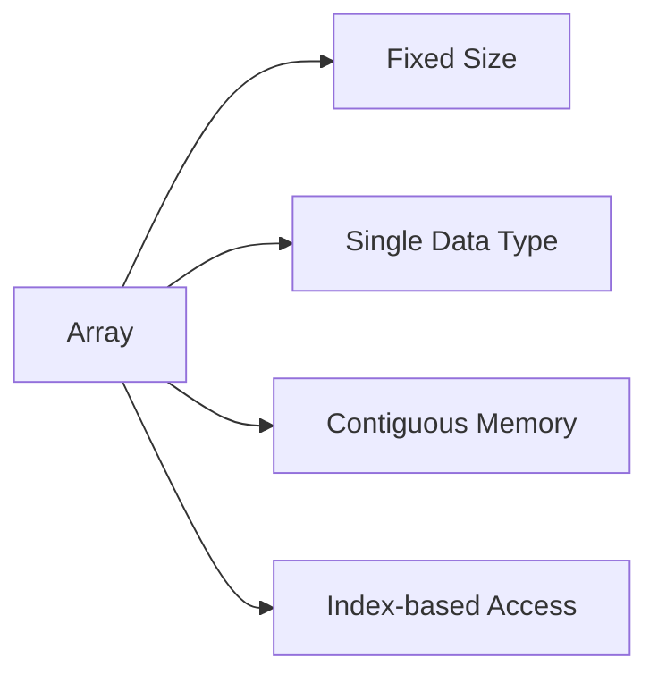

---

## Arrays as Objects in Java

**Yes, arrays in Java are objects!** This is a fundamental concept that distinguishes Java from languages like C/C++.

### Key Points:
- Arrays are **dynamically allocated** on the heap
- Every array has a member variable `length` (not a method)
- Arrays inherit from `java.lang.Object` class
- Arrays can be assigned to `Object` variables
- Arrays have access to all methods of `Object` class

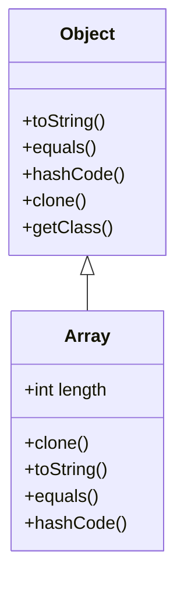

### Example Demonstrating Arrays as Objects:

```java
public class ArrayAsObject {
    public static void main(String[] args) {
        int[] arr = {10, 20, 30};
        
        // Array is an object
        Object obj = arr;  // Valid assignment
        
        // Array has length property (not method)
        System.out.println("Length: " + arr.length);
        
        // Array inherits Object methods
        System.out.println("Class: " + arr.getClass().getName());
        System.out.println("Hash Code: " + arr.hashCode());
        System.out.println("String: " + arr.toString());
    }
}
```

---

## Array Declaration and Initialization

### 1. Declaration Syntax

```java
// Method 1: Type followed by []
dataType[] arrayName;
int[] numbers;
String[] names;

// Method 2: [] after variable name (C-style, less preferred)
dataType arrayName[];
int numbers[];
String names[];
```

### 2. Initialization Methods

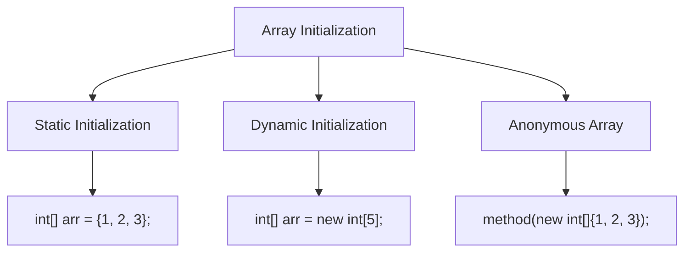

#### Method 1: Declaration and Initialization Separately
```java
int[] numbers;              // Declaration
numbers = new int[5];       // Initialization with size 5
```

#### Method 2: Declaration and Initialization Together
```java
int[] numbers = new int[5]; // Creates array of size 5
```

#### Method 3: Static Initialization (Array Literal)
```java
int[] numbers = {10, 20, 30, 40, 50};
String[] names = {"Alice", "Bob", "Charlie"};
```

#### Method 4: Anonymous Array
```java
// Useful for passing arrays to methods directly
printArray(new int[]{1, 2, 3, 4, 5});
```

---

## Types of Arrays

### 1. Single-Dimensional Arrays

```java
int[] numbers = new int[5];
```

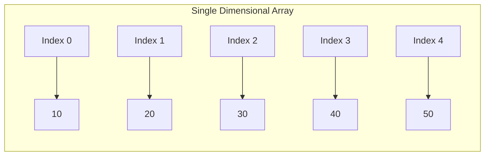

### 2. Multi-Dimensional Arrays

#### a) Two-Dimensional Arrays (Matrix)

```java
int[][] matrix = new int[3][4];  // 3 rows, 4 columns

// Static initialization
int[][] matrix = {
    {1, 2, 3, 4},
    {5, 6, 7, 8},
    {9, 10, 11, 12}
};
```

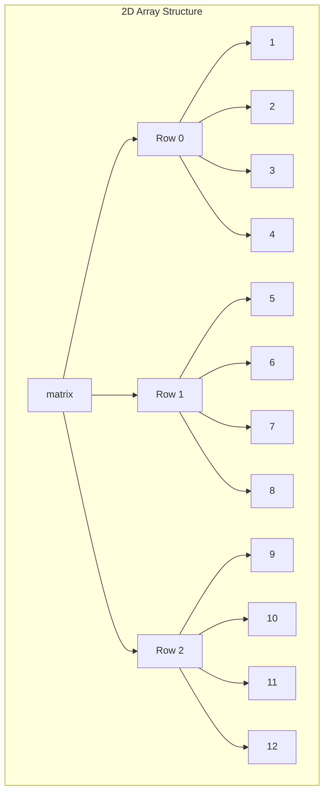

#### b) Jagged Arrays (Arrays of Arrays)

```java
int[][] jagged = new int[3][];
jagged[0] = new int[2];  // First row has 2 elements
jagged[1] = new int[4];  // Second row has 4 elements
jagged[2] = new int[3];  // Third row has 3 elements
```

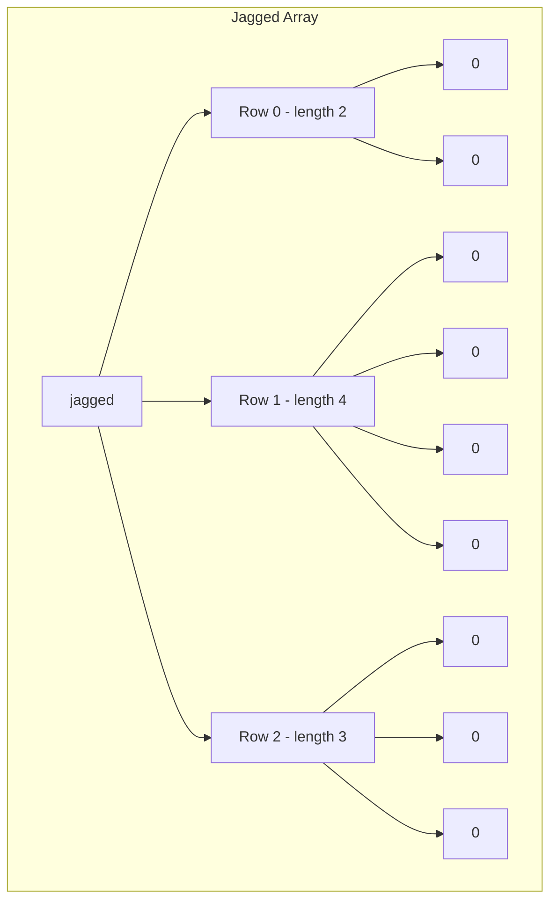

#### c) Three-Dimensional Arrays

```java
int[][][] cube = new int[2][3][4];
```

---

## Default Values

When an array is created using `new`, elements are initialized with **default values** based on the data type:

| Data Type | Default Value |
|-----------|---------------|
| `byte` | 0 |
| `short` | 0 |
| `int` | 0 |
| `long` | 0L |
| `float` | 0.0f |
| `double` | 0.0d |
| `char` | '\u0000' (null character) |
| `boolean` | false |
| **Object references** | **null** |

### Example:

```java
public class ArrayDefaults {
    public static void main(String[] args) {
        int[] numbers = new int[5];
        String[] names = new String[3];
        boolean[] flags = new boolean[2];
        
        System.out.println(numbers[0]);  // Output: 0
        System.out.println(names[0]);    // Output: null
        System.out.println(flags[0]);    // Output: false
    }
}
```

```mermaid
graph TB
    subgraph "Primitive Array Defaults"
    PA[int[] nums = new int[3]] --> P1[0]
    PA --> P2[0]
    PA --> P3[0]
    end
    
    subgraph "Object Array Defaults"
    OA[String[] strs = new String[3]] --> O1[null]
    OA --> O2[null]
    OA --> O3[null]
    end
```

---

## Understanding Memory Concepts (In-Depth)

### 🎓 Let's Learn Like a Complete Beginner!

Imagine you're learning to paint, and you need to understand your tools first. Similarly, before we use arrays effectively, let's understand **how computer memory works** - don't worry, I'll explain everything step by step!

---

### 1️⃣ What is "Memory" in Computer?

Think of computer memory like a **giant apartment building** with millions of rooms. Each room:
- Has a **unique address** (like Room 101, Room 102, etc.)
- Can store **one piece of information** (a number, letter, etc.)
- Has a **specific size** (some rooms are bigger than others)

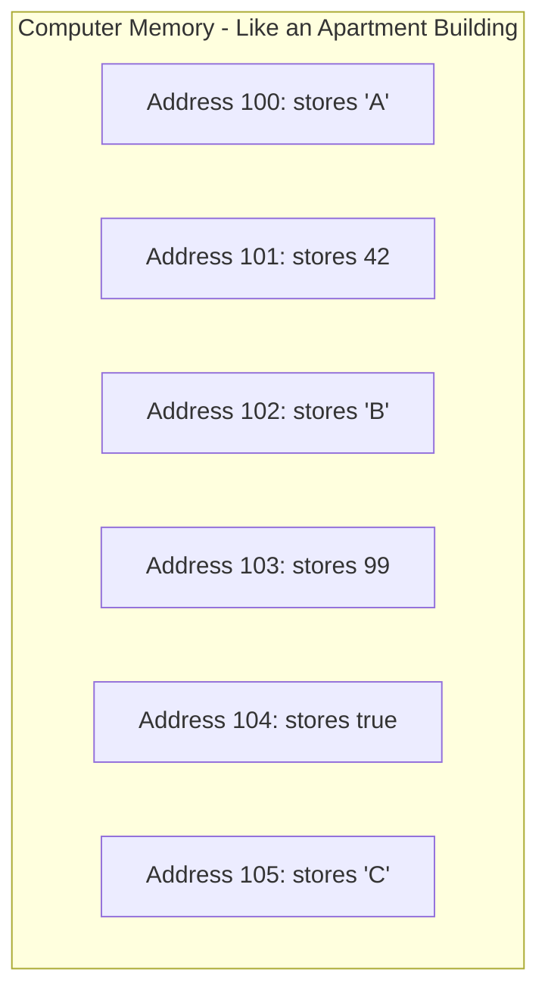

**Types of Memory in Java:**

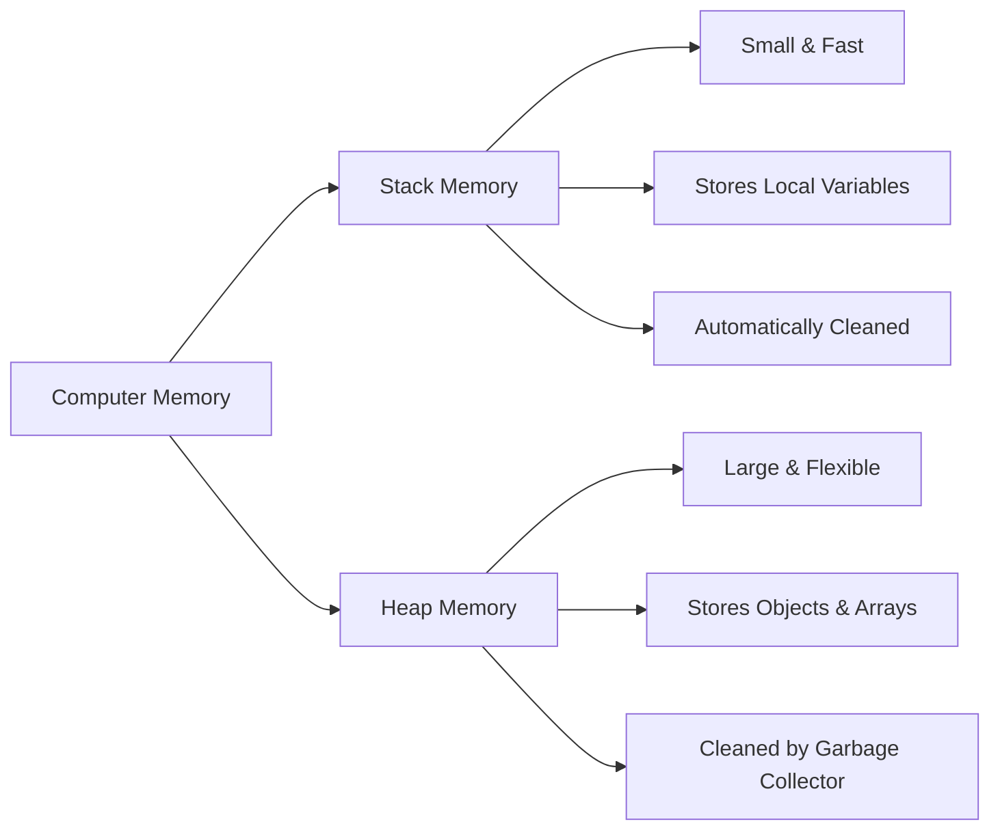

---

### 2️⃣ What Does "Dynamically Allocated" Mean?

Let me explain this with a **real-life analogy**:

#### Static Allocation (Compile Time)
Imagine you're planning a birthday party:
- **Before the party**, you decide: "I'll invite exactly 5 friends"
- You book a table for 5 people
- You buy 5 gift bags
- **Everything is decided BEFORE the party starts**

#### Dynamic Allocation (Runtime)
Now imagine a different scenario:
- **Before the party**, you don't know how many friends will come
- **During the party**, friends start arriving
- You count: "Oh, 8 friends came!"
- **NOW** you get chairs for 8 people
- **The decision happens WHILE the program is running**

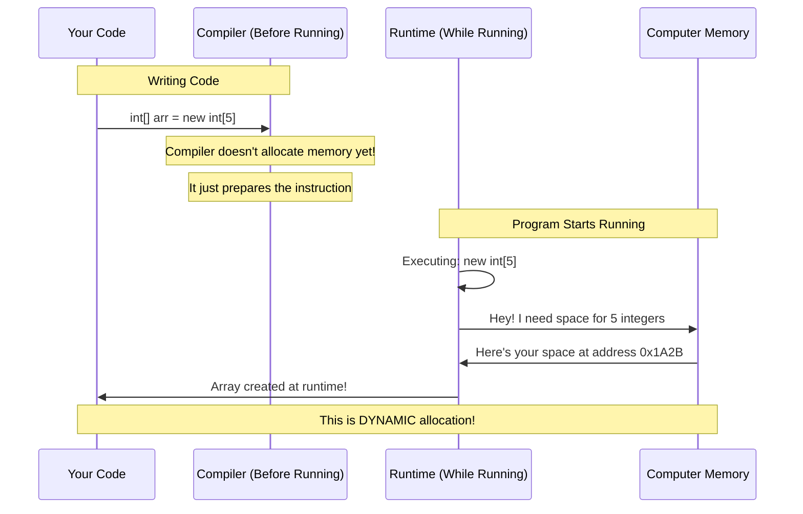

**In Java Arrays:**

```java
// At COMPILE time - compiler doesn't know if user enters 5 or 100
Scanner scanner = new Scanner(System.in);
System.out.println("How many students?");
int count = scanner.nextInt();

// At RUNTIME - memory is allocated based on user input
int[] students = new int[count];  // 🎯 This is DYNAMIC allocation!
```

**Why is it called "Dynamic"?**
- ✅ Memory is allocated **during program execution** (runtime)
- ✅ Size can be determined by **user input** or **calculations**
- ✅ Happens in **Heap memory** (the flexible storage area)

```mermaid
graph TB
    subgraph "Static Allocation Example"
    S1[int x = 10;] --> S2[Compiler knows size: 4 bytes]
    S2 --> S3[Allocated on Stack]
    end
    
    subgraph "Dynamic Allocation Example"
    D1[int[] arr = new int[5];] --> D2[Size determined at runtime]
    D2 --> D3[Allocated on Heap]
    D3 --> D4[✨ This is Dynamic!]
    end
```

---

### 3️⃣ What is "Contiguous Memory"?

**Contiguous** means **next to each other** or **continuous** - like houses on the same street!

#### Visual Analogy:

**Contiguous (Array) - All rooms in a row:**
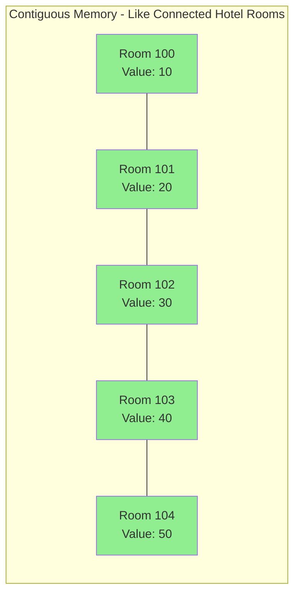

**Non-Contiguous (Like a List) - Rooms scattered:**
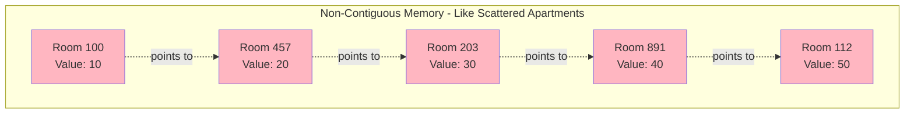

#### Real Memory Example:

```java
int[] arr = {10, 20, 30, 40, 50};
```

**Memory Layout (Contiguous):**
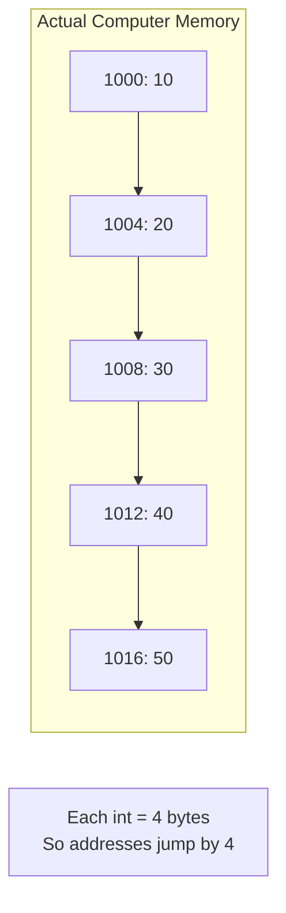

**Why Contiguous Memory is AWESOME for Arrays:**

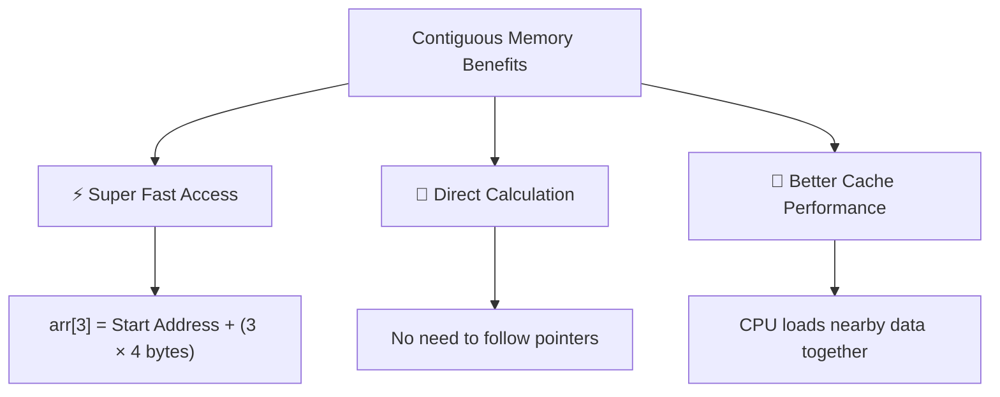

**Mathematical Formula:**
```
Address of arr[i] = Base Address + (i × size of each element)

Example:
Base Address = 1000
arr[3] = 1000 + (3 × 4) = 1012
```

**Code Example:**
```java
public class ContiguousDemo {
    public static void main(String[] args) {
        int[] arr = {10, 20, 30, 40, 50};
        
        // Accessing arr[3] is O(1) - Constant time!
        // Why? Direct calculation: base_address + (3 * 4)
        System.out.println(arr[3]);  // Instantly gets 40!
        
        // Compare with LinkedList - O(n) to access nth element
        // Must traverse: first -> second -> third -> fourth
    }
}
```

**Visual Comparison:**

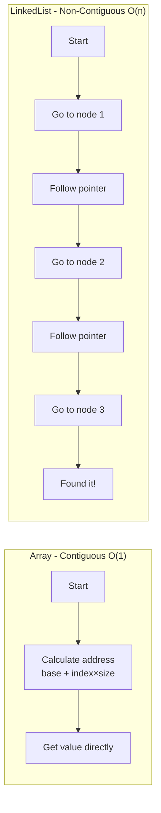

---

### 4️⃣ Why is Array Size FIXED? (The Deep Reason)

This is the **most important concept** to understand! Let me explain step by step.

#### The Root Cause: Contiguous Memory Requirement

**Scenario 1: When Array is Created**

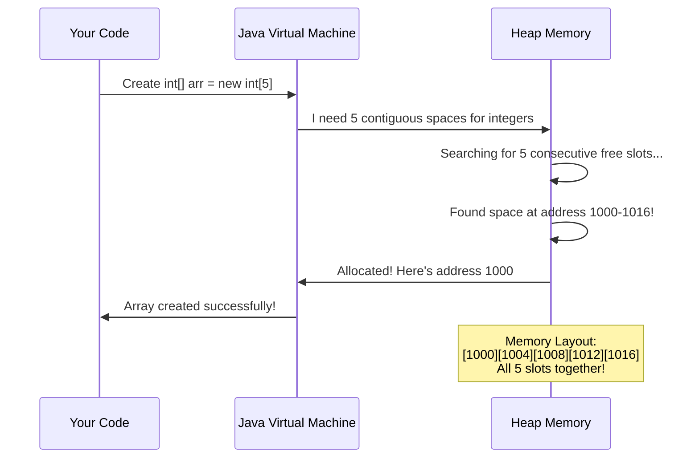

**Memory State After Creation:**
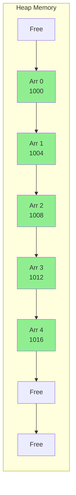

#### Scenario 2: What if we try to INCREASE size?

**Let's say we want to change size from 5 to 8:**

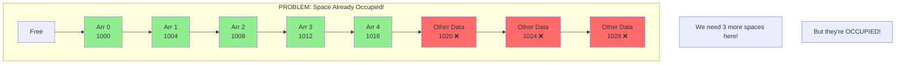

**Why Can't We Grow the Array?**

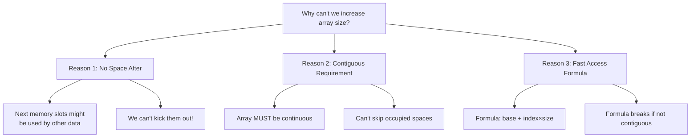

#### Real-Life Analogy:

**Parking Lot Scenario:**
```
Imagine you parked 5 cars in a row in a parking lot:

[Your Car 1][Your Car 2][Your Car 3][Your Car 4][Your Car 5][Someone else's car]

Now you want to park 3 MORE cars in the same row (contiguous).
But the next spots are TAKEN by someone else!

Options:
❌ Can't push other cars away
❌ Can't skip spots (must be contiguous)
✅ Only solution: Find a NEW location with 8 consecutive spots!
```

#### The ONLY Solution: Create New Array

```mermaid
sequenceDiagram
    participant You as Your Code
    participant Old as Old Array (size 5)
    participant JVM as Java VM
    participant New as New Array (size 8)
    
    You->>JVM: I want to grow my array from 5 to 8
    JVM->>JVM: Can't expand in place! ❌
    JVM->>JVM: Must create NEW array
    JVM->>New: Allocate 8 contiguous spaces
    New->>JVM: New array created at address 2000
    JVM->>Old: Copy elements 0-4
    Old->>New: Copying... [10, 20, 30, 40, 50]
    JVM->>You: Here's your new array!
    JVM->>Old: Old array marked for garbage collection
```

**Code Example:**

```java
public class ArrayResizeDemo {
    public static void main(String[] args) {
        // Original array - size 5
        int[] original = {10, 20, 30, 40, 50};
        System.out.println("Original array address: " + System.identityHashCode(original));
        
        // We want size 8 - must create NEW array
        int[] expanded = new int[8];  // 🆕 Completely new memory location
        System.out.println("Expanded array address: " + System.identityHashCode(expanded));
        
        // Copy old values
        for (int i = 0; i < original.length; i++) {
            expanded[i] = original[i];
        }
        
        // Add new values
        expanded[5] = 60;
        expanded[6] = 70;
        expanded[7] = 80;
        
        // Now we use 'expanded' and forget 'original'
        original = expanded;  // Point to new array
        
        // Old array will be garbage collected
    }
}
```

**Memory Visualization:**

```mermaid
graph TB
    subgraph "Before Resize"
    O1[Original Array<br/>Address: 1000<br/>Size: 5]
    O1 --> OV[10, 20, 30, 40, 50]
    end
    
    subgraph "After Resize"
    N1[New Array<br/>Address: 2000<br/>Size: 8]
    N1 --> NV[10, 20, 30, 40, 50, 60, 70, 80]
    
    O2[Old Array<br/>Address: 1000<br/>⚰️ Garbage Collected]
    end
    
    style O2 fill:#FFB6B6
    style N1 fill:#90EE90
```

---

### 5️⃣ Why This Design? (Benefits vs Trade-offs)

#### Benefits of Fixed-Size Contiguous Arrays:

```mermaid
mindmap
  root((Fixed Size Contiguous Arrays))
    Speed
      O1 access time
      Direct calculation
      No pointer following
    Memory
      Compact storage
      Better cache hits
      CPU prefetching
    Simplicity
      Easy to implement
      Predictable behavior
      No memory fragmentation
```

**Performance Comparison:**

| Operation | Array (Contiguous) | LinkedList (Non-Contiguous) |
|-----------|-------------------|----------------------------|
| Access element | **O(1)** ⚡ | O(n) 🐌 |
| Memory overhead | **Low** 💾 | High (extra pointers) |
| Cache performance | **Excellent** 🚀 | Poor |
| Resize | O(n) (must copy) | O(1) (just link) ✅ |

#### Trade-offs:

```mermaid
graph LR
    subgraph "Arrays: Choose Fixed Size"
    A1[✅ Lightning fast access]
    A2[✅ Memory efficient]
    A3[❌ Can't grow/shrink]
    A4[❌ Must know size upfront]
    end
    
    subgraph "Dynamic Structures: Choose Flexibility"
    D1[✅ Can grow/shrink easily]
    D2[✅ Don't need to know size]
    D3[❌ Slower access]
    D4[❌ More memory used]
    end
```

---

### 6️⃣ Solutions When You Need Dynamic Size

**Option 1: ArrayList (Recommended)**
```java
import java.util.ArrayList;

ArrayList<Integer> list = new ArrayList<>();
list.add(10);  // Grows automatically!
list.add(20);
list.add(30);
// Behind the scenes: ArrayList creates new array when needed
```

**How ArrayList Works Internally:**
```mermaid
sequenceDiagram
    participant Code as Your Code
    participant AL as ArrayList
    participant Arr as Internal Array
    
    Code->>AL: add(10)
    AL->>Arr: Store in array[0]
    
    Code->>AL: add(20)
    AL->>Arr: Store in array[1]
    
    Note over AL,Arr: Internal array full!
    
    Code->>AL: add(30)
    AL->>AL: Create new array (2x size)
    AL->>AL: Copy old values
    AL->>Arr: Store 30 in new array
    
    Note over AL: User doesn't see this complexity!
```

**Option 2: Manual Resize Function**
```java
public class ManualResize {
    public static int[] resize(int[] original, int newSize) {
        int[] newArray = new int[newSize];
        
        // Copy old elements
        int elementsToCopy = Math.min(original.length, newSize);
        for (int i = 0; i < elementsToCopy; i++) {
            newArray[i] = original[i];
        }
        
        return newArray;
    }
    
    public static void main(String[] args) {
        int[] arr = {1, 2, 3, 4, 5};
        arr = resize(arr, 10);  // Now size is 10
    }
}
```

**Option 3: Using Arrays.copyOf()**
```java
int[] original = {1, 2, 3, 4, 5};
int[] expanded = Arrays.copyOf(original, 10);  // New size: 10
```

---

### 7️⃣ Complete Mental Model

```mermaid
graph TB
    Start[Need to store multiple values]
    Start --> Q1{Know the exact count?}
    
    Q1 -->|Yes, won't change| A[Use Array]
    Q1 -->|No, or will change| D[Use ArrayList/List]
    
    A --> A1[✅ Best Performance]
    A --> A2[✅ Memory Efficient]
    A --> A3[⚠️ Fixed Size]
    
    D --> D1[✅ Flexible Size]
    D --> D2[⚠️ Slightly Slower]
    D --> D3[⚠️ More Memory]
    
    A3 --> Sol[Need to resize?]
    Sol --> S1[Create new array]
    Sol --> S2[Copy elements]
    Sol --> S3[Use new array]
```

---

### 📝 Summary - Key Takeaways

1. **Dynamic Allocation** = Memory allocated during program execution (runtime), not before
2. **Contiguous Memory** = Array elements stored in consecutive memory addresses, like rooms in a row
3. **Fixed Size** = Once created, array size cannot change because:
   - Next memory locations might be occupied
   - Arrays MUST be contiguous
   - Fast access formula requires fixed positions
4. **Solution** = Create new larger array and copy elements (that's what ArrayList does automatically)

**Remember:**
```
Array = Trading flexibility for SPEED! 🚀
Fixed size + Contiguous memory = Lightning fast access! ⚡
```

---

## Memory Allocation

### How Arrays are Stored in Memory

Arrays in Java are allocated in the **Heap memory**, while the reference variable is stored in the **Stack memory**.

```mermaid
graph TB
    subgraph Stack
    S1[Reference Variable: arr]
    end
    
    subgraph Heap
    H1[Array Object]
    H2[length = 5]
    H3[Index 0: 10]
    H4[Index 1: 20]
    H5[Index 2: 30]
    H6[Index 3: 40]
    H7[Index 4: 50]
    end
    
    S1 -.-> H1
    H1 --> H2
    H1 --> H3
    H1 --> H4
    H1 --> H5
    H1 --> H6
    H1 --> H7
```

### Memory Allocation Process:

1. **Stack Memory**: Stores the reference variable (pointer to array)
2. **Heap Memory**: Stores the actual array object with:
   - Array metadata (type, length)
   - Array elements in contiguous memory locations

### Example with Memory Diagram:

```java
int[] arr = new int[5];
arr[0] = 10;
arr[1] = 20;
```

```mermaid
sequenceDiagram
    participant Stack
    participant Heap
    
    Note over Stack: int[] arr
    Stack->>Heap: new int[5]
    Heap-->>Stack: Returns reference (0x1A2B3C)
    Note over Heap: Allocate 5 int spaces
    Note over Heap: Initialize with 0
    Stack->>Heap: arr[0] = 10
    Note over Heap: Update index 0 to 10
    Stack->>Heap: arr[1] = 20
    Note over Heap: Update index 1 to 20
```

### Multi-Dimensional Array Memory Layout:

```java
int[][] matrix = new int[2][3];
```

```mermaid
graph TB
    subgraph Stack
    S[matrix reference]
    end
    
    subgraph "Heap - Main Array"
    H1[Array Object - 2 elements]
    H1 --> R1[Reference to Row 0]
    H1 --> R2[Reference to Row 1]
    end
    
    subgraph "Heap - Row 0"
    A1[0] 
    A2[0]
    A3[0]
    end
    
    subgraph "Heap - Row 1"
    B1[0]
    B2[0]
    B3[0]
    end
    
    S -.-> H1
    R1 -.-> A1
    R2 -.-> B1
```

### Memory Calculation:

For primitive arrays:
```
Memory = Array Object Header + (Element Size × Length)
```

Example for `int[] arr = new int[10];`:
- Object Header: ~12-16 bytes (JVM dependent)
- int elements: 4 bytes × 10 = 40 bytes
- **Total ≈ 52-56 bytes** (plus padding for alignment)

---

## Array Methods and Operations

### Built-in Array Property:

```java
int[] arr = {10, 20, 30, 40, 50};

// Length property (NOT a method)
System.out.println(arr.length);  // Output: 5
```

### Common Array Operations Using `java.util.Arrays` Class:

```java
import java.util.Arrays;

public class ArrayMethods {
    public static void main(String[] args) {
        int[] numbers = {5, 2, 8, 1, 9};
        
        // 1. toString() - Convert array to string
        System.out.println(Arrays.toString(numbers));
        // Output: [5, 2, 8, 1, 9]
        
        // 2. sort() - Sort array in ascending order
        Arrays.sort(numbers);
        System.out.println(Arrays.toString(numbers));
        // Output: [1, 2, 5, 8, 9]
        
        // 3. binarySearch() - Search element (array must be sorted)
        int index = Arrays.binarySearch(numbers, 5);
        System.out.println("Index of 5: " + index);  // Output: 2
        
        // 4. fill() - Fill array with a value
        int[] arr = new int[5];
        Arrays.fill(arr, 100);
        System.out.println(Arrays.toString(arr));
        // Output: [100, 100, 100, 100, 100]
        
        // 5. equals() - Compare two arrays
        int[] arr1 = {1, 2, 3};
        int[] arr2 = {1, 2, 3};
        System.out.println(Arrays.equals(arr1, arr2));  // Output: true
        
        // 6. copyOf() - Copy array with new length
        int[] original = {1, 2, 3, 4, 5};
        int[] copy = Arrays.copyOf(original, 3);
        System.out.println(Arrays.toString(copy));
        // Output: [1, 2, 3]
        
        // 7. copyOfRange() - Copy specific range
        int[] rangeCopy = Arrays.copyOfRange(original, 1, 4);
        System.out.println(Arrays.toString(rangeCopy));
        // Output: [2, 3, 4]
        
        // 8. stream() - Convert to stream (Java 8+)
        int sum = Arrays.stream(numbers).sum();
        System.out.println("Sum: " + sum);
    }
}
```

### Manual Array Operations:

```java
public class ManualArrayOperations {
    
    // Traverse array
    public static void traverse(int[] arr) {
        for (int i = 0; i < arr.length; i++) {
            System.out.print(arr[i] + " ");
        }
    }
    
    // Enhanced for loop
    public static void traverseEnhanced(int[] arr) {
        for (int element : arr) {
            System.out.print(element + " ");
        }
    }
    
    // Search element
    public static int linearSearch(int[] arr, int target) {
        for (int i = 0; i < arr.length; i++) {
            if (arr[i] == target) {
                return i;
            }
        }
        return -1;
    }
    
    // Find maximum
    public static int findMax(int[] arr) {
        int max = arr[0];
        for (int i = 1; i < arr.length; i++) {
            if (arr[i] > max) {
                max = arr[i];
            }
        }
        return max;
    }
    
    // Reverse array
    public static void reverse(int[] arr) {
        int left = 0;
        int right = arr.length - 1;
        while (left < right) {
            int temp = arr[left];
            arr[left] = arr[right];
            arr[right] = temp;
            left++;
            right--;
        }
    }
}
```

### Method Summary Table:

| Method | Description | Example |
|--------|-------------|---------|
| `Arrays.toString()` | Converts array to string | `Arrays.toString(arr)` |
| `Arrays.sort()` | Sorts array | `Arrays.sort(arr)` |
| `Arrays.binarySearch()` | Binary search (sorted array) | `Arrays.binarySearch(arr, key)` |
| `Arrays.fill()` | Fill with value | `Arrays.fill(arr, value)` |
| `Arrays.equals()` | Compare arrays | `Arrays.equals(arr1, arr2)` |
| `Arrays.copyOf()` | Copy array | `Arrays.copyOf(arr, newLength)` |
| `Arrays.copyOfRange()` | Copy range | `Arrays.copyOfRange(arr, from, to)` |
| `Arrays.asList()` | Convert to List | `Arrays.asList(arr)` |
| `Arrays.stream()` | Convert to Stream | `Arrays.stream(arr)` |
| `clone()` | Clone array | `arr.clone()` |

---

## Important Points

### 1. Array Index
```mermaid
graph LR
    A[Array Indexing] --> B[Starts at 0]
    A --> C[Ends at length-1]
    A --> D[ArrayIndexOutOfBoundsException]
```

```java
int[] arr = new int[5];  // Valid indices: 0, 1, 2, 3, 4
arr[5] = 10;  // Runtime Error: ArrayIndexOutOfBoundsException
```

### 2. Array Size is Fixed

```java
int[] arr = new int[5];
// Cannot change size after creation
// To resize, create new array and copy elements
```

### 3. Arrays are Covariant

```java
Object[] objArr = new String[10];  // Valid
objArr[0] = "Hello";               // Valid
objArr[1] = new Integer(10);       // Runtime Error: ArrayStoreException
```

### 4. Cloning Arrays

```java
int[] original = {1, 2, 3, 4, 5};
int[] cloned = original.clone();   // Creates shallow copy
```

### 5. Arrays vs Collections

```mermaid
graph TB
    subgraph Arrays
    A1[Fixed Size]
    A2[Primitive + Objects]
    A3[Fast Access O-1]
    A4[No Built-in Methods]
    end
    
    subgraph Collections
    C1[Dynamic Size]
    C2[Only Objects]
    C3[Rich API]
    C4[Type-safe with Generics]
    end
```

### 6. Performance Considerations

```java
// Good: Direct access
int value = arr[5];  // O(1)

// Bad: Creating new array for resize
int[] newArr = new int[arr.length * 2];  // O(n)
System.arraycopy(arr, 0, newArr, 0, arr.length);
```

---

## Complete Example Program

```java
import java.util.Arrays;

public class ArrayComprehensiveExample {
    public static void main(String[] args) {
        
        // 1. Declaration and Initialization
        int[] numbers = {64, 34, 25, 12, 22, 11, 90};
        
        System.out.println("Original Array: " + Arrays.toString(numbers));
        System.out.println("Array Length: " + numbers.length);
        System.out.println("Array Class: " + numbers.getClass().getName());
        
        // 2. Access elements
        System.out.println("\nFirst element: " + numbers[0]);
        System.out.println("Last element: " + numbers[numbers.length - 1]);
        
        // 3. Modify elements
        numbers[0] = 100;
        System.out.println("\nAfter modification: " + Arrays.toString(numbers));
        
        // 4. Traverse using different methods
        System.out.println("\nTraverse using for loop:");
        for (int i = 0; i < numbers.length; i++) {
            System.out.print(numbers[i] + " ");
        }
        
        System.out.println("\n\nTraverse using enhanced for:");
        for (int num : numbers) {
            System.out.print(num + " ");
        }
        
        // 5. Sort array
        Arrays.sort(numbers);
        System.out.println("\n\nSorted Array: " + Arrays.toString(numbers));
        
        // 6. Search element
        int searchKey = 25;
        int index = Arrays.binarySearch(numbers, searchKey);
        System.out.println("Index of " + searchKey + ": " + index);
        
        // 7. Copy array
        int[] copy = Arrays.copyOf(numbers, numbers.length);
        System.out.println("Copied Array: " + Arrays.toString(copy));
        
        // 8. Multi-dimensional array
        int[][] matrix = {
            {1, 2, 3},
            {4, 5, 6},
            {7, 8, 9}
        };
        
        System.out.println("\n2D Array:");
        for (int i = 0; i < matrix.length; i++) {
            for (int j = 0; j < matrix[i].length; j++) {
                System.out.print(matrix[i][j] + " ");
            }
            System.out.println();
        }
        
        // 9. Array of objects
        String[] fruits = {"Apple", "Banana", "Orange"};
        System.out.println("\nString Array: " + Arrays.toString(fruits));
        
        // 10. Default values demonstration
        int[] defaultInts = new int[3];
        String[] defaultStrings = new String[3];
        System.out.println("\nDefault int values: " + Arrays.toString(defaultInts));
        System.out.println("Default String values: " + Arrays.toString(defaultStrings));
    }
}
```

---

## Advantages and Disadvantages of Arrays

### 🎯 Advantages of Arrays

Arrays have several powerful advantages that make them one of the most fundamental and widely-used data structures in programming.

---

#### 1️⃣ Random Access (O(1) Time Complexity)

**What is Random Access?**

"Random Access" means you can **directly access ANY element** in the array **instantly**, regardless of its position, without having to go through other elements.

**Real-Life Analogy:**

Think of two different storage systems:

```mermaid
graph TB
    subgraph "Array - Like a Mailbox Grid"
    A1[You want letter from Box 47] --> A2[Directly go to Box 47]
    A2 --> A3[Get letter instantly! ⚡]
    end
    
    subgraph "Linked List - Like a Chain of Letters"
    L1[You want 47th letter] --> L2[Open letter 1]
    L2 --> L3[Read: Next is letter 2]
    L3 --> L4[Open letter 2]
    L4 --> L5[Read: Next is letter 3]
    L5 --> L6[... continue 47 times ...]
    L6 --> L7[Finally get letter 47! 🐌]
    end
```

**How Does Random Access Work in Arrays?**

Remember, arrays use **contiguous memory** and **direct calculation**:

```mermaid
flowchart LR
    A["Want arr[5]?"] --> B["Calculate:\nBase + (index × size)"]
    B --> C["Direct memory jump"]
    C --> D["Instant access\n⚡ O(1)"]
```

**Code Example:**

```java
public class RandomAccessDemo {
    public static void main(String[] args) {
        int[] arr = new int[1000000]; // 1 million elements!
        
        // Fill with values
        for (int i = 0; i < arr.length; i++) {
            arr[i] = i * 2;
        }
        
        // Accessing first element - super fast!
        long start = System.nanoTime();
        int first = arr[0];
        long end = System.nanoTime();
        System.out.println("Time to access arr[0]: " + (end - start) + "ns");
        
        // Accessing element in the middle - SAME speed! ⚡
        start = System.nanoTime();
        int middle = arr[500000];
        end = System.nanoTime();
        System.out.println("Time to access arr[500000]: " + (end - start) + "ns");
        
        // Accessing last element - STILL same speed! ⚡⚡
        start = System.nanoTime();
        int last = arr[999999];
        end = System.nanoTime();
        System.out.println("Time to access arr[999999]: " + (end - start) + "ns");
        
        // All three accesses take approximately the SAME time!
        // This is Random Access - O(1) time complexity
    }
}
```

**Memory Calculation Visualization:**

```mermaid
graph TB
    subgraph "Array in Memory"
    M[Base Address: 1000]
    M --> E0["Index 0<br/>Address: 1000<br/>Value: 10"]
    M --> E1["Index 1<br/>Address: 1004<br/>Value: 20"]
    M --> E2["Index 2<br/>Address: 1008<br/>Value: 30"]
    M --> E3["Index 3<br/>Address: 1012<br/>Value: 40"]
    M --> E4["Index 4<br/>Address: 1016<br/>Value: 50"]
    end
    
    Q["Want arr[3]?"] --> C["Calculate: 1000 + 3×4 = 1012"]
    C --> R["Jump to address 1012"]
    R --> V["Read value: 40"]
    
    style Q fill:#FFE4B5
    style C fill:#98FB98
    style R fill:#87CEEB
    style V fill:#FFB6C1
```

**Benefits of Random Access:**

```mermaid
mindmap
  root((Random Access<br/>Benefits))
    Performance
      Constant time O-1
      No iteration needed
      Predictable speed
    Algorithms
      Binary Search possible
      Quick Sort efficient
      Direct indexing
    Applications
      Database indexing
      Image pixel access
      Game board states
```

**Comparison with Other Data Structures:**

| Data Structure | Access Time | Why? |
|----------------|-------------|------|
| **Array** | **O(1)** ⚡ | Direct calculation: base + index × size |
| ArrayList | **O(1)** ⚡ | Uses array internally |
| LinkedList | O(n) 🐌 | Must traverse from head to nth node |
| Stack | O(n) 🐌 | Can only access top element efficiently |
| Queue | O(n) 🐌 | Can only access front/rear efficiently |

---

#### 2️⃣ Cache-Friendly (Cache Locality)

**What is Cache?**

Your computer has different levels of memory storage:

```mermaid
graph TB
    subgraph "Memory Hierarchy - Fastest to Slowest"
    R[CPU Registers<br/>⚡⚡⚡ Fastest<br/>~1 nanosecond<br/>Few bytes]
    L1[L1 Cache<br/>⚡⚡ Super Fast<br/>~1-2 nanoseconds<br/>32-64 KB]
    L2[L2 Cache<br/>⚡ Very Fast<br/>~3-10 nanoseconds<br/>256-512 KB]
    L3[L3 Cache<br/>Fast<br/>~10-20 nanoseconds<br/>2-32 MB]
    RAM[Main Memory - RAM<br/>Slower<br/>~50-100 nanoseconds<br/>8-64 GB]
    DISK[Hard Disk/SSD<br/>🐌 Very Slow<br/>~1-10 milliseconds<br/>512 GB - 2 TB]
    end
    
    R --> L1 --> L2 --> L3 --> RAM --> DISK
```

**What Makes Arrays Cache-Friendly?**

Because arrays use **contiguous memory**, when the CPU loads one element, it automatically loads **nearby elements** into cache!

**Cache Line Concept:**

```mermaid
graph LR
    subgraph "Array in Main Memory - RAM"
    A0[arr-0] --- A1[arr-1] --- A2[arr-2] --- A3[arr-3] --- A4[arr-4] --- A5[arr-5] --- A6[arr-6] --- A7[arr-7]
    end
    
    subgraph "CPU Cache Line - 64 bytes typical"
    C0[arr-0] --- C1[arr-1] --- C2[arr-2] --- C3[arr-3]
    end
    
    Request[CPU requests arr-0] --> Load[CPU loads entire cache line]
    Load --> Bonus[Gets arr-0, arr-1, arr-2, arr-3 for FREE!]
    
    style Request fill:#FFE4B5
    style Load fill:#98FB98
    style Bonus fill:#FFB6C1
```

**Real Example:**

```java
public class CacheFriendlyDemo {
    public static void main(String[] args) {
        int size = 10000000; // 10 million
        int[] arr = new int[size];
        
        // Initialize array
        for (int i = 0; i < size; i++) {
            arr[i] = i;
        }
        
        // Test 1: Sequential Access (Cache-Friendly) ✅
        long start = System.nanoTime();
        long sum1 = 0;
        for (int i = 0; i < size; i++) {
            sum1 += arr[i];  // Accessing elements in order
        }
        long sequential = System.nanoTime() - start;
        
        // Test 2: Random Access Pattern (Cache-Unfriendly) ❌
        start = System.nanoTime();
        long sum2 = 0;
        for (int i = 0; i < size; i++) {
            int randomIndex = (i * 7919) % size;  // Jump around randomly
            sum2 += arr[randomIndex];
        }
        long random = System.nanoTime() - start;
        
        System.out.println("Sequential access: " + sequential / 1_000_000 + "ms");
        System.out.println("Random pattern: " + random / 1_000_000 + "ms");
        System.out.println("Random is " + (random / sequential) + "x slower!");
        
        // Typical result: Random is 3-10x slower due to cache misses!
    }
}
```

**Visual Explanation:**

**Sequential Access (Cache-Friendly):**
```mermaid
sequenceDiagram
    participant CPU
    participant Cache
    participant RAM
    
    CPU->>Cache: Need arr[0]
    Cache->>RAM: Load cache line (arr[0]-arr[15])
    RAM-->>Cache: Here's the data
    Cache-->>CPU: Here's arr[0]
    
    Note over CPU,Cache: Next requests for arr[1]-arr[15]<br/>are already in cache! ⚡
    
    CPU->>Cache: Need arr[1]
    Cache-->>CPU: Already here! Instant! ⚡
    
    CPU->>Cache: Need arr[2]
    Cache-->>CPU: Already here! Instant! ⚡
```

**Random Access Pattern (Cache-Unfriendly):**
```mermaid
sequenceDiagram
    participant CPU
    participant Cache
    participant RAM
    
    CPU->>Cache: Need arr[0]
    Cache->>RAM: Load cache line (arr[0]-arr[15])
    RAM-->>Cache: Here's the data
    Cache-->>CPU: Here's arr[0]
    
    CPU->>Cache: Need arr[1000]
    Note over Cache: Not in cache! ❌
    Cache->>RAM: Load cache line (arr[1000]-arr[1015])
    RAM-->>Cache: Here's the data
    Cache-->>CPU: Here's arr[1000]
    
    CPU->>Cache: Need arr[50]
    Note over Cache: Not in cache! ❌
    Cache->>RAM: Load cache line (arr[50]-arr[65])
    RAM-->>Cache: Here's the data
    Cache-->>CPU: Here's arr[50]
    
    Note over CPU,RAM: Many cache misses = Slower! 🐌
```

**Cache Hit vs Cache Miss:**

```mermaid
graph TB
    subgraph "Cache Performance"
    Hit[Cache Hit ⚡<br/>Data in cache<br/>~1-5 nanoseconds]
    Miss[Cache Miss 🐌<br/>Must fetch from RAM<br/>~50-100 nanoseconds<br/>20-100x slower!]
    end
    
    A[Array Sequential Access] --> Hit
    L[LinkedList Access] --> Miss
    
    style Hit fill:#90EE90
    style Miss fill:#FFB6B6
```

**Benefits of Being Cache-Friendly:**

1. **Faster Iteration** - When looping through array, most data is in cache
2. **Better Performance** - Can be 10-100x faster than pointer-chasing structures
3. **CPU Prefetching** - Modern CPUs can predict and preload data
4. **Energy Efficient** - Less RAM access = less power consumption

**Performance Comparison:**

| Operation | Array (Cache-Friendly) | LinkedList (Cache-Unfriendly) |
|-----------|------------------------|-------------------------------|
| Sum all elements | ~10ms ⚡ | ~50-100ms 🐌 |
| Cache hit rate | 95-99% ✅ | 10-30% ❌ |
| Memory bandwidth | Optimal | Poor |

---

#### 3️⃣ Memory Efficiency

**Minimal Overhead:**

```mermaid
graph LR
    subgraph "Array Memory Layout"
    AH[Object Header<br/>12-16 bytes] --> AL[Length field<br/>4 bytes]
    AL --> D1[Data 1<br/>4 bytes]
    D1 --> D2[Data 2<br/>4 bytes]
    D2 --> D3[Data 3<br/>4 bytes]
    end
    
    subgraph "LinkedList Memory Layout"
    NH1[Node 1<br/>Object Header<br/>16 bytes] --> ND1[Data<br/>4 bytes]
    ND1 --> NP1[Next Pointer<br/>8 bytes]
    NP1 --> NH2[Node 2<br/>Object Header<br/>16 bytes]
    NH2 --> ND2[Data<br/>4 bytes]
    ND2 --> NP2[Next Pointer<br/>8 bytes]
    end
    
    Note1[Array: ~20 bytes overhead + data]
    Note2[LinkedList: ~24-28 bytes PER element!]
```

**Memory Comparison:**

```java
// Array for 1000 integers
int[] array = new int[1000];
// Memory: ~16 bytes (header) + 4000 bytes (data) = 4016 bytes

// LinkedList for 1000 integers
LinkedList<Integer> list = new LinkedList<>();
// Memory: 1000 nodes × 28 bytes = 28,000 bytes!
// 7x more memory!
```

---

#### 4️⃣ Simple and Intuitive

```mermaid
mindmap
  root((Array<br/>Simplicity))
    Easy Syntax
      arr-i- access
      Simple loops
      Clear indexing
    Predictable
      Fixed size
      Known behavior
      No surprises
    Universal
      All languages support
      Same concept everywhere
      Easy to learn
```

---

#### 5️⃣ Other Advantages

**a) Better for Algorithms:**
- Binary Search: O(log n) - only possible with random access
- Quick Sort: O(n log n) - efficient with array swaps
- Dynamic Programming: Often uses arrays for memoization

**b) CPU-Friendly Operations:**
- SIMD (Single Instruction Multiple Data) optimization
- Vectorization by compilers
- Loop unrolling

**c) Predictable Performance:**
- No hidden allocations
- No pointer dereferencing
- Deterministic behavior

---

### ⚠️ Disadvantages of Arrays

Every data structure has trade-offs. Let's understand what arrays are NOT good at.

---

#### 1️⃣ Insertion is Slow - O(n)

**Why is Insertion Slow?**

Because arrays are stored in **contiguous memory** and have **fixed positions**, inserting an element in the middle requires **shifting all subsequent elements**!

**Visual Example - Inserting 35 at Index 2:**

**Before:**
```mermaid
graph LR
    A0[Index 0<br/>10] --> A1[Index 1<br/>20]
    A1 --> A2[Index 2<br/>30]
    A2 --> A3[Index 3<br/>40]
    A3 --> A4[Index 4<br/>50]
    
    style A2 fill:#FFE4B5
```

**Step-by-Step Insertion Process:**

```mermaid
sequenceDiagram
    participant Code as Your Code
    participant Arr as Array
    
    Note over Code,Arr: Want to insert 35 at index 2
    
    Code->>Arr: Step 1: Move arr[4] to arr[5]
    Note over Arr: [10, 20, 30, 40, _, 50]
    
    Code->>Arr: Step 2: Move arr[3] to arr[4]
    Note over Arr: [10, 20, 30, _, 40, 50]
    
    Code->>Arr: Step 3: Move arr[2] to arr[3]
    Note over Arr: [10, 20, _, 30, 40, 50]
    
    Code->>Arr: Step 4: Insert 35 at arr[2]
    Note over Arr: [10, 20, 35, 30, 40, 50]
    
    Note over Code,Arr: Had to move 3 elements = O(n)
```

**After:**
```mermaid
graph LR
    A0[Index 0<br/>10] --> A1[Index 1<br/>20]
    A1 --> A2[Index 2<br/>35]
    A2 --> A3[Index 3<br/>30]
    A3 --> A4[Index 4<br/>40]
    A4 --> A5[Index 5<br/>50]
    
    style A2 fill:#90EE90
```

**Code Implementation:**

```java
public class ArrayInsertionDemo {
    
    public static int[] insert(int[] arr, int index, int value) {
        // Step 1: Create new array with size + 1
        int[] newArr = new int[arr.length + 1];
        
        // Step 2: Copy elements before insertion point
        for (int i = 0; i < index; i++) {
            newArr[i] = arr[i];
        }
        
        // Step 3: Insert new value
        newArr[index] = value;
        
        // Step 4: Copy remaining elements (SHIFTING!)
        for (int i = index; i < arr.length; i++) {
            newArr[i + 1] = arr[i];  // Each element shifts right
        }
        
        return newArr;
    }
    
    public static void main(String[] args) {
        int[] arr = {10, 20, 30, 40, 50};
        
        // Insert 35 at index 2
        long start = System.nanoTime();
        arr = insert(arr, 2, 35);
        long end = System.nanoTime();
        
        System.out.println("Array after insertion: " + Arrays.toString(arr));
        System.out.println("Time taken: " + (end - start) + "ns");
        
        // Output: [10, 20, 35, 30, 40, 50]
        // If array had 1 million elements, would need to shift ~500,000 elements!
    }
}
```

**Time Complexity Analysis:**

```mermaid
graph TB
    I[Insertion in Array] --> W[Worst Case: O-n<br/>Insert at beginning]
    I --> A[Average Case: O-n<br/>Insert in middle]
    I --> B[Best Case: O-1<br/>Insert at end]
    
    W --> W1[Must shift ALL n elements]
    A --> A1[Must shift n/2 elements on average]
    B --> B1[No shifting needed]
    
    style W fill:#FFB6B6
    style A fill:#FFE4B5
    style B fill:#90EE90
```

**Why LinkedList is Better for Insertion:**

```mermaid
graph LR
    subgraph "LinkedList Insertion - O(1) once position found"
    L1[Node 1<br/>20] -.->|next| L2[Node 2<br/>30]
    L3[New Node<br/>25]
    end
    
    L1 -.->|Update pointer| L3
    L3 -.->|Point to| L2
    
    Note[Just change 2 pointers!<br/>No shifting needed!]
```

---

#### 2️⃣ Deletion is Slow - O(n)

**Why is Deletion Slow?**

Same reason as insertion - must **shift elements** to fill the gap!

**Visual Example - Deleting Index 2:**

**Before:**
```mermaid
graph LR
    A0[Index 0<br/>10] --> A1[Index 1<br/>20]
    A1 --> A2[Index 2<br/>30]
    A2 --> A3[Index 3<br/>40]
    A3 --> A4[Index 4<br/>50]
    
    style A2 fill:#FFB6B6
```

**Deletion Process:**

```mermaid
sequenceDiagram
    participant Code
    participant Arr as Array
    
    Note over Code,Arr: Delete element at index 2
    
    Code->>Arr: Step 1: Mark for deletion<br/>[10, 20, X, 40, 50]
    
    Code->>Arr: Step 2: Shift arr[3] to arr[2]<br/>[10, 20, 40, 40, 50]
    
    Code->>Arr: Step 3: Shift arr[4] to arr[3]<br/>[10, 20, 40, 50, 50]
    
    Code->>Arr: Step 4: Reduce size<br/>[10, 20, 40, 50]
    
    Note over Code,Arr: Had to shift 2 elements = O(n)
```

**After:**
```mermaid
graph LR
    A0[Index 0<br/>10] --> A1[Index 1<br/>20]
    A1 --> A2[Index 2<br/>40]
    A2 --> A3[Index 3<br/>50]
```

**Code Implementation:**

```java
public class ArrayDeletionDemo {
    
    public static int[] delete(int[] arr, int index) {
        // Create new array with size - 1
        int[] newArr = new int[arr.length - 1];
        
        // Copy elements before deletion point
        for (int i = 0; i < index; i++) {
            newArr[i] = arr[i];
        }
        
        // Copy remaining elements (SHIFTING LEFT!)
        for (int i = index + 1; i < arr.length; i++) {
            newArr[i - 1] = arr[i];  // Each element shifts left
        }
        
        return newArr;
    }
    
    public static void main(String[] args) {
        int[] arr = {10, 20, 30, 40, 50};
        
        // Delete element at index 2
        arr = delete(arr, 2);
        
        System.out.println(Arrays.toString(arr));
        // Output: [10, 20, 40, 50]
    }
}
```

---

#### 3️⃣ Linear Search is Slow - O(n)

**Why is Search Slow (for unsorted arrays)?**

For **unsorted arrays**, you must check EVERY element in worst case!

**Visual Example - Searching for 45:**

```mermaid
sequenceDiagram
    participant S as Searcher
    participant A as Array [30, 10, 50, 20, 45]
    
    S->>A: Is arr[0] == 45?
    A-->>S: No, it's 30
    
    S->>A: Is arr[1] == 45?
    A-->>S: No, it's 10
    
    S->>A: Is arr[2] == 45?
    A-->>S: No, it's 50
    
    S->>A: Is arr[3] == 45?
    A-->>S: No, it's 20
    
    S->>A: Is arr[4] == 45?
    A-->>S: Yes! Found it! ✅
    
    Note over S,A: Had to check all 5 elements = O(n)
```

**Code Example:**

```java
public class SearchDemo {
    
    // Linear Search - O(n)
    public static int linearSearch(int[] arr, int target) {
        for (int i = 0; i < arr.length; i++) {
            if (arr[i] == target) {
                return i;  // Found!
            }
        }
        return -1;  // Not found
    }
    
    public static void main(String[] args) {
        int[] arr = {30, 10, 50, 20, 45, 60, 80, 90};
        
        // Worst case: element is at end or not present
        int index = linearSearch(arr, 90);
        // Must check all 8 elements!
    }
}
```

**BUT - Binary Search is FAST for Sorted Arrays! O(log n)**

```java
public class BinarySearchDemo {
    
    // Binary Search - O(log n)
    public static int binarySearch(int[] arr, int target) {
        int left = 0;
        int right = arr.length - 1;
        
        while (left <= right) {
            int mid = left + (right - left) / 2;
            
            if (arr[mid] == target) {
                return mid;  // Found!
            } else if (arr[mid] < target) {
                left = mid + 1;  // Search right half
            } else {
                right = mid - 1;  // Search left half
            }
        }
        return -1;
    }
    
    public static void main(String[] args) {
        int[] arr = {10, 20, 30, 40, 50, 60, 70, 80, 90};  // SORTED!
        
        // Search for 45 using binary search
        int index = binarySearch(arr, 70);
        // Only checks 3-4 elements instead of all 9!
    }
}
```

**Binary Search Visualization:**

```mermaid
graph TB
    Start[Search for 70 in sorted array] --> S1["[10,20,30,40,50,60,70,80,90]<br/>Check middle: 50"]
    S1 --> C1{70 > 50?}
    C1 -->|Yes| S2["Search right half: [60,70,80,90]<br/>Check middle: 70"]
    S2 --> Found["Found 70! ✅<br/>Only 2 comparisons instead of 7!"]
    
    style Found fill:#90EE90
```

**Search Performance:**

| Array Type | Search Algorithm | Time Complexity | Elements Checked (n=1000) |
|------------|------------------|-----------------|---------------------------|
| Unsorted | Linear Search | O(n) 🐌 | Up to 1000 |
| Sorted | **Binary Search** | **O(log n)** ⚡ | Only ~10 |

---

#### 4️⃣ Fixed Size - No Flexibility

We've covered this extensively in the memory section, but it's a significant disadvantage:

```mermaid
graph TB
    P[Problem: Fixed Size] --> P1[Can't grow dynamically]
    P --> P2[Can't shrink to free memory]
    P --> P3[Must recreate for resize]
    
    P1 --> S1[Wasted space if too large]
    P2 --> S2["ArrayIndexOutOfBounds if too small"]
    P3 --> S3[O-n time to resize]
```

---

#### 5️⃣ Wasted Space

```java
// Allocate for maximum expected size
int[] students = new int[1000];  // Expecting max 1000 students

// But only 50 students registered
// 950 spaces wasted! ❌
```

---

### 📊 Summary: Advantages vs Disadvantages

```mermaid
graph TB
    subgraph "✅ Strengths"
    S1[⚡ O-1 Random Access]
    S2[💾 Cache-Friendly]
    S3[🎯 Memory Efficient]
    S4[📈 Fast Iteration]
    S5[🔍 Binary Search possible]
    end
    
    subgraph "❌ Weaknesses"
    W1[🐌 O-n Insertion]
    W2[🐌 O-n Deletion]
    W3[🐌 O-n Linear Search]
    W4[🔒 Fixed Size]
    W5[💾 Potential Space Waste]
    end
    
    Decision{Use Array?}
    Decision -->|"Lots of access,<br/>few modifications"| S1
    Decision -->|"Lots of insert/delete"| W1
```

---

## Time Complexity Analysis

### Complete Time Complexity Table

| Operation | Best Case | Average Case | Worst Case | Explanation |
|-----------|-----------|--------------|------------|-------------|
| **Access** | **O(1)** ⚡ | **O(1)** ⚡ | **O(1)** ⚡ | Direct calculation: base + index × size |
| **Search (Unsorted)** | O(1) | O(n) | O(n) 🐌 | Element at first position / middle / not found |
| **Search (Sorted)** | O(1) | **O(log n)** ⚡ | O(log n) | Binary search - eliminate half each time |
| **Insertion (End)** | **O(1)** ⚡ | **O(1)** ⚡ | O(n) | If space available / if must resize array |
| **Insertion (Beginning)** | O(n) 🐌 | O(n) 🐌 | O(n) 🐌 | Must shift all n elements |
| **Insertion (Middle)** | O(n) | O(n) 🐌 | O(n) 🐌 | Must shift n/2 elements on average |
| **Deletion (End)** | **O(1)** ⚡ | **O(1)** ⚡ | **O(1)** ⚡ | Just reduce size |
| **Deletion (Beginning)** | O(n) 🐌 | O(n) 🐌 | O(n) 🐌 | Must shift all n elements |
| **Deletion (Middle)** | O(n) | O(n) 🐌 | O(n) 🐌 | Must shift n/2 elements on average |
| **Update** | **O(1)** ⚡ | **O(1)** ⚡ | **O(1)** ⚡ | Direct access to modify |
| **Traversal** | O(n) | O(n) | O(n) | Must visit each element |

### Visual Time Complexity Comparison

```mermaid
graph TB
    subgraph "O(1) - Constant Time ⚡⚡⚡"
    C1[Access arr-i-]
    C2[Update arr-i- = x]
    C3["Insert at end (if space)"]
    C4[Delete from end]
    end
    
    subgraph "O(log n) - Logarithmic Time ⚡⚡"
    L1[Binary Search - sorted]
    end
    
    subgraph "O(n) - Linear Time ⚡"
    N1[Linear Search]
    N2[Insert in middle]
    N3[Delete from middle]
    N4[Traversal]
    end
    
    subgraph "O(n log n) - Log-Linear ⚡"
    NL1[Quick Sort]
    NL2[Merge Sort]
    NL3[Heap Sort]
    end
    
    subgraph "O(n²) - Quadratic 🐌"
    Q1[Bubble Sort]
    Q2[Selection Sort]
    Q3[Insertion Sort]
    end
```

### Detailed Time Complexity Breakdown

#### 1. Access: O(1)

```java
int value = arr[100];  // Same time regardless of array size!
// Time: ~1-2 nanoseconds
```

**Why O(1)?**
```
Address = base_address + (index × element_size)
This is one simple calculation - doesn't depend on array size!
```

#### 2. Insertion: O(n)

```java
// Insert at beginning - Worst case
public void insertAtBeginning(int[] arr, int value) {
    // Must shift ALL elements right
    for (int i = arr.length - 1; i > 0; i--) {  // n iterations
        arr[i] = arr[i - 1];
    }
    arr[0] = value;
}
// Time: O(n)
```

**Insertion Time Based on Position:**

```mermaid
graph LR
    I0["Insert at index 0<br/>Shift n elements<br/>O(n)"] 
    I1["Insert at index 1<br/>Shift n-1 elements<br/>O(n)"]
    I2["Insert at index n/2<br/>Shift n/2 elements<br/>O(n)"]
    I3["Insert at index n-1<br/>Shift 1 element<br/>O(n)"]
    I4["Insert at index n<br/>Shift 0 elements<br/>O(1)"]
    
    style I0 fill:#FFB6B6
    style I1 fill:#FFB6B6
    style I2 fill:#FFE4B5
    style I3 fill:#FFE4B5
    style I4 fill:#90EE90
```

#### 3. Deletion: O(n)

```java
// Delete from beginning - Worst case
public void deleteFromBeginning(int[] arr) {
    // Must shift ALL elements left
    for (int i = 0; i < arr.length - 1; i++) {  // n iterations
        arr[i] = arr[i + 1];
    }
}
// Time: O(n)
```

#### 4. Search: O(n) or O(log n)

**Linear Search - O(n):**
```java
public int linearSearch(int[] arr, int target) {
    for (int i = 0; i < arr.length; i++) {  // Worst case: n iterations
        if (arr[i] == target) return i;
    }
    return -1;
}
```

**Binary Search - O(log n):**
```java
public int binarySearch(int[] arr, int target) {
    int left = 0, right = arr.length - 1;
    
    while (left <= right) {  // log₂(n) iterations
        int mid = left + (right - left) / 2;
        if (arr[mid] == target) return mid;
        else if (arr[mid] < target) left = mid + 1;
        else right = mid - 1;
    }
    return -1;
}
```

**Growth Comparison:**

```mermaid
graph LR
    subgraph "Array Size vs Operations"
    direction TB
    T1["n = 10<br/>Linear: 10 ops<br/>Binary: 4 ops"]
    T2["n = 100<br/>Linear: 100 ops<br/>Binary: 7 ops"]
    T3["n = 1,000<br/>Linear: 1,000 ops<br/>Binary: 10 ops"]
    T4["n = 1,000,000<br/>Linear: 1,000,000 ops 🐌<br/>Binary: 20 ops ⚡"]
    end
    
    T1 --> T2 --> T3 --> T4
```

### Space Complexity

```mermaid
graph TB
    subgraph "Array Space Complexity"
    S1["Array Declaration<br/>int[] arr = new int[n]<br/>Space: O(n)"]
    S2["No extra space for operations<br/>In-place modifications<br/>Space: O(1)"]
    end
    
    subgraph "Algorithm Space Complexity"
    A1["Iterative operations<br/>Space: O(1)"]
    A2["Recursive operations<br/>Space: O(recursion depth)"]
    end
```

---

## When to Use Arrays

### ✅ Use Arrays When:

```mermaid
mindmap
  root((Use Arrays<br/>When))
    Access Pattern
      Frequent random access
      Read-heavy operations
      Direct indexing needed
    Size
      Fixed/known size
      Size rarely changes
      Predictable data volume
    Performance
      Speed is critical
      Cache performance matters
      Memory overhead must be minimal
    Data Type
      Homogeneous data
      Simple data structures
      Primitive types
```

### Specific Use Cases:

#### 1️⃣ Mathematical Operations

```java
// Matrix operations
int[][] matrix = new int[1000][1000];

// Vector calculations
double[] vector1 = new double[1000];
double[] vector2 = new double[1000];

// Image processing (pixels)
int[][] image = new int[1920][1080];  // Each pixel
```

**Why Arrays?**
- Need fast random access to any element
- Fixed dimensions (1920×1080 pixels)
- Cache-friendly for sequential processing

#### 2️⃣ Lookup Tables

```java
// Days in each month
int[] daysInMonth = {31, 28, 31, 30, 31, 30, 31, 31, 30, 31, 30, 31};

// Get days in March (index 2)
int marchDays = daysInMonth[2];  // O(1) access!

// ASCII to character mapping
char[] asciiTable = new char[128];
```

**Why Arrays?**
- Fixed size (12 months, 128 ASCII)
- Constant-time lookups
- No insertions/deletions

#### 3️⃣ Buffers and Caches

```java
// Network packet buffer
byte[] buffer = new byte[1024];

// Audio samples
short[] audioBuffer = new short[44100];  // 1 second at 44.1kHz

// Recently accessed items
Object[] cache = new Object[100];
```

**Why Arrays?**
- Fixed capacity
- Fast sequential access
- Minimal overhead

#### 4️⃣ Sorting and Searching

```java
// Student scores
int[] scores = new int[100];
Arrays.sort(scores);  // Efficient sorting

// Binary search after sorting
int index = Arrays.binarySearch(scores, 95);
```

**Why Arrays?**
- Efficient sorting algorithms (O(n log n))
- Binary search requires random access
- In-place operations

#### 5️⃣ Game Development

```java
// Game board (Chess, Tic-Tac-Toe)
char[][] chessBoard = new char[8][8];

// Tile map
int[][] tileMap = new int[100][100];

// High scores (fixed count)
int[] topScores = new int[10];
```

**Why Arrays?**
- Fixed dimensions
- Direct coordinate access: board[x][y]
- Fast rendering

#### 6️⃣ Algorithm Implementation

```java
// Dynamic Programming - Fibonacci
int[] fib = new int[100];
fib[0] = 0;
fib[1] = 1;
for (int i = 2; i < 100; i++) {
    fib[i] = fib[i-1] + fib[i-2];  // Fast access to previous values
}

// Graph adjacency matrix
int[][] graph = new int[1000][1000];
```

**Why Arrays?**
- Need to access previous computed values
- Fixed problem size
- O(1) access critical for performance

#### 7️⃣ Database and Big Data

```java
// Batch processing
int[] batchIds = new int[10000];

// Column-oriented storage
double[] prices = new double[1000000];
String[] names = new String[1000000];
```

**Why Arrays?**
- Bulk operations
- Sequential scanning
- Cache-friendly for analytics

---

### ❌ DON'T Use Arrays When:

```mermaid
graph TB
    subgraph "Avoid Arrays If"
    A1["❌ Frequent insertions/deletions<br/>Use: ArrayList, LinkedList"]
    A2["❌ Unknown/dynamic size<br/>Use: ArrayList, Vector"]
    A3["❌ Need key-value pairs<br/>Use: HashMap, TreeMap"]
    A4["❌ Need unique elements<br/>Use: HashSet, TreeSet"]
    A5["❌ LIFO operations<br/>Use: Stack"]
    A6["❌ FIFO operations<br/>Use: Queue, LinkedList"]
    A7["❌ Priority-based access<br/>Use: PriorityQueue"]
    end
    
    style A1 fill:#FFB6B6
    style A2 fill:#FFB6B6
    style A3 fill:#FFB6B6
    style A4 fill:#FFB6B6
    style A5 fill:#FFB6B6
    style A6 fill:#FFB6B6
    style A7 fill:#FFB6B6
```

---

### 🎯 Decision Flowchart: Array or Not?

```mermaid
flowchart TD
    Start([Need a data structure]) --> Q1{Know the size<br/>in advance?}
    
    Q1 -->|No| Alt1[Use ArrayList<br/>or Collection]
    Q1 -->|Yes| Q2{Size will<br/>change often?}
    
    Q2 -->|Yes| Alt2[Use ArrayList<br/>for flexibility]
    Q2 -->|No| Q3{Frequent<br/>insertions/deletions?}
    
    Q3 -->|Yes| Alt3[Use LinkedList<br/>or Collection]
    Q3 -->|No| Q4{Need random<br/>access often?}
    
    Q4 -->|No| Alt4[Consider<br/>other structures]
    Q4 -->|Yes| Q5{Need maximum<br/>performance?}
    
    Q5 -->|No| Alt5[ArrayList is fine]
    Q5 -->|Yes| Arr[✅ Use Array!]
    
    style Arr fill:#90EE90
    style Alt1 fill:#FFE4B5
    style Alt2 fill:#FFE4B5
    style Alt3 fill:#FFE4B5
    style Alt4 fill:#FFE4B5
    style Alt5 fill:#FFE4B5
```

---

### Comparison with Other Data Structures

| Feature | Array | ArrayList | LinkedList | HashMap |
|---------|-------|-----------|------------|----------|
| **Random Access** | O(1) ⚡ | O(1) ⚡ | O(n) 🐌 | O(1) avg ⚡ |
| **Insert at End** | O(1)* | O(1) amortized | O(1) ⚡ | O(1) avg ⚡ |
| **Insert at Beginning** | O(n) 🐌 | O(n) 🐌 | O(1) ⚡ | N/A |
| **Delete** | O(n) 🐌 | O(n) 🐌 | O(n) 🐌 | O(1) avg ⚡ |
| **Search** | O(n) or O(log n) | O(n) or O(log n) | O(n) 🐌 | O(1) avg ⚡ |
| **Size** | Fixed 🔒 | Dynamic ✅ | Dynamic ✅ | Dynamic ✅ |
| **Memory** | Efficient 💾 | Extra overhead | More overhead | Most overhead |
| **Cache** | Excellent ⚡⚡ | Excellent ⚡⚡ | Poor 🐌 | Poor 🐌 |
| **Primitive** | Yes ✅ | No (uses wrappers) | No | No |

*if space available

---

### Real-World Example Scenarios

**Scenario 1: Student Management System**

```java
// ❌ BAD: Using array when size is unknown
Student[] students = new Student[100];  // What if 150 students?

// ✅ GOOD: Using ArrayList
ArrayList<Student> students = new ArrayList<>();
students.add(new Student("Alice"));  // Can grow dynamically
```

**Scenario 2: Game Score Tracking**

```java
// ✅ GOOD: Fixed top 10 scores
int[] topScores = new int[10];

// Fast access, known size, rarely changes
if (newScore > topScores[9]) {
    topScores[9] = newScore;
    Arrays.sort(topScores);  // Re-sort
}
```

**Scenario 3: Real-time Sensor Data**

```java
// ✅ GOOD: Ring buffer for last 1000 readings
double[] sensorReadings = new double[1000];
int currentIndex = 0;

public void addReading(double value) {
    sensorReadings[currentIndex] = value;
    currentIndex = (currentIndex + 1) % 1000;  // Circular
}
```

**Scenario 4: Social Media Timeline**

```java
// ❌ BAD: Using array for dynamic content
Post[] timeline = new Post[100];  // Can't handle growth

// ✅ GOOD: Using ArrayList
ArrayList<Post> timeline = new ArrayList<>();
timeline.add(0, newPost);  // Insert at beginning frequently
// Actually, LinkedList might be better for this!
```

---

### Summary: When to Use Arrays

```mermaid
mindmap
  root((Array Use Cases))
    ✅ Perfect For
      Fixed size collections
      Lookup tables
      Mathematical computations
      Image/Audio data
      Game boards/grids
      Algorithm memoization
      Primitive type storage
      Performance-critical code
    ⚠️ Consider Carefully
      Known max size but varies
      Infrequent modifications
      Trade-off: speed vs flexibility
    ❌ Avoid For
      Unknown size
      Frequent insert/delete
      Dynamic growth needed
      Key-value associations
      Complex data management
```

**Golden Rule:**
> Use arrays when you need **maximum performance** for **random access** and **iteration**, and you know the **size won't change** much. For everything else, use Collections!

---

## Summary

```mermaid
mindmap
  root((Java Arrays))
    Objects
      Inherit from Object
      Dynamically allocated
      Have length property
    Declaration
      Type[] name
      Type name[]
      Static initialization
      Dynamic initialization
    Types
      Single-dimensional
      Multi-dimensional
      Jagged arrays
    Memory
      Heap allocation
      Contiguous storage
      Reference in Stack
    Default Values
      Primitives: 0/false
      Objects: null
    Operations
      Arrays class methods
      Manual operations
      Stream operations
    Declaration
      Type[] name
      Type name[]
      Static initialization
      Dynamic initialization
    Types
      Single-dimensional
      Multi-dimensional
      Jagged arrays
    Memory
      Heap allocation
      Contiguous storage
      Reference in Stack
    Default Values
      Primitives: 0/false
      Objects: null
    Operations
      Arrays class methods
      Manual operations
      Stream operations
```

### Key Takeaways:
1. ✅ Arrays are **objects** in Java, allocated on the heap
2. ✅ Arrays have a **fixed size** that cannot change after creation
3. ✅ Arrays store elements in **contiguous memory** locations
4. ✅ Array indices start at **0** and end at **length-1**
5. ✅ Elements are initialized with **default values** (0, false, null)
6. ✅ Use `java.util.Arrays` class for common operations
7. ✅ Multi-dimensional arrays are **arrays of arrays**
8. ✅ Arrays provide **O(1)** access time for elements

#### 🚀 Performance Characteristics:
- ⚡ **Random Access**: O(1) - Lightning fast
- 💾 **Cache-Friendly**: Contiguous memory = better CPU cache performance
- 📊 **Search**: O(n) unsorted, O(log n) sorted with binary search
- 🐌 **Insertion/Deletion**: O(n) - must shift elements
- 📏 **Memory**: Most efficient for primitive types

#### 🎯 Use Arrays When:
- Size is known and rarely changes
- Need frequent random access
- Performance is critical
- Working with primitive types
- Implementing algorithms requiring direct indexing

#### 🚫 Avoid Arrays When:
- Frequent insertions/deletions needed
- Size is unknown or changes frequently
- Need flexibility over performance
- Require key-value associations (use HashMap instead)

---

*Created: February 21, 2026*