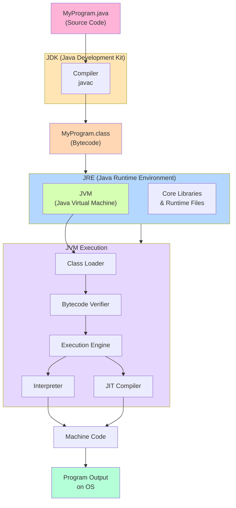

# JDK, JRE, JVM and Java Program Life Cycle

------------------------------------------------------------------------

# 1. Introduction

Java is a platform-independent programming language.\
To understand how Java works, we must understand three main components:

-   JDK (Java Development Kit)
-   JRE (Java Runtime Environment)
-   JVM (Java Virtual Machine)

------------------------------------------------------------------------

# 2. JVM (Java Virtual Machine)

## Definition

JVM is the engine that runs Java programs.

## Responsibilities

-   Loads bytecode (.class file)
-   Verifies bytecode
-   Converts bytecode into machine code
-   Executes the program
-   Manages memory (Heap & Stack)
-   Performs Garbage Collection

## Key Point

The JVM is platform-dependent. Each operating system has its own JVM
implementation.

------------------------------------------------------------------------

# 3. JRE (Java Runtime Environment)

## Definition

JRE provides the environment required to run Java applications.

## JRE Contains:

-   JVM
-   Core Java libraries
-   Supporting runtime files

## Purpose

If you only want to run Java programs (not develop them), JRE is enough.

------------------------------------------------------------------------

# 4. JDK (Java Development Kit)

## Definition

JDK is used to develop Java applications.

## JDK Contains:

-   JRE
-   JVM
-   Compiler (javac)
-   Debugger
-   Development tools

## Purpose

If you want to write and compile Java programs, you need JDK.

------------------------------------------------------------------------

# 5. Relationship Between JDK, JRE, and JVM

JDK = JRE + Development Tools\
JRE = JVM + Libraries\
JVM = Executes bytecode

------------------------------------------------------------------------

# 6. Java Program Life Cycle

## Step 1: Write Source Code

You create a file:

MyProgram.java

Example:

``` java
public class MyProgram {
    public static void main(String[] args) {
        System.out.println("Hello World");
    }
}
```

------------------------------------------------------------------------

## Step 2: Compilation

Command:

javac MyProgram.java

The Java Compiler (javac) converts:

MyProgram.java → MyProgram.class

The .class file contains Bytecode.

------------------------------------------------------------------------

## Step 3: Class Loading

When you run:

java MyProgram

The Class Loader loads the .class file into memory.

------------------------------------------------------------------------

## Step 4: Bytecode Verification

The Bytecode Verifier checks: - Security - Memory access violations -
Invalid instructions

------------------------------------------------------------------------

## Step 5: Execution

JVM converts bytecode into machine code using:

-   Interpreter
-   JIT (Just-In-Time) Compiler

Then the program executes.

------------------------------------------------------------------------

# 7. Complete Flow Diagram

.java file ↓ javac (Compiler in JDK) ↓ .class file (Bytecode) ↓ JVM
(Inside JRE) ↓ Machine Code ↓ Program Output

------------------------------------------------------------------------

# 8. How Java Achieves Platform Independence

-   Source code is compiled into Bytecode.
-   Bytecode is platform independent.
-   JVM is platform dependent.
-   Each OS has its own JVM implementation.

This is why Java is called:

"Write Once, Run Anywhere"

------------------------------------------------------------------------

# 9. Memory Areas in JVM

1.  Method Area
2.  Heap
3.  Stack
4.  PC Register
5.  Native Method Stack

------------------------------------------------------------------------

# 10. Common Interview Questions

1.  What is the difference between JDK, JRE, and JVM?
2.  Can Java program run without JDK?
3.  What is bytecode?
4.  What is JIT compiler?
5.  Why is Java platform independent?
6.  What happens when you run a Java program?
7.  What is the role of Class Loader?
8.  What is Garbage Collection?
9.  Difference between Interpreter and JIT?
10. Can we run a .java file directly?

------------------------------------------------------------------------

# 11. Short Summary

-   JVM executes Java bytecode.
-   JRE provides runtime environment.
-   JDK is used for development.
-   Java source code is compiled into bytecode.
-   JVM converts bytecode into machine code at runtime.

------------------------------------------------------------------------

# 12. Complete JDK Architecture & Program Execution Flow



This diagram shows:
- **JDK** at the top, which includes the Compiler, JRE, and Development Tools
- **Compilation Process**: Source code (.java) → Bytecode (.class)
- **JRE Components**: JVM and Core Libraries
- **JVM Execution Steps**: Class Loading → Bytecode Verification → Execution using Interpreter or JIT Compiler
- **Final Output**: Machine Code that runs on the Operating System

------------------------------------------------------------------------

End of Notes
