# Java Strings - Complete Guide for Beginners

## Table of Contents
1. [What is a String?](#what-is-a-string)
2. [String Memory Allocation](#string-memory-allocation)
3. [String vs StringBuilder vs StringBuffer](#string-vs-stringbuilder-vs-stringbuffer)
4. [When to Use What?](#when-to-use-what)
5. [String Pool and Literals](#string-pool-and-literals)
6. [String Operations and Methods](#string-operations-and-methods)
7. [Java Streams with Strings](#java-streams-with-strings)

---

## What is a String?

Think of a String like a sentence or a word. In Java, a **String** is a sequence of characters (letters, numbers, symbols) grouped together.

### Examples:
```java
"Hello"            // This is a String
"Java Programming" // This is also a String
"12345"            // Even numbers in quotes are Strings
"@#$%"             // Symbols can be in Strings too
```

### Important Facts:
- Strings in Java are **immutable** - once created, they cannot be changed
- Strings are objects in Java, not primitive data types
- Java provides special support for Strings because we use them so often
- **Java 9+**: Strings are internally stored as **byte arrays** (not char arrays) using the **Compact Strings** optimization, which saves memory for ASCII-heavy content

---

## String Memory Allocation

### Understanding Memory in Java

Java has different memory areas:
- **Heap Memory**: Where objects are stored
- **String Pool**: A special area in heap memory just for String literals
  - > ⚠️ **Note:** Before **Java 7**, the String Pool lived in **PermGen** (Permanent Generation), a separate memory space. From **Java 7 onwards**, it was moved into the regular **Heap**, making it subject to garbage collection and easier to tune.
- **Stack Memory**: Where method calls and local variables are stored

### How Strings are Created

There are **TWO ways** to create Strings in Java:

#### Method 1: Using String Literals (Recommended)
```java
String name = "John";
```

#### Method 2: Using the `new` Keyword
```java
String name = new String("John");
```

### Memory Allocation Diagram

Let's see how memory is allocated for different scenarios:

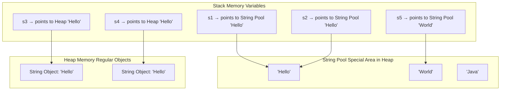

### Code Example with Memory Explanation

```java
public class StringMemoryExample {
    public static void main(String[] args) {
        // Using String Literals - Goes to String Pool
        String s1 = "Hello"; // Creates "Hello" in String Pool
        String s2 = "Hello"; // Reuses the same "Hello" from String Pool

        // Using new keyword - Goes to Heap
        String s3 = new String("Hello"); // Creates new object in Heap
        String s4 = new String("Hello"); // Creates another new object in Heap

        // Checking references (where they point in memory)
        System.out.println(s1 == s2); // true  - same reference in String Pool
        System.out.println(s1 == s3); // false - different memory locations
        System.out.println(s3 == s4); // false - different objects in Heap

        // Checking actual content
        System.out.println(s1.equals(s2)); // true - same content
        System.out.println(s1.equals(s3)); // true - same content
        System.out.println(s3.equals(s4)); // true - same content
    }
}
```

**Output:**
```
true
false
false
true
true
true
```

### Why This Happens - Memory Diagram

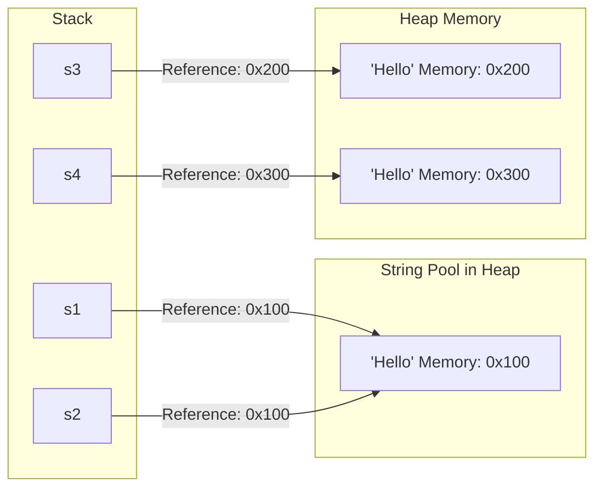

**Key Takeaway:** When you use string literals (like `"Hello"`), Java checks if it already exists in the String Pool. If yes, it reuses it. If no, it creates a new one. This saves memory!

---

## String vs StringBuilder vs StringBuffer

Now let's understand the three different ways to work with text in Java:

### 1. String (Immutable)

**What does Immutable mean?**
Immutable means "cannot be changed". Once you create a String, you cannot modify it.

```java
String message = "Hello";
message = message + " World"; // This doesn't modify the original String
```

#### Understanding the Cost of Immutability

When you try to "modify" a String, Java doesn't actually modify it. Instead, it:
1. **Creates a new memory location** for the new String
2. **Copies the content** from the old String
3. **Adds the new content** to the copy
4. **Returns the new String object**
5. The old String remains in memory (until garbage collected)

This process is **COSTLY** in terms of both memory and performance!

**Step-by-Step Example:**

```java
String str = "Hello";         // Original String created
str = str + " World";         // Looks simple, but expensive!
```

**What happens internally:**

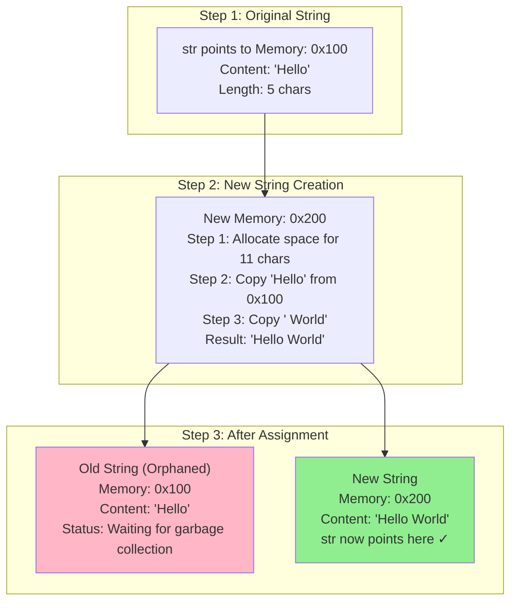

**Detailed Memory Operations:**

```java
String str = "Hello";                // Memory: 0x100 ['H','e','l','l','o']
str = str.concat(" World");          // What happens:
// Internally Java does:
// 1. Allocate new memory: 0x200 (size: 11 characters)
// 2. Copy from old string: ['H','e','l','l','o'] from 0x100 to 0x200
// 3. Append new string:    [' ','W','o','r','l','d'] to 0x200
// 4. Create new String object pointing to 0x200
// 5. str variable now points to 0x200
// 6. Old string at 0x100 becomes garbage (if no other reference)
```

**The Cost in a Loop (VERY EXPENSIVE):**

```java
String result = "";
for (int i = 0; i < 5; i++) {
    result = result + i;
}
```

**Memory Operations Count:**
```
Iteration 0: "" + "0"
  - Allocate new memory
  - Copy "" (0 chars)
  - Add "0" (1 char)
  - Create new String "0"
  Total: Create 1 new object

Iteration 1: "0" + "1"
  - Allocate new memory
  - Copy "0" (1 char) ← COPYING!
  - Add "1" (1 char)
  - Create new String "01"
  Total: Create 1 new object + Copy 1 char

Iteration 2: "01" + "2"
  - Allocate new memory
  - Copy "01" (2 chars) ← COPYING!
  - Add "2" (1 char)
  - Create new String "012"
  Total: Create 1 new object + Copy 2 chars

Iteration 3: "012" + "3"
  - Allocate new memory
  - Copy "012" (3 chars) ← COPYING!
  - Add "3" (1 char)
  - Create new String "0123"
  Total: Create 1 new object + Copy 3 chars

Iteration 4: "0123" + "4"
  - Allocate new memory
  - Copy "0123" (4 chars) ← COPYING!
  - Add "4" (1 char)
  - Create new String "01234"
  Total: Create 1 new object + Copy 4 chars

TOTAL: 5 new objects created + (0+1+2+3+4) = 10 characters copied!
```

**Why This Is Costly:**
1. **Memory Allocation**: Creating new objects repeatedly is expensive
2. **Copying Overhead**: Each iteration copies ALL previous characters
3. **Garbage Collection**: Old strings need to be cleaned up
4. **CPU Time**: Copying characters takes processing time
5. **Memory Fragmentation**: Many small objects created and destroyed

**Real-World Impact:**

```java
// Example: Building HTML with 1000 lines
String html = "";
for (int i = 0; i < 1000; i++) {
    html = html + "<div>Line " + i + "</div>\n"; // DISASTER!
}
// How many operations?
// - 1000 new String objects created
// - Approximately 500,000 character copies!
// - Time taken: Several seconds
// - Memory wasted: Megabytes

// Same operation with StringBuilder (EFFICIENT)
StringBuilder html = new StringBuilder();
for (int i = 0; i < 1000; i++) {
    html.append("<div>Line ").append(i).append("</div>\n");
}
// How many operations?
// - 1 StringBuilder object
// - Appending to internal array (resizing only when needed)
// - Time taken: Milliseconds
// - Memory: Minimal
```

**Comparison Diagram:**

```mermaid
graph TB
    subgraph "String (Immutable) - COSTLY"
        ST1["Original: 'Hello'
Memory: 1000 bytes"] --> ST2["Copy + Modify
New object: 'Hello World'
Memory: 2000 bytes"]
        ST2 --> ST3["Copy + Modify
New object: 'Hello World!'
Memory: 3000 bytes"]
        ST3 --> ST4["Total: 3 objects
6000 bytes used
Many copy operations"]
    end

    subgraph "StringBuilder (Mutable) - EFFICIENT"
        SB1["StringBuilder: 'Hello'
Memory: ~1000 bytes"] --> SB2["Append (same object)
'Hello World'
No new allocation needed"]
        SB2 --> SB3["Append (same object)
'Hello World!'
No new allocation needed"]
        SB3 --> SB4["Total: 1 object
Memory grows only when
internal array is full"]
    end

    style ST4 fill:#FFB6C6
    style SB4 fill:#90EE90
```

**What actually happens in memory:**

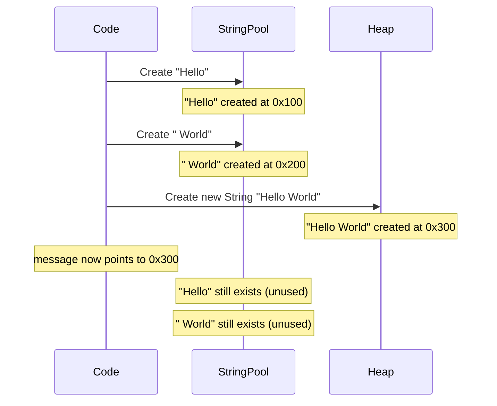

**Problem Summary:**

Every time you "modify" a String, Java:
- ❌ Creates a new String object (memory allocation)
- ❌ Copies all characters from old String (CPU time)
- ❌ Leaves old String as garbage (memory waste)
- ❌ This is **extremely inefficient** for many modifications

---

### 2. StringBuilder (Mutable, Not Thread-Safe) - The Solution!

**Why do we need StringBuilder?**
Because String's immutability is **costly** (creates new objects + copies data), Java provides **StringBuilder** as a mutable alternative. It solves the copying problem!

**Key Difference:**
- **String**: Creates new object every time → Costly
- **StringBuilder**: Modifies same object → Efficient

StringBuilder is like a dynamic character array that you can modify **without creating new objects**. However, note that when the internal array runs out of capacity, it **does resize itself** — which involves allocating a larger array and copying existing content into it. This resize is rare and amortised over many appends, so it's still far more efficient than String.

```java
StringBuilder sb = new StringBuilder("Hello");
sb.append(" World"); // Modifies the same object
sb.append("!");      // Modifies the same object again
String result = sb.toString(); // Convert to String when done
```

**How StringBuilder Avoids Excessive Copying:**

Instead of creating new objects on every operation, StringBuilder uses an **internal character array** that can grow:

```java
StringBuilder sb = new StringBuilder("Hello");
// What happens internally:
// 1. Create char array with capacity 21 (default 16 + length of "Hello" = 5)
//    Array: ['H','e','l','l','o',null,null,null,...]
// 2. Set length = 5

sb.append(" World");
// What happens:
// 1. Check if capacity is enough ✓ (21 > 11)
// 2. Add characters to SAME array at index 5
//    Array: ['H','e','l','l','o',' ','W','o','r','l','d',null,...]
// 3. Update length = 11
// NO new object created! NO full-string copying!

sb.append("!");
// What happens:
// 1. Check if capacity is enough ✓ (21 > 12)
// 2. Add character to SAME array at index 11
//    Array: ['H','e','l','l','o',' ','W','o','r','l','d','!',null,...]
// 3. Update length = 12
// Same object modified again!

// ⚠️ What if capacity is exceeded?
// If we append a very long string exceeding capacity 21:
// 1. A new, larger array is allocated (typically: old capacity * 2 + 2)
// 2. Existing content is copied into the new array
// 3. The new content is appended
// This resize is rare and amortised — still far cheaper than String concatenation
```

**StringBuilder vs String - Same Operation:**

```java
// Using String (INEFFICIENT - Creates multiple objects + Copies)
String str = "Hello";
str = str + " World"; // Creates new object, copies "Hello"
str = str + "!";      // Creates new object, copies "Hello World"
// Total: 3 objects created, 2 full-string copy operations

// Using StringBuilder (EFFICIENT - No new objects per append, No full-string copying)
StringBuilder sb = new StringBuilder("Hello");
sb.append(" World"); // Modifies same object
sb.append("!");      // Modifies same object
// Total: 1 object, 0 full-string copy operations (until resize is needed)
```

**Memory Diagram:**

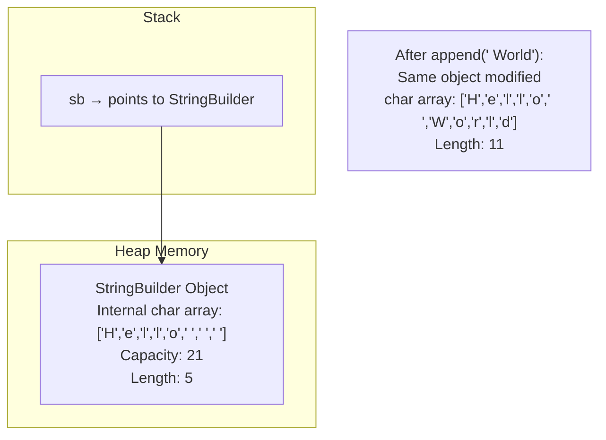

**Key Features:**
- **Mutable**: You can change the content
- **Efficient**: Doesn't create new objects for each append
- **Not Thread-Safe**: Cannot be used safely by multiple threads simultaneously
- **Fast**: Faster than StringBuffer because no synchronization overhead

### 3. StringBuffer (Mutable, Thread-Safe)

StringBuffer is almost identical to StringBuilder, but it's **thread-safe** (can be used by multiple threads).

```java
StringBuffer sbf = new StringBuffer("Hello");
sbf.append(" World"); // Modifies the same object (thread-safe way)
String result = sbf.toString();
```

**Key Features:**
- **Mutable**: You can change the content
- **Thread-Safe**: Can be used safely by multiple threads
- **Slower**: Slightly slower than StringBuilder due to synchronization
- **Synchronized**: Methods are synchronized to prevent conflicts

---

## Detailed Comparison Table

| Feature | String | StringBuilder | StringBuffer |
|---------|--------|---------------|--------------|
| **Mutability** | Immutable (cannot change) | Mutable (can change) | Mutable (can change) |
| **How it works** | Creates NEW object on each modification | Modifies SAME object (copies only on resize) | Modifies SAME object (copies only on resize) |
| **Memory Behavior** | Copies entire string to new location | Appends to internal array; resizes occasionally | Appends to internal array; resizes occasionally |
| **Objects Created** | 1 new object per modification | 1 object for all modifications | 1 object for all modifications |
| **Copying Overhead** | ❌ High (copies all previous chars every time) | ✓ Minimal (only on rare array resize) | ✓ Minimal (only on rare array resize) |
| **Thread Safety** | Thread-safe (immutable) | NOT thread-safe | Thread-safe (synchronized) |
| **Performance** | Slow for modifications | Fast | Moderate (slower than StringBuilder) |
| **Memory Efficiency** | ❌ Wasteful (creates garbage) | ✓ Efficient | ✓ Efficient |
| **When to Use** | Fixed strings, rarely modified | Single-threaded, many modifications | Multi-threaded, many modifications |
| **Storage** | String Pool (literals) or Heap | Heap | Heap |
| **Since Version** | Java 1.0 | Java 5 (1.5) | Java 1.0 |

**Key Insight:**
- **String**: Every modification → New object + Copy all characters → **COSTLY** 💰
- **StringBuilder/StringBuffer**: Every modification → Same object + No full-string copying (only occasional resize) → **EFFICIENT** ✓

---

## When to Use What?

Let me explain with real-world scenarios:

### Use **String** when:

1. **The value doesn't change**
```java
String country = "India";
String apiKey = "abc123xyz789";
final String DATABASE_URL = "jdbc:mysql://localhost:3306/mydb";
```

2. **You need to use it as a key in HashMap**
```java
Map<String, Integer> scores = new HashMap<>();
scores.put("John", 95); // String is perfect for keys
```

3. **Working with small amounts of text**
```java
String greeting = "Hello " + name; // Simple concatenation is fine
```

### Use **StringBuilder** when:

1. **Building strings in loops (single-threaded)**
```java
StringBuilder sb = new StringBuilder();
for (int i = 1; i <= 1000; i++) {
    sb.append("Number: ").append(i).append("\n");
}
String result = sb.toString();
```

2. **Heavy string manipulation**
```java
StringBuilder html = new StringBuilder();
html.append("<html>")
    .append("<body>")
    .append("<h1>")
    .append("<div>Welcome</div>")
    .append("</h1>")
    .append("</body>")
    .append("</html>");
```

3. **Parsing or building complex strings**
```java
StringBuilder csvLine = new StringBuilder();
for (String value : values) {
    csvLine.append(value).append(",");
}
```

### Use **StringBuffer** when:

1. **Multiple threads are modifying the same string**
```java
public class Logger {
    private StringBuffer logBuffer = new StringBuffer();

    public void log(String message) {
        // Can be called by multiple threads
        logBuffer.append(new Date()).append(": ").append(message).append("\n");
    }
}
```

2. **Working with legacy code** (older Java applications used StringBuffer)

---

## Performance Comparison Example

Let's see the performance difference:

```java
public class PerformanceTest {
    public static void main(String[] args) {
        int iterations = 50000;

        // Test 1: Using String (SLOW)
        long startTime = System.currentTimeMillis();
        String str = "";
        for (int i = 0; i < iterations; i++) {
            str += "a"; // Creates new String object each time!
        }
        long endTime = System.currentTimeMillis();
        System.out.println("String time: " + (endTime - startTime) + " ms");

        // Test 2: Using StringBuilder (FAST)
        startTime = System.currentTimeMillis();
        StringBuilder sb = new StringBuilder();
        for (int i = 0; i < iterations; i++) {
            sb.append("a"); // Modifies same object
        }
        String result = sb.toString();
        endTime = System.currentTimeMillis();
        System.out.println("StringBuilder time: " + (endTime - startTime) + " ms");

        // Test 3: Using StringBuffer (MODERATE)
        startTime = System.currentTimeMillis();
        StringBuffer sbf = new StringBuffer();
        for (int i = 0; i < iterations; i++) {
            sbf.append("a");
        }
        String result2 = sbf.toString();
        endTime = System.currentTimeMillis();
        System.out.println("StringBuffer time: " + (endTime - startTime) + " ms");
    }
}
```

> ⚠️ **Note:** The exact numbers vary depending on your JVM version, hardware, and JIT optimizations. Modern JVMs (Java 9+) can be significantly faster. The relative order (String slowest, StringBuilder fastest) holds true, but treat specific millisecond figures as illustrative, not absolute.

**Typical Output (may vary by JVM/hardware):**
```
String time:        ~1000-3000 ms
StringBuilder time: ~2-5 ms
StringBuffer time:  ~4-8 ms
```

**Notice:** String is **hundreds of times slower** when doing many concatenations!

**Why Such a HUGE Difference?**

Let's break down what happens with 50,000 iterations:

**String Approach (SLOW):**
```
Iteration 1: "" + "a" = "a"
  - Create new object
  - Copy: 0 chars
  - Total: 1 object

Iteration 2: "a" + "a" = "aa"
  - Create new object
  - Copy: 1 char from previous string
  - Total: 2 objects

...

Iteration 50,000: (49,999 'a's) + "a" = (50,000 'a's)
  - Create new object
  - Copy: 49,999 chars from previous string!
  - Total: 50,000 objects

TOTAL OPERATIONS:
  - Objects created: 50,000
  - Characters copied: 0 + 1 + 2 + 3 + ... + 49,999 = 1,249,975,000 characters!
  - Time: Very slow
```

**StringBuilder Approach (FAST):**
```
All 50,000 iterations:
  - Use SAME StringBuilder object
  - Just append to internal array
  - Resize array only when full (grows: newCapacity = oldCapacity * 2 + 2)
  - Occasional resize involves copying, but far less frequently!

TOTAL OPERATIONS:
  - Objects created: 1 (just the StringBuilder)
  - Characters copied: Only during rare resizes (~log₂(50000) ≈ 16 resize events)
  - Time: Very fast
```

**Mathematical Proof of Why String is Slow:**
```
For n iterations:
  String copying cost    = 1 + 2 + 3 + ... + (n-1) = n(n-1)/2
  With n = 50,000:       50,000 × 49,999 / 2 = 1,249,975,000 copy operations!

  StringBuilder copy cost = ~O(n log n) due to rare array resizes
  With n = 50,000:        Only ~800,000 characters copied across all resizes
```

**Real-World Analogy:**

Think of building a tower with blocks:

**String (Immutable) Approach:**
- Build tower with 1 block
- Want to add 2nd block? Destroy tower, rebuild with 2 blocks from scratch
- Want to add 3rd block? Destroy tower, rebuild with 3 blocks from scratch
- Result: EXTREMELY WASTEFUL! ❌

**StringBuilder (Mutable) Approach:**
- Build tower with 1 block
- Want to add 2nd block? Just place it on top
- Want to add 3rd block? Just place it on top
- Occasionally the tower gets too tall for its base → rebuild with a bigger base, then continue
- Result: EFFICIENT! ✓

---

## String Pool and Literals Explained

### What is the String Pool?

The **String Pool** (also called String Constant Pool) is a special memory area where Java stores String literals to save memory.

> ⚠️ **Historical Note:** Before **Java 7**, the String Pool was located in **PermGen** (Permanent Generation). From **Java 7 onwards**, it was moved to the **Heap**, allowing it to be garbage collected and making it easier to manage with standard JVM flags.

### String Pool Architecture

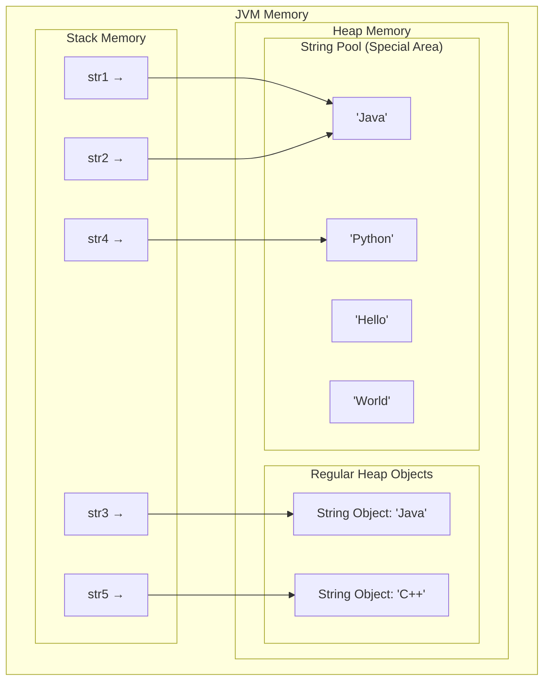

### Same Value for Different Variables - Detailed Example

```java
public class StringPoolDemo {
    public static void main(String[] args) {
        // All using literals - go to String Pool
        String s1 = "Hello";
        String s2 = "Hello";
        String s3 = "Hello";

        // Using new keyword - goes to Heap
        String s4 = new String("Hello");
        String s5 = new String("Hello");

        // intern() method - moves to String Pool if not there
        String s6 = s4.intern();

        // Reference comparison (==)
        System.out.println("s1 == s2: " + (s1 == s2)); // true
        System.out.println("s1 == s3: " + (s1 == s3)); // true
        System.out.println("s1 == s4: " + (s1 == s4)); // false
        System.out.println("s4 == s5: " + (s4 == s5)); // false
        System.out.println("s1 == s6: " + (s1 == s6)); // true

        // Content comparison (.equals)
        System.out.println("\nAll have same content: " +
            (s1.equals(s2) && s2.equals(s3) && s3.equals(s4)
             && s4.equals(s5) && s5.equals(s6))); // true
    }
}
```

### Memory Visualization with Same Values

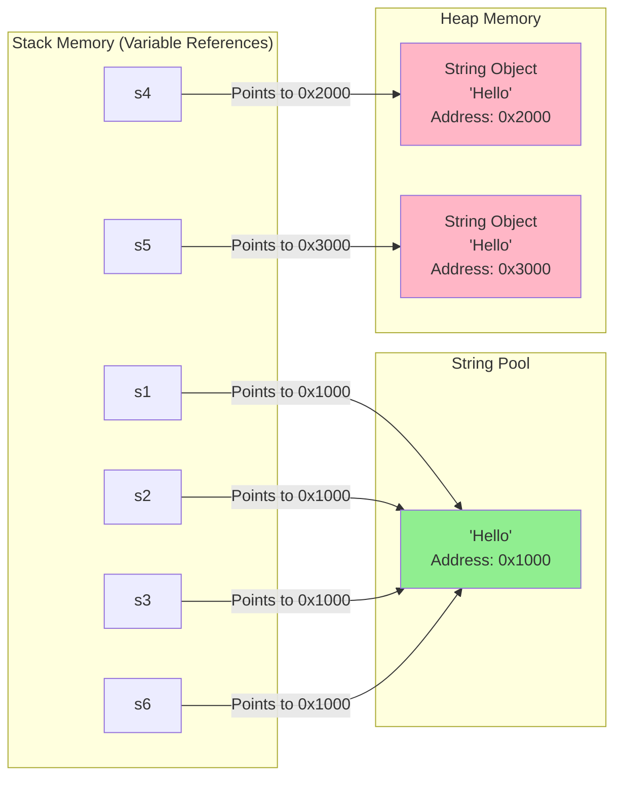

**Key Observations:**
- `s1`, `s2`, `s3` all point to the **same object** in String Pool (address 0x1000)
- `s4` and `s5` point to **different objects** in Heap (addresses 0x2000 and 0x3000)
- `s6` uses `intern()` to point back to String Pool (address 0x1000)

---

## String Operations and Methods

### Common String Methods

```java
import java.util.Arrays;

public class StringMethods {
    public static void main(String[] args) {
        String str = "Hello World";

        // 1. Length
        System.out.println("Length: " + str.length()); // 11

        // 2. Character at index
        System.out.println("Character at index 0: " + str.charAt(0)); // H

        // 3. Substring
        System.out.println("Substring(0,5): " + str.substring(0, 5)); // Hello

        // 4. Index of character/string
        System.out.println("Index of 'o': " + str.indexOf('o'));         // 4
        System.out.println("Last index of 'o': " + str.lastIndexOf('o')); // 7

        // 5. String comparison
        System.out.println("Equals 'Hello World': " + str.equals("Hello World"));                   // true
        System.out.println("Equals ignore case 'hello world': " + str.equalsIgnoreCase("hello world")); // true

        // 6. String modification (returns new String)
        System.out.println("Uppercase: " + str.toUpperCase());                    // HELLO WORLD
        System.out.println("Lowercase: " + str.toLowerCase());                    // hello world
        System.out.println("Replace 'World' with 'Java': " + str.replace("World", "Java")); // Hello Java

        // 7. Trim whitespace
        String spaced = "  Hello  ";
        System.out.println("Trimmed: '" + spaced.trim() + "'");    // 'Hello'
        // Java 11+: strip() is preferred - handles Unicode whitespace correctly
        System.out.println("Stripped: '" + spaced.strip() + "'");  // 'Hello'

        // 8. Split string
        String sentence = "Java is awesome";
        String[] words = sentence.split(" ");
        System.out.println("Words: " + Arrays.toString(words)); // [Java, is, awesome]

        // 9. Check if string contains
        System.out.println("Contains 'World': " + str.contains("World")); // true

        // 10. Starts with / Ends with
        System.out.println("Starts with 'Hello': " + str.startsWith("Hello")); // true
        System.out.println("Ends with 'World': " + str.endsWith("World"));     // true

        // 11. Is empty / Is blank
        System.out.println("Is empty: " + str.isEmpty()); // false
        System.out.println("Is blank: " + str.isBlank()); // false (Java 11+)

        // 12. Join strings (Java 8+)
        String joined = String.join(", ", "Alice", "Bob", "Charlie");
        System.out.println("Joined: " + joined); // Alice, Bob, Charlie
    }
}
```

### StringBuilder/StringBuffer Methods

```java
public class StringBuilderMethods {
    public static void main(String[] args) {
        StringBuilder sb = new StringBuilder("Hello");

        // 1. Append
        sb.append(" World");
        System.out.println(sb); // Hello World

        // 2. Insert
        sb.insert(5, ",");
        System.out.println(sb); // Hello, World

        // 3. Delete
        sb.delete(5, 6); // Remove comma
        System.out.println(sb); // Hello World

        // 4. Reverse
        sb.reverse();
        System.out.println(sb); // dlroW olleH
        sb.reverse(); // Reverse back

        // 5. Replace
        sb.replace(0, 5, "Hi");
        System.out.println(sb); // Hi World

        // 6. Capacity and Length
        System.out.println("Length: "   + sb.length());   // 8
        System.out.println("Capacity: " + sb.capacity()); // 21 (16 default + 5 for initial "Hello")

        // 7. Convert to String
        String result = sb.toString();
        System.out.println("Final string: " + result); // Hi World
    }
}
```

---

## Java Streams with Strings

Java 8 introduced **Streams** - a powerful way to process collections of data (including Strings).

### What are Streams?

Think of a Stream as a **pipeline** where data flows through and gets transformed.

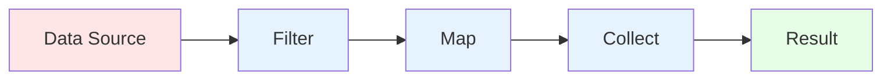

### Stream Operations on Strings

#### 1. Creating Streams from Strings

```java
import java.util.Arrays;
import java.util.List;
import java.util.stream.Collectors;
import java.util.stream.Stream;

public class StringStreams {
    public static void main(String[] args) {
        // Method 1: Stream from String array
        String[] names = {"Alice", "Bob", "Charlie", "David"};
        Stream<String> stream1 = Arrays.stream(names);

        // Method 2: Stream from List
        List<String> nameList = Arrays.asList("Alice", "Bob", "Charlie", "David");
        Stream<String> stream2 = nameList.stream();

        // Method 3: Stream of characters from a String
        String word = "Hello";
        word.chars().forEach(c -> System.out.print((char)c + " "));
        // Output: H e l l o
    }
}
```

#### 2. Filter Operation

Find strings that match a condition:

```java
import java.util.Arrays;
import java.util.List;
import java.util.stream.Collectors;

public class FilterExample {
    public static void main(String[] args) {
        List<String> names = Arrays.asList("Alice", "Bob", "Charlie", "David", "Alex");

        // Filter names starting with 'A'
        List<String> filteredNames = names.stream()
            .filter(name -> name.startsWith("A"))
            .collect(Collectors.toList());
        System.out.println(filteredNames); // [Alice, Alex]

        // Filter names with length > 4
        List<String> longNames = names.stream()
            .filter(name -> name.length() > 4)
            .collect(Collectors.toList());
        System.out.println(longNames); // [Alice, Charlie, David]
    }
}
```

#### 3. Map Operation

Transform each element:

```java
import java.util.Arrays;
import java.util.List;
import java.util.stream.Collectors;

public class MapExample {
    public static void main(String[] args) {
        List<String> names = Arrays.asList("alice", "bob", "charlie");

        // Convert all names to uppercase
        List<String> upperNames = names.stream()
            .map(String::toUpperCase)
            .collect(Collectors.toList());
        System.out.println(upperNames); // [ALICE, BOB, CHARLIE]

        // Get length of each name
        List<Integer> nameLengths = names.stream()
            .map(String::length)
            .collect(Collectors.toList());
        System.out.println(nameLengths); // [5, 3, 7]

        // Add prefix to each name
        List<String> prefixedNames = names.stream()
            .map(name -> "Mr. " + name)
            .collect(Collectors.toList());
        System.out.println(prefixedNames); // [Mr. alice, Mr. bob, Mr. charlie]
    }
}
```

#### 4. Sorted Operation

```java
import java.util.Arrays;
import java.util.List;
import java.util.stream.Collectors;

public class SortExample {
    public static void main(String[] args) {
        List<String> names = Arrays.asList("Charlie", "Alice", "David", "Bob");

        // Sort alphabetically
        List<String> sortedNames = names.stream()
            .sorted()
            .collect(Collectors.toList());
        System.out.println(sortedNames); // [Alice, Bob, Charlie, David]

        // Sort by length
        List<String> sortedByLength = names.stream()
            .sorted((a, b) -> a.length() - b.length())
            .collect(Collectors.toList());
        System.out.println(sortedByLength); // [Bob, Alice, David, Charlie]

        // Reverse order
        List<String> reverseSorted = names.stream()
            .sorted((a, b) -> b.compareTo(a))
            .collect(Collectors.toList());
        System.out.println(reverseSorted); // [David, Charlie, Bob, Alice]
    }
}
```

#### 5. Collect Operation

Gather results into different forms:

```java
import java.util.Arrays;
import java.util.List;
import java.util.Set;
import java.util.stream.Collectors;

public class CollectExample {
    public static void main(String[] args) {
        List<String> words = Arrays.asList("apple", "banana", "apple", "cherry", "banana");

        // Collect to List
        List<String> list = words.stream()
            .collect(Collectors.toList());
        System.out.println("List: " + list);

        // Collect to Set (removes duplicates)
        Set<String> set = words.stream()
            .collect(Collectors.toSet());
        System.out.println("Set: " + set); // [apple, banana, cherry]

        // Join strings with delimiter
        String joined = words.stream()
            .distinct() // Remove duplicates
            .collect(Collectors.joining(", "));
        System.out.println("Joined: " + joined); // apple, banana, cherry

        // Join with prefix and suffix
        String formatted = words.stream()
            .distinct()
            .collect(Collectors.joining(", ", "[", "]"));
        System.out.println("Formatted: " + formatted); // [apple, banana, cherry]
    }
}
```

#### 6. Common Stream Operations Combined

```java
import java.util.Arrays;
import java.util.List;
import java.util.stream.Collectors;

public class CombinedStreamExample {
    public static void main(String[] args) {
        List<String> sentences = Arrays.asList(
            "Java is awesome",
            "Python is great",
            "JavaScript is popular",
            "Java is powerful"
        );

        // Find all unique words starting with 'J', convert to uppercase
        List<String> result = sentences.stream()
            .flatMap(sentence -> Arrays.stream(sentence.split(" "))) // Split into words
            .filter(word -> word.startsWith("J"))                    // Filter J words
            .map(String::toUpperCase)                               // Convert to uppercase
            .distinct()                                             // Remove duplicates
            .sorted()                                               // Sort alphabetically
            .collect(Collectors.toList());                          // Collect to list

        System.out.println(result); // [JAVA, JAVASCRIPT]
    }
}
```

#### 7. Reduce Operation

Combine elements into a single result:

```java
import java.util.Arrays;
import java.util.List;
import java.util.Optional;

public class ReduceExample {
    public static void main(String[] args) {
        List<String> words = Arrays.asList("Hello", "World", "Java", "Streams");

        // Concatenate all words
        Optional<String> concatenated = words.stream()
            .reduce((a, b) -> a + " " + b);
        concatenated.ifPresent(System.out::println); // Hello World Java Streams

        // Find longest word
        Optional<String> longest = words.stream()
            .reduce((a, b) -> a.length() > b.length() ? a : b);
        longest.ifPresent(word -> System.out.println("Longest: " + word)); // Longest: Streams

        // Count total characters
        int totalLength = words.stream()
            .mapToInt(String::length)
            .sum();
        System.out.println("Total characters: " + totalLength); // 23
    }
}
```

#### 8. Advanced String Stream Examples

```java
import java.util.Arrays;
import java.util.List;
import java.util.Map;
import java.util.stream.Collectors;

public class AdvancedStreamExamples {
    public static void main(String[] args) {
        List<String> names = Arrays.asList(
            "Alice", "Bob", "Charlie", "David", "Alex", "Benjamin"
        );

        // Example 1: Group by first letter
        Map<Character, List<String>> groupedByFirstLetter = names.stream()
            .collect(Collectors.groupingBy(name -> name.charAt(0)));
        System.out.println("Grouped by first letter:");
        groupedByFirstLetter.forEach((letter, namesList) ->
            System.out.println(letter + ": " + namesList));
        // A: [Alice, Alex]
        // B: [Bob, Benjamin]
        // C: [Charlie]
        // D: [David]

        // Example 2: Count names by length
        Map<Integer, Long> countByLength = names.stream()
            .collect(Collectors.groupingBy(String::length, Collectors.counting()));
        System.out.println("\nCount by length: " + countByLength);

        // Example 3: Partition by length > 4
        Map<Boolean, List<String>> partitioned = names.stream()
            .collect(Collectors.partitioningBy(name -> name.length() > 4));
        System.out.println("\nLong names (> 4): "  + partitioned.get(true));
        System.out.println("Short names (<= 4): " + partitioned.get(false));

        // Example 4: Find first name starting with 'B'
        names.stream()
            .filter(name -> name.startsWith("B"))
            .findFirst()
            .ifPresent(name -> System.out.println("\nFirst B name: " + name)); // Bob

        // Example 5: Check if any name contains "lie"
        boolean anyMatch = names.stream()
            .anyMatch(name -> name.contains("lie"));
        System.out.println("\nAny name contains 'lie': " + anyMatch); // true (Charlie)

        // Example 6: Check if all names start with uppercase
        boolean allUppercase = names.stream()
            .allMatch(name -> Character.isUpperCase(name.charAt(0)));
        System.out.println("All start with uppercase: " + allUppercase); // true
    }
}
```

### Stream Processing Diagram

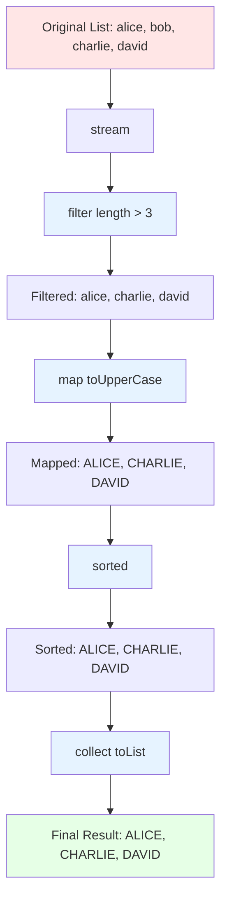

---

## Complete Example: String Processing Application

Let's build a complete application that demonstrates everything:

```java
import java.util.*;
import java.util.stream.Collectors;

public class StringProcessingDemo {
    public static void main(String[] args) {
        // Sample data: Student names and scores
        List<String> studentData = Arrays.asList(
            "Alice:95", "Bob:82", "Charlie:88",
            "David:95", "Alex:82", "Benjamin:90"
        );

        System.out.println("=== String Processing Demo ===\n");

        // 1. Using String operations
        demonstrateStringOperations(studentData);

        // 2. Using StringBuilder for efficiency
        demonstrateStringBuilder(studentData);

        // 3. Using Streams
        demonstrateStreams(studentData);
    }

    // Method 1: Basic String operations
    static void demonstrateStringOperations(List<String> data) {
        System.out.println("1. Basic String Operations:");
        System.out.println("----------------------------");
        for (String record : data) {
            String[] parts = record.split(":");
            String name  = parts[0];
            int    score = Integer.parseInt(parts[1]);

            String grade;
            if      (score >= 90) grade = "A";
            else if (score >= 80) grade = "B";
            else                  grade = "C";

            System.out.println(name + " scored " + score + " (Grade: " + grade + ")");
        }
        System.out.println();
    }

    // Method 2: StringBuilder for efficiency
    static void demonstrateStringBuilder(List<String> data) {
        System.out.println("2. Using StringBuilder:");
        System.out.println("----------------------------");
        StringBuilder report = new StringBuilder();
        report.append("Student Report\n");
        report.append("==============\n\n");

        for (String record : data) {
            String[] parts = record.split(":");
            report.append("Student: ").append(parts[0])
                  .append(" | Score: ").append(parts[1])
                  .append("\n");
        }
        report.append("\nTotal Students: ").append(data.size());
        System.out.println(report.toString());
        System.out.println();
    }

    // Method 3: Stream operations
    static void demonstrateStreams(List<String> data) {
        System.out.println("3. Using Streams:");
        System.out.println("----------------------------");

        // Get all students with score >= 90
        List<String> topStudents = data.stream()
            .filter(record -> Integer.parseInt(record.split(":")[1]) >= 90)
            .map(record -> record.split(":")[0])
            .sorted()
            .collect(Collectors.toList());
        System.out.println("Top Students (>= 90): " + topStudents);

        // Calculate average score
        double avgScore = data.stream()
            .mapToInt(record -> Integer.parseInt(record.split(":")[1]))
            .average()
            .orElse(0.0);
        System.out.println("Average Score: " + String.format("%.2f", avgScore));

        // Group by score
        Map<Integer, List<String>> byScore = data.stream()
            .collect(Collectors.groupingBy(
                record -> Integer.parseInt(record.split(":")[1]),
                Collectors.mapping(
                    record -> record.split(":")[0],
                    Collectors.toList()
                )
            ));
        System.out.println("\nStudents grouped by score:");
        byScore.forEach((score, students) ->
            System.out.println("  Score " + score + ": " + students));
    }
}
```

**Output:**
```
=== String Processing Demo ===

1. Basic String Operations:
----------------------------
Alice scored 95 (Grade: A)
Bob scored 82 (Grade: B)
Charlie scored 88 (Grade: B)
David scored 95 (Grade: A)
Alex scored 82 (Grade: B)
Benjamin scored 90 (Grade: A)

2. Using StringBuilder:
----------------------------
Student Report
==============

Student: Alice | Score: 95
Student: Bob | Score: 82
Student: Charlie | Score: 88
Student: David | Score: 95
Student: Alex | Score: 82
Student: Benjamin | Score: 90

Total Students: 6

3. Using Streams:
----------------------------
Top Students (>= 90): [Alice, Benjamin, David]
Average Score: 88.67

Students grouped by score:
  Score 82: [Bob, Alex]
  Score 88: [Charlie]
  Score 90: [Benjamin]
  Score 95: [Alice, David]
```

---

## Summary and Best Practices

### Quick Decision Guide

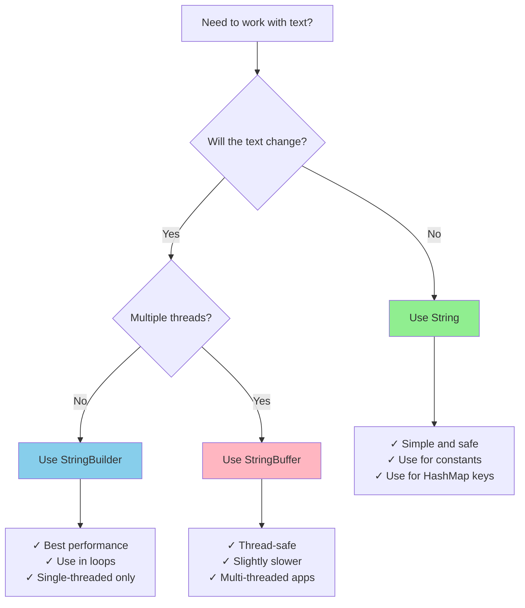

### Key Takeaways

1. **String** = Immutable, safe, use for fixed text
2. **StringBuilder** = Mutable, fast, use for single-threaded modifications
3. **StringBuffer** = Mutable, thread-safe, use for multi-threaded modifications
4. **String Pool** saves memory by reusing literal strings (located in Heap since Java 7)
5. **Compact Strings (Java 9+)** store ASCII content as byte arrays, saving memory
6. **Streams** provide powerful functional programming for text processing

### Common Pitfalls to Avoid

```java
// ❌ BAD: String concatenation in loop
String result = "";
for (int i = 0; i < 1000; i++) {
    result += i; // Creates 1000 new String objects!
}

// ✅ GOOD: Use StringBuilder
StringBuilder sb = new StringBuilder();
for (int i = 0; i < 1000; i++) {
    sb.append(i); // Efficient
}
String result = sb.toString();


// ❌ BAD: Using == for string comparison
String s1 = "Hello";
String s2 = new String("Hello");
if (s1 == s2) { // Wrong! Compares references
    // ...
}

// ✅ GOOD: Use .equals()
if (s1.equals(s2)) { // Correct! Compares content
    // ...
}


// ❌ BAD: Using trim() for Unicode whitespace (Java 11+)
String s = "\u2005Hello\u2005"; // Unicode space
System.out.println(s.trim());   // May not remove all whitespace types

// ✅ GOOD: Use strip() which handles Unicode whitespace (Java 11+)
System.out.println(s.strip()); // Correctly handles all whitespace
```

---

## Interview Questions and Answers

Here are the most commonly asked Java String interview questions with detailed answers:

### Basic Level Questions

#### Q1. What is a String in Java? Is it a primitive data type?

**Answer:** A String is a sequence of characters in Java. **No, it is not a primitive data type** - it is a **class** (object type) in Java.

- Primitive types: int, char, boolean, float, double, byte, short, long
- String is a class defined in `java.lang.String` package
- Strings are handled as objects, but Java provides special support for them

```java
String name = "John"; // This is an object, not a primitive
int age = 25;         // This is a primitive
```

---

#### Q2. What is String immutability? Why are Strings immutable in Java?

**Answer:** String immutability means once a String object is created, its value cannot be changed.

**Why are Strings immutable?**

1. **Security**: Strings are used for database connections, network connections, file paths. If mutable, someone could change them
2. **String Pool**: Immutability allows Java to use String Pool and share the same String objects
3. **Thread Safety**: Multiple threads can share String objects without synchronization
4. **Caching**: Hash codes can be cached because Strings don't change
5. **Class Loading**: Class names are Strings, immutability ensures correct class loading

```java
String s1 = "Hello";
s1.concat(" World"); // This doesn't change s1
System.out.println(s1); // Still prints "Hello"

String s2 = s1.concat(" World"); // Creates new String
System.out.println(s2); // Prints "Hello World"
```

---

#### Q3. What is the difference between String, StringBuilder, and StringBuffer?

**Answer:**

| Feature | String | StringBuilder | StringBuffer |
|---------|--------|---------------|--------------|
| **Mutability** | Immutable | Mutable | Mutable |
| **Thread Safety** | Thread-safe (immutable) | NOT thread-safe | Thread-safe (synchronized) |
| **Performance** | Slow for modifications | Fast | Slower than StringBuilder |
| **Memory** | Creates new object on modification | Modifies same object (resizes internally when needed) | Modifies same object (resizes internally when needed) |
| **Since** | Java 1.0 | Java 1.5 | Java 1.0 |
| **Use Case** | Fixed strings | Single-threaded string building | Multi-threaded string building |

```java
// String - Immutable
String s = "Hello";
s = s + " World"; // Creates new object

// StringBuilder - Mutable, not thread-safe
StringBuilder sb = new StringBuilder("Hello");
sb.append(" World"); // Modifies same object

// StringBuffer - Mutable, thread-safe
StringBuffer sbf = new StringBuffer("Hello");
sbf.append(" World"); // Modifies same object, synchronized
```

---

#### Q4. What is String Pool (String Constant Pool)?

**Answer:** String Pool is a special memory area in the Java Heap where String literals are stored. It's also called **String Intern Pool** or **String Constant Pool**.

> ⚠️ **Important:** Before **Java 7**, the String Pool was in **PermGen**. From **Java 7 onwards**, it moved to the **Heap**, making pooled strings eligible for garbage collection.

**Purpose**: To save memory by reusing String literals

```java
String s1 = "Hello"; // Created in String Pool
String s2 = "Hello"; // Reuses the same object from String Pool
String s3 = new String("Hello"); // Created in Heap, not in Pool

System.out.println(s1 == s2); // true  (same reference)
System.out.println(s1 == s3); // false (different references)
```

**Memory Diagram:**
```
String Pool: ["Hello"]      ← s1, s2 point here
Heap:        [String("Hello")] ← s3 points here
```

---

#### Q5. What is the difference between `==` and `.equals()` method?

**Answer:**
- **`==`** operator: Compares **reference (memory address)** - checks if both variables point to the same object
- **`.equals()`** method: Compares **content (actual value)** - checks if both Strings have the same characters

```java
String s1 = "Hello";
String s2 = "Hello";
String s3 = new String("Hello");

// Reference comparison (==)
System.out.println(s1 == s2); // true  (same object in String Pool)
System.out.println(s1 == s3); // false (different objects)

// Content comparison (.equals)
System.out.println(s1.equals(s2)); // true (same content)
System.out.println(s1.equals(s3)); // true (same content)
```

---

### Intermediate Level Questions

#### Q6. What happens when you do `String s1 = s2`?

**Answer:** When you assign one String variable to another (`String s1 = s2`), you are **copying the reference**, not the value. Both variables will point to the **same String object** in memory.

```java
String s2 = "Java";
String s1 = s2; // s1 now points to the same object as s2

System.out.println(s1 == s2);     // true (same reference)
System.out.println(s1.equals(s2)); // true (same content)
```

**Important:** If you later reassign one of them, they will point to different objects:

```java
String s2 = "Java";
String s1 = s2;     // Both point to "Java"
s1 = "Python";      // s1 now points to "Python" (new assignment)

System.out.println(s1);        // Python
System.out.println(s2);        // Java (unchanged)
System.out.println(s1 == s2);  // false (different references now)
```

---

#### Q7. How does `substring()` work? Does it create a new String?

**Answer:** Yes, `substring()` **always creates a new String object** because Strings are immutable.

**Syntax:**
- `substring(int beginIndex)` - from beginIndex to end
- `substring(int beginIndex, int endIndex)` - from beginIndex to endIndex-1

```java
String original = "Hello World";
String sub1 = original.substring(0, 5); // "Hello"
String sub2 = original.substring(6);    // "World"
String sub3 = original.substring(6, 11); // "World"

System.out.println("Original: " + original); // Hello World (unchanged)
System.out.println("Sub1: " + sub1);         // Hello
System.out.println("Sub2: " + sub2);         // World

System.out.println(original == sub1); // false (different objects)
```

**Important Java Version Notes:**
- **Java 6 and earlier**: `substring()` shared the same underlying char array as the original (memory leak risk)
- **Java 7 onwards**: `substring()` creates a new, independent char array (safer, no memory leak)

---

#### Q8. What is the `intern()` method?

**Answer:** The `intern()` method is used to put a String into the String Pool manually. If the String already exists in the pool, it returns the reference to that String; otherwise, it adds it to the pool.

```java
String s1 = new String("Hello"); // Creates object in Heap
String s2 = "Hello";             // Creates/reuses in String Pool
String s3 = s1.intern();         // Returns reference from String Pool

System.out.println(s1 == s2); // false (different locations)
System.out.println(s2 == s3); // true  (both in String Pool)
System.out.println(s1.equals(s2)); // true (same content)
```

**Use Case:** When you have Strings created with `new` keyword but want to use String Pool benefits for memory optimization.

---

#### Q9. Can we create a String without using the `new` keyword?

**Answer:** Yes, and it's actually **recommended**! You can create Strings using **string literals**.

```java
// Method 1: Using literal (Recommended) - Uses String Pool
String s1 = "Hello";

// Method 2: Using new keyword - Creates object in Heap
String s2 = new String("Hello");
```

**Differences:**
```java
String s1 = "Hello";             // 1 object created (in String Pool)
String s2 = new String("Hello"); // 2 objects created (1 in Pool for literal, 1 in Heap)
```

---

#### Q10. How many objects are created by the following code?

```java
String s1 = "Hello";
String s2 = "Hello";
String s3 = new String("Hello");
String s4 = new String("Hello");
```

**Answer:** **3 objects** are created in total:

1. **"Hello" in String Pool** (created once, shared by s1 and s2)
2. **First String object in Heap** for s3
3. **Second String object in Heap** for s4

**Breakdown:**
```java
String s1 = "Hello";             // 1 object: "Hello" in String Pool
String s2 = "Hello";             // 0 objects: reuses existing "Hello"
String s3 = new String("Hello"); // 1 object: new String in Heap
String s4 = new String("Hello"); // 1 object: another new String in Heap
```

**Memory Layout:**
```
String Pool: ["Hello"]         ← s1, s2 point here
Heap:        [String("Hello")] ← s3 points here
             [String("Hello")] ← s4 points here
```

---

#### Q11. What is the output of this code?

```java
String s1 = "Java";
String s2 = "Java";
String s3 = new String("Java");
String s4 = new String("Java");

System.out.println(s1 == s2);
System.out.println(s1 == s3);
System.out.println(s3 == s4);
System.out.println(s1.equals(s3));
```

**Answer:**
```
true
false
false
true
```

**Explanation:**
- `s1 == s2` → **true**: Both point to same object in String Pool
- `s1 == s3` → **false**: s1 in String Pool, s3 in Heap (different locations)
- `s3 == s4` → **false**: Both in Heap but different objects
- `s1.equals(s3)` → **true**: Same content "Java"

---

#### Q12. Why is String length stored as int instead of long?

**Answer:** In Java, array indices are of type `int`, and since Strings are internally backed by a character/byte array, the maximum length is limited to `Integer.MAX_VALUE` (2,147,483,647).

**Practical Reasons:**
1. **Memory Constraint**: Creating a String longer than 2 billion characters would require enormous memory
2. **Array Limitation**: Java arrays are indexed with int
3. **Sufficient for most use cases**: 2 billion characters is more than enough for typical applications

```java
public class StringSize {
    public static void main(String[] args) {
        String s = "Hello";
        int len = s.length(); // Returns int, not long
        System.out.println("Max String length: " + Integer.MAX_VALUE);
        // Max String length: 2147483647
    }
}
```

---

### Advanced Level Questions

#### Q13. What is the difference between `String s = "Hello"` and `String s = new String("Hello")`?

**Answer:**

| Aspect | `String s = "Hello"` | `String s = new String("Hello")` |
|--------|---------------------|----------------------------------|
| **Objects Created** | 1 (in String Pool) | 2 (1 in Pool + 1 in Heap) |
| **Memory Location** | String Pool | Heap Memory |
| **Performance** | Better (reuses existing) | Worse (always creates new) |
| **Recommended** | ✅ Yes | ❌ No (unless specific need) |

**When to use `new String()`?**
- Almost never! Only in very specific cases
- For normal use, always use string literals

---

#### Q14. Can we make String mutable?

**Answer:** No, we **cannot make String mutable** directly. String class is declared as `final`, and its internal array is private and final. However, we can use alternatives:

**Option 1: Use StringBuilder or StringBuffer** (Recommended)
```java
StringBuilder sb = new StringBuilder("Hello");
sb.append(" World"); // Mutable
System.out.println(sb); // Hello World
```

**Option 2: Use Reflection** (Not Recommended)

> ⚠️ **Java 9+ Warning:** The reflection approach below will throw an `InaccessibleObjectException` on Java 9+ unless you explicitly open the `java.lang` module with the `--add-opens java.base/java.lang=ALL-UNNAMED` JVM flag. This is an advanced/unsupported use case and should **never** be done in production.

```java
import java.lang.reflect.Field;

public class MutableString {
    public static void main(String[] args) throws Exception {
        String s1 = "Hello";
        String s2 = "Hello"; // Points to same pool object!

        // ⚠️ Requires --add-opens flag on Java 9+
        Field field = String.class.getDeclaredField("value");
        field.setAccessible(true);
        char[] value = (char[]) field.get(s1);
        value[0] = 'J';

        // DANGER: Both s1 and s2 are now "Jello" because they
        // share the same String Pool object!
        System.out.println(s1); // Jello
        System.out.println(s2); // Jello (both changed!)
    }
}
```

**Dangers:**
1. ❌ Breaks String immutability contract
2. ❌ Affects ALL references to that String Pool object
3. ❌ Corrupts String Pool integrity
4. ❌ Not thread-safe
5. ❌ Does not work without extra flags on Java 9+
6. ❌ Can cause unpredictable bugs

**Conclusion:** Never do this in production code!

---

#### Q15. What happens in String concatenation using `+` operator?

**Answer:** When you use `+` operator to concatenate Strings, Java internally uses **StringBuilder** (from Java 5 onwards) for optimization.

**Single Concatenation:**
```java
String s = "Hello" + " " + "World";
// Compiler optimizes this to:
String s = "Hello World"; // Single object created
```

**In Loops (Problem):**
```java
String result = "";
for (int i = 0; i < 3; i++) {
    result += i; // Creates new StringBuilder every iteration!
}
// Internally becomes (simplified):
// result = new StringBuilder(result).append(0).toString();
// result = new StringBuilder(result).append(1).toString();
// result = new StringBuilder(result).append(2).toString();
```

**Better Approach:**
```java
StringBuilder sb = new StringBuilder();
for (int i = 0; i < 3; i++) {
    sb.append(i); // Efficient - reuses same StringBuilder
}
String result = sb.toString();
```

---

#### Q16. Why is String class declared as final?

**Answer:** String class is declared as **final** for several important reasons:

**1. Security:**
```java
// If String wasn't final, someone could do:
class MaliciousString extends String {
    public boolean equals(Object obj) {
        return true; // Always returns true!
    }
}
// This would break security for passwords, file paths, etc.
```

**2. Immutability Guarantee:**
- Final class cannot be extended
- Prevents subclasses from adding mutable behavior

**3. String Pool Integrity:**
- Ensures no subclass can modify String Pool behavior

**4. Thread Safety:**
- Guarantees String objects remain unchanged across threads

**5. Performance:**
- JVM can optimize final classes better
- Allows aggressive caching and inlining

---

#### Q17. How does `equals()` method work in String class?

**Answer:** The `equals()` method in String class compares the **content character by character**.

**Implementation (Simplified):**
```java
public boolean equals(Object obj) {
    // 1. Check if same reference
    if (this == obj) return true;

    // 2. Check if obj is a String
    if (obj instanceof String) {
        String other = (String) obj;

        // 3. Check if lengths are equal
        if (this.length() != other.length()) return false;

        // 4. Compare character by character
        for (int i = 0; i < this.length(); i++) {
            if (this.charAt(i) != other.charAt(i)) return false;
        }
        return true;
    }
    return false;
}
```

---

#### Q18. What is the difference between `compareTo()` and `equals()`?

**Answer:**

| Method | `equals()` | `compareTo()` |
|--------|-----------|--------------|
| **Return Type** | boolean | int |
| **Purpose** | Check equality | Compare lexicographically |
| **Returns** | true/false | negative/0/positive |
| **Use Case** | Equality check | Sorting, ordering |

```java
String s1 = "Apple";
String s2 = "Apple";
String s3 = "Banana";
String s4 = "apple";

System.out.println(s1.equals(s2));          // true
System.out.println(s1.equals(s3));          // false
System.out.println(s1.equals(s4));          // false (case-sensitive)

System.out.println(s1.compareTo(s2));       // 0 (equal)
System.out.println(s1.compareTo(s3));       // negative (Apple < Banana)
System.out.println(s3.compareTo(s1));       // positive (Banana > Apple)
System.out.println(s1.compareTo(s4));       // negative (A < a in ASCII)

System.out.println(s1.equalsIgnoreCase(s4));    // true
System.out.println(s1.compareToIgnoreCase(s4)); // 0
```

**Return Values of compareTo():**
- **0**: Strings are equal
- **Negative**: First string is lexicographically less than second
- **Positive**: First string is lexicographically greater than second

---

#### Q19. Can we use String in switch statement?

**Answer:** **Yes**, from **Java 7 onwards**, you can use String in switch statements.

```java
public class StringSwitch {
    public static void main(String[] args) {
        String day = "Monday";

        switch (day) {
            case "Monday":
                System.out.println("Start of work week");
                break;
            case "Friday":
                System.out.println("End of work week");
                break;
            case "Saturday":
            case "Sunday":
                System.out.println("Weekend!");
                break;
            default:
                System.out.println("Midweek day");
        }
    }
}
```

**Important Points:**
- ✅ Available from Java 7+
- ✅ Case-sensitive comparison
- ✅ Uses `equals()` internally, not `==`
- ❌ null causes NullPointerException

```java
String day = null;
switch (day) { // ❌ NullPointerException!
    case "Monday": break;
}

// Safe approach:
if (day != null) {
    switch (day) { /* ... */ }
}
```

---

#### Q20. What are the ways to create a String object?

**Answer:** There are **multiple ways** to create String objects in Java:

**1. Using String Literal** (Most Common)
```java
String s1 = "Hello";
```

**2. Using new Keyword**
```java
String s2 = new String("Hello");
```

**3. Using char array**
```java
char[] chars = {'H', 'e', 'l', 'l', 'o'};
String s3 = new String(chars);
System.out.println(s3); // Hello
```

**4. Using byte array**
```java
byte[] bytes = {72, 101, 108, 108, 111}; // ASCII values
String s4 = new String(bytes);
System.out.println(s4); // Hello
```

**5. Using StringBuilder/StringBuffer**
```java
StringBuilder sb = new StringBuilder("Hello");
String s5 = sb.toString();
```

**6. Using String.valueOf()**
```java
int num  = 123;
String s6 = String.valueOf(num);  // "123"
char c   = 'A';
String s7 = String.valueOf(c);    // "A"
boolean b = true;
String s8 = String.valueOf(b);    // "true"
```

**7. Using String.format()**
```java
String s9  = String.format("Hello %s", "World"); // "Hello World"
String s10 = String.format("Number: %d", 42);    // "Number: 42"
```

**8. Using String.join() (Java 8+)**
```java
String s11 = String.join(", ", "Alice", "Bob", "Charlie"); // "Alice, Bob, Charlie"
```

**9. Using concatenation**
```java
String s12 = "Hello" + " " + "World"; // "Hello World"
```

---

#### Q21. What is the output?

```java
String s1 = "Hello";
s1.concat(" World");
System.out.println(s1);
```

**Answer:**
```
Hello
```

**Explanation:** The `concat()` method returns a **new String** but doesn't modify the original String (because Strings are immutable). Since we didn't assign the result to any variable, the new String is lost.

**Correct Way:**
```java
String s1 = "Hello";
s1 = s1.concat(" World"); // Assign the result back
System.out.println(s1); // Hello World
```

---

#### Q22. How is memory managed when concatenating Strings in a loop?

**Answer:** When concatenating Strings in a loop using `+` operator, Java creates **multiple intermediate String objects**, which is very inefficient.

**Problem Example:**
```java
String result = "";
for (int i = 0; i < 5; i++) {
    result = result + i;
}
// Each iteration creates a new StringBuilder internally and discards it!
// Total intermediate objects: many
```

**Solution: Use StringBuilder**
```java
StringBuilder sb = new StringBuilder();
for (int i = 0; i < 5; i++) {
    sb.append(i); // Modifies same object
}
String result = sb.toString(); // Only 1 final String object
```

---

#### Q23. What will happen if we try to modify a String using reflection?

**Answer:** Using reflection to modify a String is **possible but extremely dangerous** and should be avoided.

> ⚠️ **Java 9+ Warning:** The following code requires `--add-opens java.base/java.lang=ALL-UNNAMED` as a JVM argument on Java 9+. Without it, you will get an `InaccessibleObjectException`. This behavior is a deliberate Java security feature.

```java
import java.lang.reflect.Field;

public class StringReflection {
    public static void main(String[] args) throws Exception {
        String s1 = "Hello";
        String s2 = "Hello"; // SAME String Pool object as s1!

        // Requires --add-opens flag on Java 9+
        Field field = String.class.getDeclaredField("value");
        field.setAccessible(true);
        char[] value = (char[]) field.get(s1);
        value[0] = 'J';

        System.out.println(s1); // Jello
        System.out.println(s2); // Jello (BOTH CHANGED - same pool object!)
    }
}
```

**Why both changed?** Both s1 and s2 point to the **same object** in String Pool. Modifying the char array affects all references.

**Dangers:**
1. ❌ Breaks String immutability contract
2. ❌ Affects all references to that String
3. ❌ Corrupts String Pool
4. ❌ Not thread-safe
5. ❌ Blocked by default on Java 9+
6. ❌ Can cause unpredictable bugs

**Conclusion:** Never do this in production code!

---

#### Q24. Explain String memory allocation with this code:

```java
String s1 = "Java" + "Programming";
String s2 = "JavaProgramming";
System.out.println(s1 == s2);
```

**Answer:** The output is **true**.

**Explanation:** Java compiler performs **compile-time optimization** (constant folding). Since both "Java" and "Programming" are string literals, the compiler concatenates them at compile time.

```java
// What you write:
String s1 = "Java" + "Programming";

// What compiler sees:
String s1 = "JavaProgramming"; // Optimized at compile time
```

**Memory:**
```
String Pool: ["JavaProgramming"]
              ↑              ↑
             s1             s2
Both point to the same object!
```

**However, if you use variables:**
```java
String str1 = "Java";
String str2 = "Programming";
String s1   = str1 + str2;     // Concatenation at runtime
String s2   = "JavaProgramming";

System.out.println(s1 == s2);     // false (s1 in Heap, s2 in Pool)
System.out.println(s1.equals(s2)); // true  (same content)
```

---

#### Q25. What is the difference between StringBuffer and synchronized StringBuilder?

**Answer:** Even though you can manually synchronize StringBuilder, **StringBuffer** is designed differently:

```java
// StringBuffer - synchronized at the method level (built-in)
StringBuffer sbf = new StringBuffer("Hello");
sbf.append(" World"); // Thread-safe automatically

// StringBuilder - not synchronized
StringBuilder sb = new StringBuilder("Hello");
sb.append(" World"); // Not thread-safe

// Manually synchronized StringBuilder (external synchronization)
StringBuilder sb2 = new StringBuilder("Hello");
synchronized(sb2) {
    sb2.append(" World"); // Thread-safe, but only inside this block
}
```

**Key Differences:**

| Aspect | StringBuffer | Synchronized StringBuilder |
|--------|--------------|---------------------------|
| **Method Level** | Synchronized at method level | External synchronization only |
| **Ease of Use** | Easier (built-in) | More complex |
| **Performance** | Consistent overhead | Flexible (sync only when needed) |
| **Safety** | Always thread-safe | Safe only inside sync block |
| **Recommendation** | Use for multi-threaded | Use StringBuilder for single-threaded |

**Best Practice:**
```java
// Single-threaded: Use StringBuilder
StringBuilder sb = new StringBuilder();
sb.append("Fast");

// Multi-threaded: Use StringBuffer
StringBuffer sbf = new StringBuffer();
sbf.append("Thread-safe");
```

---

## Bonus: Tricky Interview Questions

### Q26. What is the output?

```java
String s1 = "Hello";
String s2 = s1;
s1 = "World";
System.out.println(s2);
```

**Answer:** `Hello`

**Explanation:** When `s1 = "World"` is executed, s1 starts pointing to a new String object. The original "Hello" object still exists, and s2 still points to it.

---

### Q27. What is the output?

```java
String s = "Hello";
s.toUpperCase();
s.concat(" World");
System.out.println(s);
```

**Answer:** `Hello`

**Explanation:** Both `toUpperCase()` and `concat()` return new Strings, but we're not assigning them anywhere. The original String `s` remains unchanged because Strings are immutable.

---

### Q28. How many objects are created?

```java
String s = "Hello" + "World";
```

**Answer:** **1 object**

**Explanation:** The compiler optimizes `"Hello" + "World"` to `"HelloWorld"` at compile time (constant folding). Only one object is created in the String Pool.

---

### Q29. What is the output?

```java
System.out.println("Hello" == "Hello");
System.out.println(new String("Hello") == new String("Hello"));
```

**Answer:**
```
true
false
```

**Explanation:**
- First: Both literals point to same object in String Pool
- Second: `new` keyword creates two different objects in Heap

---

### Q30. Is String thread-safe?

**Answer:** **Yes**, String is thread-safe because it is **immutable**. Once created, a String object cannot be modified, so multiple threads can share it without synchronization.

```java
// Thread-safe - String is immutable
String message = "Hello";
// Multiple threads can read 'message' safely

// Not thread-safe - StringBuilder is mutable
StringBuilder sb = new StringBuilder("Hello");
// Multiple threads modifying 'sb' need synchronization
```

---

## Modern Java String Features

### Java 11+ Additions

```java
// strip() - Unicode-aware whitespace removal (better than trim())
String s = "  Hello  ";
System.out.println(s.strip());      // "Hello"
System.out.println(s.stripLeading()); // "Hello  "
System.out.println(s.stripTrailing()); // "  Hello"

// isBlank() - true if empty or only whitespace
System.out.println("  ".isBlank()); // true
System.out.println("Hi".isBlank()); // false

// repeat()
String repeated = "abc".repeat(3);
System.out.println(repeated); // abcabcabc

// lines() - stream of lines
"Line 1\nLine 2\nLine 3".lines()
    .forEach(System.out::println);
```

### Text Blocks (Java 15+)

```java
// Old way - messy string with escape characters
String json = "{\n" +
              "  \"name\": \"Alice\",\n" +
              "  \"age\": 30\n" +
              "}";

// New way - Text Blocks (Java 15+)
String json = """
    {
      "name": "Alice",
      "age": 30
    }
    """;
```

### Compact Strings (Java 9+)

> **Internal Optimization:** From Java 9 onwards, the JVM uses **Compact Strings** — Strings containing only Latin-1 (ASCII) characters are stored as `byte[]` instead of `char[]`, cutting memory usage roughly in half for typical English text. This is automatic and transparent; your code does not change.

---

## Conclusion

Congratulations! You now understand:

- ✅ How Strings work in Java
- ✅ The difference between String, StringBuilder, and StringBuffer
- ✅ How memory is allocated for Strings (Heap since Java 7)
- ✅ What the String Pool is and how it saves memory
- ✅ When to use each type
- ✅ How to process Strings efficiently using Streams
- ✅ Common String methods and operations
- ✅ Interview questions and answers to ace your interviews!
- ✅ Modern Java features: strip(), isBlank(), repeat(), Text Blocks, Compact Strings

**Remember:**
- Use **String** for simple, unchanging text
- Use **StringBuilder** for building/modifying text in single-threaded code
- Use **StringBuffer** only when you need thread safety
- Use **Streams** for complex data processing
- Prefer **strip()** over **trim()** in Java 11+
- Use **Text Blocks** for multiline strings in Java 15+

Keep practicing with examples, and you'll master Java Strings in no time! 🚀
