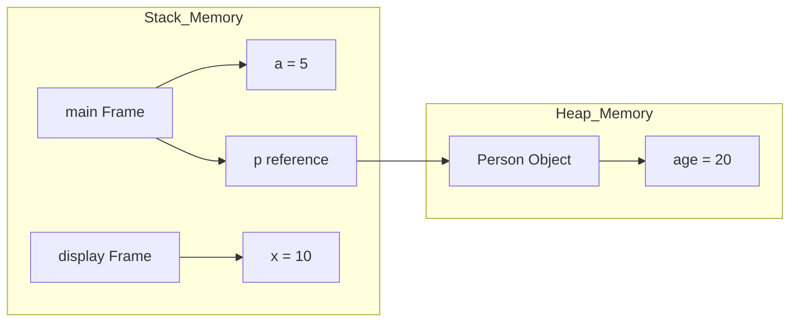
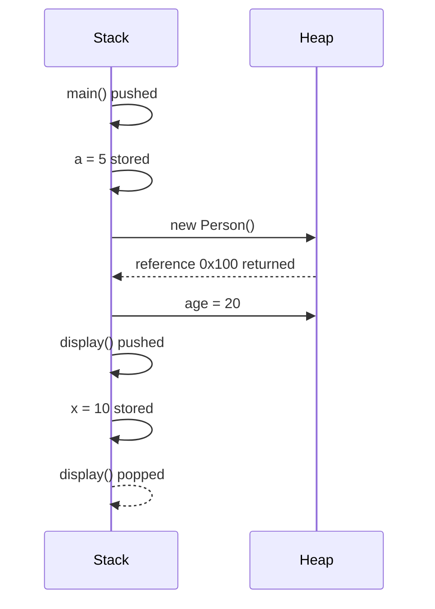
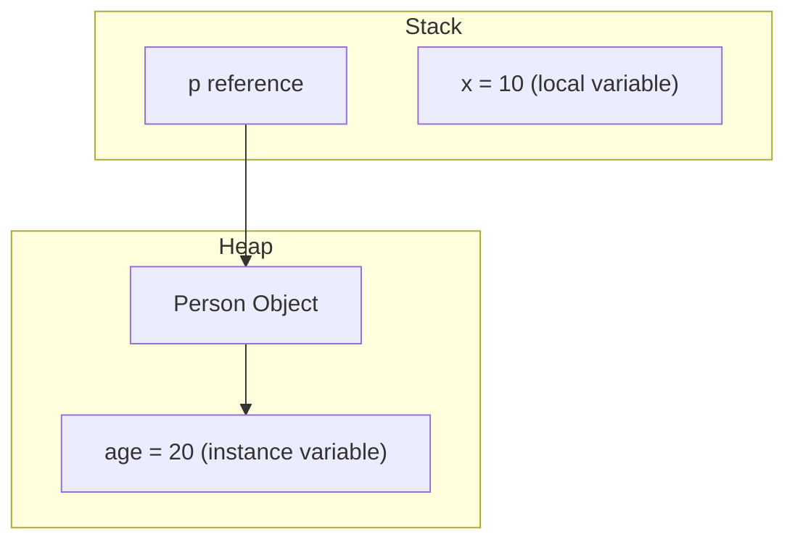
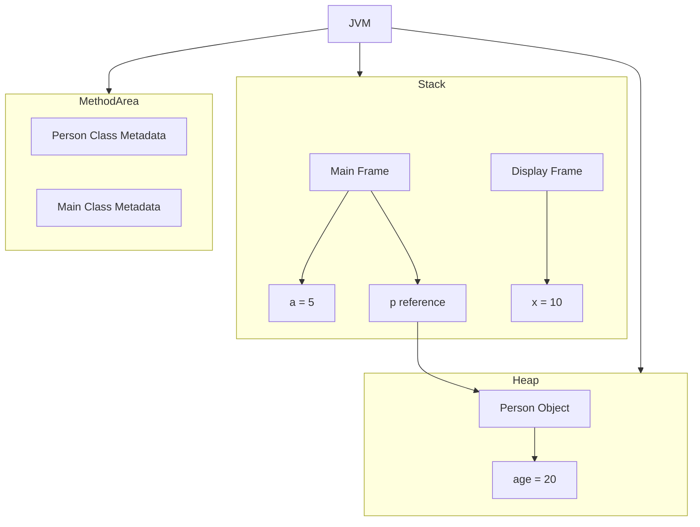
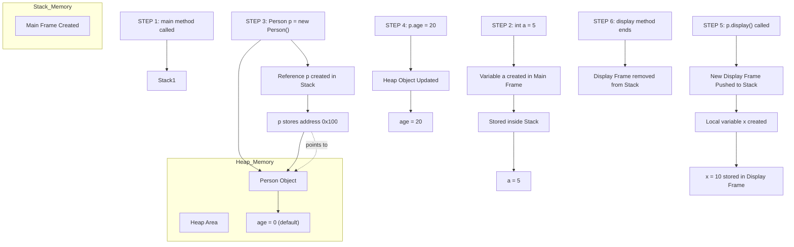
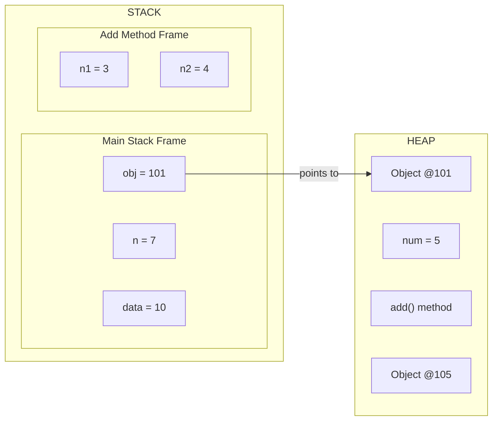

# Stack and Heap Memory in Java

## 1️⃣ Introduction

In Java, memory inside the JVM is mainly divided into:

- **Stack Memory**
- **Heap Memory**

Understanding these is very important to know how Java stores:
- Local Variables
- Instance Variables
- Object References
- Method Calls

---

# 2️⃣ STACK vs HEAP Overview

## 📌 Stack Memory
- Stores **method calls**
- Stores **local variables**
- Stores **reference variables**
- Works in **LIFO (Last In First Out)**
- Each thread has its own stack

## 📌 Heap Memory
- Stores **objects**
- Stores **instance variables**
- Shared among all threads
- Managed by **Garbage Collector**

---

# 3️⃣ Sample Java Program

```java
class Person {
    int age; // Instance variable

    void display() {
        int x = 10; // Local variable
        System.out.println(age + x);
    }
}

public class Main {
    public static void main(String[] args) {
        int a = 5;               // Local variable
        Person p = new Person(); // Reference variable
        p.age = 20;              // Instance variable
        p.display();
    }
}
```

---

# 4️⃣ How Memory Looks Inside JVM

## 📊 Diagram 1 – JVM Memory Structure

```
                JVM MEMORY
------------------------------------------------
|                  STACK                       |
|----------------------------------------------|
| main() Stack Frame                           |
|   a = 5                                      |
|   p ----> (reference)                        |
|----------------------------------------------|
| display() Stack Frame                        |
|   x = 10                                     |
------------------------------------------------

------------------------------------------------
|                   HEAP                       |
|----------------------------------------------|
| Person Object                                |
|   age = 20                                   |
------------------------------------------------
```

---

# 5️⃣ Step-by-Step Memory Allocation

## Step 1: Program Starts

`main()` method is pushed into Stack.

```
STACK:
-----------------
| main() frame  |
-----------------
```

---

## Step 2: int a = 5;

Local variable `a` is stored inside **main() stack frame**

```
STACK:
-----------------
| main() frame  |
| a = 5         |
-----------------
```

---

## Step 3: Person p = new Person();

- `new Person()` → Object created in **Heap**
- `p` → Reference stored in **Stack**

```
STACK:                          HEAP:
-----------------              -----------------
| main() frame  |              | Person Object |
| a = 5         |              | age = 0       |
| p ----> 0x100 |              -----------------
-----------------
```

---

## Step 4: p.age = 20;

Instance variable updated inside Heap.

```
HEAP:
-----------------
| Person Object |
| age = 20      |
-----------------
```

---

## Step 5: p.display();

New stack frame is created.

```
STACK:
---------------------------------
| display() frame               |
| x = 10                        |
---------------------------------
| main() frame                  |
| a = 5                         |
| p ----> 0x100                 |
---------------------------------
```

---

## Step 6: Method Ends

- `display()` frame removed from stack
- `main()` continues

---

# 6️⃣ Local Variable vs Instance Variable

| Feature | Local Variable | Instance Variable |
|----------|---------------|------------------|
| Stored In | Stack | Heap |
| Scope | Inside method | Inside object |
| Lifetime | Until method ends | Until object is garbage collected |
| Default Value | No default | Gets default value (0, null, etc.) |

---

# 7️⃣ Diagram 2 – Local vs Instance Variable

```
Person p = new Person();

STACK:
-----------------------
| p ----> 0x200       |
-----------------------

HEAP:
-----------------------
| Person Object       |
| age = 0             |
-----------------------
```

If inside method:

```
void test() {
   int x = 50;
}
```

```
STACK:
-----------------------
| test() frame        |
| x = 50              |
-----------------------
```

---

# 8️⃣ Diagram 3 – Complete Execution Flow

```
Step 1: main() added to stack

Step 2: Local variables stored in stack

Step 3: Object created in heap

Step 4: Reference stored in stack

Step 5: Method call creates new stack frame

Step 6: Frame removed after method completes

Step 7: Heap object stays until Garbage Collector removes it
```

Visual Representation:

```
THREAD STACK                          HEAP
---------------------------------------------------------
| display() frame |                  | Person Object    |
| x = 10          |                  | age = 20         |
---------------------------------------------------------
| main() frame    |
| a = 5           |
| p ----> 0x100   |
---------------------------------------------------------
```

---

# 9️⃣ Important Notes About JVM Memory

JVM Memory includes:
- Heap
- Stack
- Method Area
- Program Counter Register
- Native Method Stack

But for object & variable understanding:
👉 Focus mainly on **Stack and Heap**

---

# 🔟 Summary

- Local variables → Stored in Stack
- Instance variables → Stored in Heap
- Reference variables → Stored in Stack
- Objects → Stored in Heap
- Method calls → Create Stack Frames
- Stack follows LIFO
- Heap is cleaned by Garbage Collector

---

# End of Notes


📌 1️⃣ JVM Memory Structure (Stack + Heap)




📌 2️⃣ Step-by-Step Execution Flow




📌 3️⃣ Local vs Instance Variable Diagram





📌 4️⃣ Complete JVM Memory Architecture (Extended)




📌 Sample Program Used




