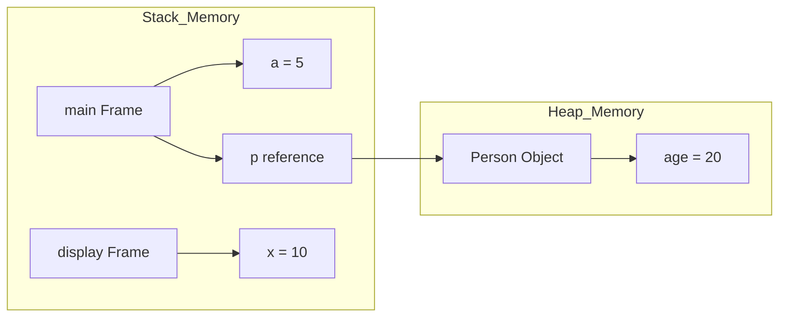
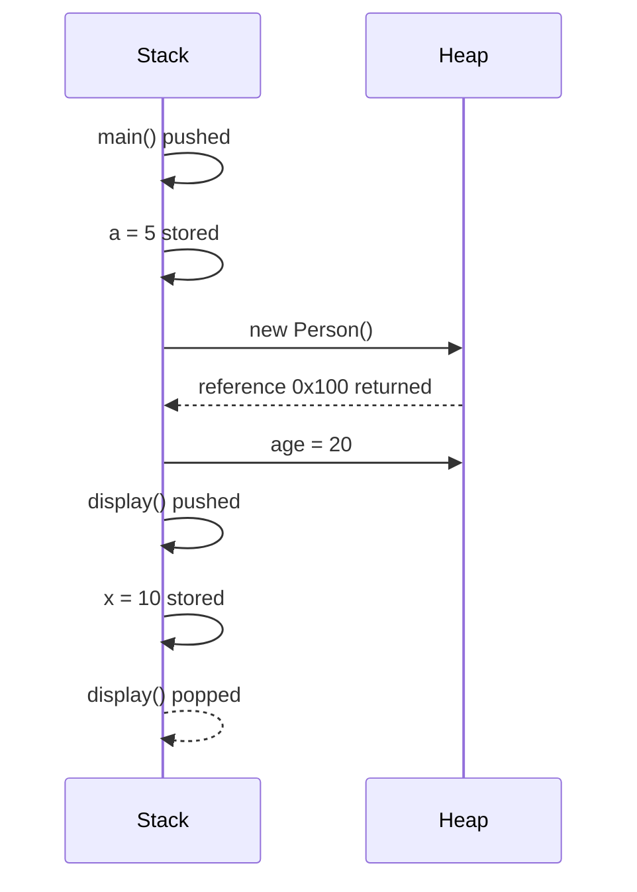
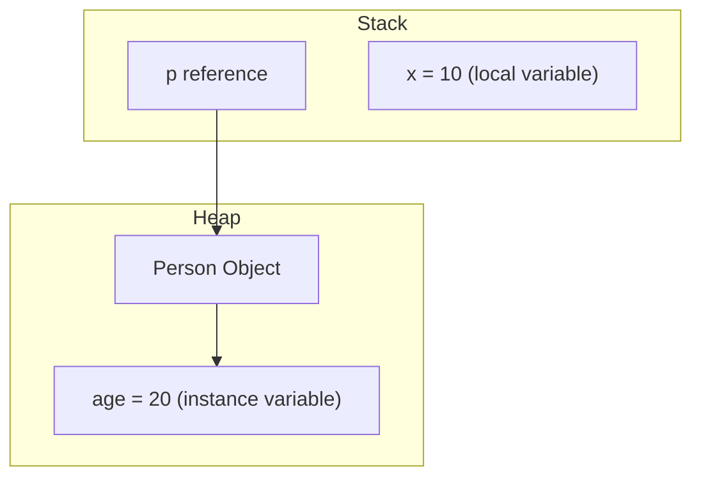
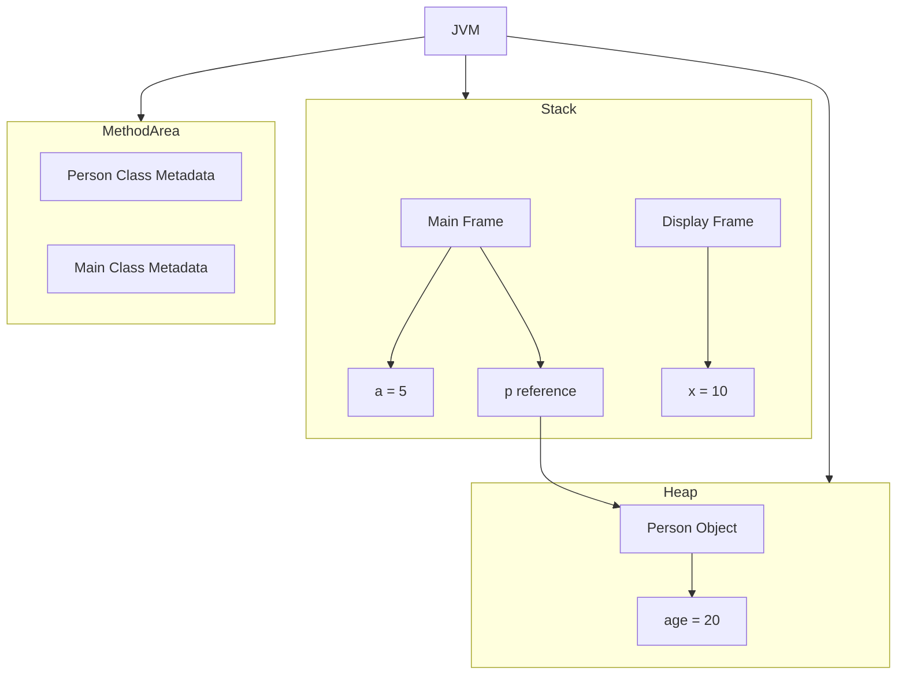
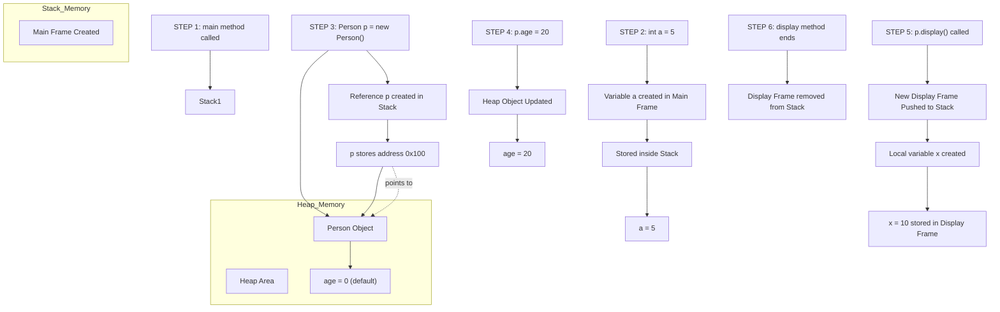
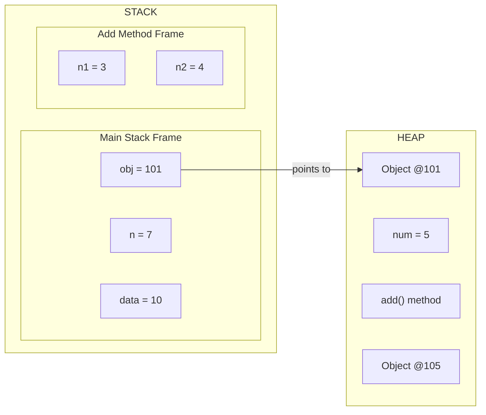

# Stack and Heap Memory in Java

## 1️⃣ Introduction

In Java, memory inside the JVM is mainly divided into:

- **Stack Memory**
- **Heap Memory**

Understanding these is very important to know how Java stores:
- Local Variables
- Instance Variables
- Object References
- Method Calls

---

# 2️⃣ STACK vs HEAP Overview

## 📌 Stack Memory
- Stores **method calls**
- Stores **local variables**
- Stores **reference variables**
- Works in **LIFO (Last In First Out)**
- Each thread has its own stack

## 📌 Heap Memory
- Stores **objects**
- Stores **instance variables**
- Shared among all threads
- Managed by **Garbage Collector**

---

# 3️⃣ Sample Java Program

```java
class Person {
    int age; // Instance variable

    void display() {
        int x = 10; // Local variable
        System.out.println(age + x);
    }
}

public class Main {
    public static void main(String[] args) {
        int a = 5;               // Local variable
        Person p = new Person(); // Reference variable
        p.age = 20;              // Instance variable
        p.display();
    }
}
```

---

# 4️⃣ How Memory Looks Inside JVM

## 📊 Diagram 1 – JVM Memory Structure

```
                JVM MEMORY
------------------------------------------------
|                  STACK                       |
|----------------------------------------------|
| main() Stack Frame                           |
|   a = 5                                      |
|   p ----> (reference)                        |
|----------------------------------------------|
| display() Stack Frame                        |
|   x = 10                                     |
------------------------------------------------

------------------------------------------------
|                   HEAP                       |
|----------------------------------------------|
| Person Object                                |
|   age = 20                                   |
------------------------------------------------
```

---

# 5️⃣ Step-by-Step Memory Allocation

## Step 1: Program Starts

`main()` method is pushed into Stack.

```
STACK:
-----------------
| main() frame  |
-----------------
```

---

## Step 2: int a = 5;

Local variable `a` is stored inside **main() stack frame**

```
STACK:
-----------------
| main() frame  |
| a = 5         |
-----------------
```

---

## Step 3: Person p = new Person();

- `new Person()` → Object created in **Heap**
- `p` → Reference stored in **Stack**

```
STACK:                          HEAP:
-----------------              -----------------
| main() frame  |              | Person Object |
| a = 5         |              | age = 0       |
| p ----> 0x100 |              -----------------
-----------------
```

---

## Step 4: p.age = 20;

Instance variable updated inside Heap.

```
HEAP:
-----------------
| Person Object |
| age = 20      |
-----------------
```

---

## Step 5: p.display();

New stack frame is created.

```
STACK:
---------------------------------
| display() frame               |
| x = 10                        |
---------------------------------
| main() frame                  |
| a = 5                         |
| p ----> 0x100                 |
---------------------------------
```

---

## Step 6: Method Ends

- `display()` frame removed from stack
- `main()` continues

---

# 6️⃣ Local Variable vs Instance Variable

| Feature | Local Variable | Instance Variable |
|----------|---------------|------------------|
| Stored In | Stack | Heap |
| Scope | Inside method | Inside object |
| Lifetime | Until method ends | Until object is garbage collected |
| Default Value | No default | Gets default value (0, null, etc.) |

---

# 7️⃣ Diagram 2 – Local vs Instance Variable

```
Person p = new Person();

STACK:
-----------------------
| p ----> 0x200       |
-----------------------

HEAP:
-----------------------
| Person Object       |
| age = 0             |
-----------------------
```

If inside method:

```
void test() {
   int x = 50;
}
```

```
STACK:
-----------------------
| test() frame        |
| x = 50              |
-----------------------
```

---

# 8️⃣ Diagram 3 – Complete Execution Flow

```
Step 1: main() added to stack

Step 2: Local variables stored in stack

Step 3: Object created in heap

Step 4: Reference stored in stack

Step 5: Method call creates new stack frame

Step 6: Frame removed after method completes

Step 7: Heap object stays until Garbage Collector removes it
```

Visual Representation:

```
THREAD STACK                          HEAP
---------------------------------------------------------
| display() frame |                  | Person Object    |
| x = 10          |                  | age = 20         |
---------------------------------------------------------
| main() frame    |
| a = 5           |
| p ----> 0x100   |
---------------------------------------------------------
```

---

# 9️⃣ Important Notes About JVM Memory

JVM Memory includes:
- Heap
- Stack
- Method Area
- Program Counter Register
- Native Method Stack

But for object & variable understanding:
👉 Focus mainly on **Stack and Heap**

---

# 🔟 Summary

- Local variables → Stored in Stack
- Instance variables → Stored in Heap
- Reference variables → Stored in Stack
- Objects → Stored in Heap
- Method calls → Create Stack Frames
- Stack follows LIFO
- Heap is cleaned by Garbage Collector

---

# End of Notes


📌 1️⃣ JVM Memory Structure (Stack + Heap)


```mermaid
flowchart LR

    subgraph Stack_Memory
        M1["main Frame"]
        M1a["a = 5"]
        M1b["p reference"]
        D1["display Frame"]
        D1a["x = 10"]
    end

    subgraph Heap_Memory
        H1["Person Object"]
        H2["age = 20"]
    end

    M1 --> M1a
    M1 --> M1b
    D1 --> D1a
    M1b --> H1
    H1 --> H2
```


📌 2️⃣ Step-by-Step Execution Flow


```mermaid
sequenceDiagram
    participant Stack
    participant Heap

    Stack->>Stack: main() pushed
    Stack->>Stack: a = 5 stored
    Stack->>Heap: new Person()
    Heap-->>Stack: reference 0x100 returned
    Stack->>Heap: age = 20
    Stack->>Stack: display() pushed
    Stack->>Stack: x = 10 stored
    Stack-->>Stack: display() popped
```


📌 3️⃣ Local vs Instance Variable Diagram



```mermaid
flowchart TB

    subgraph Stack
        R1["p reference"]
        L1["x = 10 (local variable)"]
    end

    subgraph Heap
        O1["Person Object"]
        I1["age = 20 (instance variable)"]
    end

    R1 --> O1
    O1 --> I1
```


📌 4️⃣ Complete JVM Memory Architecture (Extended)


```mermaid
flowchart TB

    JVM["JVM"]

    JVM --> Stack
    JVM --> Heap
    JVM --> MethodArea

    subgraph Stack
        F1["Main Frame"]
        F2["Display Frame"]
        V1["a = 5"]
        V2["p reference"]
        V3["x = 10"]
    end

    subgraph Heap
        O1["Person Object"]
        I1["age = 20"]
    end

    subgraph MethodArea
        C1["Person Class Metadata"]
        C2["Main Class Metadata"]
    end

    F1 --> V1
    F1 --> V2
    F2 --> V3

    V2 --> O1
    O1 --> I1
```


📌 Sample Program Used


```mermaid
flowchart TB

    %% =========================
    %% STEP 1 - JVM STARTS
    %% =========================

    S1["STEP 1: main method called"]
    S1 --> Stack1

    subgraph Stack_Memory
        direction TB
        M1["Main Frame Created"]
    end

    %% =========================
    %% STEP 2 - LOCAL VARIABLE
    %% =========================

    S2["STEP 2: int a = 5"]
    S2 --> A1["Variable a created in Main Frame"]
    A1 --> A2["Stored inside Stack"]
    A2 --> A3["a = 5"]

    %% =========================
    %% STEP 3 - OBJECT CREATION
    %% =========================

    S3["STEP 3: Person p = new Person()"]

    subgraph Heap_Memory
        direction TB
        H1["Heap Area"]
        O1["Person Object"]
        I1["age = 0 (default)"]
    end

    S3 --> O1
    O1 --> I1

    S3 --> P1["Reference p created in Stack"]
    P1 --> P2["p stores address 0x100"]
    P2 --> O1

    %% =========================
    %% STEP 4 - INSTANCE UPDATE
    %% =========================

    S4["STEP 4: p.age = 20"]
    S4 --> I2["Heap Object Updated"]
    I2 --> I3["age = 20"]

    %% =========================
    %% STEP 5 - METHOD CALL
    %% =========================

    S5["STEP 5: p.display() called"]
    S5 --> D1["New Display Frame Pushed to Stack"]

    D1 --> X1["Local variable x created"]
    X1 --> X2["x = 10 stored in Display Frame"]

    %% =========================
    %% STEP 6 - METHOD END
    %% =========================

    S6["STEP 6: display method ends"]
    S6 --> Pop1["Display Frame removed from Stack"]

    %% =========================
    %% MEMORY LINKS
    %% =========================

    P2 -. points to .-> O1
```



```mermaid

flowchart LR

%% =========================
%% STACK SECTION
%% =========================

subgraph STACK

    direction TB

    subgraph MAIN_FRAME["Main Stack Frame"]
        M1["obj = 101"]
        M2["n = 7"]
        M3["data = 10"]
    end

    subgraph ADD_FRAME["Add Method Frame"]
        A1["n1 = 3"]
        A2["n2 = 4"]
    end

end

%% =========================
%% HEAP SECTION
%% =========================

subgraph HEAP

    direction TB

    H1["Object @101"]
    H1a["num = 5"]
    H1b["add() method"]

    H2["Object @105"]
end

%% =========================
%% LINKS
%% =========================

M1 -- "points to" --> H1
```
# 1️⃣1️⃣ Static Variables and Memory Allocation

## 📌 What is a Static Variable?

A **static variable** is a variable declared using the `static` keyword inside a class. It belongs to the **class rather than to individual objects**, so there is one shared copy associated with the class.

### Interview-ready definition

> **A static variable is a class-level variable declared using the `static` keyword. It is shared among all objects of that class, unlike an instance variable, which has a separate copy for each object.**

---

## 📌 Example: Instance vs Static Variable

```java
class Person {

    // Instance variable
    int age;

    // Static variable
    static int numberOfPeople = 0;
}

public class Main {
    public static void main(String[] args) {

        Person p1 = new Person();
        Person p2 = new Person();

        p1.age = 20;
        p2.age = 30;

        Person.numberOfPeople = 2;
    }
}
```

Here:

- `age` → **Instance variable**
- `numberOfPeople` → **Static variable**
- `p1` and `p2` → **Reference variables**
- `p1` and `p2` are also **local variables** because they are declared inside `main()`

---

## 📌 How Instance and Static Variables Differ

For:

```java
Person p1 = new Person();
Person p2 = new Person();

p1.age = 20;
p2.age = 30;
```

There are two separate `age` values:

```text
                    HEAP

             ┌─────────────────┐
p1 ─────────►│ Person Object   │
             │ age = 20        │
             └─────────────────┘

             ┌─────────────────┐
p2 ─────────►│ Person Object   │
             │ age = 30        │
             └─────────────────┘
```

But for:

```java
Person.numberOfPeople = 2;
```

there is one class-level value shared by the `Person` objects:

```text
              PERSON CLASS
             ┌─────────────────────┐
             │ numberOfPeople = 2  │
             └──────────┬──────────┘
                        │
                 shared by objects
                    /        \
                   /          \
                 p1            p2
                 │              │
              age = 20       age = 30
```

---

## 📌 Static Variable Memory Allocation

A static variable is **not created separately for every object**.

When the class is loaded by the JVM, the class-level information and static fields are associated with the class's runtime representation. Modern JVM implementations use the **Metaspace** for class metadata, while the exact storage details of static fields are JVM-implementation dependent.

For interview purposes, it is better to say:

> **Static variables have class-level lifetime and are shared by all instances. They are initialized when the class is initialized, rather than once for every object.**

Do **not** rely on the oversimplified statement that "all static variables are stored in the Method Area" as a universal JVM memory rule. The JVM specification does not require one exact physical memory location for every implementation detail.

---

## 📌 Memory Comparison

```text
                         JVM
                          │
          ┌───────────────┴───────────────┐
          │                               │
        STACK                            HEAP
          │                               │
     main() frame                    Person Object 1
     ├── p1 ───────────────────────► ├── age = 20
     └── p2 ────────────────────┐    │
                                │    Person Object 2
                                └──► ├── age = 30

                    CLASS-LEVEL DATA
                         │
                    Person class
                    └── numberOfPeople = 2
```

The diagram is a **conceptual model** for understanding the relationship. The exact JVM memory layout is implementation dependent.

---

## 📌 Static Variable is Shared

Consider:

```java
class Person {
    int age;
    static int count = 0;
}
```

Then:

```java
Person p1 = new Person();
Person p2 = new Person();

p1.age = 20;
p2.age = 30;

Person.count = 2;
```

Conceptually:

```text
Person class
│
└── count = 2       ← ONE shared variable

p1 → Person object
     └── age = 20   ← p1's own variable

p2 → Person object
     └── age = 30   ← p2's own variable
```

If you change:

```java
Person.count = 3;
```

the same shared static variable changes for everyone.

---

## 📌 Why Use Static Variables?

Use a static variable when a value should represent something **shared at the class level** rather than something belonging to one particular object.

Example:

```java
class Person {
    static String country = "India";
}
```

If every `Person` has the same `country`, keeping one class-level value makes more sense than maintaining a separate copy for every object.

Access it using the class name:

```java
Person.country
```

This makes it clear that the variable belongs to the class.

---

## 📌 Important: Static vs Instance

| Feature | Instance Variable | Static Variable |
|---|---|---|
| Keyword | No `static` | `static` |
| Belongs to | Object | Class |
| Copies | One per object | Shared class-level copy |
| Access | `p1.age` | `Person.count` |
| Created per object? | Yes | No |
| Shared? | No | Yes |
| Example | `int age` | `static int count` |

### Interview answer: Instance vs Static

> **An instance variable belongs to an individual object, so every object has its own copy. A static variable belongs to the class, so it is shared among all objects of that class.**

---

## 📌 Complete Variable Classification

```java
class Person {

    int age;                         // Instance + Primitive

    static int numberOfPeople = 0;   // Static + Primitive

    static String country = "India"; // Static + Reference

    void display() {
        int x = 10;                  // Local + Primitive
        Person p = new Person();     // Local + Reference
    }
}
```

This gives four useful combinations:

```text
Local + Primitive     → int x = 10;
Local + Reference     → Person p = new Person();
Instance + Primitive  → int age;
Static + Primitive    → static int numberOfPeople;
Static + Reference    → static String country;
```

### ⭐ Key Interview Concept

**Local / Instance / Static** describes **where the variable belongs and its scope/ownership relationship**.

**Primitive / Reference** describes **what kind of value the variable holds**.

Therefore, a variable can belong to more than one classification. For example:

```java
Person p = new Person();
```

`p` is both:

- a **local variable**, because it is declared inside a method
- a **reference variable**, because it holds a reference to an object

---

## 📌 Static Variable: Interview Quick Notes

- Declared using the `static` keyword.
- Belongs to the class, not an individual object.
- Shared among instances of the class.
- Initialized as part of class initialization.
- Can be accessed using the class name, e.g. `Person.count`.
- Does not require an object to access it.
- A static field can be primitive or reference type.
- Exact physical memory placement is JVM implementation dependent.