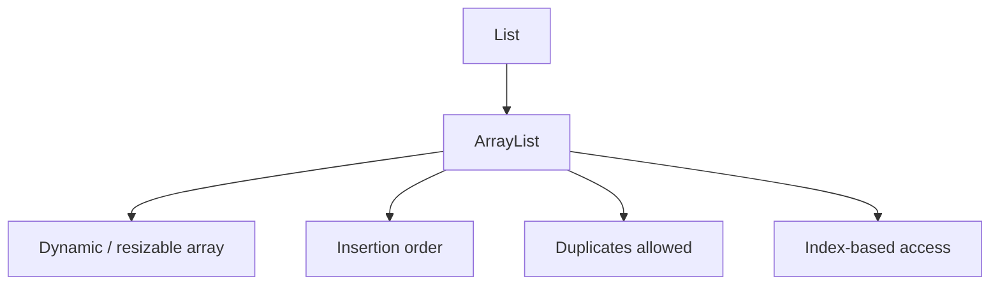
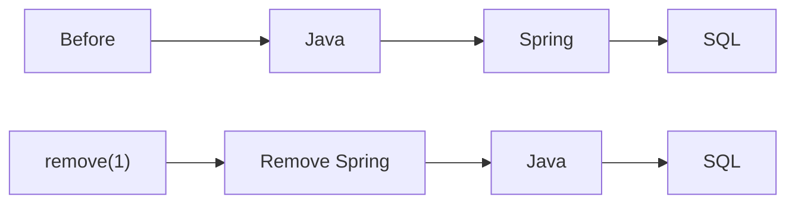
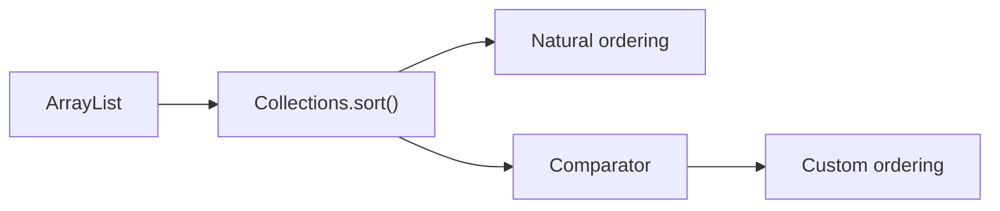
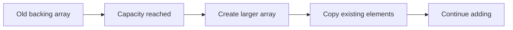
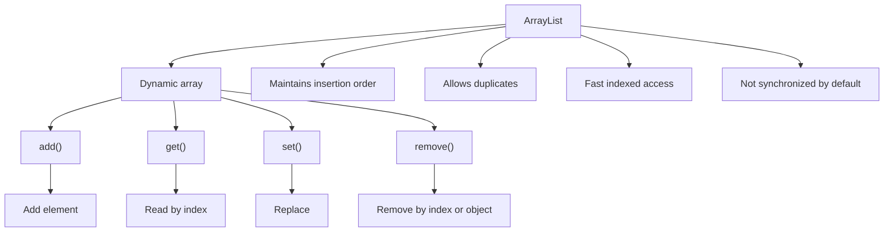

# Java ArrayList: Methods + Interview Questions

> **Interview-focused notes for Java/SDE preparation**
>
> This note is based on the supplied Collections Framework notes, with additional interview-oriented explanations and examples added for the most commonly used `ArrayList` methods.

---

# 1. What is ArrayList?

`ArrayList` is a resizable-array implementation of the `List` interface.

### Key characteristics

- Maintains **insertion order**
- Allows **duplicate elements**
- Supports **index-based access**
- Size grows automatically
- Stores objects, not primitive types directly
- Without generics, different object types can be stored
- With generics, compile-time type safety is provided



Example:

```java
ArrayList<String> names = new ArrayList<>();

names.add("Gowtham");
names.add("Arun");
names.add("Gowtham");

System.out.println(names);
```

Output:

```text
[Gowtham, Arun, Gowtham]
```

The duplicate `"Gowtham"` is allowed.

---

# 2. Creating an ArrayList

## Basic declaration

```java
ArrayList<String> names = new ArrayList<>();
```

Better practice is often to program to the interface:

```java
List<String> names = new ArrayList<>();
```

Here:

```text
List              → reference type
ArrayList          → implementation
```

---

# 3. `add()`

## Purpose

Adds an element to the end of the list.

### Syntax

```java
list.add(element);
```

### Example

```java
ArrayList<String> names = new ArrayList<>();

names.add("Java");
names.add("Spring");
names.add("SQL");

System.out.println(names);
```

Output:

```text
[Java, Spring, SQL]
```

### Important point

`add()` returns a `boolean`.

```java
boolean result = names.add("Docker");

System.out.println(result);
```

For a normal `ArrayList`, this returns:

```text
true
```

---

# 4. `add(index, element)`

## Purpose

Inserts an element at a specific index.

### Syntax

```java
list.add(index, element);
```

### Example

```java
ArrayList<String> skills = new ArrayList<>();

skills.add("Java");
skills.add("SQL");
skills.add("Spring");

skills.add(1, "Docker");

System.out.println(skills);
```

Output:

```text
[Java, Docker, SQL, Spring]
```

### What happened?

Before:

```text
Index:    0       1       2
          ↓       ↓       ↓
        Java     SQL    Spring
```

After inserting `"Docker"` at index `1`:

```text
Index:    0         1        2       3
          ↓         ↓        ↓       ↓
        Java     Docker     SQL    Spring
```

The existing elements after the insertion point have to be shifted.

### Interview point

Insertion near the beginning or middle of an `ArrayList` can require shifting elements.

---

# 5. `get(index)`

## Purpose

Retrieves the element at a particular index.

### Syntax

```java
list.get(index);
```

### Example

```java
ArrayList<String> skills = new ArrayList<>();

skills.add("Java");
skills.add("Spring");
skills.add("SQL");

String skill = skills.get(1);

System.out.println(skill);
```

Output:

```text
Spring
```

### Important point

`ArrayList` provides fast index-based retrieval because it is backed by an array.

```java
skills.get(0);
skills.get(1);
skills.get(2);
```

---

# 6. `set(index, element)`

## Purpose

Replaces the element at an existing index.

### Syntax

```java
list.set(index, element);
```

### Example

```java
ArrayList<String> skills = new ArrayList<>();

skills.add("Java");
skills.add("Python");
skills.add("SQL");

skills.set(1, "Spring");

System.out.println(skills);
```

Output:

```text
[Java, Spring, SQL]
```

### `set()` vs `add(index, element)`

This is a common interview question.

```java
list.add(1, "Spring");
```

**Inserts** a new element and shifts existing elements.

```java
list.set(1, "Spring");
```

**Replaces** the existing element at index `1`.

### Easy memory trick

```text
add() → INSERT
set() → REPLACE
```

---

# 7. `remove(index)`

## Purpose

Removes the element at a particular index.

### Example

```java
ArrayList<String> skills = new ArrayList<>();

skills.add("Java");
skills.add("Spring");
skills.add("SQL");

String removed = skills.remove(1);

System.out.println(removed);
System.out.println(skills);
```

Output:

```text
Spring
[Java, SQL]
```

### Important point

When an element is removed from the middle, the elements after it may need to shift.



---

# 8. `remove(Object)`

`ArrayList` has another `remove()` overload.

```java
list.remove(Object);
```

It removes the **first occurrence** of the specified object.

Example:

```java
ArrayList<String> skills = new ArrayList<>();

skills.add("Java");
skills.add("Spring");
skills.add("Java");

skills.remove("Java");

System.out.println(skills);
```

Output:

```text
[Spring, Java]
```

Only the first `"Java"` is removed.

---

# 9. The famous `remove(int)` vs `remove(Object)` interview question

This is especially important when using `ArrayList<Integer>`.

Consider:

```java
ArrayList<Integer> numbers = new ArrayList<>();

numbers.add(10);
numbers.add(20);
numbers.add(30);

numbers.remove(1);
```

What is removed?

**20**

Why?

Because:

```java
remove(1)
```

matches:

```java
remove(int index)
```

So index `1` is removed.

---

Now:

```java
numbers.remove(Integer.valueOf(10));
```

This removes the object/value `10`.

### Remember

```text
remove(1)
    ↓
remove element at index 1

remove(Integer.valueOf(1))
    ↓
remove the Integer value 1
```

### Interview example

```java
ArrayList<Integer> list = new ArrayList<>();

list.add(10);
list.add(20);
list.add(30);

list.remove(1);

System.out.println(list);
```

Output:

```text
[10, 30]
```

But:

```java
list.remove(Integer.valueOf(10));
```

removes the value `10`.

---

# 10. `size()`

## Purpose

Returns the number of elements currently stored in the `ArrayList`.

```java
ArrayList<String> list = new ArrayList<>();

list.add("Java");
list.add("Spring");
list.add("SQL");

System.out.println(list.size());
```

Output:

```text
3
```

### Important

For arrays:

```java
arr.length
```

For collections:

```java
list.size()
```

Do not write:

```java
list.length
```

---

# 11. `isEmpty()`

Checks whether the list contains zero elements.

```java
ArrayList<String> list = new ArrayList<>();

System.out.println(list.isEmpty());
```

Output:

```text
true
```

After:

```java
list.add("Java");
```

then:

```java
System.out.println(list.isEmpty());
```

Output:

```text
false
```

---

# 12. `contains()`

Checks whether an element exists in the list.

### Example

```java
ArrayList<String> skills = new ArrayList<>();

skills.add("Java");
skills.add("Spring");
skills.add("SQL");

System.out.println(skills.contains("Java"));
System.out.println(skills.contains("Python"));
```

Output:

```text
true
false
```

---

# 13. `indexOf()`

Returns the index of the **first occurrence** of an element.

```java
ArrayList<String> list = new ArrayList<>();

list.add("Java");
list.add("Spring");
list.add("Java");

System.out.println(list.indexOf("Java"));
```

Output:

```text
0
```

If the element does not exist:

```java
System.out.println(list.indexOf("Python"));
```

Output:

```text
-1
```

---

# 14. `lastIndexOf()`

Returns the index of the **last occurrence** of an element.

```java
ArrayList<String> list = new ArrayList<>();

list.add("Java");
list.add("Spring");
list.add("Java");

System.out.println(list.lastIndexOf("Java"));
```

Output:

```text
2
```

### Quick comparison

```text
indexOf()
    ↓
first occurrence

lastIndexOf()
    ↓
last occurrence
```

---

# 15. `clear()`

Removes all elements from the list.

```java
ArrayList<String> skills = new ArrayList<>();

skills.add("Java");
skills.add("Spring");
skills.add("SQL");

skills.clear();

System.out.println(skills);
System.out.println(skills.isEmpty());
```

Output:

```text
[]
true
```

### Important distinction

`clear()` removes all elements.

It does not mean that the `ArrayList` reference itself becomes `null`.

---

# 16. `addAll()`

Adds all elements from another collection.

### Example

```java
ArrayList<String> backend = new ArrayList<>();

backend.add("Java");
backend.add("Spring");

ArrayList<String> database = new ArrayList<>();

database.add("SQL");
database.add("Redis");

backend.addAll(database);

System.out.println(backend);
```

Output:

```text
[Java, Spring, SQL, Redis]
```

### Copying an ArrayList

Your original notes use `addAll()` for copying elements:

```java
ArrayList al2 = new ArrayList();

al2.addAll(al);
```

This is much simpler than manually copying elements using a loop.

---

# 17. `addAll(index, collection)`

You can also insert another collection starting at a particular index.

```java
ArrayList<String> first = new ArrayList<>();

first.add("Java");
first.add("SQL");

ArrayList<String> second = new ArrayList<>();

second.add("Spring");
second.add("Docker");

first.addAll(1, second);

System.out.println(first);
```

Output:

```text
[Java, Spring, Docker, SQL]
```

---

# 18. `removeAll()`

Removes all elements from the current list that are also present in another collection.

```java
ArrayList<String> skills = new ArrayList<>();

skills.add("Java");
skills.add("Spring");
skills.add("SQL");

ArrayList<String> remove = new ArrayList<>();

remove.add("Spring");
remove.add("SQL");

skills.removeAll(remove);

System.out.println(skills);
```

Output:

```text
[Java]
```

---

# 19. `containsAll()`

Checks whether the list contains all elements from another collection.

```java
ArrayList<String> skills = new ArrayList<>();

skills.add("Java");
skills.add("Spring");
skills.add("SQL");

ArrayList<String> required = new ArrayList<>();

required.add("Java");
required.add("SQL");

System.out.println(skills.containsAll(required));
```

Output:

```text
true
```

---

# 20. `Collections.sort()`

The `Collections` utility class provides sorting operations.

```java
ArrayList<Integer> numbers = new ArrayList<>();

numbers.add(50);
numbers.add(10);
numbers.add(30);

Collections.sort(numbers);

System.out.println(numbers);
```

Output:

```text
[10, 30, 50]
```

For custom sorting, use a `Comparator`.



---

# 21. Most Important ArrayList Methods: Quick Table

| Method | Purpose | Example |
|---|---|---|
| `add(E)` | Add at end | `list.add("Java")` |
| `add(int,E)` | Insert at index | `list.add(1,"Java")` |
| `get(int)` | Retrieve by index | `list.get(1)` |
| `set(int,E)` | Replace element | `list.set(1,"Java")` |
| `remove(int)` | Remove by index | `list.remove(1)` |
| `remove(Object)` | Remove first matching object | `list.remove("Java")` |
| `size()` | Number of elements | `list.size()` |
| `isEmpty()` | Check whether empty | `list.isEmpty()` |
| `contains(Object)` | Check whether present | `list.contains("Java")` |
| `indexOf(Object)` | First matching index | `list.indexOf("Java")` |
| `lastIndexOf(Object)` | Last matching index | `list.lastIndexOf("Java")` |
| `clear()` | Remove everything | `list.clear()` |
| `addAll(Collection)` | Add another collection | `list.addAll(other)` |
| `containsAll(Collection)` | Check multiple elements | `list.containsAll(other)` |
| `removeAll(Collection)` | Remove matching elements | `list.removeAll(other)` |

---

# 22. Time Complexity: Interview View

For a typical `ArrayList` backed by a dynamic array:

| Operation | Typical complexity |
|---|---:|
| `get(index)` | `O(1)` |
| `set(index, value)` | `O(1)` |
| `add(value)` at end | `O(1)` amortized |
| `add(index, value)` | `O(n)` |
| `remove(index)` | `O(n)` |
| `contains(value)` | `O(n)` |
| `indexOf(value)` | `O(n)` |
| `lastIndexOf(value)` | `O(n)` |
| `clear()` | `O(n)` |

### Why is `get()` O(1)?

Because the underlying array allows direct index calculation/access.

```text
ArrayList
   ↓
Underlying array
   ↓
index
   ↓
Direct access
```

### Why can middle insertion be O(n)?

Elements may need to be shifted.

```text
Before:

[A] [B] [C] [D] [E]

Insert X at index 2:

[A] [B] [X] [C] [D] [E]
          ↑
       shifting
```

---

# 23. Frequently Asked Interview Questions

## Q1. What is ArrayList?

**Answer:**

`ArrayList` is a resizable-array implementation of the `List` interface. It maintains insertion order, allows duplicates, and provides index-based access.

---

## Q2. Why is ArrayList called a dynamic array?

Because its internal storage can grow as elements are added.

Unlike a normal Java array:

```java
int[] arr = new int[5];
```

whose length is fixed, an `ArrayList` can grow dynamically.

---

## Q3. Does ArrayList allow duplicates?

**Yes.**

```java
ArrayList<String> list = new ArrayList<>();

list.add("Java");
list.add("Java");
```

Result:

```text
[Java, Java]
```

---

## Q4. Does ArrayList maintain insertion order?

**Yes.**

```java
list.add("A");
list.add("B");
list.add("C");
```

The iteration order is:

```text
A → B → C
```

---

## Q5. Does ArrayList allow null?

Yes.

```java
ArrayList<String> list = new ArrayList<>();

list.add(null);
list.add("Java");
```

---

## Q6. Can ArrayList store primitive types?

Not directly.

You cannot declare:

```java
ArrayList<int> list; // invalid
```

Use the wrapper type:

```java
ArrayList<Integer> list;
```

Java performs autoboxing:

```java
list.add(10);
```

The primitive `10` is converted to an `Integer` object.

---

## Q7. What is the difference between `size()` and `length`?

```text
Array
    → length

ArrayList / Collection
    → size()
```

Example:

```java
int[] arr = new int[5];

System.out.println(arr.length);
```

versus:

```java
ArrayList<Integer> list = new ArrayList<>();

System.out.println(list.size());
```

---

## Q8. Difference between `add()` and `set()`?

### `add()`

Inserts an element.

```java
list.add(1, "Java");
```

Existing elements may shift.

### `set()`

Replaces an existing element.

```java
list.set(1, "Java");
```

### Interview one-liner

> `add()` changes the size when inserting a new element, while `set()` replaces an element at an existing index without changing the size.

---

## Q9. Difference between `remove(int)` and `remove(Object)`?

This is one of the most important `ArrayList` questions.

```java
list.remove(1);
```

means:

> Remove the element at index `1`.

Whereas:

```java
list.remove(Integer.valueOf(1));
```

means:

> Remove the first occurrence of the value `1`.

---

# 24. Tricky `Integer` Question

What is the output?

```java
ArrayList<Integer> list = new ArrayList<>();

list.add(10);
list.add(20);
list.add(30);

list.remove(1);

System.out.println(list);
```

### Answer

```text
[10, 30]
```

Because `1` is interpreted as an `int`, so Java selects:

```java
remove(int index)
```

---

What about:

```java
list.remove(Integer.valueOf(10));
```

Now Java selects:

```java
remove(Object)
```

and removes the value `10`.

---

# 25. Q10. ArrayList vs Array

| Array | ArrayList |
|---|---|
| Fixed size | Resizable |
| Can store primitives | Stores objects |
| `length` | `size()` |
| Lower-level structure | Collection framework class |
| Fewer built-in collection operations | Many useful collection methods |

---

# 26. Q11. ArrayList vs LinkedList

| ArrayList | LinkedList |
|---|---|
| Dynamic array | Linked nodes |
| Fast indexed access | Slower indexed access |
| Middle insertion/removal may require shifting | Node insertion/removal can be efficient when position is known |
| Good for frequent reads/index access | Useful for linked-list/deque-style operations |

### Interview answer

> Use `ArrayList` when indexed access and frequent reads are important. Consider `LinkedList` when the operations and access pattern genuinely benefit from linked-node behavior.

---

# 27. Q12. Why is ArrayList retrieval fast?

Because `ArrayList` uses array-based storage.

For:

```java
list.get(5);
```

the underlying array can directly access the element at the corresponding position.

Therefore:

```text
get(index) → O(1)
```

---

# 28. Q13. Why is insertion in the middle slower?

Suppose:

```text
[A] [B] [C] [D] [E]
```

Insert `X` at index `2`:

```text
[A] [B] [X] [C] [D] [E]
```

`C`, `D`, and `E` may need to shift.

Therefore:

```text
add(index, element) → O(n)
```

in the general case.

---

# 29. Q14. What happens when ArrayList becomes full?

The `ArrayList` needs a larger backing array.

Conceptually:



The exact growth policy is an implementation detail and should not be memorized as a universal fixed percentage for interviews unless the interviewer specifically asks about a particular JDK implementation.

---

# 30. Q15. What is the difference between size and capacity?

This is a common follow-up.

### Size

Number of actual elements currently stored.

```java
list.size();
```

### Capacity

Amount of backing-array storage currently available before another resize is needed.

Conceptually:

```text
Capacity = available backing-array slots
Size     = elements currently present
```

Example:

```text
Capacity: 10
Size:      4
```

There are 4 elements stored and room for more before resizing.

---

# 31. Q16. Is ArrayList thread-safe?

No.

`ArrayList` is not synchronized by default.

If multiple threads modify the same list concurrently, external synchronization or another appropriate concurrent design may be required.

For interview purposes:

```text
ArrayList
    ↓
Not synchronized by default
```

---

# 32. Q17. How can you make an ArrayList synchronized?

One traditional option is:

```java
List<String> list =
    Collections.synchronizedList(new ArrayList<>());
```

However, thread-safety requirements should be considered carefully rather than automatically wrapping every list.

---

# 33. Q18. Can we store different types in an ArrayList?

Without generics:

```java
ArrayList list = new ArrayList();

list.add(10);
list.add("Java");
list.add(10.5);
```

This is allowed because the raw collection stores objects.

With generics:

```java
ArrayList<String> list = new ArrayList<>();

list.add("Java");
// list.add(10); // compile-time error
```

Generics provide type safety.

---

# 34. Q19. What is the difference between raw ArrayList and generic ArrayList?

### Raw

```java
ArrayList list = new ArrayList();
```

Can contain different object types.

### Generic

```java
ArrayList<String> list = new ArrayList<>();
```

The compiler enforces the declared type.

### Interview answer

> Generics provide compile-time type safety and reduce the need for explicit casting when retrieving elements.

---

# 35. Q20. How do you iterate over an ArrayList?

### Enhanced for loop

```java
for (String skill : skills) {
    System.out.println(skill);
}
```

### Iterator

```java
Iterator<String> iterator = skills.iterator();

while (iterator.hasNext()) {
    System.out.println(iterator.next());
}
```

### Traditional index loop

```java
for (int i = 0; i < skills.size(); i++) {
    System.out.println(skills.get(i));
}
```

### Important interview distinction

An iterator can safely perform iterator-based removal:

```java
Iterator<String> iterator = skills.iterator();

while (iterator.hasNext()) {
    if (iterator.next().equals("Java")) {
        iterator.remove();
    }
}
```

---

# 36. Q21. What happens if you modify an ArrayList while using an Iterator?

Direct structural modification during iteration can cause a `ConcurrentModificationException`.

Unsafe pattern:

```java
for (String skill : skills) {
    if (skill.equals("Java")) {
        skills.remove(skill);
    }
}
```

Prefer iterator removal:

```java
Iterator<String> iterator = skills.iterator();

while (iterator.hasNext()) {
    if (iterator.next().equals("Java")) {
        iterator.remove();
    }
}
```

---

# 37. Q22. How do you sort an ArrayList?

For natural ordering:

```java
Collections.sort(list);
```

or, with modern Java:

```java
list.sort(null);
```

For custom ordering:

```java
list.sort((a, b) -> a.length() - b.length());
```

For interview preparation, understand both:

```text
Comparable  → natural ordering
Comparator  → custom ordering
```

---

# 38. Q23. How do you reverse an ArrayList?

```java
Collections.reverse(list);
```

Example:

```java
ArrayList<Integer> numbers =
    new ArrayList<>(List.of(10, 20, 30));

Collections.reverse(numbers);

System.out.println(numbers);
```

Output:

```text
[30, 20, 10]
```

---

# 39. Q24. How do you convert an ArrayList to an array?

```java
String[] array = list.toArray(new String[0]);
```

Example:

```java
ArrayList<String> list = new ArrayList<>();

list.add("Java");
list.add("Spring");

String[] array = list.toArray(new String[0]);
```

---

# 40. Q25. How do you remove duplicates from an ArrayList?

One common approach is to use a `Set`.

```java
ArrayList<Integer> numbers = new ArrayList<>();

numbers.add(10);
numbers.add(20);
numbers.add(10);
numbers.add(30);

Set<Integer> unique = new LinkedHashSet<>(numbers);

ArrayList<Integer> result = new ArrayList<>(unique);

System.out.println(result);
```

Output:

```text
[10, 20, 30]
```

`LinkedHashSet` is useful here when you want to preserve insertion order.

---

# 41. Coding Questions Based on ArrayList

These are good practice questions after learning the methods.

## Easy

1. Add 10 integers to an `ArrayList` and print them.
2. Find the size of an `ArrayList`.
3. Print the element at a given index.
4. Replace an element at a given index.
5. Remove an element by index.
6. Remove a particular value.
7. Check whether a value exists.
8. Find the first and last occurrence of a value.
9. Reverse an `ArrayList`.
10. Clear an `ArrayList`.

## Medium

11. Remove all duplicate elements while preserving insertion order.
12. Find the maximum and minimum value in an `ArrayList<Integer>`.
13. Find the second-largest element.
14. Sort an `ArrayList<Integer>` in ascending order.
15. Sort it in descending order.
16. Sort an `ArrayList<String>` alphabetically.
17. Sort strings by length using a `Comparator`.
18. Merge two `ArrayList`s.
19. Find common elements between two lists.
20. Remove all elements present in another list.

## Interview-level

21. Explain why `get()` is O(1).
22. Explain why `add(index, element)` can be O(n).
23. Explain `remove(int)` vs `remove(Object)`.
24. Explain `size` vs capacity.
25. Explain what happens when the backing array needs to grow.
26. Explain `ArrayList` vs `LinkedList`.
27. Explain `ArrayList` thread safety.
28. Explain fail-fast iterator behavior.
29. Explain raw types vs generics.
30. Design a solution that removes duplicates while preserving insertion order.

---

# 42. Must-Know Methods Before an Interview

If you have limited revision time, memorize these first:

```text
1. add()
2. add(index, element)
3. get()
4. set()
5. remove(index)
6. remove(Object)
7. size()
8. isEmpty()
9. contains()
10. indexOf()
11. lastIndexOf()
12. clear()
13. addAll()
14. containsAll()
15. removeAll()
```

### The five most important

If the interviewer suddenly asks you to explain `ArrayList` methods, start with:

```text
add()
get()
set()
remove()
size()
```

Then mention the overloaded `remove()` because it is a common trap.

---

# 43. Final ArrayList Mental Model



---

# 44. 30-Second Interview Answer

If asked:

> **"Explain ArrayList."**

A strong answer:

> `ArrayList` is a resizable-array implementation of the `List` interface. It maintains insertion order, allows duplicate elements, and provides fast index-based access. Its `get()` and `set()` operations are typically O(1), while insertion or removal in the middle can be O(n) because elements may need to be shifted. It is not synchronized by default. Common methods include `add()`, `get()`, `set()`, `remove()`, `contains()`, `indexOf()`, `size()`, and `addAll()`.

---

# 45. Final Revision Card

```text
ARRAYLIST
────────────────────────────────

What?
→ Resizable array
→ List implementation

Allows?
→ Duplicates       YES
→ null              YES
→ Insertion order   YES
→ Primitive types   NO (use wrappers)

Fast?
→ get(index)        O(1)
→ set(index)        O(1)
→ add(end)          O(1) amortized

Potentially slower?
→ add(index, x)     O(n)
→ remove(index)     O(n)
→ contains(x)       O(n)
→ indexOf(x)        O(n)

Most important trap:
→ remove(1)                 = index 1
→ remove(Integer.valueOf(1)) = value 1

Array:
→ fixed size
→ length

ArrayList:
→ dynamic size
→ size()

Thread safety:
→ not synchronized by default

Remember:
add  → insert
set  → replace
get  → retrieve
remove → delete
```
