# Java Collections Framework - Complete Guide

## Table of Contents
1. [Why Do We Need Collections?](#why-do-we-need-collections)
2. [What is the Java Collections Framework?](#what-is-the-java-collections-framework)
3. [Collection Hierarchy](#collection-hierarchy)
4. [Generics in Collections](#generics-in-collections)
5. [The Iterable & Collection Interface](#the-iterable--collection-interface)
6. [List Interface & Implementations](#list-interface--implementations)
7. [Set Interface & Implementations](#set-interface--implementations)
8. [Queue & Deque Interface & Implementations](#queue--deque-interface--implementations)
9. [Map Interface & Implementations](#map-interface--implementations)
10. [Iterator, ListIterator & Spliterator](#iterator-listiterator--spliterator)
11. [Iterating Through Collections](#iterating-through-collections)
12. [toArray() Methods](#toarray-methods)
13. [Comparable vs Comparator](#comparable-vs-comparator)
14. [equals() and hashCode() Contract](#equals-and-hashcode-contract)
15. [ConcurrentModificationException & Fail-Fast vs Fail-Safe](#concurrentmodificationexception--fail-fast-vs-fail-safe)
16. [Collections Utility Class](#collections-utility-class)
17. [Thread Safety in Collections](#thread-safety-in-collections)
18. [Unmodifiable & Immutable Collections](#unmodifiable--immutable-collections)
19. [Null Handling Across Collections](#null-handling-across-collections)
20. [Specialized Maps & Sets](#specialized-maps--sets)
21. [Stream API with Collections](#stream-api-with-collections)
22. [Most Commonly Used Collections](#most-commonly-used-collections)
23. [Which Collection Should I Use? (Decision Guide)](#which-collection-should-i-use-decision-guide)
24. [Time Complexity Cheat Sheet](#time-complexity-cheat-sheet)

---

## Why Do We Need Collections?

Before Collections existed, we only had **arrays**. Let's understand what problems arrays have:

```java
// Problem 1: FIXED SIZE — you must know the size upfront
int[] marks = new int[5]; // What if 6th student joins? Too bad!

// Problem 2: NO BUILT-IN METHODS — want to search? Write your own loop

// Problem 3: NO EASY DELETION — deleting from middle requires shifting
```

**Think of it like this:**
- An **array** is like a row of fixed chairs in a classroom. You can't add more chairs, and if someone leaves from the middle, there's an empty gap you must fill manually.
- A **Collection** is like a flexible seating arrangement — chairs can be added, removed, rearranged automatically.

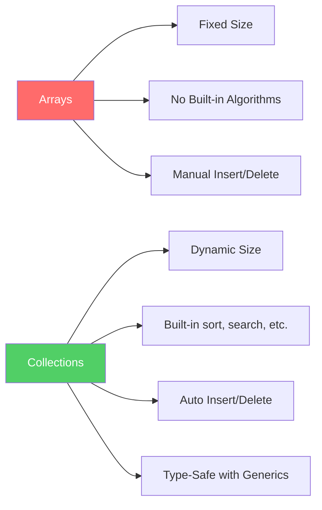

---

## What is the Java Collections Framework?

The **Java Collections Framework (JCF)** is a unified architecture for representing and manipulating groups of objects. It provides:

1. **Interfaces** — Abstract data types (List, Set, Queue, Map)
2. **Implementations** — Concrete classes (ArrayList, HashMap, etc.)
3. **Algorithms** — Static methods in the `Collections` utility class (sort, search, shuffle, etc.)

**Key package:** `java.util`

---

## Collection Hierarchy

This is the **most important diagram** to understand. Everything in the Collections Framework is built on this hierarchy.

There are **two separate hierarchies** in JCF:
1. **Collection hierarchy** — for groups of individual elements (List, Set, Queue)
2. **Map hierarchy** — for key-value pairs (HashMap, TreeMap)

**Why are they separate?** Because a Collection stores single elements (`add(element)`), but a Map stores pairs (`put(key, value)`). They have fundamentally different contracts.

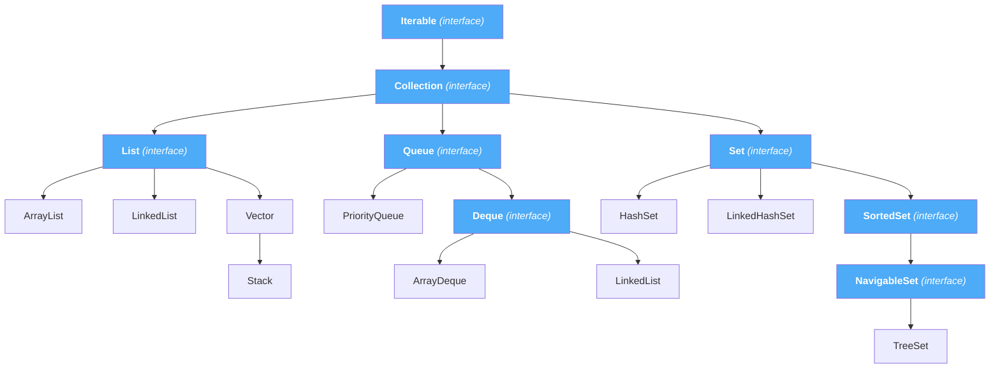

**Blue = Interface, Yellow = Class**

> **Note:** `LinkedList` implements **both** `List` and `Deque`. That's why it appears in two places.

### Map Hierarchy (Separate from Collection)

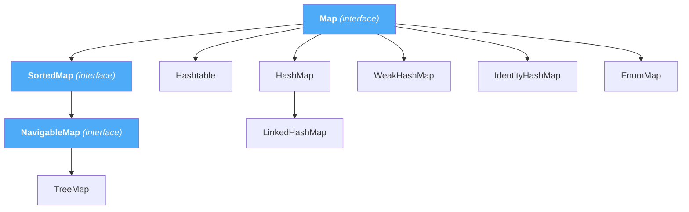

### What Are NavigableSet and NavigableMap?

Your notes had `SortedSet` and `SortedMap` but missed these. `NavigableSet` extends `SortedSet` and adds navigation methods:

```java
NavigableSet<Integer> set = new TreeSet<>(Arrays.asList(10, 20, 30, 40, 50));

set.lower(30);    // 20  — strictly less than 30
set.floor(30);    // 30  — less than or equal to 30
set.ceiling(35);  // 40  — greater than or equal to 35
set.higher(30);   // 40  — strictly greater than 30
```

**Why do we need this?** Imagine you're building a leaderboard — "Give me all scores above 90" or "What's the next highest score after 85?" — `NavigableSet` makes these queries trivial.

---

## Generics in Collections

### The Problem Without Generics (Java 1.4 and earlier)

```java
// Without Generics — DANGEROUS!
ArrayList list = new ArrayList();
list.add("Hello");
list.add(42);        // No error at compile time!

String s = (String) list.get(1); // ClassCastException at RUNTIME! 42 is not a String
```

### The Solution With Generics (Java 5+)

```java
ArrayList<String> list = new ArrayList<String>();
list.add("Hello");
list.add(42);       // COMPILE ERROR! Caught immediately!

String s = list.get(0); // No cast needed!
```

### Diamond Operator (Java 7+)

```java
// Java 7+ — compiler infers the type
ArrayList<String> list = new ArrayList<>();
```

### Wildcards — PECS Rule

```java
// ? extends T — UPPER bound (read-only, "producer")
void printAll(List<? extends Number> list) {
    for (Number n : list) System.out.println(n);
}

// ? super T — LOWER bound (write-only, "consumer")
void addNumbers(List<? super Integer> list) {
    list.add(42); // OK
}

// Remember: PECS — Producer Extends, Consumer Super
```

---

## The Iterable & Collection Interface

### Iterable Interface

Any class that implements `Iterable` can be used in a **for-each loop**.

```java
public interface Iterable<T> {
    Iterator<T> iterator();
    default void forEach(Consumer<? super T> action) { ... } // Java 8+
    default Spliterator<T> spliterator() { ... }              // Java 8+
}
```

### Collection Interface

Defines the **core operations** every collection must support:

```java
public interface Collection<E> extends Iterable<E> {
    int size();
    boolean isEmpty();
    boolean add(E e);
    boolean remove(Object o);
    boolean contains(Object o);
    boolean addAll(Collection<? extends E> c);
    boolean removeAll(Collection<?> c);
    boolean retainAll(Collection<?> c);  // Keep only elements present in c
    void clear();
    Object[] toArray();
    <T> T[] toArray(T[] a);
    default Stream<E> stream() { ... }
    default boolean removeIf(Predicate<? super E> filter) { ... }
}
```

**Why is `Map` not part of `Collection`?** Because `Collection` defines `add(element)` — a single element. Maps deal with `put(key, value)` — two elements per entry. The contracts are incompatible.

---

## List Interface & Implementations

### What is a List?

A **List** is an **ordered collection** (sequence). It:
- **Allows duplicates** — you can add "Apple" ten times
- **Maintains insertion order** — elements stay in the order you added them
- **Allows positional access** — get/set by index (`get(0)`, `set(2, "Banana")`)
- **Allows null** elements

```java
// Key methods unique to List (beyond Collection)
E get(int index);
E set(int index, E element);
void add(int index, E element);
E remove(int index);
int indexOf(Object o);
int lastIndexOf(Object o);
List<E> subList(int fromIndex, int toIndex);
ListIterator<E> listIterator();
```

### 1. ArrayList — The King of Lists

**What is it?** A **resizable array**. Internally, it's just an `Object[]` that grows when needed.

**Why is it the most used List?** Arrays are stored in **contiguous memory**, so CPUs can read them blazingly fast (cache-friendly).

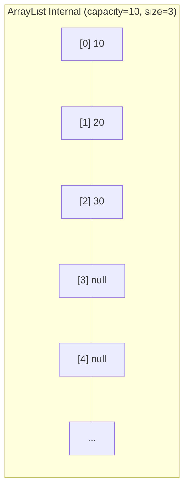

#### How Dynamic Resizing Works

```java
ArrayList<Integer> list = new ArrayList<>(); // Default capacity = 10
// When size exceeds capacity → creates NEW array with 1.5x capacity
// Old: capacity 10 → New: capacity 15
// All elements COPIED to new array (expensive!)
```

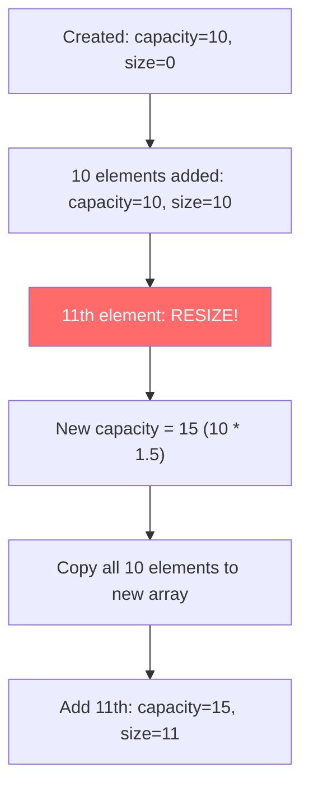

**Pro tip:** If you know you'll add 1000 elements, use `new ArrayList<>(1000)` to avoid repeated resizing.

#### Performance

| Operation | Time | Why? |
|-----------|------|------|
| `get(index)` | **O(1)** | Direct array access |
| `add(element)` at end | **O(1)** amortized | Place at next slot (resize occasionally) |
| `add(index, element)` middle | **O(n)** | Must shift all elements after `index` right |
| `remove(index)` | **O(n)** | Must shift all elements after `index` left |
| `contains(element)` | **O(n)** | Must scan entire array |
| `set(index, element)` | **O(1)** | Direct array access |

#### Example

```java
import java.util.ArrayList;
import java.util.List;

public class ArrayListExample {
    public static void main(String[] args) {
        List<String> fruits = new ArrayList<>();
        
        fruits.add("Apple");
        fruits.add("Banana");
        fruits.add("Cherry");
        fruits.add("Apple"); // Duplicates allowed!
        
        System.out.println(fruits.get(1)); // Banana
        fruits.set(1, "Blueberry");        // Replace Banana
        fruits.add(1, "Avocado");          // Insert at index 1, shifts rest
        
        fruits.remove(0);          // Remove by index
        fruits.remove("Cherry");   // Remove by value (first occurrence)
        
        System.out.println(fruits.contains("Apple")); // true
        System.out.println(fruits); // [Avocado, Blueberry, Apple]
    }
}
```

### 2. LinkedList — The Flexible Chain

**What is it?** A **doubly-linked list**. Each node holds a reference to the **previous** and **next** node.

**Why does it exist?** Inserting/deleting at the beginning or middle of an ArrayList is O(n). In a LinkedList, if you already have a reference to the node, insert/delete is O(1).

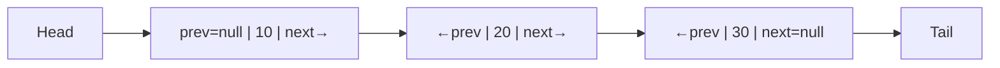

#### Performance

| Operation | Time | Why? |
|-----------|------|------|
| `get(index)` | **O(n)** | Must traverse from head/tail |
| `add(element)` at end | **O(1)** | Update tail pointer |
| `addFirst(element)` | **O(1)** | Update head pointer |
| `add(index, element)` | **O(n)** | Traverse to index, then O(1) insert |
| `removeFirst()`/`removeLast()` | **O(1)** | Direct head/tail access |
| `contains(element)` | **O(n)** | Scan all nodes |

#### When LinkedList Loses

In practice, **LinkedList is almost always slower than ArrayList** — even for insertions! Why?
- **Cache misses** — ArrayList is contiguous in memory (CPU cache loves this). LinkedList nodes are scattered.
- **Memory overhead** — Each node stores 2 extra references (prev + next), ~24 extra bytes per element.
- The O(n) traversal to find the insertion point often costs more than O(n) shifting in ArrayList.

**When to actually use LinkedList?** Only when you need a Deque with both List and Deque interfaces. But even then, **ArrayDeque is usually faster** if you only need Deque.

### 3. Vector — The Legacy Synchronized List

Almost identical to ArrayList, but **every method is synchronized** (thread-safe).

```java
// DON'T use Vector (legacy, slow)
Vector<String> v = new Vector<>();

// Instead use:
List<String> syncList = Collections.synchronizedList(new ArrayList<>());
// Or for read-heavy concurrent access:
List<String> cowList = new CopyOnWriteArrayList<>();
```

### 4. Stack — The Legacy LIFO Structure

Extends Vector. Implements Last-In-First-Out (LIFO). **Avoid it** — it inherits Vector's synchronized overhead and breaks stack abstraction with random-access methods.

```java
// DON'T use Stack
Stack<Integer> stack = new Stack<>();

// Instead use ArrayDeque as a stack
Deque<Integer> stack = new ArrayDeque<>();
stack.push(10);
stack.push(20);
System.out.println(stack.pop());  // 20 (LIFO)
System.out.println(stack.peek()); // 10 (look without removing)
```

### ArrayList vs LinkedList — Decision

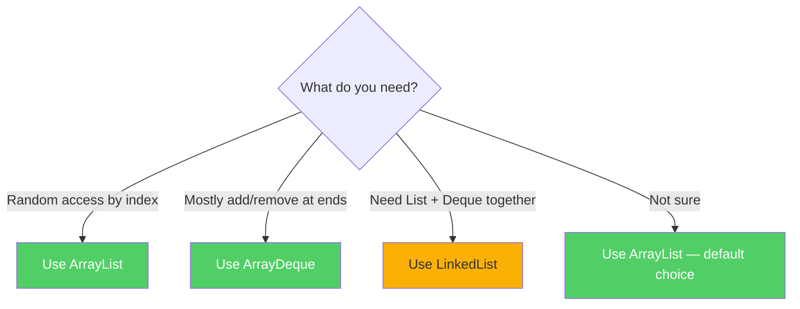

---

## Set Interface & Implementations

### What is a Set?

A collection that **does NOT allow duplicate elements**. Like a mathematical set.

```java
Set<String> set = new HashSet<>();
set.add("Apple");
set.add("Banana");
set.add("Apple");  // Returns false — duplicate ignored!
System.out.println(set.size()); // 2, not 3!
```

**Why Set over List?**
- **Uniqueness guarantee** — no duplicates without manual checking
- **Fast contains()** — HashSet O(1) vs ArrayList O(n)
- **Use cases:** tracking unique visitors, deduplication, membership testing

### 1. HashSet — The Fastest Set

Backed by a **HashMap** internally. When you add an element, it stores it as a **key** in an internal HashMap (with a dummy value).

#### How It Works

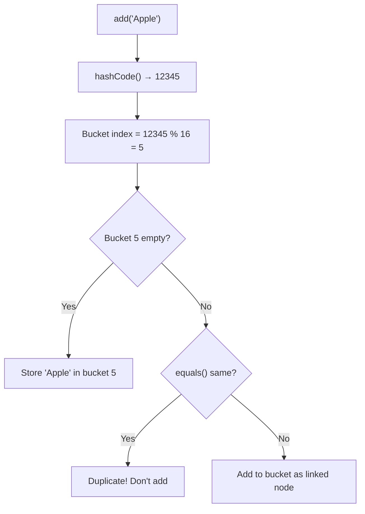

**Critical:** HashSet uses `hashCode()` to find the bucket and `equals()` to check for duplicates. **If you override `equals()`, you MUST override `hashCode()` too!**

| Property | Value |
|----------|-------|
| Ordering | **No guaranteed order** |
| Null | **1 null** allowed |
| `add/remove/contains` | **O(1)** average |

#### Example

```java
Set<String> cities = new HashSet<>();
cities.add("Chennai");
cities.add("Mumbai");
cities.add("Delhi");
cities.add("Chennai"); // Duplicate — ignored

System.out.println(cities); // Order NOT guaranteed
System.out.println(cities.contains("Mumbai")); // true — O(1)!
```

### 2. LinkedHashSet — HashSet + Insertion Order

Extends HashSet, maintains a **doubly-linked list** to preserve **insertion order**.

**Why?** Sometimes you want O(1) lookups **and** elements in the order you added them.

```java
Set<String> set = new LinkedHashSet<>();
set.add("Banana");
set.add("Apple");
set.add("Cherry");
System.out.println(set); // [Banana, Apple, Cherry] — insertion order!
```

### 3. TreeSet — The Sorted Set

Backed by a **Red-Black tree**. Elements are always **sorted**.

```java
Set<Integer> set = new TreeSet<>();
set.add(50);
set.add(10);
set.add(30);
System.out.println(set); // [10, 30, 50] — always sorted!
```

| Property | Value |
|----------|-------|
| Ordering | **Sorted** (natural order or Comparator) |
| Null | **Not allowed** (can't compare null) |
| `add/remove/contains` | **O(log n)** |

### HashSet vs LinkedHashSet vs TreeSet

| Feature | HashSet | LinkedHashSet | TreeSet |
|---------|---------|---------------|---------|
| **Ordering** | No order | Insertion order | Sorted order |
| **Performance** | O(1) | O(1) | O(log n) |
| **Null** | 1 null | 1 null | **No null** |
| **Internal** | HashMap | HashMap + LinkedList | Red-Black Tree |
| **Use When** | Just uniqueness | Uniqueness + insertion order | Uniqueness + sorted |

---

## Queue & Deque Interface & Implementations

### What is a Queue?

A **FIFO** (First-In-First-Out) collection — like a line at a movie theater.

```java
// Queue has TWO sets of methods:
// Throws exception:  add(e), remove(), element()
// Returns special:   offer(e)→false, poll()→null, peek()→null
```

**Why two sets?** `add/remove/element` throw exceptions — useful when empty queue = bug. `offer/poll/peek` return special values — useful when empty queue = normal (e.g., producer-consumer).

| Operation | Throws Exception | Returns Special Value |
|-----------|-----------------|----------------------|
| Insert | `add(e)` | `offer(e)` → false |
| Remove | `remove()` | `poll()` → null |
| Examine | `element()` | `peek()` → null |

### 1. PriorityQueue — Ordered by Priority, Not FIFO

Elements are dequeued by **priority** (natural ordering or Comparator), NOT insertion order.

**Why?** Hospital ER — patients treated by severity, not arrival order.

```java
// Min-heap by default (smallest first)
Queue<Integer> pq = new PriorityQueue<>();
pq.offer(30);
pq.offer(10);
pq.offer(20);
System.out.println(pq.poll()); // 10 — smallest first!

// Max-heap (largest first)
Queue<Integer> maxPQ = new PriorityQueue<>(Comparator.reverseOrder());
maxPQ.offer(30); maxPQ.offer(10); maxPQ.offer(20);
System.out.println(maxPQ.poll()); // 30 — largest first!
```

| Property | Value |
|----------|-------|
| Null | **Not allowed** |
| Internal | **Binary heap** (array-based) |
| `offer/poll` | **O(log n)** |
| `peek` | **O(1)** |

### What is a Deque?

**Double-Ended Queue** — insert and remove at **both ends**. Can act as Queue (FIFO) or Stack (LIFO).

```java
// Deque adds: addFirst/addLast, removeFirst/removeLast, peekFirst/peekLast
// Stack operations: push(e) = addFirst, pop() = removeFirst
```

### 2. ArrayDeque — The Best Queue AND Stack

Resizable array implementation of Deque. **Faster than LinkedList as a Queue and faster than Stack as a Stack.**

```java
// As a Queue (FIFO)
Deque<String> queue = new ArrayDeque<>();
queue.offer("First");
queue.offer("Second");
System.out.println(queue.poll()); // First

// As a Stack (LIFO)
Deque<String> stack = new ArrayDeque<>();
stack.push("Bottom");
stack.push("Top");
System.out.println(stack.pop()); // Top
```

**Why better than LinkedList?** No node allocation, cache-friendly contiguous array, less memory.

| Property | Value |
|----------|-------|
| Null | **Not allowed** |
| Internal | Resizable circular array |
| All operations | **O(1)** amortized |

### Queue/Deque Decision

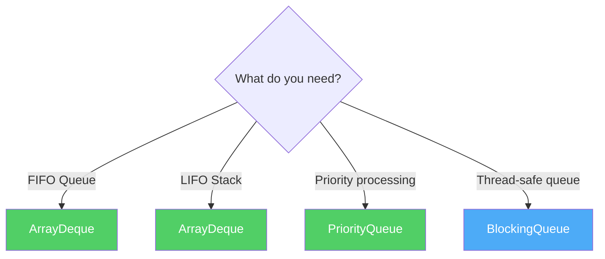

---

## Map Interface & Implementations

### What is a Map?

A **Map** stores **key-value pairs**. Each key maps to exactly one value. Keys must be **unique**, values can be duplicated.

**Think of it like a dictionary:** the word (key) maps to its definition (value). You can't have the same word twice, but two words can share the same definition.

```java
// Key methods
V put(K key, V value);
V get(Object key);
V remove(Object key);
boolean containsKey(Object key);
boolean containsValue(Object value);
Set<K> keySet();
Collection<V> values();
Set<Map.Entry<K,V>> entrySet();
int size();

// Java 8+ additions
V getOrDefault(Object key, V defaultValue);
V putIfAbsent(K key, V value);
V computeIfAbsent(K key, Function<K, V> mappingFunction);
V computeIfPresent(K key, BiFunction<K, V, V> remappingFunction);
void forEach(BiConsumer<K, V> action);
V merge(K key, V value, BiFunction<V, V, V> remappingFunction);
```

### 1. HashMap — The King of Maps

A hash table implementation. Stores entries in an **array of buckets** using the key's `hashCode()`.

#### How HashMap Works Internally (Interview Favorite!)

**Step 1: Hashing**
```java
map.put("Apple", 100);
// 1. hashCode("Apple") → say 12345
// 2. Bucket index = hash(12345) % array.length
// 3. Store Entry(key="Apple", value=100) in that bucket
```

**Step 2: Collision Handling**
```java
// If "Apple" and "Mango" both hash to bucket 5:
// Before Java 8: LinkedList of entries in that bucket → O(n) lookup
// Java 8+: If > 8 entries in one bucket → Red-Black Tree → O(log n) lookup
```

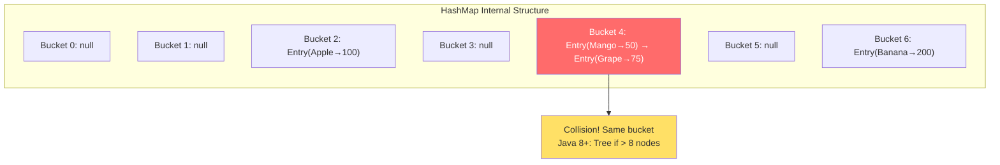

**Step 3: Resizing (Rehashing)**
```java
// Initial capacity: 16 buckets, Load factor: 0.75
// When size > 16 * 0.75 = 12 → Double capacity (16 → 32)
// REHASH all entries → O(n) — expensive!
```

#### Properties

| Property | Value |
|----------|-------|
| Ordering | **No guaranteed order** |
| Null keys | **One null key** allowed (goes to bucket 0) |
| Null values | **Multiple null values** allowed |
| Thread-safe | **No** |
| `get/put/remove` | **O(1)** average, O(log n) worst (Java 8+) |

#### Example

```java
import java.util.HashMap;
import java.util.Map;

public class HashMapExample {
    public static void main(String[] args) {
        Map<String, Integer> scores = new HashMap<>();
        
        scores.put("Alice", 95);
        scores.put("Bob", 87);
        scores.put("Charlie", 92);
        scores.put("Alice", 98);  // Updates Alice (keys unique)
        
        System.out.println(scores.get("Alice"));                  // 98
        System.out.println(scores.getOrDefault("David", 0));      // 0
        System.out.println(scores.containsKey("Bob"));             // true
        
        // Iterate over entries
        for (Map.Entry<String, Integer> entry : scores.entrySet()) {
            System.out.println(entry.getKey() + " → " + entry.getValue());
        }
        
        // Java 8+ forEach
        scores.forEach((name, score) -> System.out.println(name + ": " + score));
        
        // putIfAbsent — only add if key doesn't exist
        scores.putIfAbsent("Alice", 50); // Does nothing
        scores.putIfAbsent("David", 88); // Adds David
        
        // computeIfAbsent — compute value lazily
        scores.computeIfAbsent("Eve", k -> k.length() * 10); // Eve → 30
        
        // merge — combine values
        scores.merge("Alice", 5, Integer::sum); // Alice = 98 + 5 = 103
    }
}
```

### 2. LinkedHashMap — HashMap + Insertion Order

Maintains a **doubly-linked list** to preserve **insertion order** (or **access order** for LRU cache).

```java
// Insertion order (default)
Map<String, Integer> map = new LinkedHashMap<>();
map.put("Banana", 2);
map.put("Apple", 1);
map.put("Cherry", 3);
System.out.println(map); // {Banana=2, Apple=1, Cherry=3}

// Access order (for LRU cache)
Map<String, Integer> lru = new LinkedHashMap<>(16, 0.75f, true);
lru.put("A", 1); lru.put("B", 2); lru.put("C", 3);
lru.get("A");  // Access A — moves to end
System.out.println(lru); // {B=2, C=3, A=1} — A moved to end
```

### 3. TreeMap — The Sorted Map

**Red-Black tree** implementation. Keys are always **sorted**.

```java
Map<String, Integer> map = new TreeMap<>();
map.put("Charlie", 3);
map.put("Alice", 1);
map.put("Bob", 2);
System.out.println(map); // {Alice=1, Bob=2, Charlie=3} — sorted!

// Navigation methods
TreeMap<Integer, String> tm = new TreeMap<>();
tm.put(10, "Ten"); tm.put(20, "Twenty"); tm.put(30, "Thirty"); tm.put(40, "Forty");

System.out.println(tm.firstKey());      // 10
System.out.println(tm.lastKey());       // 40
System.out.println(tm.lowerKey(25));    // 20 (strictly less)
System.out.println(tm.higherKey(25));   // 30 (strictly greater)
System.out.println(tm.subMap(15, 35));  // {20=Twenty, 30=Thirty}
```

| Property | Value |
|----------|-------|
| Ordering | **Sorted by key** |
| Null keys | **Not allowed** |
| `get/put/remove` | **O(log n)** |

### 4. Hashtable — Legacy, Avoid It

Synchronized HashMap from Java 1.0.

| Difference | HashMap | Hashtable |
|------------|---------|-----------|
| Synchronization | No | Yes (every method) |
| Null key | 1 allowed | **Not allowed** |
| Null value | Allowed | **Not allowed** |
| Performance | Faster | Slower |
| Status | Modern | Legacy — use ConcurrentHashMap |

### HashMap vs LinkedHashMap vs TreeMap

| Feature | HashMap | LinkedHashMap | TreeMap |
|---------|---------|---------------|---------|
| **Ordering** | No order | Insertion/Access order | Sorted by key |
| **Performance** | O(1) | O(1) | O(log n) |
| **Null key** | 1 allowed | 1 allowed | **Not allowed** |
| **Internal** | Hash table | Hash table + Linked list | Red-Black Tree |
| **Use when** | Default choice | Need order + fast lookup | Need sorted keys |

---

## Iterator, ListIterator & Spliterator

### Iterator — Safe Traversal and Removal

**Why do we need it?** Using a regular for-each and removing elements causes `ConcurrentModificationException`:

```java
// BAD — throws ConcurrentModificationException!
List<Integer> list = new ArrayList<>(Arrays.asList(10, 15, 20));
for (Integer x : list) {
    if (x % 2 == 0) list.remove(x); // CRASH!
}

// GOOD — use Iterator
Iterator<Integer> it = list.iterator();
while (it.hasNext()) {
    int x = it.next();
    if (x % 2 == 0) it.remove(); // Safe!
}
System.out.println(list); // [15]
```

#### Iterator Methods

```java
boolean hasNext();   // Is there a next element?
E next();            // Return next element and advance cursor
void remove();       // Remove element last returned by next()
default void forEachRemaining(Consumer<? super E> action) { ... } // Java 8+
```

#### Step-by-Step Example (from your notes — Image 4)

```java
void removeEven(Collection<Integer> c) {
    Iterator<Integer> it = c.iterator();
    while (it.hasNext()) {
        int x = (Integer) it.next(); // Two things: get value AND advance cursor
        if (x % 2 == 0)
            it.remove();
    }
}

Collection<Integer> c = new ArrayList<>(Arrays.asList(10, 15, 20));
removeEven(c);
System.out.println(c); // [15]
```

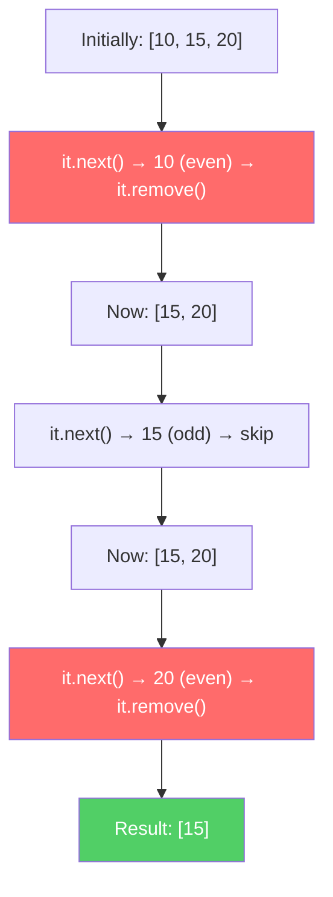

### ListIterator — Bidirectional for Lists

Enhanced Iterator that goes **forward and backward**, and can **add/set** during iteration. **Only works with Lists.**

```java
List<String> list = new ArrayList<>(Arrays.asList("A", "B", "C", "D"));
ListIterator<String> lit = list.listIterator();

// Forward
while (lit.hasNext()) {
    System.out.println(lit.nextIndex() + ": " + lit.next());
}

// Backward
while (lit.hasPrevious()) {
    System.out.println(lit.previousIndex() + ": " + lit.previous());
}

// Modify during iteration
ListIterator<String> lit2 = list.listIterator();
while (lit2.hasNext()) {
    String val = lit2.next();
    if (val.equals("B")) lit2.set("B_MODIFIED");  // Replace
    if (val.equals("C")) lit2.add("C2");           // Insert after
}
System.out.println(list); // [A, B_MODIFIED, C, C2, D]
```

### Iterator vs ListIterator

| Feature | Iterator | ListIterator |
|---------|----------|-------------|
| Direction | **Forward only** | **Forward and Backward** |
| Works with | Any Collection | **Lists only** |
| `remove()` | Yes | Yes |
| `set()` | No | **Yes** |
| `add()` | No | **Yes** |
| Get index | No | **Yes** |

### Spliterator — For Parallel Processing (Java 8+)

A "splitting iterator" for **parallel traversal**. It splits a collection into parts for multi-threaded processing.

```java
List<Integer> numbers = Arrays.asList(1, 2, 3, 4, 5, 6, 7, 8);
Spliterator<Integer> split1 = numbers.spliterator();
Spliterator<Integer> split2 = split1.trySplit(); // Takes first half
// split2: [1, 2, 3, 4], split1: [5, 6, 7, 8] — can process in parallel!
```

**When to use?** Rarely directly. Used internally by **parallel streams** (`collection.parallelStream()`).

---

## Iterating Through Collections

### 4 Main Ways (from your notes — Image 8) + 2 Extra

#### 1. Iterator (Classic)
```java
Iterator<String> it = list.iterator();
while (it.hasNext()) System.out.println(it.next());
```
**Use when:** You need to **remove elements** during iteration.

#### 2. For-Each Loop (Enhanced for)
```java
for (String s : list) System.out.println(s);
```
**Use when:** **Default choice** — clean, readable. Internally uses Iterator.

#### 3. forEach Method (Java 8+)
```java
list.forEach(System.out::println);
```
**Use when:** Functional style preferred.

#### 4. Stream API (Java 8+)
```java
list.stream().filter(s -> s.startsWith("A")).forEach(System.out::println);
```
**Use when:** Complex filtering, mapping, reducing.

#### 5. ListIterator (Lists Only)
```java
ListIterator<String> lit = list.listIterator(list.size());
while (lit.hasPrevious()) System.out.println(lit.previous()); // Backward
```

#### 6. Index-Based for Loop (Lists Only)
```java
for (int i = 0; i < list.size(); i++) System.out.println(list.get(i));
```
**Use when:** You need the **index**.

### Iterating Over Maps

```java
Map<String, Integer> map = Map.of("A", 1, "B", 2, "C", 3);

// 1. Over entries (most common)
for (Map.Entry<String, Integer> entry : map.entrySet()) {
    System.out.println(entry.getKey() + " = " + entry.getValue());
}

// 2. Over keys only
for (String key : map.keySet()) System.out.println(key);

// 3. Over values only
for (Integer value : map.values()) System.out.println(value);

// 4. forEach (Java 8+)
map.forEach((key, value) -> System.out.println(key + " = " + value));
```

---

## toArray() Methods

### Why Convert Collection to Array?

Sometimes APIs require arrays (legacy code, varargs methods), or you want a **fixed snapshot**.

### Two Versions

```java
Object[] toArray();           // Returns Object[] — NOT type-safe
<T> T[] toArray(T[] a);      // Returns T[] — TYPE-SAFE (preferred)
```

### Example

```java
List<Integer> list = new ArrayList<>(Arrays.asList(10, 15, 20));

// Version 1: Object[] — requires casting
Object[] arr1 = list.toArray();
for (Object x : arr1) System.out.print(x + " "); // 10 15 20

// Version 2: Type-safe — PREFERRED
Integer[] arr2 = list.toArray(new Integer[0]);
for (Integer x : arr2) System.out.print(x + " "); // 10 15 20

// Java 11+ method reference style
Integer[] arr3 = list.toArray(Integer[]::new);
```

**Bug in your notes (Image 7):** `Integer[] arr = list.toArray();` **won't compile** because `toArray()` returns `Object[]`, not `Integer[]`. Must use `list.toArray(new Integer[0])`.

**Tip:** Pass `new Integer[0]` (empty array) — modern JVMs optimize this to be faster than `new Integer[list.size()]`.

---

## Comparable vs Comparator

### The Problem

```java
List<String> names = Arrays.asList("Charlie", "Alice", "Bob");
Collections.sort(names); // Works! Strings have natural ordering (alphabetical)

List<Student> students = new ArrayList<>();
students.add(new Student("Alice", 85));
students.add(new Student("Bob", 92));
Collections.sort(students); // COMPILE ERROR! How should Student be sorted?
```

**The compiler doesn't know how to compare two Students.** By name? By marks? You must tell it.

### Comparable — "I Can Compare Myself" (Natural Ordering)

The class itself defines its default sort order by implementing `Comparable`.

```java
public class Student implements Comparable<Student> {
    String name;
    int marks;
    
    public Student(String name, int marks) {
        this.name = name;
        this.marks = marks;
    }
    
    @Override
    public int compareTo(Student other) {
        // Negative → this < other
        // Zero    → this == other
        // Positive → this > other
        return this.marks - other.marks; // Sort by marks ascending
    }
    
    @Override
    public String toString() { return name + "(" + marks + ")"; }
}

// Now this works!
List<Student> students = Arrays.asList(
    new Student("Alice", 85),
    new Student("Bob", 92),
    new Student("Charlie", 78)
);
Collections.sort(students);
System.out.println(students); // [Charlie(78), Alice(85), Bob(92)]
```

### Comparator — "Someone Else Compares Me" (Custom Ordering)

An external class/lambda defines the sort order. **Use when:**
- You **can't modify** the class (third-party library)
- You need **multiple different orderings**

```java
// Sort by name
Comparator<Student> byName = (s1, s2) -> s1.name.compareTo(s2.name);

// Sort by marks descending
Comparator<Student> byMarksDesc = (s1, s2) -> s2.marks - s1.marks;

// Sort by marks, then by name if tie
Comparator<Student> byMarksThenName = Comparator
    .comparingInt((Student s) -> s.marks)
    .thenComparing(s -> s.name);

students.sort(byName);          // [Alice(85), Bob(92), Charlie(78)]
students.sort(byMarksDesc);     // [Bob(92), Alice(85), Charlie(78)]
students.sort(byMarksThenName); // [Charlie(78), Alice(85), Bob(92)]
```

### Java 8+ Comparator Factory Methods

```java
Comparator.comparingInt(Student::getMarks);              // By marks
Comparator.comparing(Student::getName);                   // By name
Comparator.comparingInt(Student::getMarks).reversed();    // Marks descending
Comparator.comparingInt(Student::getMarks)
          .thenComparing(Student::getName);                // Marks, then name
Comparator.naturalOrder();                                 // Natural ordering
Comparator.reverseOrder();                                 // Reverse natural
Comparator.nullsFirst(Comparator.naturalOrder());          // Nulls first
Comparator.nullsLast(Comparator.naturalOrder());           // Nulls last
```

### Comparable vs Comparator — Decision

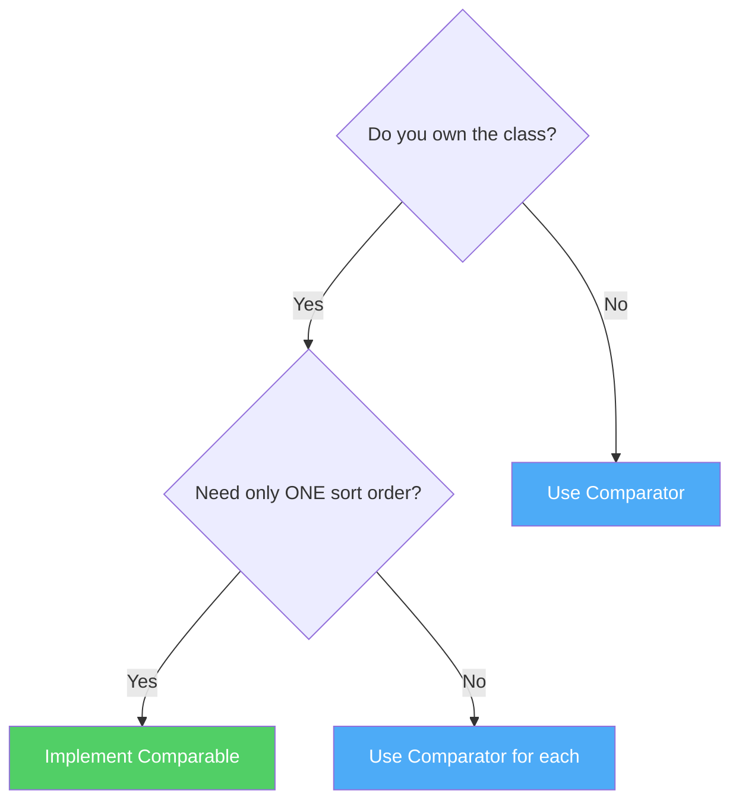

| Feature | Comparable | Comparator |
|---------|-----------|------------|
| Package | `java.lang` | `java.util` |
| Method | `compareTo(T o)` | `compare(T o1, T o2)` |
| Sort orders | **One** (natural) | **Many** |
| Modifies class? | **Yes** | **No** |
| Used by | `Collections.sort(list)` | `Collections.sort(list, comp)` |
| Lambda? | No | **Yes** `(a, b) -> ...` |

---

## equals() and hashCode() Contract

### Why Is This So Important?

**HashMap and HashSet rely on `hashCode()` to find the bucket, and `equals()` to confirm identity.** Break the contract → elements "disappear" from your Map/Set.

### The Contract

1. **If `a.equals(b)` is true → `a.hashCode() == b.hashCode()` MUST be true**
2. If `a.hashCode() == b.hashCode()` → `a.equals(b)` may or may not be true (collision OK)
3. `equals()` must be consistent — same result every time for unchanged objects

### What Happens If You Break It?

```java
class Employee {
    String name;
    int id;
    
    Employee(String name, int id) { this.name = name; this.id = id; }
    
    @Override
    public boolean equals(Object o) {
        if (this == o) return true;
        if (!(o instanceof Employee)) return false;
        Employee e = (Employee) o;
        return id == e.id && name.equals(e.name);
    }
    // OOPS! Forgot to override hashCode()!
}

Set<Employee> set = new HashSet<>();
Employee e1 = new Employee("Alice", 1);
set.add(e1);

Employee e2 = new Employee("Alice", 1); // Same name and id
System.out.println(e1.equals(e2));      // true — they ARE equal
System.out.println(set.contains(e2));   // FALSE!!!
// WHY? e1.hashCode() != e2.hashCode() (default uses memory address)
// HashSet looks in WRONG bucket → doesn't find it!
```

### Correct Implementation

```java
class Employee {
    String name;
    int id;
    
    Employee(String name, int id) { this.name = name; this.id = id; }
    
    @Override
    public boolean equals(Object o) {
        if (this == o) return true;
        if (!(o instanceof Employee)) return false;
        Employee e = (Employee) o;
        return id == e.id && Objects.equals(name, e.name);
    }
    
    @Override
    public int hashCode() {
        return Objects.hash(name, id); // SAME fields as equals()!
    }
}

// Now it works!
Set<Employee> set = new HashSet<>();
set.add(new Employee("Alice", 1));
System.out.println(set.contains(new Employee("Alice", 1))); // TRUE!
```

**Golden Rule:** Always override `hashCode()` when you override `equals()`. Use the **same fields** in both.

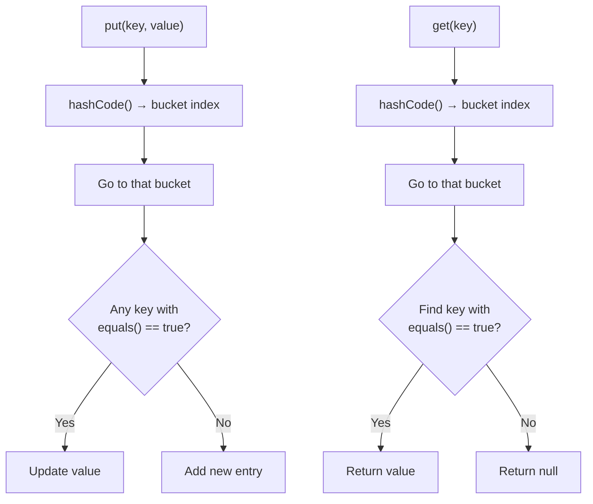

---

## ConcurrentModificationException & Fail-Fast vs Fail-Safe

### What is ConcurrentModificationException?

Occurs when you **modify a collection while iterating** over it (not through iterator's own methods).

```java
List<String> list = new ArrayList<>(Arrays.asList("A", "B", "C"));

// This CRASHES!
for (String s : list) {
    if (s.equals("B")) list.remove(s); // ConcurrentModificationException!
}
```

**Why?** The for-each uses an Iterator internally. The Iterator tracks a `modCount`. If the collection is modified directly, `modCount` changes → Iterator detects mismatch → throws exception.

### Solutions

```java
// Solution 1: Iterator.remove()
Iterator<String> it = list.iterator();
while (it.hasNext()) {
    if (it.next().equals("B")) it.remove(); // Safe!
}

// Solution 2: removeIf() — cleanest (Java 8+)
list.removeIf(s -> s.equals("B"));

// Solution 3: CopyOnWriteArrayList (concurrent)
List<String> cowList = new CopyOnWriteArrayList<>(Arrays.asList("A", "B", "C"));
for (String s : cowList) {
    if (s.equals("B")) cowList.remove(s); // Works! Iterates over snapshot
}
```

### Fail-Fast vs Fail-Safe

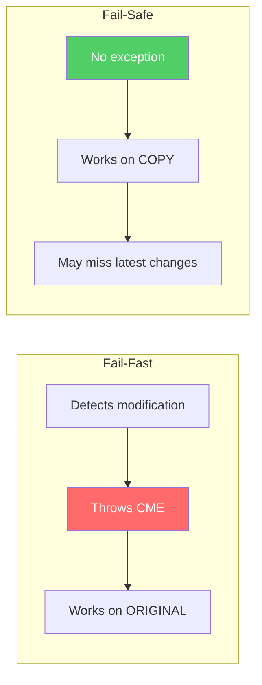

| Feature | Fail-Fast | Fail-Safe |
|---------|-----------|-----------|
| Throws CME? | **Yes** | **No** |
| Works on | Original collection | Copy/snapshot |
| Examples | ArrayList, HashMap, HashSet | CopyOnWriteArrayList, ConcurrentHashMap |
| Memory | Less | More (copy overhead) |
| Sees latest data? | Yes (until crash) | **May not** see changes after iterator creation |

---

## Collections Utility Class

`java.util.Collections` is a **utility class** with static methods — the "toolkit" for collections.

### Sorting

```java
List<Integer> list = new ArrayList<>(Arrays.asList(30, 10, 20, 50, 40));

Collections.sort(list);                            // [10, 20, 30, 40, 50]
Collections.sort(list, Comparator.reverseOrder()); // [50, 40, 30, 20, 10]

// Java 8+ — List has its own sort
list.sort(Comparator.naturalOrder());
```

### Binary Search

```java
Collections.sort(list); // MUST be sorted first!
int index = Collections.binarySearch(list, 30); // Returns index of 30
// Not found → returns -(insertion point) - 1
```

### Min, Max

```java
int min = Collections.min(list); // 10
int max = Collections.max(list); // 50
String longest = Collections.max(names, Comparator.comparingInt(String::length));
```

### Reversing, Shuffling, Rotating

```java
Collections.reverse(list);     // Reverse the list
Collections.shuffle(list);     // Randomly shuffle
Collections.swap(list, 0, 2);  // Swap indices 0 and 2
Collections.rotate(list, 2);   // Rotate right by 2
```

### Fill, Copy, Replace

```java
Collections.fill(list, 0);                    // All elements become 0
Collections.copy(destList, srcList);           // Copy src into dest
Collections.replaceAll(list, 10, 99);          // Replace all 10s with 99
```

### Frequency, Disjoint

```java
int count = Collections.frequency(list, 10);          // How many times 10 appears
boolean noCommon = Collections.disjoint(list1, list2); // True if no common elements
```

### Singleton & Empty Collections

```java
// Immutable single-element collections
List<String> single = Collections.singletonList("only");
Set<String> singleSet = Collections.singleton("only");
Map<String, Integer> singleMap = Collections.singletonMap("key", 42);

// Immutable empty collections
List<String> emptyList = Collections.emptyList();
Set<String> emptySet = Collections.emptySet();
Map<String, Integer> emptyMap = Collections.emptyMap();
```

### nCopies

```java
List<String> fiveHellos = Collections.nCopies(5, "Hello");
// [Hello, Hello, Hello, Hello, Hello] — immutable
```

### Synchronized & Unmodifiable Wrappers

```java
// Thread-safe wrappers
List<String> syncList = Collections.synchronizedList(new ArrayList<>());
Map<String, Integer> syncMap = Collections.synchronizedMap(new HashMap<>());

// Read-only wrappers
List<String> readOnly = Collections.unmodifiableList(list);
readOnly.add("X"); // UnsupportedOperationException!
```

---

## Thread Safety in Collections

### The Problem

```java
// Two threads adding to the same ArrayList simultaneously
List<String> list = new ArrayList<>();
// Thread 1: list.add("A");
// Thread 2: list.add("B");
// Result: Unpredictable! Data corruption, lost elements, ArrayIndexOutOfBoundsException
```

### Solutions (from oldest to newest)

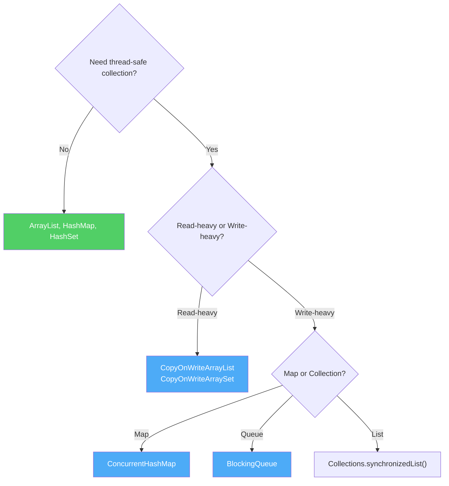

### Legacy Synchronized (Avoid)

```java
Vector<String> v = new Vector<>();              // Don't use — coarse-grained locking
Hashtable<String, Integer> ht = new Hashtable<>(); // Don't use
```

### Collections.synchronizedXxx() Wrappers

```java
List<String> syncList = Collections.synchronizedList(new ArrayList<>());
// IMPORTANT: Must synchronize manually during iteration!
synchronized (syncList) {
    for (String s : syncList) {
        System.out.println(s);
    }
}
```

### ConcurrentHashMap (Best for Maps)

```java
// Fine-grained locking — only locks individual buckets, not the whole map
Map<String, Integer> map = new ConcurrentHashMap<>();
map.put("A", 1); // Thread-safe without external synchronization

// Atomic operations
map.putIfAbsent("B", 2);
map.compute("A", (key, val) -> val + 1);
map.merge("A", 1, Integer::sum);
```

### CopyOnWriteArrayList (Best for Read-Heavy Lists)

```java
// Creates a NEW copy of the array on every write
// Reads are never blocked — always see a consistent snapshot
List<String> cowList = new CopyOnWriteArrayList<>();
cowList.add("A"); // Creates new internal array
// Iteration never throws ConcurrentModificationException

// Good for: event listener lists, config that rarely changes
// Bad for: frequent writes (copying whole array is expensive)
```

### BlockingQueue (For Producer-Consumer)

```java
BlockingQueue<String> queue = new LinkedBlockingQueue<>(10); // Capacity 10

// Producer thread
queue.put("task");  // Blocks if full

// Consumer thread
String task = queue.take(); // Blocks if empty
```

---

## Unmodifiable & Immutable Collections

### Why Immutable?

- **Thread-safe by default** — no one can change it
- **Safe to share** — pass to methods without worrying
- **Predictable** — what you put in stays

### Collections.unmodifiableXxx() (Java 2+)

```java
List<String> original = new ArrayList<>(Arrays.asList("A", "B", "C"));
List<String> readOnly = Collections.unmodifiableList(original);

readOnly.add("D"); // UnsupportedOperationException!

// BUT: It's a VIEW, not a copy!
original.add("D");
System.out.println(readOnly); // [A, B, C, D] — readOnly changed too!
// NOT truly immutable — just an unmodifiable VIEW
```

### Java 9+ Factory Methods (Truly Immutable)

```java
List<String> list = List.of("A", "B", "C");
Set<String> set = Set.of("A", "B", "C");
Map<String, Integer> map = Map.of("A", 1, "B", 2);
Map<String, Integer> map2 = Map.ofEntries(
    Map.entry("A", 1),
    Map.entry("B", 2)
);

list.add("D");       // UnsupportedOperationException!
// List.of(null);     // NullPointerException! No nulls allowed
// Set.of("A", "A");  // IllegalArgumentException! No duplicates
```

### Java 10+ copyOf

```java
List<String> original = new ArrayList<>(Arrays.asList("A", "B", "C"));
List<String> immutableCopy = List.copyOf(original); // Truly immutable copy
original.add("D");
System.out.println(immutableCopy); // [A, B, C] — not affected!
```

---

## Null Handling Across Collections

**This is a common source of NullPointerException!** Different collections have different null policies.

| Collection | Null Elements/Keys | Null Values | Why? |
|------------|-------------------|-------------|------|
| **ArrayList** | Allowed | N/A | No restrictions |
| **LinkedList** | Allowed | N/A | No restrictions |
| **HashSet** | **1 null** | N/A | Hashes null to bucket 0 |
| **LinkedHashSet** | **1 null** | N/A | Same as HashSet |
| **TreeSet** | **Not allowed** | N/A | Can't compare null |
| **PriorityQueue** | **Not allowed** | N/A | Can't compare null |
| **ArrayDeque** | **Not allowed** | N/A | Uses null as sentinel internally |
| **HashMap** | **1 null key** | Multiple nulls | Null key → bucket 0 |
| **LinkedHashMap** | **1 null key** | Multiple nulls | Same as HashMap |
| **TreeMap** | **Not allowed** | Multiple nulls | Can't compare null keys |
| **Hashtable** | **Not allowed** | **Not allowed** | Legacy design |
| **ConcurrentHashMap** | **Not allowed** | **Not allowed** | Ambiguity: null = "not found" or "value is null"? |
| **List.of()** | **Not allowed** | N/A | Immutable, no nulls by design |
| **Set.of()** | **Not allowed** | N/A | Immutable, no nulls by design |
| **Map.of()** | **Not allowed** | **Not allowed** | Immutable, no nulls by design |

---

## Specialized Maps & Sets

### EnumMap — Map with Enum Keys

Extremely fast Map where keys must be from a **single enum type**. Internally uses an array indexed by enum ordinal.

```java
enum Day { MON, TUE, WED, THU, FRI, SAT, SUN }

EnumMap<Day, String> schedule = new EnumMap<>(Day.class);
schedule.put(Day.MON, "Gym");
schedule.put(Day.WED, "Yoga");
schedule.put(Day.FRI, "Swimming");

System.out.println(schedule); // {MON=Gym, WED=Yoga, FRI=Swimming}
// Iteration in enum declaration order
```

**Why use it?** Faster and less memory than HashMap when keys are enums.

### EnumSet — Set of Enum Values

```java
EnumSet<Day> weekdays = EnumSet.of(Day.MON, Day.TUE, Day.WED, Day.THU, Day.FRI);
EnumSet<Day> weekend = EnumSet.of(Day.SAT, Day.SUN);
EnumSet<Day> allDays = EnumSet.allOf(Day.class);
EnumSet<Day> noDays = EnumSet.noneOf(Day.class);
EnumSet<Day> range = EnumSet.range(Day.MON, Day.FRI);
```

**Why use it?** Internally a **bit vector** — incredibly fast and memory-efficient.

### WeakHashMap — Keys Can Be Garbage Collected

```java
WeakHashMap<Object, String> map = new WeakHashMap<>();
Object key = new Object();
map.put(key, "value");

key = null; // Remove strong reference
System.gc();
// Entry may be removed — key has no strong references!
```

**Why?** For caches where entries should auto-clean when keys are no longer used elsewhere.

### IdentityHashMap — Uses == Instead of equals()

```java
IdentityHashMap<String, Integer> map = new IdentityHashMap<>();
String s1 = new String("Hello");
String s2 = new String("Hello");

map.put(s1, 1);
map.put(s2, 2);
System.out.println(map.size()); // 2! s1 != s2 (different objects)

// Regular HashMap:
HashMap<String, Integer> hm = new HashMap<>();
hm.put(s1, 1); hm.put(s2, 2);
System.out.println(hm.size()); // 1! s1.equals(s2) is true
```

**Why?** For object-identity-sensitive operations (serialization frameworks, graph traversals).

---

## Stream API with Collections

### What Are Streams?

Streams (Java 8+) let you process collections **declaratively** — describe *what* you want, not *how*.

```java
List<String> names = Arrays.asList("Alice", "Bob", "Charlie", "David", "Eve");

// Imperative (old way)
List<String> result = new ArrayList<>();
for (String name : names) {
    if (name.length() > 3) {
        result.add(name.toUpperCase());
    }
}

// Declarative (Stream way)
List<String> result = names.stream()
    .filter(name -> name.length() > 3)
    .map(String::toUpperCase)
    .collect(Collectors.toList());
// [ALICE, CHARLIE, DAVID]
```

### Common Stream Operations

```java
List<Integer> numbers = Arrays.asList(5, 3, 8, 1, 9, 2, 7, 4, 6);

// Filter
numbers.stream().filter(n -> n > 5).toList();           // [8, 9, 7, 6]

// Map (transform)
numbers.stream().map(n -> n * 2).toList();               // [10, 6, 16, ...]

// Sort
numbers.stream().sorted().toList();                       // [1, 2, 3, ...]

// Reduce
int sum = numbers.stream().reduce(0, Integer::sum);       // 45

// Count, Min, Max
long count = numbers.stream().filter(n -> n > 5).count(); // 4
int min = numbers.stream().min(Integer::compare).get();    // 1
int max = numbers.stream().max(Integer::compare).get();    // 9

// Collect to different collections
Set<Integer> set = numbers.stream().collect(Collectors.toSet());
Map<Boolean, List<Integer>> partitioned = numbers.stream()
    .collect(Collectors.partitioningBy(n -> n > 5));
// {false=[5, 3, 1, 2, 4], true=[8, 9, 7, 6]}

// Group by
Map<Integer, List<String>> byLength = names.stream()
    .collect(Collectors.groupingBy(String::length));
// {3=[Bob, Eve], 5=[Alice, David], 7=[Charlie]}

// Join
String joined = names.stream().collect(Collectors.joining(", "));
// "Alice, Bob, Charlie, David, Eve"
```

### Parallel Streams

```java
// Use multiple CPU cores for processing
long count = numbers.parallelStream()
    .filter(n -> n > 5)
    .count();
// Same result, but uses multiple threads
// Only use for large datasets — small collections have thread overhead
```

---

## Most Commonly Used Collections

### Tier 1: The "Big 3" — Used Everywhere (~90% of code)

| Collection | Why It's #1 | Default For |
|------------|------------|-------------|
| **`ArrayList`** | O(1) random access, cache-friendly, dynamic size | Any List need |
| **`HashMap`** | O(1) get/put, perfect for key-value lookup | Caching, counting, grouping |
| **`HashSet`** | O(1) add/contains, deduplication | Uniqueness, membership tests |

**Golden Rule:** If someone says "give me a List" → `ArrayList`. "Map" → `HashMap`. "Set" → `HashSet`.

### Tier 2: Common in Specific Scenarios

| Collection | When You'd Pick It |
|------------|-------------------|
| **`LinkedHashMap`** | HashMap + insertion order (LRU cache) |
| **`TreeMap`** | Keys must be sorted (range queries, leaderboards) |
| **`ArrayDeque`** | Need a Stack or Queue — faster than `Stack` and `LinkedList` |
| **`PriorityQueue`** | Process by priority (task scheduling, Dijkstra's) |
| **`ConcurrentHashMap`** | Thread-safe Map in multi-threaded code |

### Tier 3: Rarely Used / Legacy — Avoid Unless Necessary

| Collection | Why It's Rare |
|------------|--------------|
| **`LinkedList`** | Almost always slower than ArrayList (cache misses). ArrayDeque better for queue. |
| **`Vector`** | Legacy synchronized ArrayList. Use `Collections.synchronizedList()` instead. |
| **`Stack`** | Legacy. Use `ArrayDeque` instead. |
| **`Hashtable`** | Legacy. Use `HashMap` or `ConcurrentHashMap`. |
| **`TreeSet`** | Only when you need sorted + unique. |

### Quick Reference

```
Need a list?        → ArrayList
Need key-value?     → HashMap
Need unique items?  → HashSet
Need a queue?       → ArrayDeque
Need a stack?       → ArrayDeque
Need sorted keys?   → TreeMap
Need sorted set?    → TreeSet
Need thread-safe?   → ConcurrentHashMap
Need order + fast?  → LinkedHashMap / LinkedHashSet
```

---

## Which Collection Should I Use? (Decision Guide)

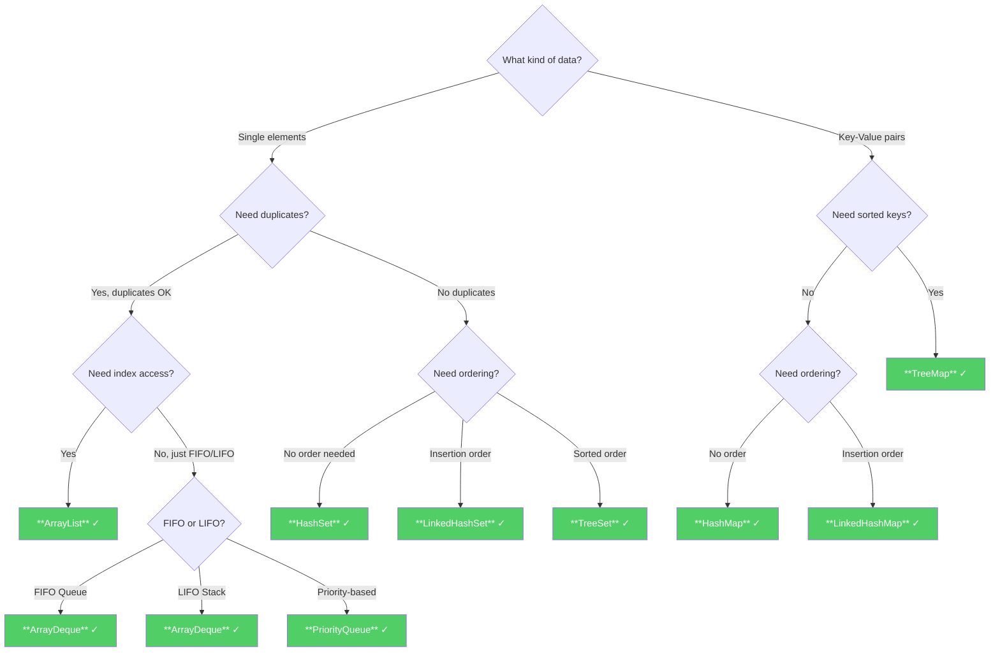

---

## Time Complexity Cheat Sheet

### List Implementations

| Operation | ArrayList | LinkedList |
|-----------|-----------|------------|
| `get(index)` | **O(1)** | O(n) |
| `set(index)` | **O(1)** | O(n) |
| `add(end)` | **O(1)**\* | **O(1)** |
| `add(index)` | O(n) | O(n)\*\* |
| `remove(index)` | O(n) | O(n)\*\* |
| `contains()` | O(n) | O(n) |
| `indexOf()` | O(n) | O(n) |

\* Amortized (occasional resize)
\*\* O(1) if you have the node reference, but O(n) to find the node

### Set Implementations

| Operation | HashSet | LinkedHashSet | TreeSet |
|-----------|---------|---------------|---------|
| `add()` | **O(1)** | **O(1)** | O(log n) |
| `remove()` | **O(1)** | **O(1)** | O(log n) |
| `contains()` | **O(1)** | **O(1)** | O(log n) |
| Iteration | O(n) | O(n) | O(n) |
| Ordering | None | Insertion | Sorted |

### Map Implementations

| Operation | HashMap | LinkedHashMap | TreeMap |
|-----------|---------|---------------|---------|
| `get()` | **O(1)** | **O(1)** | O(log n) |
| `put()` | **O(1)** | **O(1)** | O(log n) |
| `remove()` | **O(1)** | **O(1)** | O(log n) |
| `containsKey()` | **O(1)** | **O(1)** | O(log n) |
| `containsValue()` | O(n) | O(n) | O(n) |
| Ordering | None | Insertion | Sorted |

### Queue/Deque Implementations

| Operation | ArrayDeque | PriorityQueue | LinkedList |
|-----------|------------|---------------|------------|
| `offer()` (enqueue) | **O(1)** | O(log n) | **O(1)** |
| `poll()` (dequeue) | **O(1)** | O(log n) | **O(1)** |
| `peek()` | **O(1)** | **O(1)** | **O(1)** |
| `push()` (stack) | **O(1)** | N/A | **O(1)** |
| `pop()` (stack) | **O(1)** | N/A | **O(1)** |

> **Note:** All O(1) times for hash-based collections are **average case**. Worst case is O(n) for very poor hash functions, but O(log n) in Java 8+ due to tree bins.

---

**End of Java Collections Framework Guide**