# Java Collections Framework

> **Interview-ready notes**  
> Organized and formatted from the original notes. The diagrams are written in **Mermaid**, so they can be rendered in VS Code, GitHub, Notion (where supported), or Mermaid Live Editor.

---

## 1. Collections Framework: Big Picture

### Collection Interface

- A **Collection** represents a group of objects/elements.
- `Collection` extends `Iterable`.
- The JDK does not provide a direct concrete implementation of `Collection`.
- More specific sub-interfaces such as **List** and **Set** provide the actual collection types.
- Under `List`, the important implementations in these notes are:
  - `ArrayList`
  - `LinkedList`

### Collection hierarchy

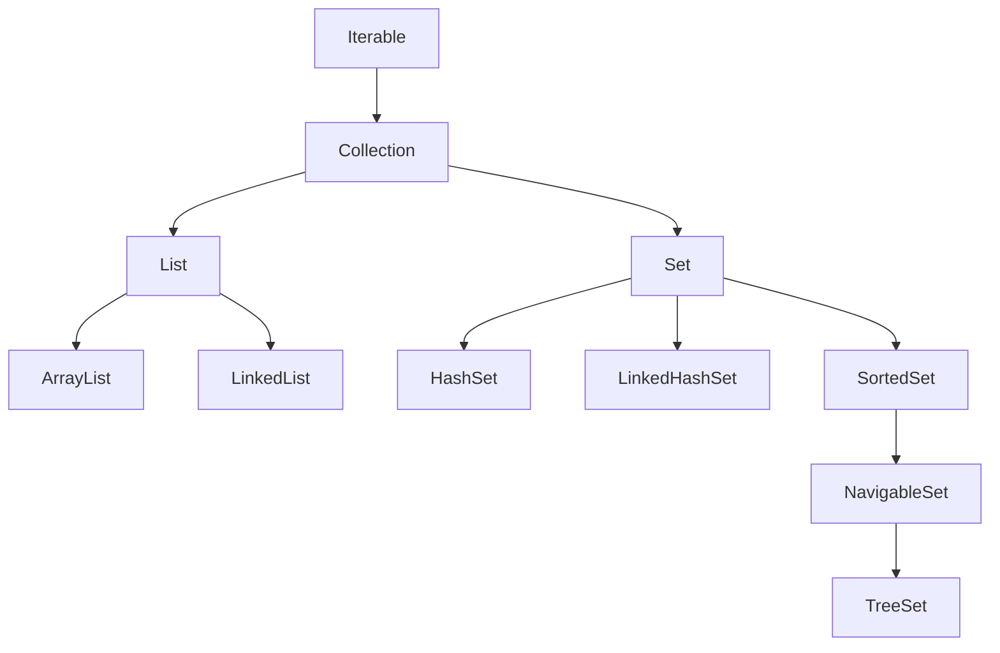

### Important distinction

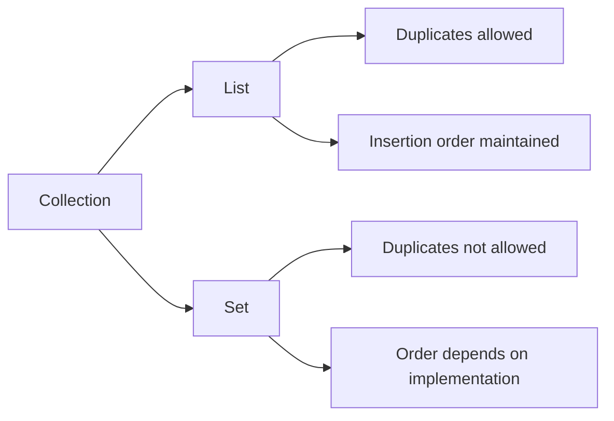

> **Memory trick:**  
> **List = sequence**  
> **Set = uniqueness**

---

# 2. List

A `List` is an **ordered collection**, also called a sequence.

### Key characteristics

- Maintains insertion order.
- Elements can be accessed using an integer **index**.
- Elements can be searched.
- Duplicate elements are typically allowed.

### Grocery-list analogy

If a grocery list contains:

```text
2 biscuits
4 chocolates
2 biscuits
```

the duplicate `biscuits` entries are allowed.

---

# 3. ArrayList

### Characteristics

1. `ArrayList` is resizable.
2. It maintains **insertion order**.
3. Heterogeneous objects are allowed when generics are not used.
4. Its underlying data structure is a **growable/dynamic array**.
5. Elements are stored in contiguous array storage, which gives fast indexed retrieval.

### Basic operations

```java
ArrayList al = new ArrayList();

al.add(10);              // 10 is stored as an Integer object
al.add(3, "20.3");       // adds at a specified index

System.out.println(al.get(2));     // retrieves element at index 2

System.out.println(al.remove(3));  // removes element at index 3

al.set(1, "modified");   // replaces element at index 1

al.indexOf('a');         // returns the index of the object
```

### `add()`

Adds an element to the end of the `ArrayList`.

```java
al.add(10);
```

### `add(index, element)`

Adds an element at a specified index.

```java
al.add(3, "20.3");
```

Compared with a normal array, inserting into the middle requires more work because elements may need to be shifted.

### `get(index)`

Retrieves the element at the specified index without modifying the list.

```java
System.out.println(al.get(2));
```

### `remove(index)`

Removes the element at the specified index.

```java
System.out.println(al.remove(3));
```

### `set(index, element)`

Replaces the element at a specified position.

```java
al.set(1, "modified");
```

### `indexOf()`

Returns the index of the specified object.

```java
al.indexOf('a');
```

### Copying an ArrayList

```java
ArrayList al2 = new ArrayList();

al2.addAll(al);

System.out.println(al2);
```

This is simpler than manually creating another array and copying elements using a loop.

### `length` vs `size()`

```text
Array
  ↓
length

Collection
  ↓
size()
```

Use:

```java
arr.length
```

for arrays, and:

```java
al.size()
```

for collections.

### Primitive types in collections

Collections store **objects**, not primitive data types.

```java
al.add(10);
```

The `10` is automatically converted from `int` to an `Integer` object through **autoboxing**.

### ArrayList: pros and cons

**Pros**
- Fast indexed retrieval.
- Continuous array-based storage.

**Cons**
- Adding/removing at the beginning or middle can require multiple shift operations.

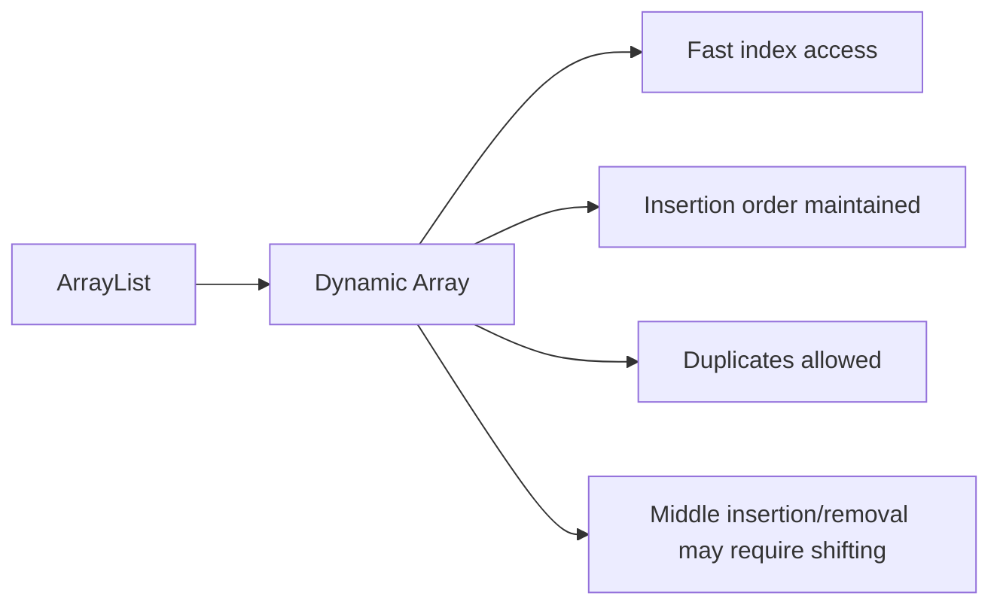

---

# 4. LinkedList

A `LinkedList` stores elements as linked nodes.

Conceptually:

```text
HEAD
  |
  v
[A | next] -> [B | next] -> [C | next] -> [D | next] -> NULL
```

### Mermaid diagram

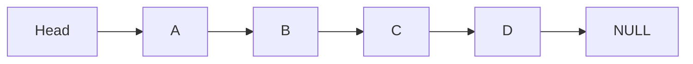

Each node can be visualized as:

```text
+------+-------+
| Data | Next  |
+------+-------+
```

### Pros

- Element insertion/deletion can be faster when the relevant node position is already known.

### Cons

- Element retrieval is not as fast as indexed access in an `ArrayList`.

### Methods

`LinkedList` supports the common `List` operations and also provides additional queue/deque-style methods.

For example:

```java
add()
offer()
```

`offer()` can add an element at the end in queue-style usage.

### ArrayList vs LinkedList

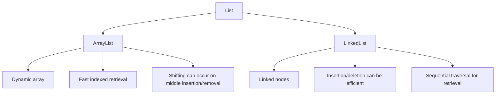

---

# 5. Comparing Strings in Collections

Strings cannot be compared using numeric operators such as:

```java
s1 > s2
```

Use:

```java
s1.compareTo(s2);
```

### `compareTo()`

It produces a result that is:

- **negative** when the first string comes before the second
- **0** when they are equal
- **positive** when the first string comes after the second

Example:

```java
String s1 = "Apple";
String s2 = "Banana";

int result = s1.compareTo(s2);
```

This comparison follows the strings' natural lexicographical ordering.

### Ordering

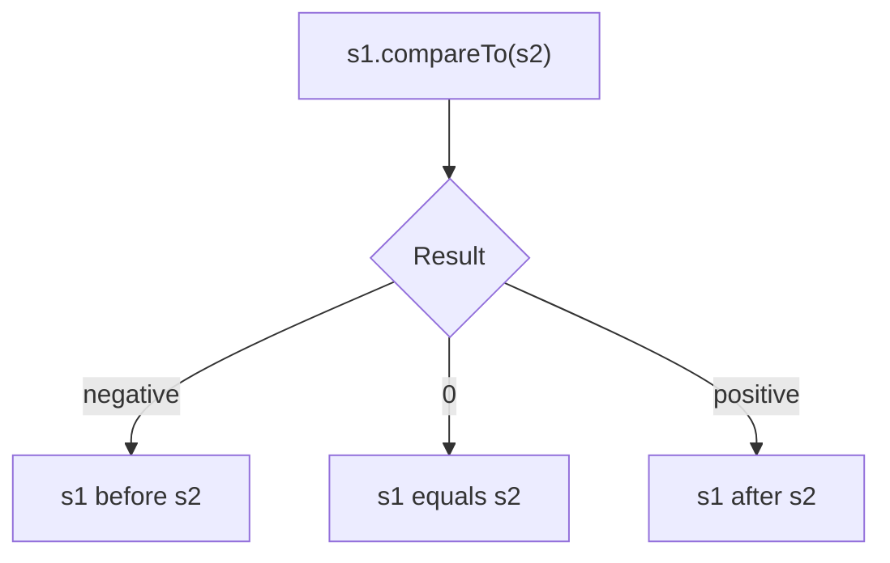

---

# 6. Collections Utility Class and Comparator

`Collections` is a **utility class** containing useful operations for collections.

Example:

```java
Collections.sort(list);
```

For custom sorting, use the `Comparator` interface.

### Comparator

`Comparator` allows us to define custom sorting logic.

Conceptually:

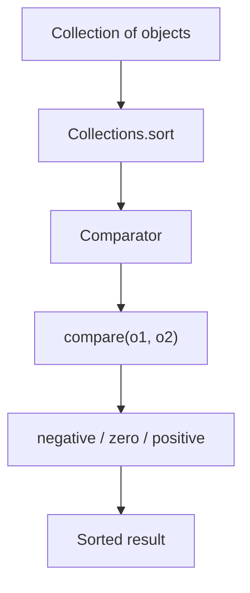

Example structure:

```java
class ComparatorDemo implements Comparator<Laptop> {

    @Override
    public int compare(Laptop l1, Laptop l2) {
        return l1.getName().compareTo(l2.getName());
    }
}
```

### Comparing object properties

If the objects contain strings:

```java
l1.getName().compareTo(l2.getName());
```

can be used to compare the names lexicographically.

### `toString()`

If an object is printed without an appropriate `toString()` implementation, the output may contain the object's class name and hash-related representation.

Override `toString()` when you want a readable representation.

---

# 7. Cursors in Collections

A **cursor** is useful for retrieving/processing objects one by one from a collection.

The notes cover:

1. `Enumeration`
2. `Iterator`
3. `ListIterator`
4. `Spliterator`

### Cursor overview

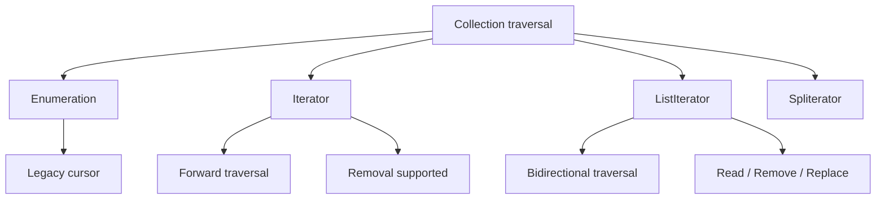

---

# 8. For-each vs Iterator vs ListIterator

## For-each loop

Limitations from the notes:

- Forward direction only.
- Cannot directly modify the collection's contents through the loop mechanism.

```java
for (Object obj : al) {
    System.out.println(obj);
}
```

## Iterator

Create an iterator:

```java
Iterator i = al.iterator();

while (i.hasNext()) {
    System.out.println(i.next());
}
```

### Important methods

```java
i.hasNext();
i.next();
i.remove();
```

`remove()` removes the last element returned by the iterator.

> Important: call `next()` before `remove()`, and `remove()` can be called only once for each returned element.

## ListIterator

`ListIterator` provides a bidirectional cursor.

From the notes:

- Forward traversal.
- Backward traversal.
- Read.
- Remove.
- Replace using `set()`.

### Comparison

| Feature | for-each | Iterator | ListIterator |
|---|---|---|---|
| Forward traversal | ✅ | ✅ | ✅ |
| Backward traversal | ❌ | ❌ | ✅ |
| Remove | ❌ | ✅ | ✅ |
| Replace with `set()` | ❌ | ❌ | ✅ |

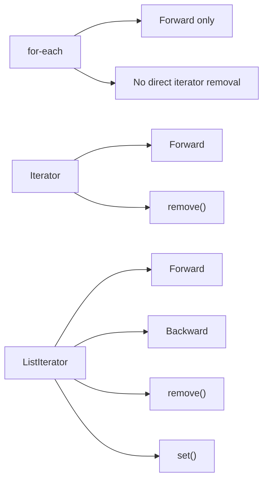

---

# 9. Set

A `Set` does **not allow duplicate elements**.

### Main characteristics from the notes

- No duplicates.
- Ordering depends on the implementation.
- `HashSet` and `LinkedHashSet` are common implementations.
- Hashing is used by hash-based sets to help identify duplicate elements.

### Set hierarchy

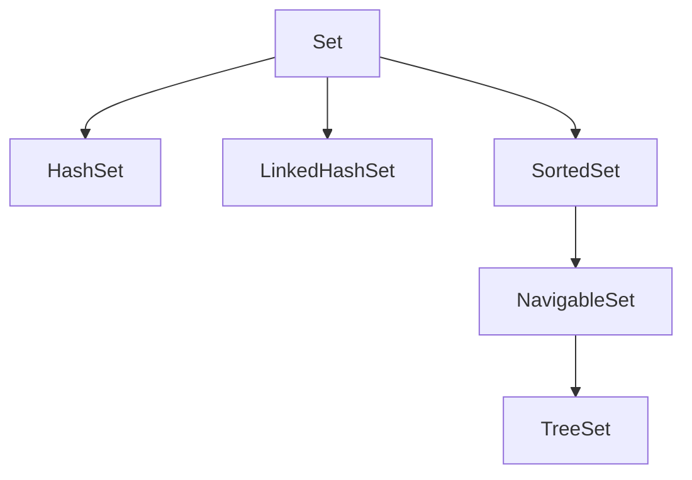

---

# 10. HashSet

### Characteristics

- No duplicate elements.
- Does not maintain insertion order.
- Uses a hash-table-based data structure.
- If an already-present value is added, it is not added again.
- `add()` returns `false` when the element was not added because it already exists.

Example concept:

```java
HashSet<Integer> set = new HashSet<>();

set.add(10);
set.add(20);
set.add(10);
```

The second `10` is not added.

### HashSet operations

The notes highlight constant-time behavior for operations such as:

- `add()`
- `contains()`
- `remove()`
- `size()`

These are based on hash-table behavior under normal conditions.

---

# 11. LinkedHashSet

`LinkedHashSet` combines hash-table behavior with linked-list ordering information.

### Characteristics

- No duplicates.
- Maintains insertion order.
- Uses a hash table + linked list.

| Collection | Data structure | Ordering |
|---|---|---|
| `HashSet` | Hash table | No insertion order |
| `LinkedHashSet` | Hash table + linked list | Insertion order |

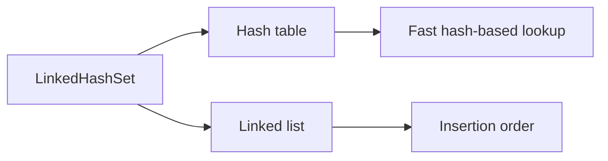

---

# 12. SortedSet and TreeSet

The notes describe the path:

```text
Set
  ↓
SortedSet
  ↓
NavigableSet
  ↓
TreeSet
```

### TreeSet

`TreeSet` maintains elements in sorted order.

The notes describe its underlying data structure as a **balanced tree**.

### Important points

- Maintains sorted order.
- Heterogeneous objects cannot generally be stored when they cannot be compared with one another.
- In such a case, a `ClassCastException` can occur.
- The notes also mention null-related behavior.

### SortedSet range operations

The notes mention:

```java
headSet(Object o);
tailSet(Object o);
```

These work with portions of the sorted set.

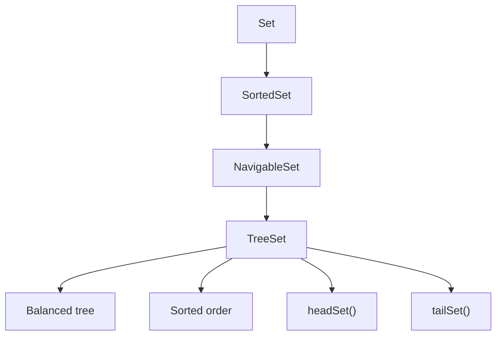

---

# 13. Set Comparison

| Type | Duplicates | Ordering | Data structure from notes |
|---|---|---|---|
| `HashSet` | ❌ | No insertion order | Hash table |
| `LinkedHashSet` | ❌ | Insertion order | Hash table + linked list |
| `TreeSet` | ❌ | Sorted order | Balanced tree |

### Quick memory rule

```text
HashSet
    ↓
Unique + no insertion order

LinkedHashSet
    ↓
Unique + insertion order

TreeSet
    ↓
Unique + sorted order
```

---

# 14. Map

`Map` is part of the Java Collections Framework, but it is **not a sub-interface of `Collection`**.

A map represents objects as:

```text
Key → Value
```

A key-value pair is called an **Entry**.

### Characteristics

- Keys must be unique.
- Values can contain duplicates.
- Ordering depends on the map implementation.

Example:

```text
Roll No. → Name

1 → Tony
2 → Tony
```

The values can be the same even though the keys are different.

### Map hierarchy

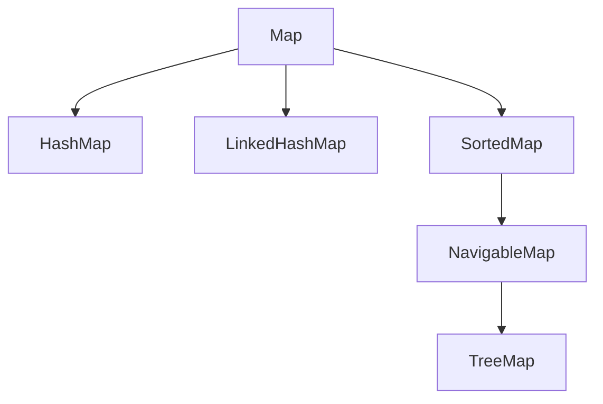

---

# 15. Map vs Collection

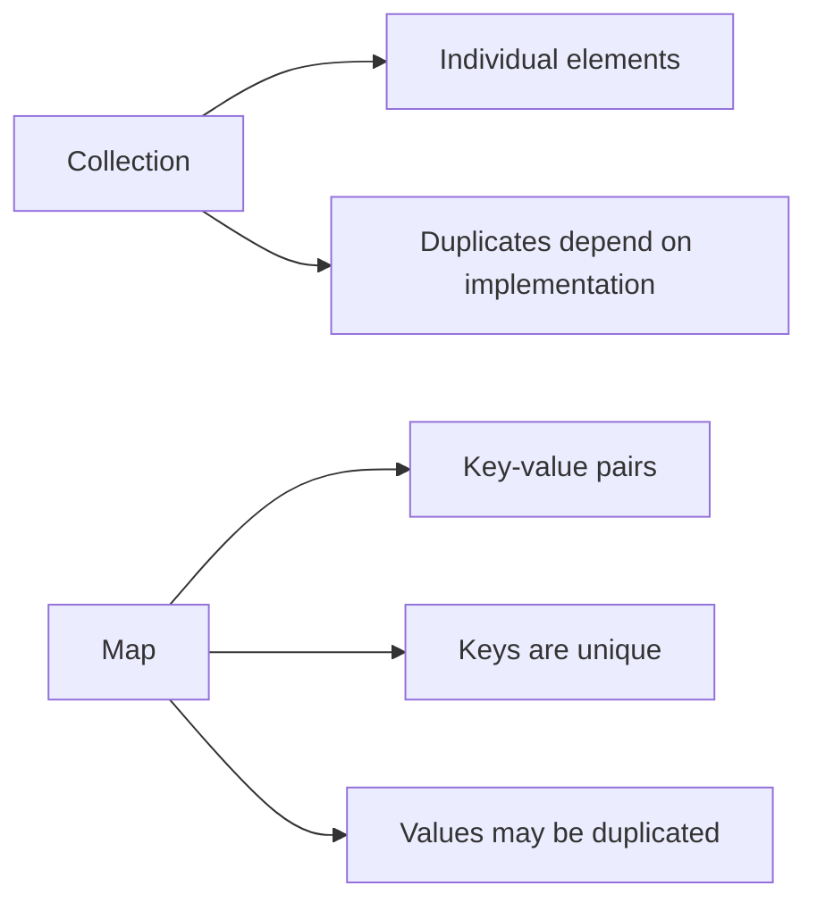

### Important note

A `Map.Entry` exists within the context of a `Map`.

```java
interface Map<K, V> {
    interface Entry<K, V> {
        // key-value pair
    }
}
```

So:

```text
Map
  ↓
Map.Entry
  ↓
Key + Value
```

---

# 16. Important Map Methods

```java
put(key, value);
putAll(map);
get(key);
remove(key);

containsKey(key);
containsValue(value);

size();
isEmpty();
clear();
```

### Example

```java
Map<String, Integer> map = new HashMap<>();

map.put("Chennai Express", 1120);
map.put("TBM Express", 2000);

System.out.println(map.get("Chennai Express"));
```

---

# 17. Collection Views of a Map

A `Map` provides three important collection views:

```java
Set<K> keySet();
Collection<V> values();
Set<Map.Entry<K,V>> entrySet();
```

### Why?

Because:

- Keys are unique → `Set`
- Values may contain duplicates → `Collection`
- Key-value mappings are unique entries → `Set`

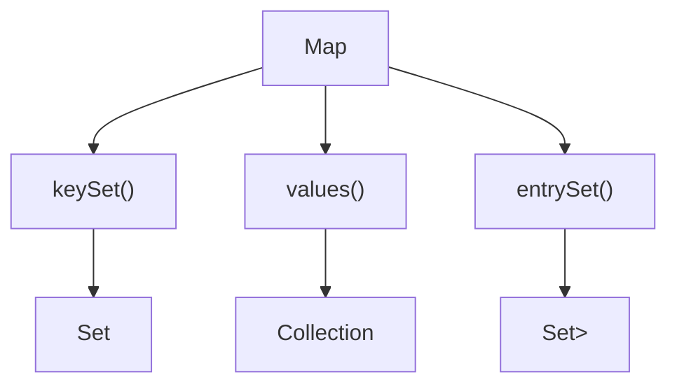

---

# 18. Map.Entry

`Entry` is a nested interface inside `Map`.

```java
Map.Entry<K,V>
```

An entry represents:

```text
Key + Value
```

### Entry methods

```java
getKey();
getValue();
```

### Example

```java
HashMap<String, Integer> hm = new HashMap<>();

hm.put("Mumbai Express", 2000);
hm.put("Yercaud Express", 2100);
hm.put("Chennai Express", 2100);
hm.put("TBM Express", 1800);

Set<Map.Entry<String, Integer>> entries = hm.entrySet();

for (Map.Entry<String, Integer> entry : entries) {
    System.out.println(entry.getKey());
    System.out.println(entry.getValue());
}
```

### Entry flow

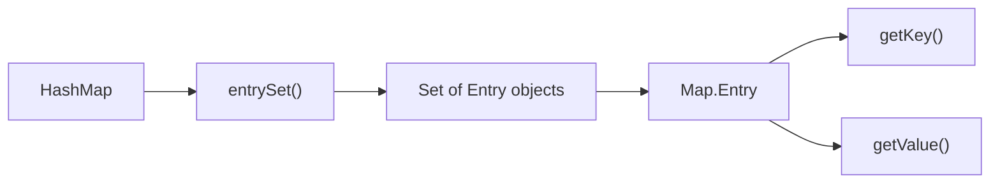

---

# 19. HashMap

### Characteristics

- Uses a hash-table-based data structure.
- Does not guarantee insertion order.
- Keys are unique.
- Values can be duplicated.

```text
HashMap
   ↓
Hash table
   ↓
Key → Value
```

---

# 20. LinkedHashMap

`LinkedHashMap` combines hash-table behavior with linked-list ordering.

### Characteristics

- Hash table + linked list.
- Maintains insertion order.

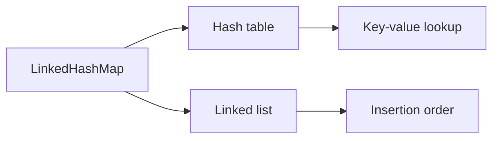

---

# 21. TreeMap

### Characteristics from the notes

- Uses a **Red-Black Tree**.
- Maintains keys in ascending sorted order.
- Sorting is based on **keys**, because keys are unique.
- Heterogeneous keys that cannot be compared can result in `ClassCastException`.
- Provides methods such as:
  - `firstKey()`
  - `firstEntry()`
  - `lastKey()`
  - `lastEntry()`

### TreeMap diagram

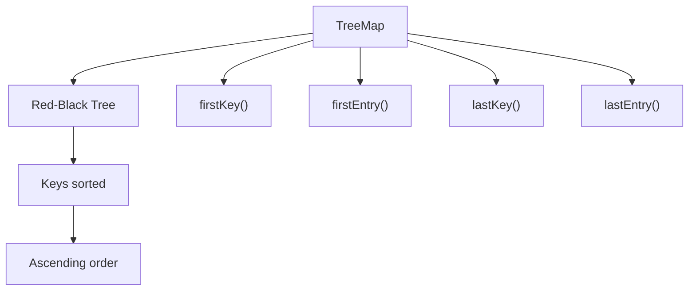

---

# 22. HashMap vs LinkedHashMap vs TreeMap

| Map | Data structure | Ordering |
|---|---|---|
| `HashMap` | Hash table | No guaranteed insertion order |
| `LinkedHashMap` | Hash table + linked list | Insertion order |
| `TreeMap` | Red-Black Tree | Sorted by keys |

### Memory trick

```text
HashMap
    → Hashing
    → No insertion order

LinkedHashMap
    → Hashing + Linked List
    → Insertion order

TreeMap
    → Tree
    → Sorted keys
```

---

# 23. Generics and Type Safety

The notes explain that collections without generics can lose compile-time type safety.

Example:

```java
TreeSet ts = new TreeSet();

ts.add(10);
ts.add("hello");
```

The problem may appear only when the program runs because the collection can contain different object types.

### Generics solve this

```java
TreeSet<Integer> ts = new TreeSet<Integer>();
```

Now the collection is intended to contain only `Integer` objects.

```java
ts.add(10);
// ts.add("hello");  // compile-time error
```

### Generic type flow

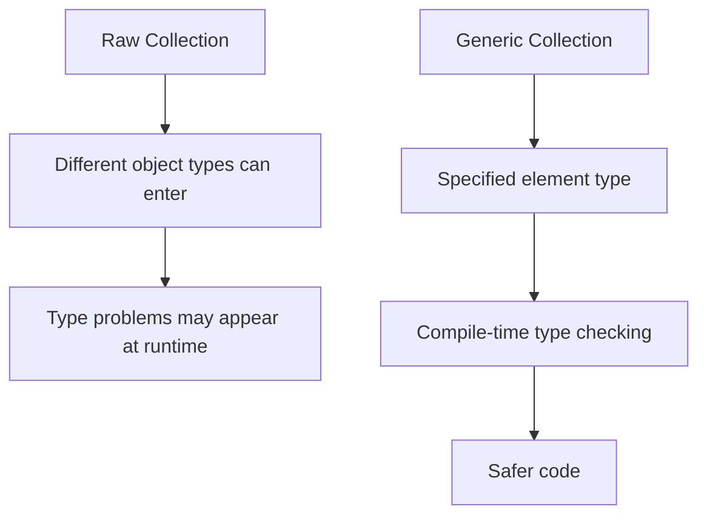

---

# 24. Generics with Map

A map normally uses two type parameters:

```java
Map<K, V>
```

where:

- `K` = key type
- `V` = value type

Example:

```java
Map<String, Integer> map = new HashMap<>();
```

This means:

```text
Key   → String
Value → Integer
```

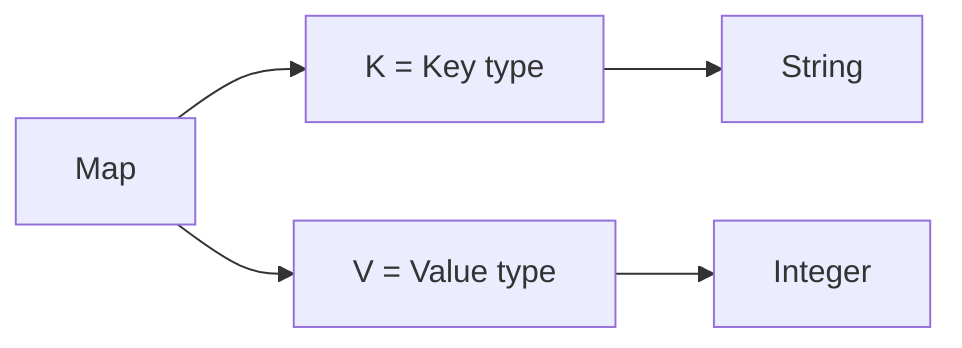

---

# 25. Complete Collections Framework Cheat Sheet

```mermaid
flowchart TD
    A["Java Collections Framework"]

    A --> B["Collection"]
    A --> C["Map"]

    B --> D["List"]
    B --> E["Set"]

    D --> F["ArrayList"]
    D --> G["LinkedList"]

    E --> H["HashSet"]
    E --> I["LinkedHashSet"]
    E --> J["SortedSet"]
    J --> K["NavigableSet"]
    K --> L["TreeSet"]

    C --> M["HashMap"]
    C --> N["LinkedHashMap"]
    C --> O["SortedMap"]
    O --> P["NavigableMap"]
    P --> Q["TreeMap"]
```

---

# 26. One-Page Decision Guide

```mermaid
flowchart TD
    A["Need to store data?"] --> B{"Key-value pairs?"}

    B -->|Yes| C["Use Map"]
    B -->|No| D{"Duplicates allowed?"}

    D -->|Yes| E["List"]
    D -->|No| F["Set"]

    E --> G{"Need fast index access?"}
    G -->|Yes| H["ArrayList"]
    G -->|No / frequent linked operations| I["LinkedList"]

    F --> J{"Need insertion order?"}
    J -->|Yes| K["LinkedHashSet"]
    J -->|No| L{"Need sorted order?"}
    L -->|Yes| M["TreeSet"]
    L -->|No| N["HashSet"]

    C --> O{"Need insertion order?"}
    O -->|Yes| P["LinkedHashMap"]
    O -->|No| Q{"Need sorted keys?"}
    Q -->|Yes| R["TreeMap"]
    Q -->|No| S["HashMap"]
```

---

# 27. Interview Quick Revision

## List

**Question:** What is a List?

**Answer:**  
A `List` is an ordered collection that allows indexed access and typically permits duplicate elements.

---

## ArrayList

**Remember:**

```text
Dynamic array
Fast indexed access
Insertion order
Duplicates allowed
Middle insertion/removal → shifting
```

---

## LinkedList

**Remember:**

```text
Linked nodes
Insertion/deletion can be efficient
Indexed retrieval is slower
Supports List + queue/deque-style operations
```

---

## Set

**Remember:**

```text
No duplicates
Ordering depends on implementation
```

---

## HashSet

```text
Unique
No insertion-order guarantee
Hash table
```

---

## LinkedHashSet

```text
Unique
Insertion order
Hash table + linked list
```

---

## TreeSet

```text
Unique
Sorted
Balanced tree
```

---

## Map

```text
Key → Value
Keys unique
Values can duplicate
Not a sub-interface of Collection
```

---

## HashMap

```text
Hash table
No insertion-order guarantee
```

---

## LinkedHashMap

```text
Hash table + linked list
Insertion order
```

---

## TreeMap

```text
Red-Black Tree
Keys sorted
firstKey()
lastKey()
firstEntry()
lastEntry()
```

---

# 28. High-Value Interview Comparisons

### ArrayList vs LinkedList

| ArrayList | LinkedList |
|---|---|
| Dynamic array | Linked nodes |
| Fast indexed retrieval | Sequential traversal for retrieval |
| Insert/remove in middle may require shifting | Insert/remove can be efficient when node position is known |
| Good for frequent reads/index access | Useful when linked-list operations are needed |

### HashSet vs LinkedHashSet vs TreeSet

| HashSet | LinkedHashSet | TreeSet |
|---|---|---|
| No duplicates | No duplicates | No duplicates |
| No insertion-order guarantee | Insertion order | Sorted order |
| Hash table | Hash table + linked list | Balanced tree |

### HashMap vs LinkedHashMap vs TreeMap

| HashMap | LinkedHashMap | TreeMap |
|---|---|---|
| Hash table | Hash table + linked list | Red-Black Tree |
| No insertion-order guarantee | Insertion order | Sorted keys |
| Key-value storage | Key-value storage | Key-value storage |

### Iterator vs ListIterator

| Iterator | ListIterator |
|---|---|
| Forward | Forward + backward |
| `remove()` | `remove()` |
| No `set()` | `set()` |
| General collection traversal | List-specific traversal |

---

# 29. Core Mental Model

When facing a collections interview question, first ask:

```text
                    ┌─────────────────┐
                    │ What am I storing? │
                    └────────┬────────┘
                             │
              ┌──────────────┴──────────────┐
              │                             │
       Individual elements             Key + Value
              │                             │
           Collection                      Map
              │
       ┌──────┴──────┐
       │             │
   Duplicates?    No duplicates?
       │             │
      List           Set
       │             │
   ┌───┴───┐     ┌───┴─────────────┐
   │       │     │        │         │
ArrayList LinkedList HashSet LinkedHashSet TreeSet
```

This decision tree is the most useful part to remember before diving into implementation details.

---

## Source note

This document reorganizes the supplied **Collections Framework** notes into a cleaner study format and preserves the original topics: `List`, `ArrayList`, `LinkedList`, string comparison, `Comparator`, cursors, `Set`, `HashSet`, `LinkedHashSet`, `TreeSet`, `Map`, `Map.Entry`, `HashMap`, `LinkedHashMap`, `TreeMap`, and generics.

The original notes also contain visual diagrams on pages 1, 3, and 5 that were converted into cleaner Mermaid diagrams here.
