# Java Streams API - Complete Guide

## Table of Contents
1. [Why Do We Need Streams?](#why-do-we-need-streams)
2. [What is a Stream?](#what-is-a-stream)
3. [Stream vs Collection](#stream-vs-collection)
4. [How to Create Streams](#how-to-create-streams)
5. [Stream Pipeline Architecture](#stream-pipeline-architecture)
6. [Intermediate Operations](#intermediate-operations)
7. [Terminal Operations](#terminal-operations)
8. [Collectors In-Depth](#collectors-in-depth)
9. [flatMap — Deep Dive](#flatmap--deep-dive)
10. [reduce() — Deep Dive](#reduce--deep-dive)
11. [Primitive Streams](#primitive-streams)
12. [Optional with Streams](#optional-with-streams)
13. [Lazy Evaluation & Short-Circuiting](#lazy-evaluation--short-circuiting)
14. [Parallel Streams](#parallel-streams)
15. [Stream Ordering & Encounter Order](#stream-ordering--encounter-order)
16. [Infinite Streams](#infinite-streams)
17. [Common Stream Patterns & Recipes](#common-stream-patterns--recipes)
18. [Common Mistakes & Pitfalls](#common-mistakes--pitfalls)
19. [Stream API Cheat Sheet](#stream-api-cheat-sheet)

---

## Why Do We Need Streams?

Before Java 8, if you wanted to process a list of data — say, filter students who scored above 80 and get their names — you'd write something like this:

```java
// ❌ The OLD way — Imperative (telling Java HOW to do it, step by step)
List<String> topStudents = new ArrayList<>();
for (Student s : students) {
    if (s.getScore() > 80) {
        topStudents.add(s.getName());
    }
}
Collections.sort(topStudents);
```

**What's wrong with this?**
- You're managing the **loop** yourself
- You're managing a **temporary list** yourself
- You're telling Java **HOW** to do the work (imperative style)
- Code is **verbose** and hard to read for complex operations
- **Not easy to parallelize** — what if you have 10 million students?

Now look at the **Streams way**:

```java
// ✅ The NEW way — Declarative (telling Java WHAT you want)
List<String> topStudents = students.stream()
    .filter(s -> s.getScore() > 80)
    .map(Student::getName)
    .sorted()
    .collect(Collectors.toList());
```

**Think of it like this:**
- **Imperative (old way)** = You go to a restaurant kitchen and cook the food yourself, step by step.
- **Declarative (streams)** = You sit at the table and tell the waiter: "I want a vegetarian dish, sorted by spice level." The kitchen figures out HOW.

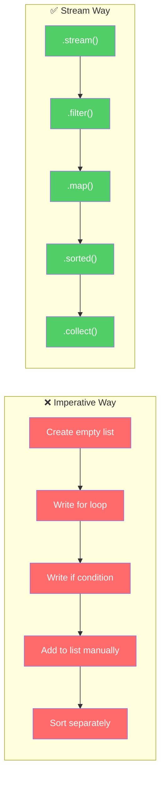

---

## What is a Stream?

A **Stream** is a **sequence of elements** that supports **sequential and parallel aggregate operations**. But here's the important part — **a Stream is NOT a data structure**. It doesn't store data. It's like a **conveyor belt** in a factory.

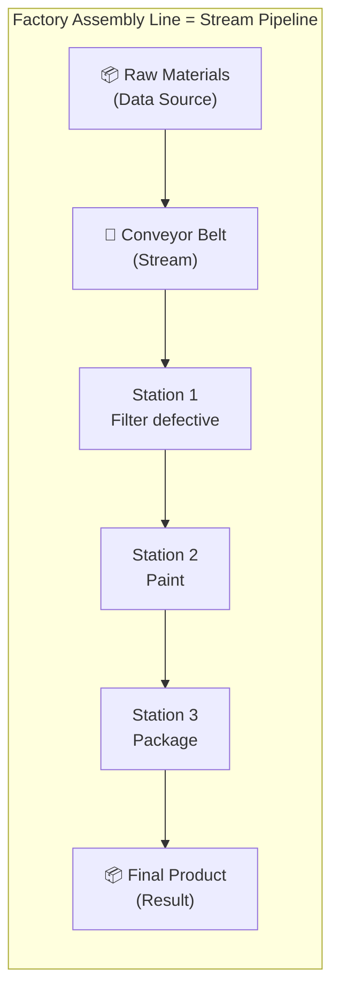

**Key Characteristics:**

| Feature | Explanation |
|---------|-------------|
| **Not a data structure** | Doesn't store elements. Takes input from a source (Collection, Array, I/O) |
| **Doesn't modify the source** | `stream().filter(...)` does NOT remove elements from the original list |
| **Lazy** | Operations are not executed until a terminal operation is called |
| **Possibly unbounded** | Streams can be infinite (e.g., `Stream.generate(() -> Math.random())`) |
| **Consumable** | A stream can be traversed **only once**. After that, it's gone — like a one-time conveyor belt |

```java
// A stream does NOT modify the source
List<Integer> numbers = Arrays.asList(1, 2, 3, 4, 5);
numbers.stream().filter(n -> n > 3); // Does NOT remove 1, 2, 3 from 'numbers'!

// A stream can only be used ONCE
Stream<Integer> stream = numbers.stream();
stream.forEach(System.out::println); // OK
stream.forEach(System.out::println); // ❌ IllegalStateException: stream has already been operated upon
```

**Think of it like this:**
- A **Collection** is like a **warehouse** — it stores items, you can go back and check them anytime.
- A **Stream** is like a **river** — water (data) flows through once. You can't step into the same river twice.

---

## Stream vs Collection

This is a question students always ask: *"If I already have Collections, why do I need Streams?"*

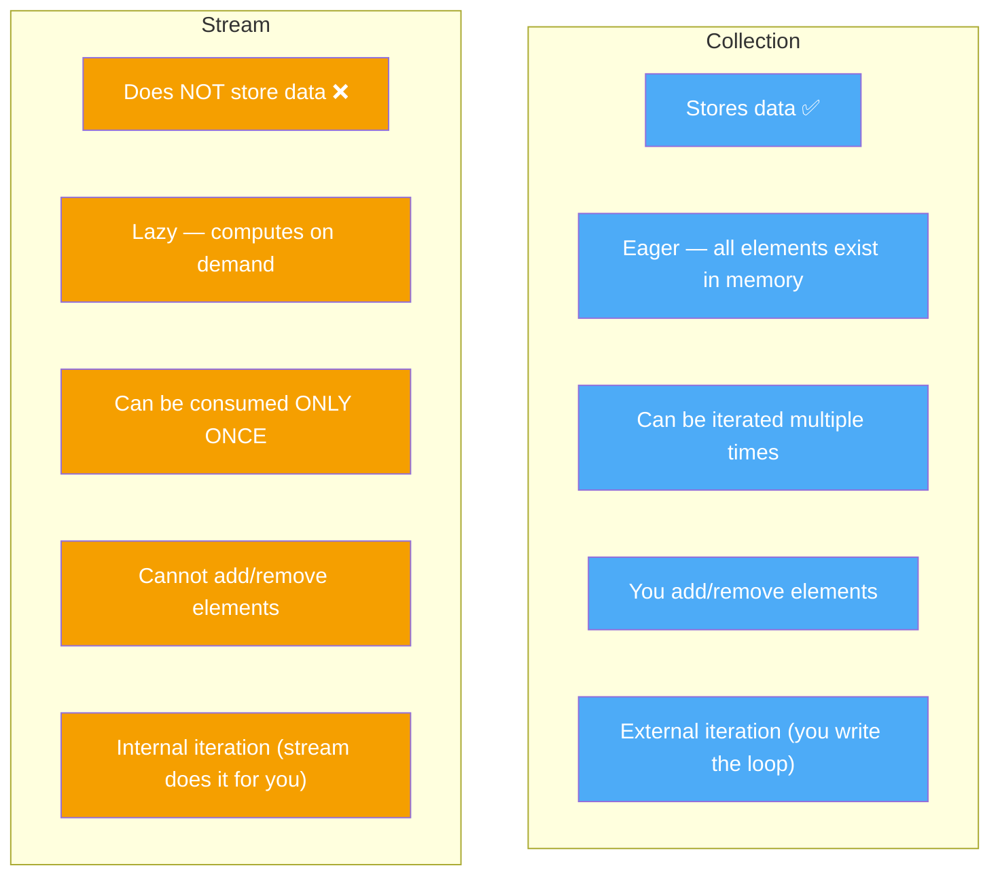

### External vs Internal Iteration

**Why does this matter?** With external iteration (Collection), YOU control the loop. With internal iteration (Stream), the LIBRARY controls the loop — which means it can optimize, parallelize, and short-circuit automatically.

```java
// External Iteration (Collection) — YOU control
for (String name : names) {
    if (name.startsWith("A")) {
        System.out.println(name);
    }
}

// Internal Iteration (Stream) — STREAM controls
names.stream()
    .filter(name -> name.startsWith("A"))
    .forEach(System.out::println);
```

**Think of it like this:**
- **External iteration** = You manually flipping pages of a book to find a chapter.
- **Internal iteration** = You tell Alexa: "Read me Chapter 5." She figures out how to get there.

---

## How to Create Streams

There are **many ways** to create a Stream. Here's every way you'll ever need:

### 1. From a Collection (Most Common)

```java
List<String> names = Arrays.asList("Alice", "Bob", "Charlie");
Stream<String> stream = names.stream();          // Sequential stream
Stream<String> parallelStream = names.parallelStream(); // Parallel stream
```

### 2. From an Array

```java
String[] arr = {"Apple", "Banana", "Cherry"};
Stream<String> stream = Arrays.stream(arr);
Stream<String> partial = Arrays.stream(arr, 0, 2); // "Apple", "Banana" only
```

### 3. Using Stream.of()

```java
Stream<String> stream = Stream.of("X", "Y", "Z");
Stream<Integer> single = Stream.of(42);
```

### 4. Using Stream.empty()

```java
// Why? To avoid returning null when a method should return a stream
Stream<String> empty = Stream.empty(); // 0 elements, no NullPointerException!
```

### 5. Using Stream.builder()

```java
Stream<String> stream = Stream.<String>builder()
    .add("one")
    .add("two")
    .add("three")
    .build();
```

### 6. Using Stream.generate() — Infinite Stream

```java
// Generates infinite random numbers — MUST use limit()!
Stream<Double> randoms = Stream.generate(Math::random).limit(5);

// Generates infinite "Hello" strings
Stream<String> hellos = Stream.generate(() -> "Hello").limit(3);
```

### 7. Using Stream.iterate() — Infinite Sequence

```java
// Java 8: iterate(seed, unaryOperator)
Stream<Integer> evens = Stream.iterate(0, n -> n + 2).limit(10); // 0, 2, 4, 6, ...

// Java 9+: iterate(seed, predicate, unaryOperator) — with a stop condition!
Stream<Integer> evens9 = Stream.iterate(0, n -> n < 20, n -> n + 2); // 0, 2, 4, ..., 18
```

### 8. Primitive Streams — IntStream, LongStream, DoubleStream

```java
IntStream ints = IntStream.range(1, 5);        // 1, 2, 3, 4 (exclusive end)
IntStream ints2 = IntStream.rangeClosed(1, 5); // 1, 2, 3, 4, 5 (inclusive end)
IntStream chars = "Hello".chars();              // Stream of char (int) values
```

### 9. From a File (Java NIO)

```java
// Each line of the file becomes a stream element
Stream<String> lines = Files.lines(Paths.get("data.txt")); // Remember to close!

// Better: use try-with-resources
try (Stream<String> lines = Files.lines(Paths.get("data.txt"))) {
    lines.filter(line -> line.contains("error"))
         .forEach(System.out::println);
}
```

### 10. From a String

```java
// Split a string into a stream
Stream<String> words = Pattern.compile(" ").splitAsStream("Hello World Java");
// "Hello", "World", "Java"
```

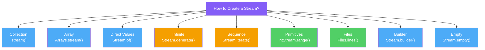

---

## Stream Pipeline Architecture

Every stream operation follows a **3-stage pipeline**. Understanding this is the KEY to mastering streams.

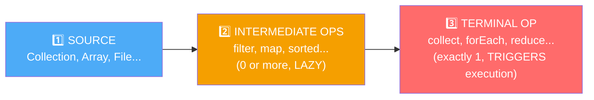

### The 3 Stages Explained

| Stage | What it does | Returns | Example |
|-------|-------------|---------|---------|
| **Source** | Provides the data | Stream | `list.stream()` |
| **Intermediate** | Transforms the stream (lazy!) | Stream | `.filter()`, `.map()`, `.sorted()` |
| **Terminal** | Triggers execution and produces a result | Non-stream (List, int, void, etc.) | `.collect()`, `.count()`, `.forEach()` |

**The most important rule:** **Nothing happens until you call a terminal operation!** Intermediate operations are 100% lazy.

```java
// ⚠️ This does NOTHING — no terminal operation!
List<String> names = Arrays.asList("Alice", "Bob", "Charlie");
names.stream()
    .filter(name -> {
        System.out.println("Filtering: " + name); // This NEVER prints!
        return name.length() > 3;
    })
    .map(String::toUpperCase);
// No output! No terminal operation = no execution!

// ✅ Add a terminal operation — NOW it runs
names.stream()
    .filter(name -> {
        System.out.println("Filtering: " + name); // NOW this prints
        return name.length() > 3;
    })
    .map(String::toUpperCase)
    .collect(Collectors.toList()); // Terminal operation triggers everything
```

**Think of it like this:**
- **Source** = Loading ingredients on the conveyor belt.
- **Intermediate operations** = Setting up stations (filter station, paint station). The stations are built but **idle**.
- **Terminal operation** = Pressing the **START button**. Only now does everything begin moving.

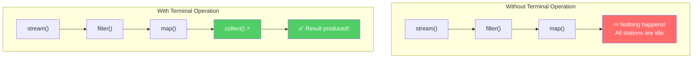

### Method Chaining — How It Works

Every intermediate operation returns a **new Stream**, which is why you can chain them:

```java
students.stream()        // Returns Stream<Student>
    .filter(s -> s.getAge() > 18)   // Returns Stream<Student> (filtered)
    .map(Student::getName)           // Returns Stream<String> (transformed)
    .sorted()                        // Returns Stream<String> (sorted)
    .collect(Collectors.toList());   // Returns List<String> (final result)
```


---

## Intermediate Operations

Intermediate operations **transform a stream into another stream**. They are **always lazy** — they don't execute until a terminal operation is called. You can chain as many as you want.

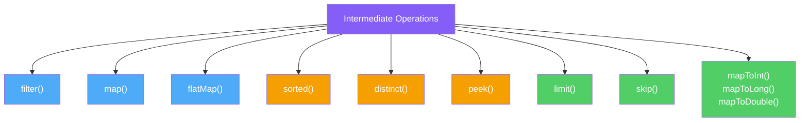

### 1. filter(Predicate) — Keep Only What You Want

**Why do we need it?** Without `filter()`, you'd need an `if` statement inside a `for` loop every time you want to select specific elements.

```java
// ❌ Without filter — manual if inside loop
List<Integer> result = new ArrayList<>();
for (int n : numbers) {
    if (n % 2 == 0) {
        result.add(n);
    }
}

// ✅ With filter — clean and readable
List<Integer> result = numbers.stream()
    .filter(n -> n % 2 == 0)
    .collect(Collectors.toList());
```

**How it works:** Takes a `Predicate<T>` (a function that returns true/false). Keeps elements where the predicate returns `true`, discards the rest.

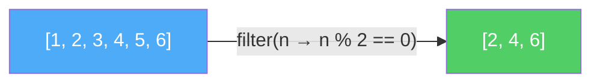

```java
// Filter students who passed
List<Student> passed = students.stream()
    .filter(s -> s.getScore() >= 40)
    .collect(Collectors.toList());

// Filter strings that are not empty
List<String> nonEmpty = names.stream()
    .filter(name -> !name.isEmpty())
    .collect(Collectors.toList());

// Chain multiple filters (AND logic)
List<Student> topYoung = students.stream()
    .filter(s -> s.getScore() > 90)
    .filter(s -> s.getAge() < 20)
    .collect(Collectors.toList());
```

**Think of it like this:** A **coffee filter** lets liquid through but catches the grounds. `filter()` lets matching elements through and catches (discards) the rest.

---

### 2. map(Function) — Transform Each Element

**Why do we need it?** When you want to **convert** every element from one form to another — like extracting names from a list of Student objects.

```java
// ❌ Without map — manual transformation
List<String> names = new ArrayList<>();
for (Student s : students) {
    names.add(s.getName());
}

// ✅ With map — one line
List<String> names = students.stream()
    .map(Student::getName)
    .collect(Collectors.toList());
```

**How it works:** Takes a `Function<T, R>` — maps every element of type T to type R.

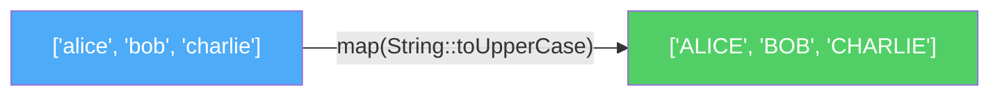

```java
// Convert strings to their lengths
List<Integer> lengths = names.stream()
    .map(String::length)
    .collect(Collectors.toList());
// ["Alice", "Bob"] → [5, 3]

// Square every number
List<Integer> squares = numbers.stream()
    .map(n -> n * n)
    .collect(Collectors.toList());
// [1, 2, 3] → [1, 4, 9]

// Extract and transform
List<String> emails = employees.stream()
    .map(Employee::getEmail)
    .map(String::toLowerCase)
    .collect(Collectors.toList());
```

**Think of it like this:** A **translator** at a conference. Every sentence (element) that goes in comes out in a different language (type). The number of sentences stays the same — only the content changes.

---

### 3. flatMap(Function) — Flatten Nested Structures

**Why do we need it?** When you have a **list of lists** (or stream of streams) and want to merge them into a single flat stream. `map()` alone can't do this — it would give you a `Stream<List<String>>` when you want `Stream<String>`.

```java
// Problem: We have a list of sentences, and want all words
List<String> sentences = Arrays.asList("Hello World", "Java Streams");

// ❌ map gives us Stream<String[]> — WRONG! We wanted Stream<String>
sentences.stream()
    .map(s -> s.split(" "))  // Stream<String[]> — array inside stream!
    .collect(Collectors.toList()); // [[Hello, World], [Java, Streams]]

// ✅ flatMap flattens it into Stream<String>
List<String> words = sentences.stream()
    .flatMap(s -> Arrays.stream(s.split(" ")))  // Stream<String> — flat!
    .collect(Collectors.toList()); // [Hello, World, Java, Streams]
```

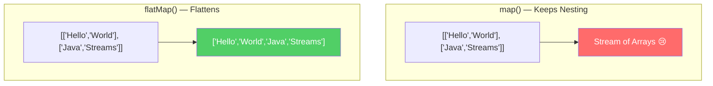

```java
// Real-world: Get all orders from all customers
List<Order> allOrders = customers.stream()
    .flatMap(customer -> customer.getOrders().stream())
    .collect(Collectors.toList());

// Flatten list of lists
List<List<Integer>> nested = Arrays.asList(
    Arrays.asList(1, 2, 3),
    Arrays.asList(4, 5),
    Arrays.asList(6, 7, 8, 9)
);
List<Integer> flat = nested.stream()
    .flatMap(Collection::stream)
    .collect(Collectors.toList()); // [1, 2, 3, 4, 5, 6, 7, 8, 9]
```

**Think of it like this:** You have **3 boxes**, each containing smaller items. `map()` gives you 3 boxes. `flatMap()` **opens all the boxes** and dumps everything into one pile.

---

### 4. sorted() — Sort Elements

**Why do we need it?** To put stream elements in order — natural order or custom order.

```java
// Natural order (alphabetical for Strings, ascending for numbers)
List<String> sorted = names.stream()
    .sorted()
    .collect(Collectors.toList());
// ["Charlie", "Alice", "Bob"] → ["Alice", "Bob", "Charlie"]

// Custom order using Comparator
List<String> sortedByLength = names.stream()
    .sorted(Comparator.comparingInt(String::length))
    .collect(Collectors.toList());
// Sorted by string length

// Reverse order
List<Integer> descending = numbers.stream()
    .sorted(Comparator.reverseOrder())
    .collect(Collectors.toList());
// [5, 4, 3, 2, 1]

// Sort objects by a property
List<Student> byScore = students.stream()
    .sorted(Comparator.comparingInt(Student::getScore).reversed())
    .collect(Collectors.toList());
// Highest score first
```

> **⚠️ Note:** `sorted()` is a **stateful intermediate operation** — it needs to see ALL elements before it can sort. This means it breaks the lazy, one-at-a-time processing for this step.

---

### 5. distinct() — Remove Duplicates

**Why do we need it?** When your data has duplicates and you want unique elements only. Without this, you'd need a `Set` or manual checking.

```java
// Remove duplicate numbers
List<Integer> unique = Arrays.asList(1, 2, 2, 3, 3, 3, 4).stream()
    .distinct()
    .collect(Collectors.toList());
// [1, 2, 3, 4]

// Remove duplicate names (case-sensitive!)
List<String> uniqueNames = Arrays.asList("Alice", "Bob", "Alice", "Charlie", "Bob").stream()
    .distinct()
    .collect(Collectors.toList());
// ["Alice", "Bob", "Charlie"]
```

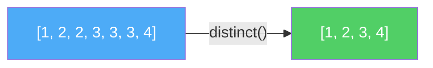

> **How does it know duplicates?** It uses `.equals()` and `.hashCode()`. For custom objects, make sure you override these methods!

---

### 6. peek(Consumer) — Spy on the Stream (for Debugging)

**Why do we need it?** Sometimes you want to **see what's happening** in the middle of a pipeline without changing anything. `peek()` lets you "peek" at each element as it passes through.

```java
// Debug: see what filter passes through
List<String> result = names.stream()
    .filter(name -> name.length() > 3)
    .peek(name -> System.out.println("After filter: " + name))
    .map(String::toUpperCase)
    .peek(name -> System.out.println("After map: " + name))
    .collect(Collectors.toList());

// Output:
// After filter: Alice
// After map: ALICE
// After filter: Charlie
// After map: CHARLIE
```

> **⚠️ Warning:** `peek()` is designed for **debugging only**. Don't use it to modify elements or cause side effects in production code. The JVM may optimize it away in some cases.

**Think of it like this:** A **security camera** in a factory. It watches items pass on the conveyor belt but doesn't touch them. Useful for monitoring, not for changing things.

---

### 7. limit(n) — Take Only the First N Elements

**Why do we need it?** When you only want the first few results — like "Top 5 scores" or when dealing with infinite streams.

```java
// Get first 3 elements
List<Integer> firstThree = numbers.stream()
    .limit(3)
    .collect(Collectors.toList());
// [1, 2, 3, 4, 5, 6, 7] → [1, 2, 3]

// CRITICAL for infinite streams!
List<Double> fiveRandoms = Stream.generate(Math::random)
    .limit(5) // Without this, it would run FOREVER!
    .collect(Collectors.toList());

// Top 3 students by score
List<Student> top3 = students.stream()
    .sorted(Comparator.comparingInt(Student::getScore).reversed())
    .limit(3)
    .collect(Collectors.toList());
```

> **Note:** `limit()` is a **short-circuiting** operation — once it gets N elements, it stops processing. The remaining elements are never touched.

---

### 8. skip(n) — Skip the First N Elements

**Why do we need it?** For **pagination** or when you want to ignore the first few results.

```java
// Skip first 2 elements
List<Integer> afterTwo = numbers.stream()
    .skip(2)
    .collect(Collectors.toList());
// [1, 2, 3, 4, 5] → [3, 4, 5]

// Pagination: Page 2 with page size 10
List<Student> page2 = students.stream()
    .skip(10)    // Skip page 1 (first 10)
    .limit(10)   // Take page 2 (next 10)
    .collect(Collectors.toList());
```

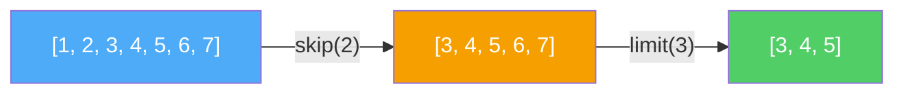

---

### 9. mapToInt(), mapToLong(), mapToDouble() — Convert to Primitive Streams

**Why do we need it?** To avoid **autoboxing overhead**. When you map to `int`, `long`, or `double`, use these instead of `map()` to get a primitive stream with special methods like `sum()`, `average()`.

```java
// ❌ Using map() — autoboxing Integer objects (slow for large data)
int total = numbers.stream()
    .map(n -> n * 2)        // Stream<Integer> — boxing!
    .reduce(0, Integer::sum);

// ✅ Using mapToInt() — no boxing, direct primitive operations
int total = numbers.stream()
    .mapToInt(n -> n * 2)   // IntStream — no boxing!
    .sum();                  // Special method on IntStream

// Get average score of students
OptionalDouble avg = students.stream()
    .mapToInt(Student::getScore)
    .average();
```

---

## Terminal Operations

Terminal operations **trigger the execution** of the entire pipeline and **produce a result** (or a side effect). After a terminal operation, the stream is **consumed and cannot be reused**.

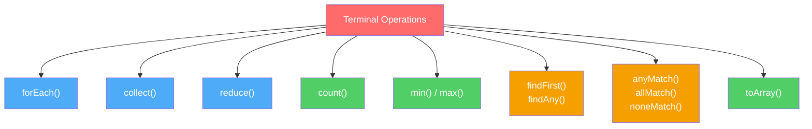

### 1. forEach(Consumer) — Do Something with Each Element

**Why do we need it?** To perform an **action** on every element — like printing, logging, or sending an email.

```java
// Print all names
names.stream().forEach(System.out::println);

// Shorter: directly on collection (Java 8+)
names.forEach(System.out::println);

// Send email to each user
users.stream()
    .filter(User::isActive)
    .forEach(user -> emailService.send(user.getEmail(), "Hello!"));
```

> **⚠️ Important:** `forEach()` returns `void`. You can't chain anything after it. Also, `forEach()` with `parallelStream()` does NOT guarantee order. Use `forEachOrdered()` if order matters.

---

### 2. collect(Collector) — Gather Results into a Collection

**Why do we need it?** This is the **most used terminal operation**. It gathers stream elements into a `List`, `Set`, `Map`, `String`, or any custom container. We'll cover this in detail in the [Collectors section](#collectors-in-depth).

```java
// Collect into a List
List<String> list = names.stream()
    .filter(n -> n.length() > 3)
    .collect(Collectors.toList());

// Collect into a Set (removes duplicates)
Set<String> set = names.stream()
    .collect(Collectors.toSet());

// Collect into a Map
Map<String, Integer> nameToLength = names.stream()
    .collect(Collectors.toMap(
        name -> name,          // key
        String::length         // value
    ));

// Join into a single String
String joined = names.stream()
    .collect(Collectors.joining(", ")); // "Alice, Bob, Charlie"

// Java 16+: toList() shorthand
List<String> list = names.stream()
    .filter(n -> n.length() > 3)
    .toList(); // Returns unmodifiable list
```

---

### 3. reduce() — Combine All Elements into One

**Why do we need it?** When you want to **combine** all elements into a single result — sum, product, concatenation, finding max, etc. We'll cover this in detail in the [reduce section](#reduce--deep-dive).

```java
// Sum all numbers
int sum = numbers.stream()
    .reduce(0, Integer::sum);
// 0 + 1 + 2 + 3 + 4 + 5 = 15

// Find maximum
Optional<Integer> max = numbers.stream()
    .reduce(Integer::max);

// Concatenate all strings
String combined = words.stream()
    .reduce("", (a, b) -> a + " " + b);
```

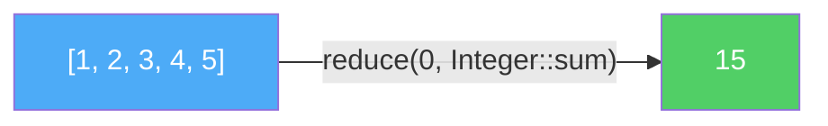

---

### 4. count() — Count Elements

```java
// Count how many students passed
long passedCount = students.stream()
    .filter(s -> s.getScore() >= 40)
    .count();

// Count distinct elements
long uniqueCount = numbers.stream()
    .distinct()
    .count();
```

> **Note:** `count()` returns `long`, not `int`.

---

### 5. min() and max() — Find Minimum/Maximum

**Why do we need it?** To find the smallest or largest element based on a `Comparator`. Returns an `Optional` because the stream might be empty.

```java
// Find the shortest name
Optional<String> shortest = names.stream()
    .min(Comparator.comparingInt(String::length));
shortest.ifPresent(s -> System.out.println("Shortest: " + s));

// Find the student with highest score
Optional<Student> topper = students.stream()
    .max(Comparator.comparingInt(Student::getScore));

// Find min and max numbers
Optional<Integer> min = numbers.stream().min(Comparator.naturalOrder());
Optional<Integer> max = numbers.stream().max(Comparator.naturalOrder());
```

---

### 6. findFirst() and findAny() — Find an Element

**Why two methods?** `findFirst()` always returns the **first** element (respects encounter order). `findAny()` can return **any** element — faster in parallel streams because it doesn't need to synchronize order.

```java
// Find first name starting with 'A'
Optional<String> first = names.stream()
    .filter(name -> name.startsWith("A"))
    .findFirst();
// Always "Alice" (if present)

// Find any name starting with 'A' (may differ in parallel)
Optional<String> any = names.parallelStream()
    .filter(name -> name.startsWith("A"))
    .findAny();
// Could be "Alice", "Andrew", "Anna" — whichever is found first by any thread
```

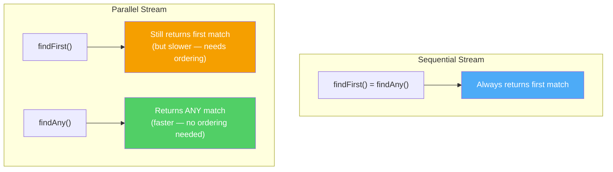

> Both are **short-circuiting** — they stop as soon as they find a match. They don't process the entire stream.

---

### 7. anyMatch(), allMatch(), noneMatch() — Check Conditions

**Why do we need it?** To quickly check if elements satisfy a condition, without processing all elements unnecessarily.

```java
List<Integer> numbers = Arrays.asList(1, 2, 3, 4, 5);

// anyMatch — Is there AT LEAST ONE even number?
boolean hasEven = numbers.stream().anyMatch(n -> n % 2 == 0); // true

// allMatch — Are ALL numbers positive?
boolean allPositive = numbers.stream().allMatch(n -> n > 0); // true

// noneMatch — Are there NO negative numbers?
boolean noNegatives = numbers.stream().noneMatch(n -> n < 0); // true
```

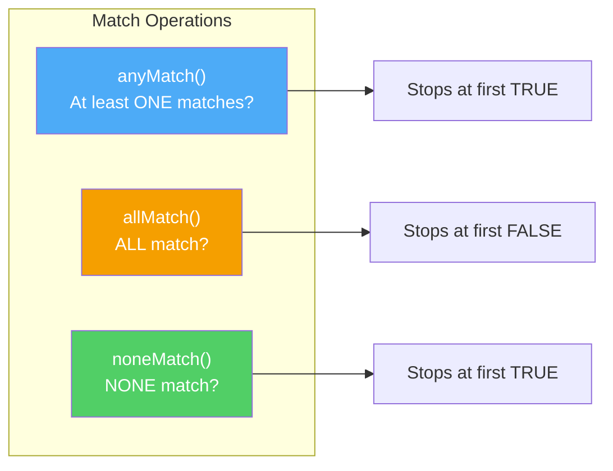

> All three are **short-circuiting** — they stop as soon as the answer is determined. `anyMatch` stops at the first `true`. `allMatch` stops at the first `false`.

---

### 8. toArray() — Convert Stream to Array

```java
// To Object[]
Object[] arr = names.stream().toArray();

// To String[] (with generator)
String[] strArr = names.stream().toArray(String[]::new);

// To int[]
int[] intArr = IntStream.rangeClosed(1, 5).toArray(); // [1, 2, 3, 4, 5]
```

---

## Collectors In-Depth

`Collectors` is a **utility class** with static factory methods that provide ready-made `Collector` implementations. It's the powerhouse behind `collect()`.

**Why a separate class?** Because collecting data into different structures (List, Set, Map, grouped Map, partitioned Map, joined String, etc.) is so common that Java provides pre-built collectors for all of them. Without `Collectors`, you'd have to write custom accumulation logic every time.

```mermaid
graph TD
    COL["Collectors"]
    COL --> BASIC["Basic Collectors"]
    COL --> STRING["String Collectors"]
    COL --> MAP["Map Collectors"]
    COL --> GROUP["Grouping & Partitioning"]
    COL --> STATS["Statistics"]
    
    BASIC --> TL["toList()"]
    BASIC --> TS["toSet()"]
    BASIC --> TC["toCollection()"]
    BASIC --> TUL["toUnmodifiableList()"]
    BASIC --> TUS["toUnmodifiableSet()"]
    
    STRING --> JOIN["joining()"]
    
    MAP --> TM["toMap()"]
    MAP --> TUM["toUnmodifiableMap()"]
    
    GROUP --> GB["groupingBy()"]
    GROUP --> PB["partitioningBy()"]
    
    STATS --> COUNT["counting()"]
    STATS --> SUM["summingInt()"]
    STATS --> AVG["averagingInt()"]
    STATS --> SUMM["summarizingInt()"]
    STATS --> MINBY["minBy() / maxBy()"]

    style COL fill:#845ef7,color:#fff
    style BASIC fill:#4dabf7,color:#fff
    style STRING fill:#4dabf7,color:#fff
    style MAP fill:#f59f00,color:#fff
    style GROUP fill:#ff6b6b,color:#fff
    style STATS fill:#51cf66,color:#fff
```

### 1. toList(), toSet(), toCollection()

```java
// Collect into ArrayList (most common)
List<String> list = names.stream()
    .collect(Collectors.toList()); // Returns ArrayList

// Collect into HashSet (removes duplicates)
Set<String> set = names.stream()
    .collect(Collectors.toSet()); // Returns HashSet

// Collect into a SPECIFIC collection type
LinkedList<String> linked = names.stream()
    .collect(Collectors.toCollection(LinkedList::new));

TreeSet<String> treeSet = names.stream()
    .collect(Collectors.toCollection(TreeSet::new)); // Sorted set!

// Java 10+: Unmodifiable collections (cannot add/remove after creation)
List<String> immutable = names.stream()
    .collect(Collectors.toUnmodifiableList());

// Java 16+: Even shorter!
List<String> immutable16 = names.stream().toList();
```

**Why `toCollection()`?** Because `toList()` gives you an `ArrayList` and `toSet()` gives you a `HashSet`. What if you want a `LinkedList`, `TreeSet`, or `PriorityQueue`? That's what `toCollection()` is for — you specify the exact collection type.

---

### 2. joining() — Concatenate Strings

**Why do we need it?** To combine stream of strings into a single string with optional delimiter, prefix, and suffix.

```java
List<String> names = Arrays.asList("Alice", "Bob", "Charlie");

// Simple join
String result = names.stream()
    .collect(Collectors.joining());
// "AliceBobCharlie"

// Join with delimiter
String csv = names.stream()
    .collect(Collectors.joining(", "));
// "Alice, Bob, Charlie"

// Join with delimiter, prefix, and suffix
String json = names.stream()
    .collect(Collectors.joining(", ", "[", "]"));
// "[Alice, Bob, Charlie]"

// Real-world: Build SQL IN clause
String inClause = ids.stream()
    .map(String::valueOf)
    .collect(Collectors.joining(", ", "WHERE id IN (", ")"));
// "WHERE id IN (1, 2, 3, 4)"
```

---

### 3. toMap() — Collect into a Map

**Why do we need it?** To create a key-value mapping from stream elements. Very common when you want to index objects by a property.

```java
// Name → Length
Map<String, Integer> nameToLength = names.stream()
    .collect(Collectors.toMap(
        name -> name,      // key mapper
        String::length     // value mapper
    ));
// {Alice=5, Bob=3, Charlie=7}

// Student ID → Student object (index by ID)
Map<Integer, Student> studentById = students.stream()
    .collect(Collectors.toMap(
        Student::getId,    // key
        student -> student // value (or Function.identity())
    ));
```

#### ⚠️ Duplicate Key Problem

```java
// What if two students have the same name?
List<String> names = Arrays.asList("Alice", "Bob", "Alice");

// ❌ This CRASHES with IllegalStateException: Duplicate key Alice
names.stream().collect(Collectors.toMap(n -> n, String::length));

// ✅ Provide a merge function (3rd parameter) to handle duplicates
Map<String, Integer> map = names.stream()
    .collect(Collectors.toMap(
        n -> n,
        String::length,
        (existing, replacement) -> existing // Keep the first one
    ));
// {Alice=5, Bob=3}
```

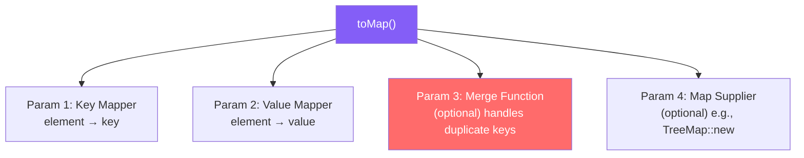

---

### 4. groupingBy() — Group Elements (like SQL GROUP BY)

**Why do we need it?** To categorize elements into groups. This is one of the **most powerful** collectors.

```java
// Group students by grade
Map<String, List<Student>> byGrade = students.stream()
    .collect(Collectors.groupingBy(Student::getGrade));
// {"A": [Alice, Bob], "B": [Charlie, David], "C": [Eve]}

// Group words by first letter
Map<Character, List<String>> byFirstLetter = words.stream()
    .collect(Collectors.groupingBy(w -> w.charAt(0)));
// {'A': ["Apple", "Ant"], 'B': ["Banana", "Ball"]}

// Group by length
Map<Integer, List<String>> byLength = names.stream()
    .collect(Collectors.groupingBy(String::length));
// {3: ["Bob"], 5: ["Alice"], 7: ["Charlie"]}
```

#### groupingBy with Downstream Collectors

The real power comes when you combine `groupingBy` with a **downstream collector** — you can group AND then do something with each group.

```java
// Group by grade, then COUNT each group
Map<String, Long> gradeCount = students.stream()
    .collect(Collectors.groupingBy(
        Student::getGrade,
        Collectors.counting()
    ));
// {"A": 2, "B": 3, "C": 1}

// Group by department, then get AVERAGE salary
Map<String, Double> avgSalary = employees.stream()
    .collect(Collectors.groupingBy(
        Employee::getDepartment,
        Collectors.averagingDouble(Employee::getSalary)
    ));

// Group by city, then collect NAMES into a Set
Map<String, Set<String>> namesByCity = people.stream()
    .collect(Collectors.groupingBy(
        Person::getCity,
        Collectors.mapping(Person::getName, Collectors.toSet())
    ));

// Group by department, then find MAX salary employee
Map<String, Optional<Employee>> topEarners = employees.stream()
    .collect(Collectors.groupingBy(
        Employee::getDepartment,
        Collectors.maxBy(Comparator.comparingDouble(Employee::getSalary))
    ));
```

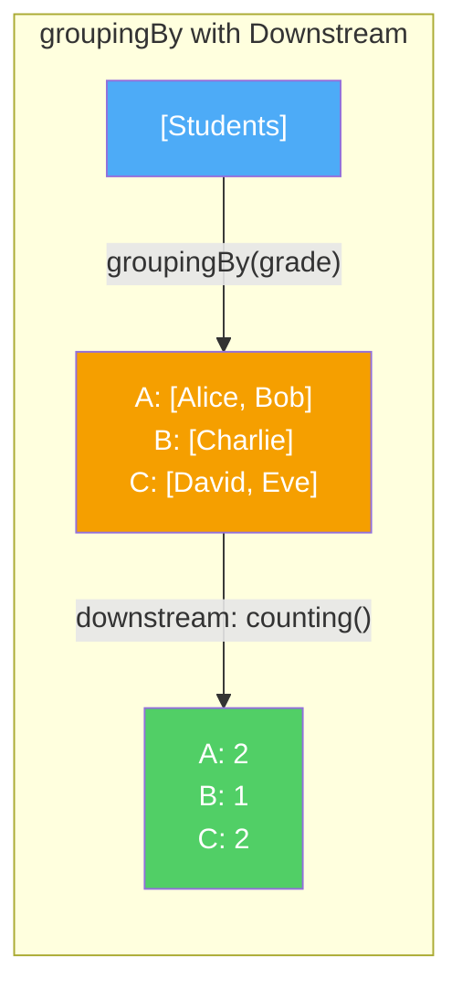

**Think of it like this:** `groupingBy` is like sorting mail into mailboxes (by zip code). The downstream collector is what you do AFTER sorting — count letters per box, find the heaviest package per box, etc.

---

### 5. partitioningBy() — Split into Two Groups (true/false)

**Why do we need it?** When you want to divide elements into exactly **two groups** based on a condition. It's a special case of `groupingBy` where the key is always `true` or `false`.

```java
// Partition students into passed and failed
Map<Boolean, List<Student>> passedOrFailed = students.stream()
    .collect(Collectors.partitioningBy(s -> s.getScore() >= 40));
// {true: [Alice, Bob, Charlie], false: [David, Eve]}

List<Student> passed = passedOrFailed.get(true);
List<Student> failed = passedOrFailed.get(false);

// Partition with downstream collector
Map<Boolean, Long> passFailCount = students.stream()
    .collect(Collectors.partitioningBy(
        s -> s.getScore() >= 40,
        Collectors.counting()
    ));
// {true: 3, false: 2}

// Partition even and odd numbers
Map<Boolean, List<Integer>> evenOdd = numbers.stream()
    .collect(Collectors.partitioningBy(n -> n % 2 == 0));
// {true: [2, 4, 6], false: [1, 3, 5]}
```

**Why not just use `groupingBy`?** You CAN, but `partitioningBy` is simpler when you only need two groups. Also, `partitioningBy` **always returns both keys** (`true` and `false`), even if one group is empty — `groupingBy` wouldn't include an empty group.

---

### 6. Statistics Collectors

```java
// counting() — count elements
long count = students.stream()
    .collect(Collectors.counting());

// summingInt() — sum of a property
int totalScore = students.stream()
    .collect(Collectors.summingInt(Student::getScore));

// averagingInt() — average of a property
double avgScore = students.stream()
    .collect(Collectors.averagingInt(Student::getScore));

// summarizingInt() — ALL statistics at once!
IntSummaryStatistics stats = students.stream()
    .collect(Collectors.summarizingInt(Student::getScore));

stats.getCount();   // 5
stats.getSum();     // 420
stats.getMin();     // 60
stats.getMax();     // 95
stats.getAverage(); // 84.0

// minBy() / maxBy()
Optional<Student> youngest = students.stream()
    .collect(Collectors.minBy(Comparator.comparingInt(Student::getAge)));
```

---

## flatMap — Deep Dive

We introduced `flatMap` earlier, but let's go deeper. This is one of the most **confusing yet powerful** operations in streams.

### The Core Problem

When you use `map()`, each element is transformed **one-to-one**. But what happens when each element maps to **multiple elements** (one-to-many)?

```mermaid
graph TD
    subgraph "map() — One-to-One"
        A1["Student"] -->|"getName()"| A2["'Alice'"]
        B1["Student"] -->|"getName()"| B2["'Bob'"]
    end
    
    subgraph "flatMap() — One-to-Many"
        C1["'Hello World'"] -->|"split + stream"| C2["'Hello'"]
        C1 -->|"split + stream"| C3["'World'"]
        D1["'Java Rocks'"] -->|"split + stream"| D2["'Java'"]
        D1 -->|"split + stream"| D3["'Rocks'"]
    end

    style A2 fill:#4dabf7,color:#fff
    style B2 fill:#4dabf7,color:#fff
    style C2 fill:#51cf66,color:#fff
    style C3 fill:#51cf66,color:#fff
    style D2 fill:#51cf66,color:#fff
    style D3 fill:#51cf66,color:#fff
```

### Step-by-Step Visualization

```java
List<List<String>> teams = Arrays.asList(
    Arrays.asList("Alice", "Bob"),
    Arrays.asList("Charlie", "David"),
    Arrays.asList("Eve")
);
```

```mermaid
graph TD
    subgraph "Step 1: Source"
        T1["Team1: [Alice, Bob]"]
        T2["Team2: [Charlie, David]"]
        T3["Team3: [Eve]"]
    end

    subgraph "Step 2: map(Collection::stream)"
        S1["Stream[Alice, Bob]"]
        S2["Stream[Charlie, David]"]
        S3["Stream[Eve]"]
        NOTE1["❌ Result: Stream of Streams!<br/>Stream&lt;Stream&lt;String&gt;&gt;"]
    end

    subgraph "Step 3: flatMap(Collection::stream)"
        F1["Alice, Bob, Charlie, David, Eve"]
        NOTE2["✅ Result: Single flat Stream!<br/>Stream&lt;String&gt;"]
    end

    T1 --> S1
    T2 --> S2
    T3 --> S3
    
    T1 -.->|flatMap| F1
    T2 -.->|flatMap| F1
    T3 -.->|flatMap| F1

    style NOTE1 fill:#ff6b6b,color:#fff
    style NOTE2 fill:#51cf66,color:#fff
```

### Real-World Examples

```java
// 1. Get all unique characters from a list of words
List<String> words = Arrays.asList("Hello", "World");
List<String> chars = words.stream()
    .flatMap(word -> Arrays.stream(word.split("")))
    .distinct()
    .collect(Collectors.toList());
// [H, e, l, o, W, r, d]

// 2. Process JSON-like nested data: Get all phone numbers from all contacts
List<String> allPhones = contacts.stream()
    .flatMap(contact -> contact.getPhoneNumbers().stream())
    .collect(Collectors.toList());

// 3. Combine with Optional (Java 9+)
List<String> validEmails = users.stream()
    .map(User::getOptionalEmail)          // Stream<Optional<String>>
    .flatMap(Optional::stream)             // Stream<String> — empties removed!
    .collect(Collectors.toList());

// 4. Generate pairs of numbers
List<int[]> pairs = IntStream.rangeClosed(1, 3).boxed()
    .flatMap(i -> IntStream.rangeClosed(1, 3)
        .mapToObj(j -> new int[]{i, j}))
    .collect(Collectors.toList());
// [1,1], [1,2], [1,3], [2,1], [2,2], [2,3], [3,1], [3,2], [3,3]
```

### flatMap Rule of Thumb

> **Use `map()`** when each element transforms to **exactly one** element.
> **Use `flatMap()`** when each element transforms to **zero or more** elements (the function returns a Stream).

---

## reduce() — Deep Dive

`reduce()` is the **most general-purpose terminal operation**. Every other terminal operation (`count()`, `sum()`, `min()`, `max()`) can be implemented using `reduce()`. It **combines all elements** into a single result.

### How reduce() Works — Step by Step

```java
List<Integer> numbers = Arrays.asList(1, 2, 3, 4, 5);
int sum = numbers.stream().reduce(0, Integer::sum);
```

```mermaid
graph LR
    I["Identity: 0"] -->|"0 + 1"| S1["1"]
    S1 -->|"1 + 2"| S2["3"]
    S2 -->|"3 + 3"| S3["6"]
    S3 -->|"6 + 4"| S4["10"]
    S4 -->|"10 + 5"| S5["15 ✅"]

    style I fill:#845ef7,color:#fff
    style S5 fill:#51cf66,color:#fff
```

### Three Forms of reduce()

#### Form 1: reduce(identity, accumulator) — Returns T

```java
// Identity = starting value. Accumulator = how to combine.
int sum = numbers.stream().reduce(0, Integer::sum);           // 15
int product = numbers.stream().reduce(1, (a, b) -> a * b);   // 120
String concat = words.stream().reduce("", String::concat);    // "HelloWorld"
```

**What is the "identity"?** It's a value that, when used with the accumulator, doesn't change the result:
- For addition: identity = 0 (0 + x = x)
- For multiplication: identity = 1 (1 × x = x)
- For concatenation: identity = "" ("" + str = str)

#### Form 2: reduce(accumulator) — Returns Optional<T>

```java
// No identity → result might be empty → returns Optional
Optional<Integer> max = numbers.stream().reduce(Integer::max);
Optional<Integer> sum = numbers.stream().reduce(Integer::sum);

// Why Optional? Because the stream might be empty!
Optional<Integer> empty = Stream.<Integer>empty().reduce(Integer::sum);
// empty == Optional.empty()
```

#### Form 3: reduce(identity, accumulator, combiner) — For Parallel Streams

```java
// The combiner tells the stream how to merge partial results from parallel threads
int sum = numbers.parallelStream().reduce(
    0,                    // identity
    Integer::sum,         // accumulator (combine element with partial result)
    Integer::sum          // combiner (combine two partial results)
);
```

```mermaid
graph TD
    subgraph "Parallel reduce with combiner"
        T1["Thread 1: 0 + 1 + 2 = 3"] 
        T2["Thread 2: 0 + 3 + 4 = 7"]
        T3["Thread 3: 0 + 5 = 5"]
        
        T1 -->|"combiner: 3 + 7"| M1["10"]
        T2 --> M1
        M1 -->|"combiner: 10 + 5"| RESULT["15 ✅"]
        T3 --> RESULT
    end

    style T1 fill:#4dabf7,color:#fff
    style T2 fill:#f59f00,color:#fff
    style T3 fill:#51cf66,color:#fff
    style RESULT fill:#845ef7,color:#fff
```

### Building Common Operations with reduce()

```java
// Sum (equivalent to IntStream.sum())
int sum = numbers.stream().reduce(0, Integer::sum);

// Max (equivalent to Stream.max())
Optional<Integer> max = numbers.stream().reduce(Integer::max);

// Min
Optional<Integer> min = numbers.stream().reduce(Integer::min);

// Count (equivalent to Stream.count())
long count = numbers.stream().reduce(0, (acc, x) -> acc + 1, Integer::sum);

// Join strings (equivalent to Collectors.joining())
String joined = names.stream().reduce("", (a, b) -> a.isEmpty() ? b : a + ", " + b);

// Find longest string
Optional<String> longest = names.stream()
    .reduce((a, b) -> a.length() >= b.length() ? a : b);
```

### reduce() vs collect()

| Feature | `reduce()` | `collect()` |
|---------|-----------|-------------|
| **Purpose** | Combine into a single immutable value | Gather into a mutable container |
| **Best for** | Sum, product, max, min, concatenation | List, Set, Map, grouped results |
| **Performance** | Creates new object at each step | Mutates the same container |
| **Example** | `reduce(0, Integer::sum)` → `15` | `collect(Collectors.toList())` → `[1,2,3]` |

```java
// ❌ Bad: Using reduce to build a list (creates new list at every step!)
List<String> result = names.stream()
    .reduce(new ArrayList<>(), 
        (list, name) -> { list.add(name); return list; }, 
        (list1, list2) -> { list1.addAll(list2); return list1; });

// ✅ Good: Use collect for mutable containers
List<String> result = names.stream()
    .collect(Collectors.toList());
```

**Think of it like this:**
- `reduce()` = Making a snowball. You roll it, it gets bigger, but you always have ONE snowball.
- `collect()` = Filling a bucket. You keep throwing items in. The bucket is mutable.

---

## Primitive Streams

Java has three specialized stream types for primitives: `IntStream`, `LongStream`, and `DoubleStream`.

**Why do we need them?** Because regular `Stream<Integer>` uses **wrapper objects** (autoboxing). Every `int` gets wrapped into an `Integer` object, which is slow and wastes memory. For 10 million numbers, that's 10 million unnecessary objects on the heap!

```mermaid
graph LR
    subgraph "❌ Stream of Integer (Wrapper)"
        A1["int 5"] -->|"Autobox"| A2["Integer(5)<br/>16 bytes on heap"]
        A3["int 10"] -->|"Autobox"| A4["Integer(10)<br/>16 bytes on heap"]
        A5["10M numbers = 10M objects!"]
    end

    subgraph "✅ IntStream (Primitive)"
        B1["int 5"] --> B2["Stored directly<br/>4 bytes"]
        B3["int 10"] --> B4["Stored directly<br/>4 bytes"]
        B5["10M numbers = just raw ints!"]
    end

    style A5 fill:#ff6b6b,color:#fff
    style B5 fill:#51cf66,color:#fff
```

### Creating Primitive Streams

```java
// IntStream
IntStream ints1 = IntStream.of(1, 2, 3, 4, 5);
IntStream ints2 = IntStream.range(1, 5);         // 1, 2, 3, 4 (exclusive)
IntStream ints3 = IntStream.rangeClosed(1, 5);    // 1, 2, 3, 4, 5 (inclusive)

// LongStream
LongStream longs = LongStream.rangeClosed(1L, 1_000_000L);

// DoubleStream
DoubleStream doubles = DoubleStream.of(1.5, 2.5, 3.5);

// From a String (stream of char values as ints)
IntStream chars = "Hello".chars(); // 72, 101, 108, 108, 111

// From a regular stream via mapToInt/Long/Double
IntStream scores = students.stream().mapToInt(Student::getScore);
```

### Special Methods on Primitive Streams

These methods are **not available** on regular `Stream<T>` — that's the whole point!

```java
IntStream numbers = IntStream.rangeClosed(1, 10);

int sum = numbers.sum();                    // 55
OptionalDouble avg = numbers.average();      // 5.5
OptionalInt max = numbers.max();             // 10
OptionalInt min = numbers.min();             // 1
long count = numbers.count();                // 10

// Get ALL statistics at once
IntSummaryStatistics stats = IntStream.rangeClosed(1, 100).summaryStatistics();
stats.getSum();     // 5050
stats.getAverage(); // 50.5
stats.getMax();     // 100
stats.getMin();     // 1
stats.getCount();   // 100
```

### Converting Between Stream Types

```mermaid
graph TD
    PS["Primitive Stream<br/>(IntStream)"] -->|"boxed()"| OS["Object Stream<br/>(Stream&lt;Integer&gt;)"]
    OS -->|"mapToInt()"| PS
    PS -->|"asLongStream()"| LS["LongStream"]
    PS -->|"asDoubleStream()"| DS["DoubleStream"]
    OS -->|"mapToDouble()"| DS

    style PS fill:#51cf66,color:#fff
    style OS fill:#4dabf7,color:#fff
    style LS fill:#f59f00,color:#fff
    style DS fill:#f59f00,color:#fff
```

```java
// IntStream → Stream<Integer> (boxing)
Stream<Integer> boxed = IntStream.rangeClosed(1, 5).boxed();

// Stream<Integer> → IntStream (unboxing)
IntStream unboxed = boxed.mapToInt(Integer::intValue);

// IntStream → LongStream
LongStream longs = IntStream.rangeClosed(1, 5).asLongStream();

// IntStream → DoubleStream
DoubleStream doubles = IntStream.rangeClosed(1, 5).asDoubleStream();

// IntStream → Stream<String> (via mapToObj)
Stream<String> strings = IntStream.rangeClosed(1, 5)
    .mapToObj(n -> "Number: " + n);
```

### When to Use Primitive Streams?

| Scenario | Use |
|----------|-----|
| Summing numbers | `mapToInt().sum()` |
| Average of values | `mapToDouble().average()` |
| Range of integers | `IntStream.range()` |
| Performance-critical with millions of numbers | Always use primitive streams |
| Need to collect into `List<Integer>` | Use `boxed()` first, then `collect()` |

---

## Optional with Streams

Many stream operations return `Optional` — `findFirst()`, `findAny()`, `min()`, `max()`, `reduce()`. Understanding `Optional` is essential for working with streams.

### Why Optional?

**The problem:** What should `findFirst()` return if the stream is empty? `null`? That leads to `NullPointerException` everywhere.

```java
// ❌ Without Optional — null danger!
String result = getFirstMatch(names); // Returns null if not found
System.out.println(result.toUpperCase()); // NullPointerException!

// ✅ With Optional — forces you to handle the "empty" case
Optional<String> result = names.stream()
    .filter(name -> name.startsWith("Z"))
    .findFirst();
// You MUST handle the possibility of emptiness
```

```mermaid
graph TD
    subgraph "Without Optional"
        A1["findFirst()"] --> A2["Returns null"]
        A2 --> A3["Developer forgets null check"]
        A3 --> A4["💥 NullPointerException"]
    end

    subgraph "With Optional"
        B1["findFirst()"] --> B2["Returns Optional"]
        B2 --> B3["Developer MUST handle empty case"]
        B3 --> B4["✅ Safe code"]
    end

    style A4 fill:#ff6b6b,color:#fff
    style B4 fill:#51cf66,color:#fff
```

### Stream Operations that Return Optional

```java
// findFirst() → Optional<T>
Optional<String> first = names.stream().findFirst();

// findAny() → Optional<T>
Optional<String> any = names.stream().findAny();

// min() → Optional<T>
Optional<String> min = names.stream().min(Comparator.naturalOrder());

// max() → Optional<T>
Optional<String> max = names.stream().max(Comparator.naturalOrder());

// reduce() (without identity) → Optional<T>
Optional<Integer> sum = numbers.stream().reduce(Integer::sum);
```

### Working with Optional Safely

```java
Optional<String> name = names.stream()
    .filter(n -> n.startsWith("Z"))
    .findFirst();

// ✅ Method 1: isPresent() + get()
if (name.isPresent()) {
    System.out.println(name.get());
}

// ✅ Method 2: ifPresent() — cleaner
name.ifPresent(System.out::println);

// ✅ Method 3: orElse() — provide a default
String result = name.orElse("Unknown");

// ✅ Method 4: orElseGet() — lazy default (computed only if empty)
String result = name.orElseGet(() -> fetchDefaultName());

// ✅ Method 5: orElseThrow() — throw if empty
String result = name.orElseThrow(() -> new RuntimeException("Not found!"));

// ✅ Method 6: map() on Optional — transform if present
Optional<String> upper = name.map(String::toUpperCase);

// ✅ Method 7: filter() on Optional
Optional<String> longName = name.filter(n -> n.length() > 5);

// ✅ Method 8 (Java 9+): ifPresentOrElse()
name.ifPresentOrElse(
    n -> System.out.println("Found: " + n),
    () -> System.out.println("Not found")
);

// ✅ Method 9 (Java 9+): or() — chain Optionals
Optional<String> result = name
    .or(() -> getFromCache())
    .or(() -> getFromDatabase());

// ✅ Method 10 (Java 9+): stream() — convert Optional to Stream (0 or 1 element)
Stream<String> stream = name.stream(); // Empty stream if empty, 1-element stream if present
```

### Optional + Streams Pattern (Java 9+)

```java
// Filter out empty Optionals from a stream
List<Optional<String>> optionals = Arrays.asList(
    Optional.of("Alice"),
    Optional.empty(),
    Optional.of("Bob"),
    Optional.empty()
);

// Extract only the present values
List<String> names = optionals.stream()
    .flatMap(Optional::stream) // empty Optionals become empty streams → filtered out!
    .collect(Collectors.toList());
// ["Alice", "Bob"]
```

**Think of it like this:** `Optional` is like a **gift box** that may or may not contain a present. You can't just rip it open (`get()`). You first check if there's something inside (`isPresent()`), or you decide what to do if it's empty (`orElse()`).

---

## Lazy Evaluation & Short-Circuiting

This is one of the **most important concepts** to understand about streams. It's what makes them efficient.

### What is Lazy Evaluation?

Intermediate operations are **lazy** — they don't execute when you call them. They only execute when a terminal operation is invoked. But it gets even more interesting: elements are processed **one at a time through the entire pipeline**, not stage by stage.

```java
List<String> names = Arrays.asList("Alice", "Bob", "Charlie", "David", "Eve");

List<String> result = names.stream()
    .filter(name -> {
        System.out.println("filter: " + name);
        return name.length() > 3;
    })
    .map(name -> {
        System.out.println("map: " + name);
        return name.toUpperCase();
    })
    .limit(2)
    .collect(Collectors.toList());
```

**What you might expect (stage by stage):**
```
filter: Alice, Bob, Charlie, David, Eve  ← filter ALL first
map: Alice, Charlie, David, Eve          ← then map ALL
limit: Alice, Charlie                     ← then take 2
```

**What actually happens (element by element):**
```
filter: Alice    ← passes filter (length > 3)
map: Alice       ← mapped to "ALICE" → 1st result
filter: Bob      ← fails filter (length = 3) → SKIPPED
filter: Charlie  ← passes filter
map: Charlie     ← mapped to "CHARLIE" → 2nd result
                 ← STOP! limit(2) reached. David and Eve are NEVER processed!
```

```mermaid
graph TD
    subgraph "❌ Stage-by-Stage (NOT how streams work)"
        S1["Filter ALL 5 names"] --> S2["Map ALL 4 passing names"]
        S2 --> S3["Take first 2"]
        S3 --> S4["Total: 5 filter + 4 map = 9 operations"]
    end

    subgraph "✅ Element-by-Element (HOW streams actually work)"
        E1["Alice → filter ✅ → map → Result 1"] 
        E2["Bob → filter ❌ → SKIP"]
        E3["Charlie → filter ✅ → map → Result 2"]
        E4["David → NEVER TOUCHED"]
        E5["Eve → NEVER TOUCHED"]
        E6["Total: 3 filter + 2 map = 5 operations"]
    end

    style S4 fill:#ff6b6b,color:#fff
    style E6 fill:#51cf66,color:#fff
    style E4 fill:#868e96,color:#fff
    style E5 fill:#868e96,color:#fff
```

### Short-Circuiting Operations

Some operations can **stop the entire pipeline early** without processing all elements:

| Operation | Type | How it short-circuits |
|-----------|------|----------------------|
| `limit(n)` | Intermediate | Stops after n elements pass through |
| `findFirst()` | Terminal | Stops after finding the first match |
| `findAny()` | Terminal | Stops after finding any match |
| `anyMatch()` | Terminal | Stops when first `true` is found |
| `allMatch()` | Terminal | Stops when first `false` is found |
| `noneMatch()` | Terminal | Stops when first `true` is found |

```java
// Short-circuit example: Find first even number in a billion numbers
Optional<Integer> firstEven = IntStream.rangeClosed(1, 1_000_000_000)
    .filter(n -> n % 2 == 0)
    .boxed()
    .findFirst();
// Returns Optional[2] almost INSTANTLY — only processes 1 and 2, not 1 billion!

// anyMatch: Does any student have a perfect score?
boolean hasPerfect = students.stream()
    .anyMatch(s -> s.getScore() == 100);
// Stops at the first student with 100, even if there are millions more to check
```

### Why Lazy Evaluation Matters

```java
// Without lazy evaluation, this would CRASH (infinite stream!)
Stream.iterate(1, n -> n + 1)  // Infinite: 1, 2, 3, 4, 5, ...
    .filter(n -> n % 2 == 0)    // Infinite even numbers: 2, 4, 6, ...
    .limit(5)                    // Take only 5
    .forEach(System.out::println);
// Prints: 2, 4, 6, 8, 10 — works perfectly because of laziness!
```

**Think of it like this:** Imagine a **sushi conveyor belt**. The chef doesn't make all 100 dishes before the belt starts. He makes one, puts it on the belt, a customer grabs it, then he makes the next. If a customer says "I only want 3 plates" (`limit(3)`), the chef stops making more after 3 are taken.

---

## Parallel Streams

Parallel streams let you process data across **multiple CPU cores** simultaneously. For large datasets, this can dramatically speed up processing.

### Why Do We Need Parallel Streams?

Modern computers have 4, 8, or even 16+ CPU cores. A regular (sequential) stream uses **only 1 core**. That means 7 out of 8 cores are sitting idle!

```mermaid
graph TD
    subgraph "Sequential Stream (1 core)"
        SEQ1["Core 1: Process ALL elements"] 
        SEQ2["Core 2: 💤 Idle"]
        SEQ3["Core 3: 💤 Idle"]
        SEQ4["Core 4: 💤 Idle"]
    end

    subgraph "Parallel Stream (all cores)"
        PAR1["Core 1: Elements 1-250"]
        PAR2["Core 2: Elements 251-500"]
        PAR3["Core 3: Elements 501-750"]
        PAR4["Core 4: Elements 751-1000"]
        PAR1 --> MERGE["Merge Results"]
        PAR2 --> MERGE
        PAR3 --> MERGE
        PAR4 --> MERGE
    end

    style SEQ2 fill:#868e96,color:#fff
    style SEQ3 fill:#868e96,color:#fff
    style SEQ4 fill:#868e96,color:#fff
    style MERGE fill:#51cf66,color:#fff
```

### How to Create Parallel Streams

```java
// Method 1: From a collection
List<Integer> numbers = Arrays.asList(1, 2, 3, 4, 5);
numbers.parallelStream()
    .forEach(System.out::println); // Order NOT guaranteed!

// Method 2: Convert sequential to parallel
numbers.stream()
    .parallel()
    .forEach(System.out::println);

// Check if a stream is parallel
boolean isParallel = numbers.parallelStream().isParallel(); // true

// Convert back to sequential
numbers.parallelStream()
    .sequential()
    .forEach(System.out::println); // Order guaranteed again
```

### How Parallel Streams Work (Under the Hood)

Parallel streams use the **ForkJoinPool** (common pool by default). The stream is split into chunks, each chunk is processed by a different thread, and results are merged.

```mermaid
graph TD
    SRC["Source: [1, 2, 3, 4, 5, 6, 7, 8]"] -->|"Split"| L["[1, 2, 3, 4]"]
    SRC -->|"Split"| R["[5, 6, 7, 8]"]
    L -->|"Split"| LL["[1, 2]"]
    L -->|"Split"| LR["[3, 4]"]
    R -->|"Split"| RL["[5, 6]"]
    R -->|"Split"| RR["[7, 8]"]
    
    LL -->|"Process"| RLL["sum=3"]
    LR -->|"Process"| RLR["sum=7"]
    RL -->|"Process"| RRL["sum=11"]
    RR -->|"Process"| RRR["sum=15"]
    
    RLL -->|"Merge"| ML["10"]
    RLR --> ML
    RRL -->|"Merge"| MR["26"]
    RRR --> MR
    
    ML -->|"Merge"| FINAL["36 ✅"]
    MR --> FINAL

    style SRC fill:#845ef7,color:#fff
    style FINAL fill:#51cf66,color:#fff
```

### When to Use Parallel Streams

```java
// ✅ GOOD: Large dataset with independent, CPU-intensive operations
long count = IntStream.rangeClosed(1, 10_000_000)
    .parallel()
    .filter(n -> isPrime(n))
    .count();

// ✅ GOOD: Processing independent records
List<Result> results = hugeDataList.parallelStream()
    .map(data -> expensiveComputation(data))
    .collect(Collectors.toList());
```

### When NOT to Use Parallel Streams

```java
// ❌ BAD: Small dataset — overhead of splitting/merging > benefit
List<Integer> small = Arrays.asList(1, 2, 3, 4, 5);
small.parallelStream().map(n -> n * 2); // Slower than sequential!

// ❌ BAD: Order matters and you use forEach
names.parallelStream()
    .forEach(System.out::println); // Prints in RANDOM order!
// Use forEachOrdered() if order matters, but it defeats the purpose

// ❌ BAD: Shared mutable state — RACE CONDITION!
List<Integer> result = new ArrayList<>(); // NOT thread-safe!
numbers.parallelStream()
    .filter(n -> n > 3)
    .forEach(result::add); // ❌ ConcurrentModificationException or wrong results!
// ✅ Use collect() instead
List<Integer> result = numbers.parallelStream()
    .filter(n -> n > 3)
    .collect(Collectors.toList()); // Thread-safe!

// ❌ BAD: LinkedList source — poor splittability
LinkedList<Integer> linked = new LinkedList<>(numbers);
linked.parallelStream(); // Can't split efficiently — no random access!

// ❌ BAD: I/O operations or blocking calls
files.parallelStream()
    .map(file -> readFromNetwork(file)); // Threads block on I/O — wastes thread pool!
```

### Parallel Stream Decision Guide

```mermaid
graph TD
    Q1["Do you have a LARGE dataset?<br/>(> 10,000 elements)"] -->|"No"| NO1["❌ Use sequential"]
    Q1 -->|"Yes"| Q2["Is each operation CPU-intensive?"]
    Q2 -->|"No (simple ops)"| NO2["❌ Probably sequential<br/>(overhead > benefit)"]
    Q2 -->|"Yes"| Q3["Is the source easily splittable?<br/>(ArrayList, array, IntStream)"]
    Q3 -->|"No (LinkedList, Stream.iterate)"| NO3["❌ Use sequential"]
    Q3 -->|"Yes"| Q4["Are operations stateless?<br/>(no shared mutable state)"]
    Q4 -->|"No"| NO4["❌ Use sequential<br/>(or fix the state issue)"]
    Q4 -->|"Yes"| YES["✅ Use parallel stream!"]

    style NO1 fill:#ff6b6b,color:#fff
    style NO2 fill:#ff6b6b,color:#fff
    style NO3 fill:#ff6b6b,color:#fff
    style NO4 fill:#ff6b6b,color:#fff
    style YES fill:#51cf66,color:#fff
```

### Source Splittability

| Source | Splittability | Why |
|--------|--------------|-----|
| `ArrayList` | Excellent | Random access, easy to split in half |
| `int[]`, `long[]` | Excellent | Contiguous memory, trivial to split |
| `IntStream.range()` | Excellent | Known size, easy to divide |
| `HashSet` | Good | Can split buckets |
| `TreeSet` | Good | Can split subtrees |
| `LinkedList` | Poor | No random access, must traverse to split |
| `Stream.iterate()` | Poor | Each element depends on the previous |
| `BufferedReader.lines()` | Poor | Sequential I/O source |

---

## Stream Ordering & Encounter Order

**Encounter order** is the order in which elements appear in the stream. Understanding this is crucial, especially when working with parallel streams.

### What Determines Encounter Order?

The **source** of the stream determines whether there's a defined encounter order:

```mermaid
graph TD
    ORD["Has Encounter Order?"]
    ORD --> YES["✅ Yes — Ordered Sources"]
    ORD --> NO["❌ No — Unordered Sources"]
    
    YES --> LIST["List (ArrayList, LinkedList)"]
    YES --> ARR["Arrays"]
    YES --> LHSET["LinkedHashSet"]
    YES --> LHMAP["LinkedHashMap"]
    YES --> TREESET["TreeSet (sorted order)"]
    YES --> RANGE["IntStream.range()"]
    
    NO --> HSET["HashSet"]
    NO --> HMAP["HashMap.keySet()"]

    style YES fill:#51cf66,color:#fff
    style NO fill:#ff6b6b,color:#fff
```

### Why Does Order Matter?

```java
List<String> names = Arrays.asList("Charlie", "Alice", "Bob");

// ✅ Ordered source → findFirst() is predictable
Optional<String> first = names.stream().findFirst(); // Always "Charlie"

// ❌ Unordered source → findFirst() varies
Set<String> nameSet = new HashSet<>(names);
Optional<String> first = nameSet.stream().findFirst(); // Could be anything!
```

### Operations That Respect or Break Order

```java
// These PRESERVE encounter order:
// filter(), map(), flatMap(), peek(), limit(), skip()

// sorted() INTRODUCES order (even on unordered streams)
Set<String> set = new HashSet<>(Arrays.asList("C", "A", "B"));
List<String> sorted = set.stream()
    .sorted()
    .collect(Collectors.toList()); // Always ["A", "B", "C"]

// unordered() REMOVES order constraint (optimization hint for parallel)
List<String> result = names.stream()
    .unordered()     // Tell the stream "I don't care about order"
    .parallel()
    .collect(Collectors.toList());
```

### Order in Parallel Streams

```java
List<Integer> numbers = Arrays.asList(1, 2, 3, 4, 5);

// forEach — does NOT respect order in parallel
numbers.parallelStream()
    .forEach(System.out::print); // Could print: 3 1 5 4 2

// forEachOrdered — DOES respect order (but slower)
numbers.parallelStream()
    .forEachOrdered(System.out::print); // Always prints: 1 2 3 4 5

// collect() — respects encounter order even in parallel
List<Integer> result = numbers.parallelStream()
    .filter(n -> n > 2)
    .collect(Collectors.toList()); // Always [3, 4, 5] — order preserved!
```

**Think of it like this:** Imagine 5 workers at a restaurant (parallel threads) preparing dishes 1-5. They finish at different times. `forEach` = serve dishes as they're ready (random order). `forEachOrdered` = wait and serve in order 1, 2, 3, 4, 5 (slower but organized).

---

## Infinite Streams

Streams can be **unbounded** — they have no end. This is only possible because of **lazy evaluation**. Elements are generated on demand, not all at once.

### Why Do We Need Infinite Streams?

Sometimes you don't know how many elements you need in advance:
- Generate random test data
- Produce a sequence until a condition is met
- Model mathematical sequences (Fibonacci, primes, etc.)

### Creating Infinite Streams

```java
// 1. Stream.generate() — each element is independent
Stream<Double> randoms = Stream.generate(Math::random);   // Infinite random numbers
Stream<String> hellos = Stream.generate(() -> "Hello");    // Infinite "Hello"
Stream<UUID> ids = Stream.generate(UUID::randomUUID);      // Infinite UUIDs

// 2. Stream.iterate() — each element depends on the previous
Stream<Integer> naturals = Stream.iterate(1, n -> n + 1);          // 1, 2, 3, 4, ...
Stream<Integer> powers = Stream.iterate(2, n -> n * 2);            // 2, 4, 8, 16, ...
Stream<LocalDate> dates = Stream.iterate(LocalDate.now(), d -> d.plusDays(1)); // Today, tomorrow, ...
```

### ⚠️ You MUST Limit Infinite Streams

```java
// ❌ This runs FOREVER (or until OutOfMemoryError)
Stream.iterate(1, n -> n + 1)
    .forEach(System.out::println); // NEVER stops!

// ✅ Use limit() to cap it
Stream.iterate(1, n -> n + 1)
    .limit(10)
    .forEach(System.out::println); // Prints 1 to 10, then stops

// ✅ Use takeWhile() (Java 9+) to stop on a condition
Stream.iterate(1, n -> n + 1)
    .takeWhile(n -> n <= 10)
    .forEach(System.out::println); // Prints 1 to 10

// ✅ Use findFirst() — short-circuits after finding one
Optional<Integer> firstDivisibleBy7 = Stream.iterate(1, n -> n + 1)
    .filter(n -> n % 7 == 0)
    .findFirst(); // Returns Optional[7] — stops immediately!
```

```mermaid
graph LR
    INF["Infinite Stream<br/>1, 2, 3, 4, ...∞"] -->|"limit(5)"| FIN["[1, 2, 3, 4, 5]"]
    INF2["Infinite Stream<br/>1, 2, 3, 4, ...∞"] -->|"takeWhile(n ≤ 3)"| FIN2["[1, 2, 3]"]
    INF3["Infinite Stream<br/>1, 2, 3, 4, ...∞"] -->|"findFirst(even)"| FIN3["Optional[2]"]

    style INF fill:#ff6b6b,color:#fff
    style INF2 fill:#ff6b6b,color:#fff
    style INF3 fill:#ff6b6b,color:#fff
    style FIN fill:#51cf66,color:#fff
    style FIN2 fill:#51cf66,color:#fff
    style FIN3 fill:#51cf66,color:#fff
```

### Java 9: takeWhile() and dropWhile()

These were added specifically to make working with ordered/infinite streams easier.

```java
// takeWhile() — take elements WHILE condition is true, stop at first false
Stream.of(2, 4, 6, 7, 8, 10).takeWhile(n -> n % 2 == 0)
    .forEach(System.out::print); // 2, 4, 6 — stops at 7 (first odd)

// dropWhile() — skip elements WHILE condition is true, take the rest
Stream.of(2, 4, 6, 7, 8, 10).dropWhile(n -> n % 2 == 0)
    .forEach(System.out::print); // 7, 8, 10 — drops 2, 4, 6
```

### Practical Examples

```java
// Fibonacci sequence
Stream.iterate(new long[]{0, 1}, f -> new long[]{f[1], f[0] + f[1]})
    .limit(10)
    .map(f -> f[0])
    .forEach(System.out::println);
// 0, 1, 1, 2, 3, 5, 8, 13, 21, 34

// Generate 5 random passwords
Stream.generate(() -> UUID.randomUUID().toString().substring(0, 8))
    .limit(5)
    .forEach(System.out::println);

// Generate timestamps at 1-second intervals (conceptual)
Stream.iterate(Instant.now(), t -> t.plusSeconds(1))
    .limit(10)
    .forEach(System.out::println);
```

---

## Common Stream Patterns & Recipes

Here are battle-tested patterns you'll use repeatedly in real projects.

### 1. Frequency Map (Count Occurrences)

```java
// Count how many times each word appears
List<String> words = Arrays.asList("apple", "banana", "apple", "cherry", "banana", "apple");
Map<String, Long> frequency = words.stream()
    .collect(Collectors.groupingBy(Function.identity(), Collectors.counting()));
// {apple=3, banana=2, cherry=1}
```

### 2. Find Maximum by Property

```java
// Student with highest score
Optional<Student> topper = students.stream()
    .max(Comparator.comparingInt(Student::getScore));

// Employee with highest salary in each department
Map<String, Optional<Employee>> topPerDept = employees.stream()
    .collect(Collectors.groupingBy(
        Employee::getDepartment,
        Collectors.maxBy(Comparator.comparingDouble(Employee::getSalary))
    ));
```

### 3. Flatten List of Lists

```java
List<List<String>> listOfLists = Arrays.asList(
    Arrays.asList("a", "b"),
    Arrays.asList("c", "d"),
    Arrays.asList("e")
);
List<String> flat = listOfLists.stream()
    .flatMap(Collection::stream)
    .collect(Collectors.toList());
// [a, b, c, d, e]
```

### 4. Convert List to Map (Index by Property)

```java
// Map of student ID → student
Map<Integer, Student> studentMap = students.stream()
    .collect(Collectors.toMap(Student::getId, Function.identity()));

// Handle duplicates: keep the first
Map<String, Student> byName = students.stream()
    .collect(Collectors.toMap(Student::getName, Function.identity(), (s1, s2) -> s1));
```

### 5. Comma-Separated String from List

```java
String csv = names.stream()
    .collect(Collectors.joining(", "));
// "Alice, Bob, Charlie"

// With quotes
String quoted = names.stream()
    .map(n -> "'" + n + "'")
    .collect(Collectors.joining(", "));
// "'Alice', 'Bob', 'Charlie'"
```

### 6. Group and Sort

```java
// Group students by grade, then sort each group by score
Map<String, List<Student>> sortedGroups = students.stream()
    .sorted(Comparator.comparingInt(Student::getScore).reversed())
    .collect(Collectors.groupingBy(Student::getGrade));
```

### 7. Top N Elements

```java
// Top 3 highest-scoring students
List<Student> top3 = students.stream()
    .sorted(Comparator.comparingInt(Student::getScore).reversed())
    .limit(3)
    .collect(Collectors.toList());
```

### 8. Remove Nulls and Blanks

```java
List<String> clean = strings.stream()
    .filter(Objects::nonNull)
    .filter(s -> !s.isBlank())
    .collect(Collectors.toList());
```

### 9. Zip Two Lists (No Built-in, Use IntStream)

```java
List<String> names = Arrays.asList("Alice", "Bob", "Charlie");
List<Integer> scores = Arrays.asList(90, 85, 95);

// Combine by index
Map<String, Integer> nameToScore = IntStream.range(0, names.size())
    .boxed()
    .collect(Collectors.toMap(names::get, scores::get));
// {Alice=90, Bob=85, Charlie=95}
```

### 10. Conditional Collection (Partition and Process)

```java
// Split, then process each group differently
Map<Boolean, List<Order>> partitioned = orders.stream()
    .collect(Collectors.partitioningBy(Order::isPaid));

List<Order> paid = partitioned.get(true);   // Process paid orders
List<Order> unpaid = partitioned.get(false); // Send reminders for unpaid
```

### 11. Chained Comparators (Multi-level Sort)

```java
// Sort by department, then by salary (descending), then by name
List<Employee> sorted = employees.stream()
    .sorted(Comparator.comparing(Employee::getDepartment)
        .thenComparing(Comparator.comparingDouble(Employee::getSalary).reversed())
        .thenComparing(Employee::getName))
    .collect(Collectors.toList());
```

### 12. Map Transformations

```java
// Transform Map values
Map<String, Integer> original = Map.of("a", 1, "b", 2, "c", 3);
Map<String, Integer> doubled = original.entrySet().stream()
    .collect(Collectors.toMap(
        Map.Entry::getKey,
        e -> e.getValue() * 2
    ));
// {a=2, b=4, c=6}

// Filter Map entries
Map<String, Integer> filtered = original.entrySet().stream()
    .filter(e -> e.getValue() > 1)
    .collect(Collectors.toMap(Map.Entry::getKey, Map.Entry::getValue));
// {b=2, c=3}
```

---

## Common Mistakes & Pitfalls

### 1. Reusing a Stream (IllegalStateException)

```java
// ❌ A stream can only be consumed ONCE
Stream<String> stream = names.stream();
stream.forEach(System.out::println);    // OK
stream.forEach(System.out::println);    // 💥 IllegalStateException!

// ✅ Create a new stream each time
names.stream().forEach(System.out::println); // OK
names.stream().forEach(System.out::println); // OK — new stream
```

### 2. Forgetting Terminal Operation (Nothing Happens)

```java
// ❌ No terminal operation — this does NOTHING!
names.stream()
    .filter(n -> n.length() > 3)
    .map(String::toUpperCase);
// No output, no result, no effect. Completely wasted.

// ✅ Always end with a terminal operation
List<String> result = names.stream()
    .filter(n -> n.length() > 3)
    .map(String::toUpperCase)
    .collect(Collectors.toList()); // NOW it executes
```

### 3. Modifying Source During Stream

```java
// ❌ NEVER modify the source collection while streaming!
List<String> names = new ArrayList<>(Arrays.asList("Alice", "Bob", "Charlie"));
names.stream()
    .filter(n -> n.startsWith("A"))
    .forEach(n -> names.remove(n)); // 💥 ConcurrentModificationException!

// ✅ Collect first, then modify
List<String> toRemove = names.stream()
    .filter(n -> n.startsWith("A"))
    .collect(Collectors.toList());
names.removeAll(toRemove);

// ✅ Or use removeIf() (not a stream, but cleaner)
names.removeIf(n -> n.startsWith("A"));
```

### 4. Using Stateful Lambdas in Parallel Streams

```java
// ❌ Shared mutable state — RACE CONDITION!
List<Integer> result = Collections.synchronizedList(new ArrayList<>());
IntStream.rangeClosed(1, 1000)
    .parallel()
    .forEach(result::add); // Race condition! May lose elements or throw exception

// ✅ Use collect — thread-safe
List<Integer> result = IntStream.rangeClosed(1, 1000)
    .parallel()
    .boxed()
    .collect(Collectors.toList());
```

### 5. Performance Trap: Stream for Everything

```java
// ❌ Overkill for simple operations
int max = numbers.stream()
    .mapToInt(Integer::intValue)
    .max()
    .orElse(0);

// ✅ Collections.max() is simpler for this
int max = Collections.max(numbers);

// ❌ Stream.count() when you already have size()
long count = list.stream().count(); // Wasteful
long count = list.size();           // Direct — O(1)!
```

### 6. Boxing/Unboxing Performance Hit

```java
// ❌ Stream<Integer> — autoboxing overhead
int sum = numbers.stream()
    .reduce(0, Integer::sum); // Each int is boxed to Integer

// ✅ IntStream — no boxing
int sum = numbers.stream()
    .mapToInt(Integer::intValue)
    .sum(); // Operates directly on primitives
```

### 7. Infinite Stream Without Limit

```java
// ❌ Runs forever!
Stream.generate(Math::random)
    .forEach(System.out::println); // Never terminates!

// ❌ filter() alone cannot make it finite — it keeps looking for matches!
Stream.iterate(1, n -> n + 1)
    .filter(n -> n < 10)      // Finds 1-9, but keeps looking forever for more!
    .forEach(System.out::println);

// ✅ Use limit() or takeWhile() (Java 9+)
Stream.iterate(1, n -> n + 1)
    .takeWhile(n -> n < 10)
    .forEach(System.out::println); // 1 to 9, then STOPS
```

### 8. toMap() Duplicate Key Crash

```java
// ❌ Crashes if two elements map to the same key
List<String> words = Arrays.asList("hi", "ha");
words.stream().collect(Collectors.toMap(w -> w.charAt(0), w -> w));
// 💥 IllegalStateException: Duplicate key h

// ✅ Provide merge function
words.stream().collect(Collectors.toMap(
    w -> w.charAt(0), w -> w, (v1, v2) -> v1 + "," + v2));
// {h=hi,ha}
```

```mermaid
graph TD
    MISTAKES["Common Stream Mistakes"]
    MISTAKES --> M1["Reusing a consumed stream"]
    MISTAKES --> M2["Missing terminal operation"]
    MISTAKES --> M3["Modifying source during stream"]
    MISTAKES --> M4["Shared mutable state in parallel"]
    MISTAKES --> M5["Infinite stream without limit"]
    MISTAKES --> M6["toMap() duplicate key crash"]
    MISTAKES --> M7["Using streams where simple loops suffice"]
    MISTAKES --> M8["Autoboxing performance trap"]

    style MISTAKES fill:#ff6b6b,color:#fff
    style M1 fill:#f59f00,color:#fff
    style M2 fill:#f59f00,color:#fff
    style M3 fill:#f59f00,color:#fff
    style M4 fill:#f59f00,color:#fff
    style M5 fill:#f59f00,color:#fff
    style M6 fill:#f59f00,color:#fff
    style M7 fill:#f59f00,color:#fff
    style M8 fill:#f59f00,color:#fff
```

---

## Stream API Cheat Sheet

### Stream Creation

| Method | Description | Example |
|--------|-------------|---------|
| `collection.stream()` | From Collection | `list.stream()` |
| `collection.parallelStream()` | Parallel from Collection | `list.parallelStream()` |
| `Arrays.stream(array)` | From array | `Arrays.stream(arr)` |
| `Stream.of(values)` | From values | `Stream.of("a", "b")` |
| `Stream.empty()` | Empty stream | `Stream.empty()` |
| `Stream.generate(supplier)` | Infinite, independent | `Stream.generate(Math::random)` |
| `Stream.iterate(seed, f)` | Infinite, sequential | `Stream.iterate(0, n -> n + 1)` |
| `IntStream.range(a, b)` | int range [a, b) | `IntStream.range(1, 10)` |
| `IntStream.rangeClosed(a, b)` | int range [a, b] | `IntStream.rangeClosed(1, 10)` |
| `Files.lines(path)` | From file | `Files.lines(Paths.get("f.txt"))` |
| `string.chars()` | From string chars | `"hello".chars()` |

### Intermediate Operations (Return Stream — Lazy)

| Operation | What it does | Signature |
|-----------|-------------|-----------|
| `filter(predicate)` | Keep matching elements | `Stream<T> → Stream<T>` |
| `map(function)` | Transform each element | `Stream<T> → Stream<R>` |
| `flatMap(function)` | Transform + flatten | `Stream<T> → Stream<R>` |
| `sorted()` | Natural order sort | `Stream<T> → Stream<T>` |
| `sorted(comparator)` | Custom sort | `Stream<T> → Stream<T>` |
| `distinct()` | Remove duplicates | `Stream<T> → Stream<T>` |
| `peek(consumer)` | Debug/observe | `Stream<T> → Stream<T>` |
| `limit(n)` | Take first n *(short-circuit)* | `Stream<T> → Stream<T>` |
| `skip(n)` | Skip first n | `Stream<T> → Stream<T>` |
| `mapToInt(function)` | Convert to IntStream | `Stream<T> → IntStream` |
| `mapToDouble(function)` | Convert to DoubleStream | `Stream<T> → DoubleStream` |
| `takeWhile(predicate)` | Take while true *(Java 9+)* | `Stream<T> → Stream<T>` |
| `dropWhile(predicate)` | Drop while true *(Java 9+)* | `Stream<T> → Stream<T>` |

### Terminal Operations (Trigger Execution — Eager)

| Operation | Returns | What it does |
|-----------|---------|-------------|
| `forEach(consumer)` | `void` | Action on each element |
| `forEachOrdered(consumer)` | `void` | Ordered action (parallel-safe) |
| `collect(collector)` | `R` | Gather into container |
| `toList()` | `List<T>` | Collect to unmodifiable list *(Java 16+)* |
| `toArray()` | `Object[]` or `T[]` | Convert to array |
| `reduce(identity, op)` | `T` | Combine all into one |
| `reduce(op)` | `Optional<T>` | Combine (no identity) |
| `count()` | `long` | Count elements |
| `min(comparator)` | `Optional<T>` | Find minimum |
| `max(comparator)` | `Optional<T>` | Find maximum |
| `findFirst()` | `Optional<T>` | First element *(short-circuit)* |
| `findAny()` | `Optional<T>` | Any element *(short-circuit)* |
| `anyMatch(predicate)` | `boolean` | Any match? *(short-circuit)* |
| `allMatch(predicate)` | `boolean` | All match? *(short-circuit)* |
| `noneMatch(predicate)` | `boolean` | None match? *(short-circuit)* |

### Common Collectors

| Collector | Returns | Example |
|-----------|---------|---------|
| `toList()` | `List<T>` | `collect(Collectors.toList())` |
| `toSet()` | `Set<T>` | `collect(Collectors.toSet())` |
| `toCollection(supplier)` | Any Collection | `collect(Collectors.toCollection(TreeSet::new))` |
| `toMap(keyFn, valFn)` | `Map<K,V>` | `collect(Collectors.toMap(Student::getId, s -> s))` |
| `joining(delimiter)` | `String` | `collect(Collectors.joining(", "))` |
| `groupingBy(classifier)` | `Map<K, List<T>>` | `collect(Collectors.groupingBy(Student::getGrade))` |
| `partitioningBy(pred)` | `Map<Boolean, List<T>>` | `collect(Collectors.partitioningBy(s -> s > 50))` |
| `counting()` | `Long` | Downstream: `groupingBy(grade, counting())` |
| `summingInt(fn)` | `Integer` | `collect(Collectors.summingInt(Student::getScore))` |
| `averagingInt(fn)` | `Double` | `collect(Collectors.averagingInt(Student::getScore))` |
| `summarizingInt(fn)` | `IntSummaryStatistics` | `collect(Collectors.summarizingInt(Student::getScore))` |
| `minBy(comparator)` | `Optional<T>` | `collect(Collectors.minBy(Comparator.naturalOrder()))` |
| `maxBy(comparator)` | `Optional<T>` | `collect(Collectors.maxBy(Comparator.naturalOrder()))` |
| `mapping(fn, downstream)` | Varies | `groupingBy(grade, mapping(getName, toList()))` |

### Primitive Stream Special Methods

| Method | Available on | Not on `Stream<T>` |
|--------|-------------|---------------------|
| `sum()` | IntStream, LongStream, DoubleStream | ❌ |
| `average()` | IntStream, LongStream, DoubleStream | ❌ |
| `summaryStatistics()` | IntStream, LongStream, DoubleStream | ❌ |
| `range(a, b)` | IntStream, LongStream | ❌ |
| `rangeClosed(a, b)` | IntStream, LongStream | ❌ |
| `boxed()` | IntStream, LongStream, DoubleStream | ❌ |
| `asLongStream()` | IntStream | ❌ |
| `asDoubleStream()` | IntStream, LongStream | ❌ |
| `mapToObj(fn)` | IntStream, LongStream, DoubleStream | ❌ |

---

> **Final Thought:** Streams are not a replacement for loops — they are a **different way of thinking**. Loops tell the computer **how** to process data (imperative). Streams tell the computer **what** you want (declarative). Master both, and choose the right tool for each job.