# Java Abstraction Explained

## Table of Contents
1. [What is Abstraction?](#what-is-abstraction)
2. [Why Abstraction is Needed](#why-abstraction-is-needed)
3. [What Abstraction Actually Does](#what-abstraction-actually-does)
4. [Core Concepts Involved in Abstraction](#core-concepts-involved-in-abstraction)
5. [How Abstraction is Implemented in Java](#how-abstraction-is-implemented-in-java)
6. [Real-World Examples](#real-world-examples)
7. [Mermaid Diagrams](#mermaid-diagrams)
8. [Practical Coding Examples](#practical-coding-examples)
9. [Common Mistakes and Misconceptions](#common-mistakes-and-misconceptions)
10. [Interview Perspective](#interview-perspective)
11. [Best Practices](#best-practices)

---

## What is Abstraction? 🎭

### Simple Definition

Abstraction means **showing only what is necessary** and **hiding the complex details**. It's about focusing on **"what something does"** rather than **"how it does it"**.

Think of it this way: You know **what** a car does (it drives you from A to B), but you don't need to know **how** the engine, transmission, and fuel injection system work together to make it move.

### Real-Life Examples of Abstraction

#### 1. Coffee Machine ☕
- **What you see:** A button that says "Make Coffee"
- **What's hidden:** Water heating, pressure building, grinding beans, filtering, temperature control
- **You only care about:** Getting your coffee!

#### 2. Google Search 🔍
- **What you do:** Type a query and press Enter
- **What's hidden:** Crawling billions of web pages, ranking algorithms, server communication, caching, load balancing
- **You only care about:** Getting relevant results!

#### 3. Electricity Switch 💡
- **What you do:** Flip a switch
- **What's hidden:** Power generation, transmission through grids, voltage transformation, circuit management
- **You only care about:** Light turns on!

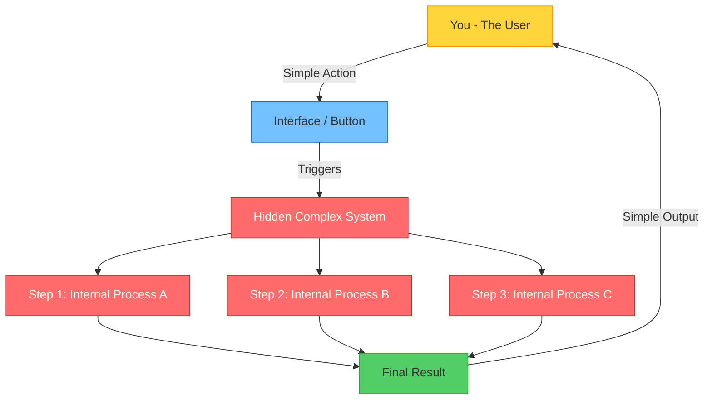

> **In programming:** Abstraction is the process of hiding implementation details and exposing only the functionality to the user. The user interacts with **what** an object does, not **how** it does it.

---

## Why Abstraction is Needed 🤔

### Problems Without Abstraction

Imagine you're building a large e-commerce application. Without abstraction:

```java
// ❌ Without Abstraction - Everything is exposed and tightly coupled
class OrderProcessor {
    public void processOrder(String item, int qty, String paymentType) {
        // Payment logic directly embedded
        if (paymentType.equals("CREDIT_CARD")) {
            // 50 lines of credit card processing code
            System.out.println("Connecting to Visa gateway...");
            System.out.println("Encrypting card data...");
            System.out.println("Sending to bank...");
            System.out.println("Verifying CVV...");
            System.out.println("Charging card...");
        } else if (paymentType.equals("UPI")) {
            // 50 lines of UPI processing code
            System.out.println("Connecting to UPI server...");
            System.out.println("Sending VPA request...");
            System.out.println("Waiting for PIN...");
        } else if (paymentType.equals("PAYPAL")) {
            // 50 lines of PayPal processing code
            System.out.println("Redirecting to PayPal...");
            System.out.println("Authenticating...");
        }
        // What if we need to add 10 more payment methods?
        // This class becomes MASSIVE and UNMAINTAINABLE!
    }
}
```

**Problems:**
- 🔴 **Tight coupling** — Everything depends on everything else
- 🔴 **Hard to maintain** — Adding a new payment type means modifying existing code
- 🔴 **No reusability** — Can't reuse payment logic elsewhere
- 🔴 **Hard to test** — Can't test one payment method independently
- 🔴 **Violates Open/Closed Principle** — Must modify existing code for every change

### How Abstraction Solves These Issues

```java
// ✅ With Abstraction - Clean, extensible, maintainable
interface PaymentMethod {
    void pay(double amount);     // WHAT it does
    boolean validate();          // WHAT it does
    // HOW it does it? Each implementation decides!
}

class CreditCardPayment implements PaymentMethod {
    public void pay(double amount) { /* credit card specific logic */ }
    public boolean validate() { /* credit card validation */ return true; }
}

class UPIPayment implements PaymentMethod {
    public void pay(double amount) { /* UPI specific logic */ }
    public boolean validate() { /* UPI validation */ return true; }
}

// Adding a new payment method? Just create a new class!
class CryptoPayment implements PaymentMethod {
    public void pay(double amount) { /* crypto specific logic */ }
    public boolean validate() { /* crypto validation */ return true; }
}

class OrderProcessor {
    public void processOrder(String item, int qty, PaymentMethod payment) {
        if (payment.validate()) {
            payment.pay(qty * 100.0);  // Doesn't care HOW payment works!
        }
    }
}
```

**Benefits:**
- ✅ **Loose coupling** — Components are independent
- ✅ **Easy to extend** — Add new payment methods without touching existing code
- ✅ **Reusable** — Payment logic can be used anywhere
- ✅ **Testable** — Each payment method can be tested independently
- ✅ **Clean code** — Each class has a single responsibility

### Benefits in Large-Scale / Enterprise Applications

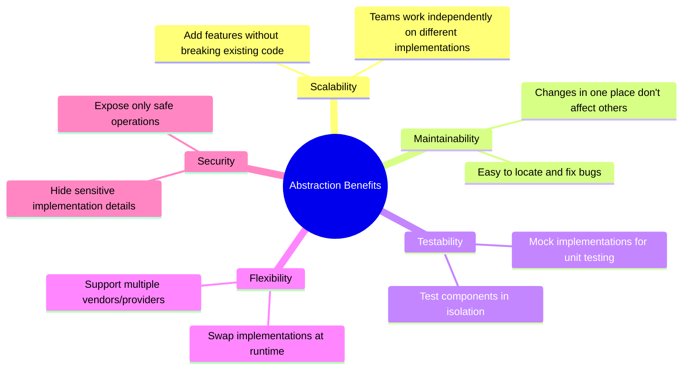

---

## What Abstraction Actually Does 🔍

### What It Hides 🙈

- **Implementation details** — The internal algorithms and logic
- **Complex operations** — Multi-step processes
- **Data structures** — How data is stored internally
- **Third-party dependencies** — External libraries and APIs used
- **Error handling complexity** — Internal retry logic, fallback mechanisms

### What It Exposes 👁️

- **Method signatures** — What operations are available
- **Input/output contracts** — What goes in and what comes out
- **Behavior definition** — What the operation promises to do
- **Public API** — The interface that users interact with

### How It Reduces Complexity

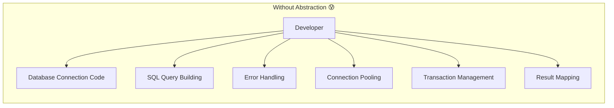

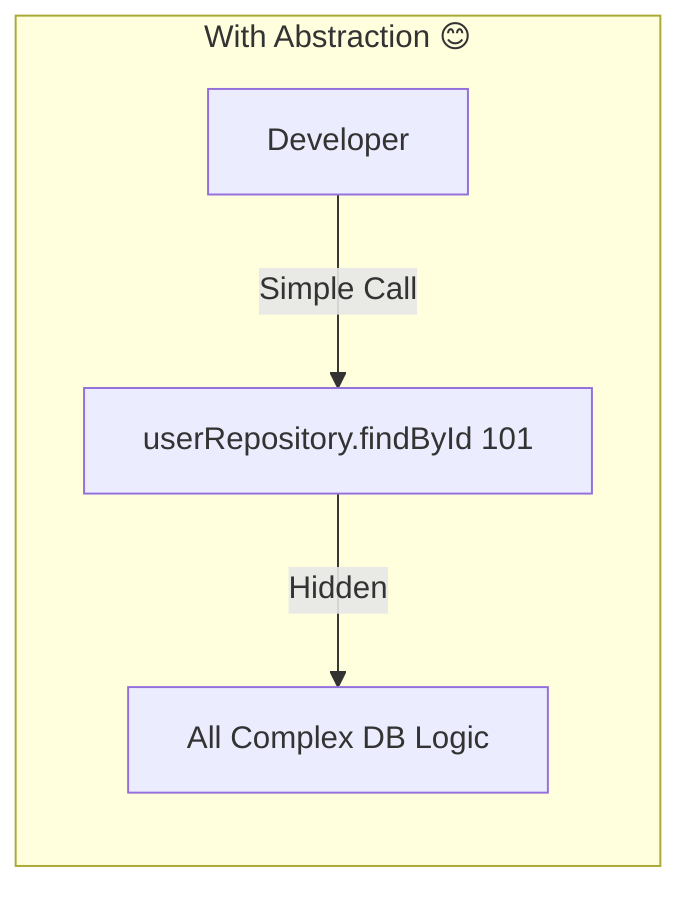

**Think of it as layers:**

| Layer | Visible To | Hidden From |
|-------|-----------|-------------|
| User clicks "Pay Now" button | User | — |
| `paymentService.processPayment()` | Frontend Developer | User |
| Credit card encryption, bank API calls | Backend Developer | Frontend Developer |
| Network protocols, byte-level operations | System Engineer | Backend Developer |

> **Key Insight:** Each layer abstracts away complexity for the layer above it. You only deal with what's relevant to YOUR level.

---

## Core Concepts Involved in Abstraction 🧩

### 1. Abstract Classes

An **abstract class** is a class that **cannot be instantiated** on its own. It serves as a **blueprint** for other classes.

- Declared using the `abstract` keyword
- Can have both abstract methods (no body) AND concrete methods (with body)
- Can have constructors, fields, and instance variables
- A child class **must** implement all abstract methods (or be abstract itself)

```java
abstract class Animal {
    String name;

    // Constructor — yes, abstract classes CAN have constructors!
    Animal(String name) {
        this.name = name;
    }

    // Abstract method — NO body, just the signature
    abstract void makeSound();

    // Concrete method — HAS a body
    void breathe() {
        System.out.println(name + " is breathing...");
    }
}
```

### 2. Interfaces

An **interface** is a **100% abstract contract** that defines what a class must do, but not how.

- Declared using the `interface` keyword
- All methods are `public abstract` by default (before Java 8)
- All fields are `public static final` by default (constants)
- A class can implement **multiple** interfaces
- Since Java 8: can have `default` and `static` methods
- Since Java 9: can have `private` methods

```java
interface Flyable {
    void fly();           // abstract by default
    int getMaxAltitude(); // abstract by default

    // Default method (Java 8+)
    default void land() {
        System.out.println("Landing safely...");
    }
}
```

### 3. Abstract Methods

An **abstract method** is a method that is **declared but not implemented**. It has:
- A return type
- A name
- Parameters (if any)
- **No body** (no curly braces `{}`)

```java
// Abstract method — just the definition
abstract void calculateArea();

// Concrete method — has the implementation
void calculateArea() {
    double area = length * width;
    System.out.println("Area: " + area);
}
```

### 4. Implementation vs Definition

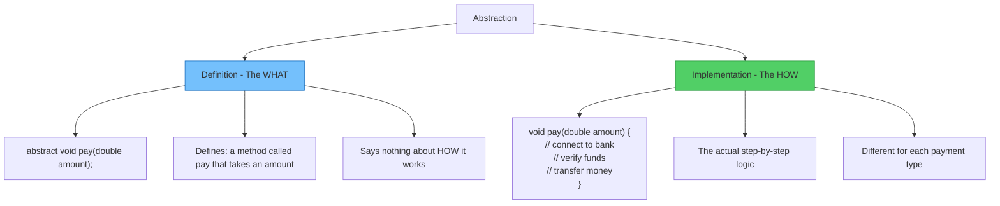

### 5. Relationship with Other OOP Pillars

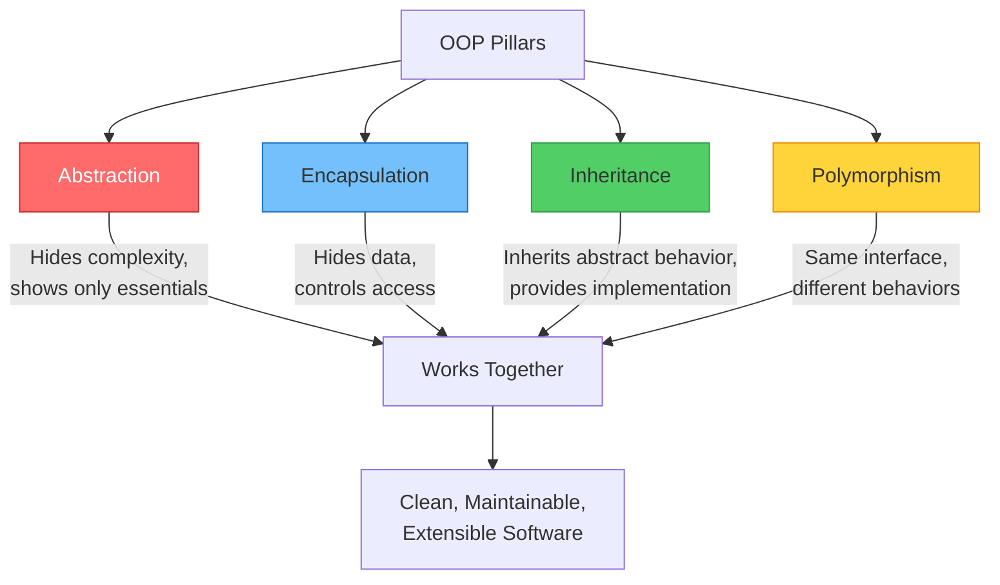

| Pillar | Focus | Example |
|--------|-------|---------|
| **Abstraction** | Hiding **complexity** | You call `car.start()` without knowing engine internals |
| **Encapsulation** | Hiding **data** | `private double balance` with getter/setter |
| **Inheritance** | **Reusing** behavior | `ElectricCar extends Car` |
| **Polymorphism** | **Same interface**, different behavior | `car.start()` works differently for Electric vs Diesel |

> **How they connect:** Abstraction defines the blueprint → Inheritance lets subclasses adopt it → Polymorphism lets them behave differently → Encapsulation protects the internal state.

---

## How Abstraction is Implemented in Java ⚙️

### Using Abstract Classes

```java
// Step 1: Define the abstract class (the blueprint)
abstract class Shape {
    String color;

    Shape(String color) {
        this.color = color;
    }

    // Abstract methods — subclasses MUST implement these
    abstract double calculateArea();
    abstract double calculatePerimeter();

    // Concrete method — shared by all shapes
    void displayInfo() {
        System.out.println("Shape Color: " + color);
        System.out.println("Area: " + calculateArea());
        System.out.println("Perimeter: " + calculatePerimeter());
    }
}

// Step 2: Create concrete subclasses with implementations
class Circle extends Shape {
    double radius;

    Circle(String color, double radius) {
        super(color);
        this.radius = radius;
    }

    @Override
    double calculateArea() {
        return Math.PI * radius * radius;
    }

    @Override
    double calculatePerimeter() {
        return 2 * Math.PI * radius;
    }
}

class Rectangle extends Shape {
    double length, width;

    Rectangle(String color, double length, double width) {
        super(color);
        this.length = length;
        this.width = width;
    }

    @Override
    double calculateArea() {
        return length * width;
    }

    @Override
    double calculatePerimeter() {
        return 2 * (length + width);
    }
}

// Step 3: Use it
public class Main {
    public static void main(String[] args) {
        Shape circle = new Circle("Red", 5.0);
        Shape rectangle = new Rectangle("Blue", 4.0, 6.0);

        circle.displayInfo();
        System.out.println();
        rectangle.displayInfo();

        // Shape s = new Shape("Green"); // ❌ ERROR! Can't instantiate abstract class!
    }
}
```

**Output:**
```
Shape Color: Red
Area: 78.53981633974483
Perimeter: 31.41592653589793

Shape Color: Blue
Area: 24.0
Perimeter: 20.0
```

### Using Interfaces

```java
// Step 1: Define interfaces (the contracts)
interface Drawable {
    void draw();
    void resize(double factor);
}

interface Printable {
    void print();
}

// Step 2: A class can implement MULTIPLE interfaces
class Report implements Drawable, Printable {
    String title;

    Report(String title) {
        this.title = title;
    }

    @Override
    public void draw() {
        System.out.println("Drawing report: " + title);
    }

    @Override
    public void resize(double factor) {
        System.out.println("Resizing report by factor: " + factor);
    }

    @Override
    public void print() {
        System.out.println("Printing report: " + title);
    }
}

// Step 3: Use it
public class Main {
    public static void main(String[] args) {
        Report report = new Report("Annual Sales");

        report.draw();
        report.resize(1.5);
        report.print();
    }
}
```

### When to Choose Abstract Class vs Interface

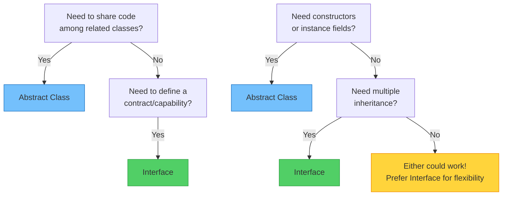

| Feature | Abstract Class | Interface |
|---------|---------------|-----------|
| **Keyword** | `abstract class` | `interface` |
| **Methods** | Abstract + Concrete | Abstract (+ default/static since Java 8) |
| **Fields** | Instance variables allowed | Only `public static final` constants |
| **Constructors** | ✅ Yes | ❌ No |
| **Multiple Inheritance** | ❌ No (single extends) | ✅ Yes (multiple implements) |
| **Access Modifiers** | Any (`private`, `protected`, etc.) | `public` only (for abstract methods) |
| **When to Use** | "IS-A" relationship with shared code | "CAN-DO" capability / contract |
| **Example** | `Animal` → `Dog`, `Cat` | `Flyable` → `Bird`, `Airplane` |

### Rules and Limitations

#### Abstract Class Rules:
1. ✅ Can have abstract and non-abstract methods
2. ✅ Can have constructors (called via `super()`)
3. ✅ Can have `static`, `final`, and instance variables
4. ❌ Cannot be instantiated directly with `new`
5. ✅ A class can extend only ONE abstract class
6. ✅ If a subclass doesn't implement all abstract methods, it must also be `abstract`

#### Interface Rules:
1. ✅ All methods are `public abstract` by default
2. ✅ All variables are `public static final` by default
3. ❌ Cannot have constructors
4. ❌ Cannot have instance variables
5. ✅ A class can implement MULTIPLE interfaces
6. ✅ An interface can extend multiple interfaces
7. ✅ Since Java 8: `default` and `static` methods allowed
8. ✅ Since Java 9: `private` methods allowed

---

## Real-World Examples 🌍

### 1. ATM Machine 🏧

You use an ATM every day. You interact with a simple screen, but behind that screen, there's a massive banking system working.

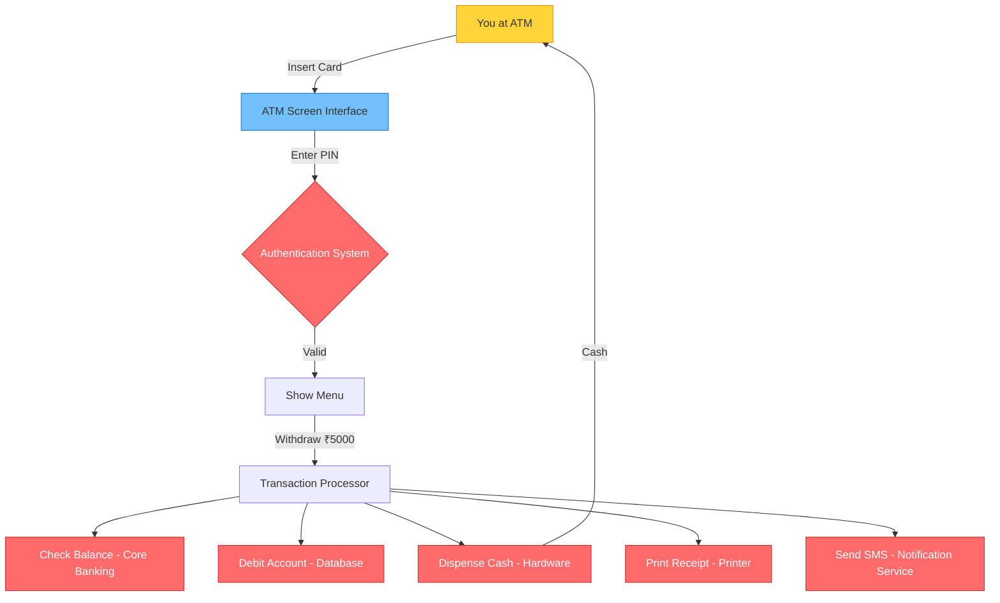

**What you see (Abstraction):** Withdraw, Deposit, Check Balance, Transfer
**What's hidden:** Network calls, encryption, database queries, hardware commands, audit logging

```java
// The abstract interface you interact with
interface ATMOperations {
    void withdraw(double amount);
    void deposit(double amount);
    double checkBalance();
    void transfer(String toAccount, double amount);
}

// The hidden complex implementation
class ATMMachine implements ATMOperations {
    private BankServer bankServer;
    private CashDispenser cashDispenser;
    private ReceiptPrinter printer;
    private SMSService smsService;

    @Override
    public void withdraw(double amount) {
        // Step 1: Verify with bank server (hidden)
        boolean approved = bankServer.verifyFunds(amount);
        // Step 2: Debit account (hidden)
        if (approved) bankServer.debitAccount(amount);
        // Step 3: Dispense cash (hidden)
        cashDispenser.dispenseCash(amount);
        // Step 4: Print receipt (hidden)
        printer.printReceipt("Withdrawal", amount);
        // Step 5: Send notification (hidden)
        smsService.sendAlert("Withdrawn: ₹" + amount);
    }

    // ... other implementations
    @Override
    public void deposit(double amount) { /* complex hidden logic */ }
    @Override
    public double checkBalance() { return 0.0; /* complex hidden logic */ }
    @Override
    public void transfer(String toAccount, double amount) { /* complex hidden logic */ }
}
```

### 2. Car Driving 🚗

```java
// What the driver sees — the abstraction
abstract class Vehicle {
    abstract void start();
    abstract void accelerate();
    abstract void brake();
    abstract void steer(String direction);
}

// Hidden complexity — Petrol car implementation
class PetrolCar extends Vehicle {
    @Override
    void start() {
        // Hidden: ignition → fuel pump → spark plug → engine cranks
        System.out.println("Petrol car started (key ignition)");
    }

    @Override
    void accelerate() {
        // Hidden: throttle → fuel injection → combustion → gear ratio
        System.out.println("Petrol car accelerating (combustion engine)");
    }

    @Override
    void brake() {
        // Hidden: brake fluid pressure → brake pads → disc friction
        System.out.println("Petrol car braking (hydraulic brakes)");
    }

    @Override
    void steer(String direction) {
        System.out.println("Steering " + direction + " (power steering pump)");
    }
}

// Hidden complexity — Electric car implementation (COMPLETELY different internals!)
class ElectricCar extends Vehicle {
    @Override
    void start() {
        // Hidden: battery check → motor controller → ready signal
        System.out.println("Electric car started (push button, silent)");
    }

    @Override
    void accelerate() {
        // Hidden: battery → inverter → electric motor → instant torque
        System.out.println("Electric car accelerating (electric motor)");
    }

    @Override
    void brake() {
        // Hidden: regenerative braking → energy recovery → battery charge
        System.out.println("Electric car braking (regenerative braking)");
    }

    @Override
    void steer(String direction) {
        System.out.println("Steering " + direction + " (electric power steering)");
    }
}

// The driver doesn't care about internal differences!
public class Driver {
    public static void main(String[] args) {
        Vehicle myCar = new ElectricCar();  // or new PetrolCar()
        myCar.start();          // Same interface
        myCar.accelerate();     // Same interface
        myCar.steer("left");    // Same interface
        myCar.brake();          // Same interface
        // Driver uses the SAME controls regardless of engine type!
    }
}
```

### 3. Remote Control 📱

```java
interface RemoteControl {
    void powerOn();
    void powerOff();
    void volumeUp();
    void volumeDown();
    void changeChannel(int channel);
}

class TVRemote implements RemoteControl {
    public void powerOn()  { System.out.println("TV: Powering ON (LCD backlight, OS boot, signal tuning)"); }
    public void powerOff() { System.out.println("TV: Powering OFF (safe shutdown)"); }
    public void volumeUp()   { System.out.println("TV: Volume UP (audio amplifier adjusted)"); }
    public void volumeDown() { System.out.println("TV: Volume DOWN"); }
    public void changeChannel(int ch) { System.out.println("TV: Channel " + ch + " (frequency tuned)"); }
}

class ACRemote implements RemoteControl {
    public void powerOn()  { System.out.println("AC: Compressor starting, coolant flowing..."); }
    public void powerOff() { System.out.println("AC: Compressor stopping, fan winding down..."); }
    public void volumeUp()   { System.out.println("AC: Temperature UP (thermostat adjusted)"); }
    public void volumeDown() { System.out.println("AC: Temperature DOWN"); }
    public void changeChannel(int mode) { System.out.println("AC: Mode changed to " + mode); }
}
```

### 4. Payment System 💳

```java
interface PaymentGateway {
    boolean authenticate();
    boolean processPayment(double amount);
    String getTransactionId();
    void sendReceipt(String email);
}

class CreditCardPayment implements PaymentGateway {
    private String cardNumber;
    private String cvv;

    CreditCardPayment(String cardNumber, String cvv) {
        this.cardNumber = cardNumber;
        this.cvv = cvv;
    }

    public boolean authenticate() {
        System.out.println("Authenticating credit card...");
        System.out.println("  → Connecting to Visa/Mastercard network");
        System.out.println("  → Verifying card number and CVV");
        System.out.println("  → 3D Secure check");
        return true;
    }

    public boolean processPayment(double amount) {
        System.out.println("Processing ₹" + amount + " via Credit Card");
        System.out.println("  → Reserving funds on card");
        System.out.println("  → Charging merchant account");
        return true;
    }

    public String getTransactionId() { return "CC-" + System.currentTimeMillis(); }
    public void sendReceipt(String email) { System.out.println("Receipt sent to " + email); }
}

class UPIPayment implements PaymentGateway {
    private String vpa;

    UPIPayment(String vpa) {
        this.vpa = vpa;
    }

    public boolean authenticate() {
        System.out.println("Authenticating UPI...");
        System.out.println("  → Verifying VPA: " + vpa);
        System.out.println("  → Sending PIN request to phone");
        return true;
    }

    public boolean processPayment(double amount) {
        System.out.println("Processing ₹" + amount + " via UPI");
        System.out.println("  → NPCI routing");
        System.out.println("  → Bank-to-bank transfer");
        return true;
    }

    public String getTransactionId() { return "UPI-" + System.currentTimeMillis(); }
    public void sendReceipt(String email) { System.out.println("Receipt sent to " + email); }
}

// The checkout system doesn't care WHICH payment method is used!
class CheckoutService {
    void checkout(PaymentGateway payment, double amount, String email) {
        if (payment.authenticate()) {
            if (payment.processPayment(amount)) {
                String txnId = payment.getTransactionId();
                System.out.println("✅ Payment successful! TXN: " + txnId);
                payment.sendReceipt(email);
            }
        }
    }
}
```

### 5. Restaurant Ordering System 🍽️

```java
// Abstract concept: Any food order
abstract class FoodOrder {
    String customerName;
    String orderId;

    FoodOrder(String customerName) {
        this.customerName = customerName;
        this.orderId = "ORD-" + System.currentTimeMillis();
    }

    // What every order must do (abstract)
    abstract void prepare();
    abstract double calculateTotal();
    abstract int getEstimatedTime(); // in minutes

    // Common behavior (concrete)
    void placeOrder() {
        System.out.println("\n🧾 Order placed by: " + customerName);
        System.out.println("Order ID: " + orderId);
        System.out.println("Total: ₹" + calculateTotal());
        System.out.println("Estimated Time: " + getEstimatedTime() + " mins");
        prepare();
    }
}

class DineInOrder extends FoodOrder {
    int tableNumber;
    String[] items;

    DineInOrder(String customerName, int tableNumber, String[] items) {
        super(customerName);
        this.tableNumber = tableNumber;
        this.items = items;
    }

    @Override
    void prepare() {
        System.out.println("👨‍🍳 Preparing for Table " + tableNumber);
        System.out.println("  → Kitchen receives order");
        System.out.println("  → Chef starts cooking");
        System.out.println("  → Waiter will serve at table");
    }

    @Override
    double calculateTotal() {
        return items.length * 250.0; // simplified pricing
    }

    @Override
    int getEstimatedTime() { return 20; }
}

class DeliveryOrder extends FoodOrder {
    String address;
    String[] items;

    DeliveryOrder(String customerName, String address, String[] items) {
        super(customerName);
        this.address = address;
        this.items = items;
    }

    @Override
    void prepare() {
        System.out.println("📦 Preparing for Delivery to: " + address);
        System.out.println("  → Kitchen receives order");
        System.out.println("  → Chef starts cooking");
        System.out.println("  → Packing in delivery containers");
        System.out.println("  → Assigning delivery partner");
    }

    @Override
    double calculateTotal() {
        return (items.length * 250.0) + 50.0; // food + delivery charge
    }

    @Override
    int getEstimatedTime() { return 40; }
}

// Usage
public class Restaurant {
    public static void main(String[] args) {
        FoodOrder order1 = new DineInOrder("Rahul", 5, new String[]{"Biryani", "Naan"});
        FoodOrder order2 = new DeliveryOrder("Priya", "123 Main St", new String[]{"Pizza", "Pasta", "Garlic Bread"});

        order1.placeOrder();
        order2.placeOrder();
    }
}
```

---

## Mermaid Diagrams 📊

### Conceptual Diagram: What Abstraction Hides

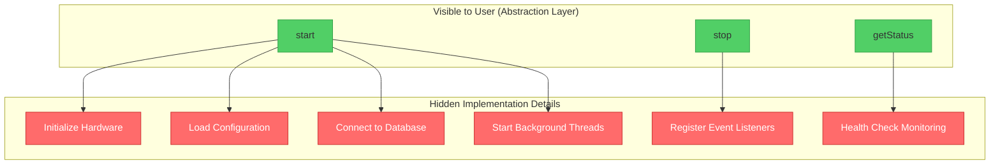

### Class Diagram: Abstract Shape Hierarchy

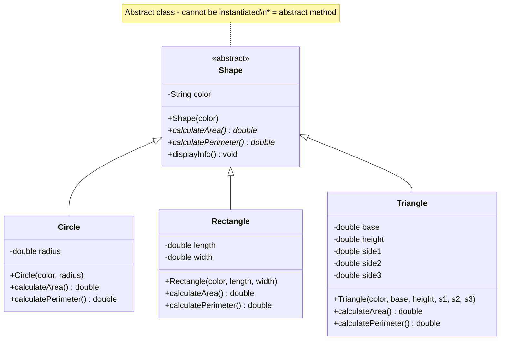

### Class Diagram: Interface-Based Payment System

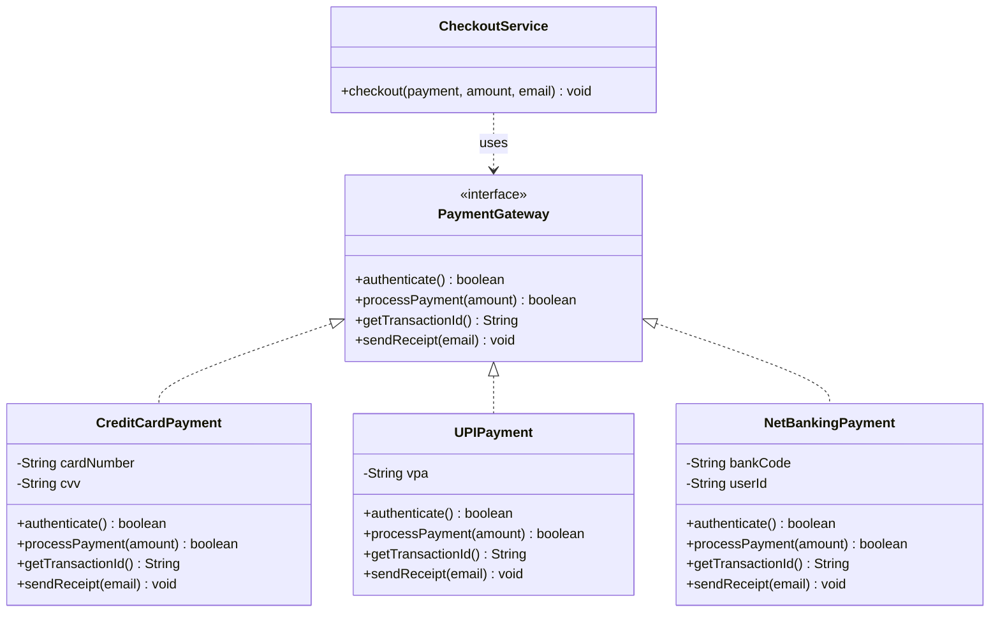

### Flow Diagram: How Hidden Implementation Works

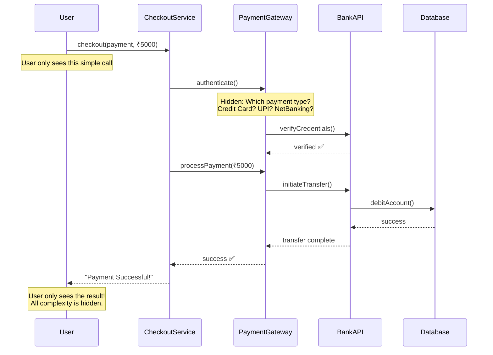

---

## Practical Coding Examples 💻

### 1. Simple Beginner-Level Example

```java
// Abstract class: defines WHAT a Notification does
abstract class Notification {
    String recipient;
    String message;

    Notification(String recipient, String message) {
        this.recipient = recipient;
        this.message = message;
    }

    // Abstract — each notification type sends differently
    abstract void send();

    // Concrete — common for all
    void logNotification() {
        System.out.println("[LOG] Notification sent to: " + recipient);
    }
}

// Email notification — HOW it sends via email
class EmailNotification extends Notification {
    EmailNotification(String recipient, String message) {
        super(recipient, message);
    }

    @Override
    void send() {
        System.out.println("📧 Sending EMAIL to " + recipient);
        System.out.println("   Subject: Notification");
        System.out.println("   Body: " + message);
        logNotification();
    }
}

// SMS notification — HOW it sends via SMS
class SMSNotification extends Notification {
    SMSNotification(String recipient, String message) {
        super(recipient, message);
    }

    @Override
    void send() {
        System.out.println("📱 Sending SMS to " + recipient);
        System.out.println("   Message: " + message);
        logNotification();
    }
}

// Push notification — HOW it sends via app
class PushNotification extends Notification {
    PushNotification(String recipient, String message) {
        super(recipient, message);
    }

    @Override
    void send() {
        System.out.println("🔔 Sending PUSH to device: " + recipient);
        System.out.println("   Alert: " + message);
        logNotification();
    }
}

public class Main {
    public static void main(String[] args) {
        // All are treated as "Notification" — abstraction!
        Notification n1 = new EmailNotification("john@email.com", "Your order is shipped!");
        Notification n2 = new SMSNotification("+91-9876543210", "OTP: 123456");
        Notification n3 = new PushNotification("device-token-abc", "New message received!");

        n1.send();
        System.out.println();
        n2.send();
        System.out.println();
        n3.send();
    }
}
```

**Output:**
```
📧 Sending EMAIL to john@email.com
   Subject: Notification
   Body: Your order is shipped!
[LOG] Notification sent to: john@email.com

📱 Sending SMS to +91-9876543210
   Message: OTP: 123456
[LOG] Notification sent to: +91-9876543210

🔔 Sending PUSH to device: device-token-abc
   Alert: New message received!
[LOG] Notification sent to: device-token-abc
```

### 2. Real-World Enterprise-Style Example: PaymentService

```java
// ========== INTERFACES (Contracts) ==========

interface PaymentProcessor {
    boolean validatePayment(double amount);
    String executePayment(double amount);
    void refund(String transactionId, double amount);
}

interface PaymentLogger {
    void logTransaction(String transactionId, String type, double amount);
    void logError(String message);
}

interface FraudDetector {
    boolean isSuspicious(double amount, String paymentMethod);
}

// ========== IMPLEMENTATIONS (Hidden Details) ==========

class StripePaymentProcessor implements PaymentProcessor {
    @Override
    public boolean validatePayment(double amount) {
        System.out.println("  [Stripe] Validating payment of ₹" + amount);
        return amount > 0 && amount < 1000000;
    }

    @Override
    public String executePayment(double amount) {
        System.out.println("  [Stripe] Processing payment through Stripe API...");
        System.out.println("  [Stripe] Connecting to payment network...");
        System.out.println("  [Stripe] Funds transferred successfully");
        return "STRIPE-TXN-" + System.currentTimeMillis();
    }

    @Override
    public void refund(String transactionId, double amount) {
        System.out.println("  [Stripe] Refunding ₹" + amount + " for TXN: " + transactionId);
    }
}

class RazorpayPaymentProcessor implements PaymentProcessor {
    @Override
    public boolean validatePayment(double amount) {
        System.out.println("  [Razorpay] Validating payment of ₹" + amount);
        return amount > 0 && amount < 500000;
    }

    @Override
    public String executePayment(double amount) {
        System.out.println("  [Razorpay] Processing payment through Razorpay API...");
        System.out.println("  [Razorpay] UPI/Card charge initiated...");
        System.out.println("  [Razorpay] Payment captured");
        return "RZRPY-TXN-" + System.currentTimeMillis();
    }

    @Override
    public void refund(String transactionId, double amount) {
        System.out.println("  [Razorpay] Refunding ₹" + amount + " for TXN: " + transactionId);
    }
}

class ConsolePaymentLogger implements PaymentLogger {
    @Override
    public void logTransaction(String transactionId, String type, double amount) {
        System.out.println("  [LOG] TXN: " + transactionId + " | Type: " + type + " | Amount: ₹" + amount);
    }

    @Override
    public void logError(String message) {
        System.out.println("  [ERROR LOG] " + message);
    }
}

class SimpleFraudDetector implements FraudDetector {
    @Override
    public boolean isSuspicious(double amount, String paymentMethod) {
        boolean suspicious = amount > 100000;
        if (suspicious) {
            System.out.println("  ⚠️ [FRAUD] High amount flagged: ₹" + amount);
        }
        return suspicious;
    }
}

// ========== SERVICE LAYER (Uses Abstractions) ==========

class PaymentService {
    // Depends on ABSTRACTIONS, not concrete classes!
    private PaymentProcessor processor;
    private PaymentLogger logger;
    private FraudDetector fraudDetector;

    // Dependencies injected — can swap implementations easily!
    PaymentService(PaymentProcessor processor, PaymentLogger logger, FraudDetector fraudDetector) {
        this.processor = processor;
        this.logger = logger;
        this.fraudDetector = fraudDetector;
    }

    String makePayment(double amount) {
        System.out.println("\n💰 Processing payment of ₹" + amount);

        // Step 1: Fraud check
        if (fraudDetector.isSuspicious(amount, "CARD")) {
            logger.logError("Payment blocked — fraud detected");
            return null;
        }

        // Step 2: Validate
        if (!processor.validatePayment(amount)) {
            logger.logError("Payment validation failed");
            return null;
        }

        // Step 3: Execute
        String txnId = processor.executePayment(amount);
        logger.logTransaction(txnId, "PAYMENT", amount);

        System.out.println("✅ Payment successful! TXN ID: " + txnId);
        return txnId;
    }

    void processRefund(String txnId, double amount) {
        System.out.println("\n🔄 Processing refund of ₹" + amount);
        processor.refund(txnId, amount);
        logger.logTransaction(txnId, "REFUND", amount);
        System.out.println("✅ Refund processed!");
    }
}

// ========== MAIN ==========
public class ECommerceApp {
    public static void main(String[] args) {
        // Using Stripe
        PaymentService stripeService = new PaymentService(
            new StripePaymentProcessor(),
            new ConsolePaymentLogger(),
            new SimpleFraudDetector()
        );

        String txnId = stripeService.makePayment(5000);
        if (txnId != null) {
            stripeService.processRefund(txnId, 2000);
        }

        System.out.println("\n========================================");

        // Switching to Razorpay — ZERO code changes in PaymentService!
        PaymentService razorpayService = new PaymentService(
            new RazorpayPaymentProcessor(),
            new ConsolePaymentLogger(),
            new SimpleFraudDetector()
        );

        razorpayService.makePayment(3000);

        System.out.println("\n========================================");

        // High amount — fraud detection triggers
        stripeService.makePayment(200000);
    }
}
```

### 3. Before vs After Abstraction Comparison

#### ❌ BEFORE — Tightly Coupled, No Abstraction

```java
class ReportGenerator {
    // Directly depends on concrete implementations — BAD!
    void generatePDFReport(String data) {
        System.out.println("Connecting to PDF library...");
        System.out.println("Formatting data for PDF...");
        System.out.println("Writing PDF file...");
    }

    void generateExcelReport(String data) {
        System.out.println("Connecting to Excel library...");
        System.out.println("Creating spreadsheet...");
        System.out.println("Writing Excel file...");
    }

    void generateHTMLReport(String data) {
        System.out.println("Building HTML structure...");
        System.out.println("Applying CSS styles...");
        System.out.println("Writing HTML file...");
    }

    // Want to add CSV? Must modify this class!
    // Want to add XML? Must modify this class!
    // This class grows FOREVER and becomes unmaintainable!
}

class App {
    public static void main(String[] args) {
        ReportGenerator generator = new ReportGenerator();
        String reportType = "PDF";

        // Ugly if-else chain
        if (reportType.equals("PDF")) {
            generator.generatePDFReport("Sales Data");
        } else if (reportType.equals("Excel")) {
            generator.generateExcelReport("Sales Data");
        } else if (reportType.equals("HTML")) {
            generator.generateHTMLReport("Sales Data");
        }
        // Adding a new format means changing BOTH the generator AND this code!
    }
}
```

#### ✅ AFTER — Loosely Coupled, With Abstraction

```java
// Step 1: Define the abstraction
interface ReportExporter {
    void export(String data, String fileName);
    String getFormat();
}

// Step 2: Each format implements the interface
class PDFExporter implements ReportExporter {
    @Override
    public void export(String data, String fileName) {
        System.out.println("📄 Exporting PDF: " + fileName);
        System.out.println("  → Connecting to PDF library");
        System.out.println("  → Formatting and writing PDF");
    }
    @Override
    public String getFormat() { return "PDF"; }
}

class ExcelExporter implements ReportExporter {
    @Override
    public void export(String data, String fileName) {
        System.out.println("📊 Exporting Excel: " + fileName);
        System.out.println("  → Creating spreadsheet");
        System.out.println("  → Writing Excel file");
    }
    @Override
    public String getFormat() { return "Excel"; }
}

class HTMLExporter implements ReportExporter {
    @Override
    public void export(String data, String fileName) {
        System.out.println("🌐 Exporting HTML: " + fileName);
        System.out.println("  → Building HTML structure");
        System.out.println("  → Applying styles and writing");
    }
    @Override
    public String getFormat() { return "HTML"; }
}

// Adding CSV? Just create a new class — NO changes to existing code!
class CSVExporter implements ReportExporter {
    @Override
    public void export(String data, String fileName) {
        System.out.println("📋 Exporting CSV: " + fileName);
        System.out.println("  → Converting data to CSV format");
        System.out.println("  → Writing CSV file");
    }
    @Override
    public String getFormat() { return "CSV"; }
}

// Step 3: ReportGenerator depends on abstraction, not concrete classes
class ReportGenerator {
    private ReportExporter exporter;

    ReportGenerator(ReportExporter exporter) {
        this.exporter = exporter;
    }

    void generate(String data, String fileName) {
        System.out.println("Generating " + exporter.getFormat() + " report...");
        exporter.export(data, fileName);
        System.out.println("✅ Report generated successfully!\n");
    }
}

// Step 4: Clean usage
class App {
    public static void main(String[] args) {
        // Easy to switch — just change the exporter!
        ReportGenerator pdfReport = new ReportGenerator(new PDFExporter());
        pdfReport.generate("Sales Data 2024", "sales_report");

        ReportGenerator excelReport = new ReportGenerator(new ExcelExporter());
        excelReport.generate("Inventory Data", "inventory_report");

        ReportGenerator csvReport = new ReportGenerator(new CSVExporter());
        csvReport.generate("User Data", "users_export");
    }
}
```

### 4. Demonstrating Loose Coupling

```java
// Without abstraction — TIGHT coupling
class EmailService {
    void sendEmail(String to, String msg) {
        System.out.println("Sending email to " + to);
    }
}

class UserRegistration {
    private EmailService emailService = new EmailService(); // ← directly depends on EmailService

    void register(String user) {
        System.out.println("Registering: " + user);
        emailService.sendEmail(user, "Welcome!"); // ← can ONLY send emails
        // What if we want SMS? Must change this class!
    }
}
```

```java
// With abstraction — LOOSE coupling
interface NotificationService {
    void notify(String to, String message);
}

class EmailServiceImpl implements NotificationService {
    public void notify(String to, String message) {
        System.out.println("📧 Email to " + to + ": " + message);
    }
}

class SMSServiceImpl implements NotificationService {
    public void notify(String to, String message) {
        System.out.println("📱 SMS to " + to + ": " + message);
    }
}

class SlackServiceImpl implements NotificationService {
    public void notify(String to, String message) {
        System.out.println("💬 Slack to " + to + ": " + message);
    }
}

class UserRegistration {
    private NotificationService notifier; // ← depends on ABSTRACTION

    UserRegistration(NotificationService notifier) {
        this.notifier = notifier; // ← injected from outside
    }

    void register(String user) {
        System.out.println("Registering: " + user);
        notifier.notify(user, "Welcome!"); // ← works with ANY notification service
    }
}

public class Main {
    public static void main(String[] args) {
        // Easy to swap notification methods!
        UserRegistration reg1 = new UserRegistration(new EmailServiceImpl());
        reg1.register("john@email.com");

        UserRegistration reg2 = new UserRegistration(new SMSServiceImpl());
        reg2.register("+91-9876543210");

        UserRegistration reg3 = new UserRegistration(new SlackServiceImpl());
        reg3.register("@john");
    }
}
```

**Output:**
```
Registering: john@email.com
📧 Email to john@email.com: Welcome!
Registering: +91-9876543210
📱 SMS to +91-9876543210: Welcome!
Registering: @john
💬 Slack to @john: Welcome!
```

---

## Common Mistakes and Misconceptions ⚠️

### 1. Abstraction vs Encapsulation

This is the **#1 most confused** pair in OOP!

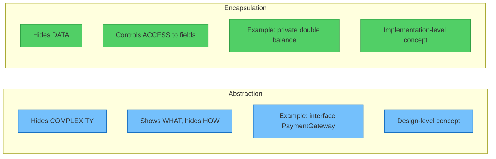

| Aspect | Abstraction | Encapsulation |
|--------|------------|---------------|
| **What it hides** | Implementation complexity | Data/fields |
| **Purpose** | Simplify by showing only essentials | Protect data from misuse |
| **How achieved** | Abstract classes, interfaces | Access modifiers (`private`, getters/setters) |
| **Level** | Design level | Code level |
| **Analogy** | Car steering wheel (hides engine) | Bank vault (hides money) |

> **Remember:** Abstraction is about **hiding complexity**. Encapsulation is about **hiding data**.
> They work together but are NOT the same thing!

### 2. Abstraction vs Inheritance

| Aspect | Abstraction | Inheritance |
|--------|------------|-------------|
| **Purpose** | Hide complexity, define contracts | Reuse code, establish hierarchy |
| **Keyword** | `abstract`, `interface` | `extends`, `implements` |
| **Focus** | WHAT to do | HOW to share behavior |
| **Analogy** | A job description | A son inheriting father's traits |

```java
// Abstraction — defines WHAT
abstract class Animal {
    abstract void makeSound(); // WHAT: every animal makes a sound
}

// Inheritance — reuses HOW
class Dog extends Animal {
    @Override
    void makeSound() {
        System.out.println("Bark!"); // HOW: a dog specifically barks
    }

    void fetch() { System.out.println("Fetching ball!"); }
}
```

> Inheritance is a **mechanism** used to **achieve** abstraction, but they are different concepts.

### 3. Overusing Abstraction

```java
// ❌ Over-abstraction — unnecessary layers
interface Addable {
    int add(int a, int b);
}

abstract class AbstractAdder implements Addable {
    abstract int add(int a, int b);
}

class SimpleAdder extends AbstractAdder {
    @Override
    public int add(int a, int b) {
        return a + b;
    }
}

// For a simple addition? This is OVERKILL!

// ✅ Just do this:
class Calculator {
    int add(int a, int b) {
        return a + b;
    }
}
```

**Signs of over-abstraction:**
- 🔴 Interfaces with only one implementation that will never change
- 🔴 Abstract classes with no shared behavior
- 🔴 Too many layers of indirection
- 🔴 You need to open 10 files to understand one feature
- 🔴 The abstraction doesn't simplify anything

### 4. Wrong Design Choices

```java
// ❌ Wrong: Using abstract class when interface is better
abstract class Loggable {
    abstract void log(String message);
    // No shared state, no shared behavior — should be an interface!
}

// ✅ Correct: Use interface for pure contracts
interface Loggable {
    void log(String message);
}
```

```java
// ❌ Wrong: Using interface when abstract class is better
interface Animal {
    String name = ""; // Can't have instance variables in interface!
    void eat();
    void sleep();
    // All animals eat and sleep the same way... repeated code in every class!
}

// ✅ Correct: Use abstract class for shared state and behavior
abstract class Animal {
    String name;
    Animal(String name) { this.name = name; }

    void eat() { System.out.println(name + " is eating"); }
    void sleep() { System.out.println(name + " is sleeping"); }

    abstract void makeSound(); // Only this varies!
}
```

---

## Interview Perspective 🎯

### How to Explain Abstraction in 2 Lines

> **"Abstraction is the OOP principle of hiding implementation details and showing only the essential features to the user. In Java, it is achieved using abstract classes and interfaces, where we define WHAT an object does without specifying HOW it does it."**

### Common Interview Questions with Answers

#### Q1: What is abstraction in Java?
**A:** Abstraction is the process of hiding complex implementation details and exposing only the necessary functionality. It lets us focus on **what** an object does rather than **how** it does it. In Java, we achieve abstraction using **abstract classes** (0-100% abstraction) and **interfaces** (100% abstraction).

#### Q2: What is the difference between abstract class and interface?
**A:**
- **Abstract class:** Can have abstract + concrete methods, instance variables, constructors. Supports single inheritance (`extends`). Use when classes share common state and behavior.
- **Interface:** All methods are abstract by default (Java 8+ allows `default`/`static`). Only constants. No constructors. Supports multiple inheritance (`implements`). Use to define a contract/capability.

#### Q3: Can we instantiate an abstract class?
**A:** No. Abstract classes cannot be instantiated directly. You must create a concrete subclass that implements all abstract methods, and then instantiate that subclass. However, you CAN use an abstract class as a reference type:
```java
Shape s = new Circle("Red", 5); // ✅ Reference is Shape, object is Circle
Shape s2 = new Shape("Blue");   // ❌ Compilation error!
```

#### Q4: Can an abstract class have a constructor?
**A:** Yes! Abstract classes can have constructors. They are called when a subclass is instantiated using `super()`. This is useful for initializing common fields.

#### Q5: Can an interface have method bodies?
**A:** Since Java 8, yes — using `default` and `static` methods. Since Java 9, `private` methods are also allowed. Regular interface methods (without these keywords) are still abstract and have no body.

#### Q6: When would you use abstraction in a real project?
**A:** When designing a system with multiple implementations of the same concept. For example:
- Multiple payment gateways (Stripe, Razorpay, PayPal)
- Multiple notification channels (Email, SMS, Push)
- Multiple database options (MySQL, PostgreSQL, MongoDB)
- Multiple export formats (PDF, Excel, CSV)

#### Q7: What is the difference between abstraction and encapsulation?
**A:** Abstraction hides **complexity** (shows WHAT, hides HOW) — achieved via abstract classes/interfaces. Encapsulation hides **data** (protects fields via access modifiers) — achieved via `private` fields and getters/setters. They complement each other but solve different problems.

#### Q8: Can we achieve 100% abstraction using abstract class?
**A:** Only if all methods are abstract (no concrete methods). However, this is essentially what an interface does, so for 100% abstraction, prefer interfaces. Abstract classes typically provide **partial** abstraction (some abstract + some concrete methods).

#### Q9: What happens if a class doesn't implement all abstract methods of its parent?
**A:** The class must itself be declared `abstract`. It becomes an intermediate abstract class, and the responsibility passes to its subclasses.

```java
abstract class Vehicle {
    abstract void start();
    abstract void stop();
}

// Doesn't implement all methods — MUST be abstract
abstract class MotorVehicle extends Vehicle {
    @Override
    void start() { System.out.println("Motor starting..."); }
    // stop() is still abstract!
}

// Now THIS class must implement stop()
class Car extends MotorVehicle {
    @Override
    void stop() { System.out.println("Car stopping with brakes"); }
}
```

#### Q10: What is "programming to an interface"?
**A:** It means your code should depend on abstractions (interfaces/abstract classes) rather than concrete implementations. This makes your code flexible, testable, and follows the Dependency Inversion Principle.

```java
// ❌ Programming to implementation
ArrayList<String> list = new ArrayList<>();

// ✅ Programming to interface
List<String> list = new ArrayList<>();
// Can easily switch to LinkedList without changing the rest of the code
```

---

## Best Practices ✅

### When to Use Abstraction

1. **Multiple implementations of the same concept**
   - Different payment gateways, notification channels, export formats

2. **Building frameworks or libraries**
   - Define contracts that users of your library must implement

3. **When you want to decouple components**
   - Service layers should depend on interfaces, not concrete classes

4. **When the "how" might change but the "what" stays the same**
   - Database might change from MySQL to MongoDB, but operations (save, find, delete) remain the same

5. **When working in teams**
   - Define interfaces first → teams can work on implementations in parallel

### When NOT to Use Abstraction

1. **Simple, single-use classes**
   - Don't create an interface for a utility class with one implementation

2. **Tight deadlines with no future extension plans**
   - YAGNI (You Ain't Gonna Need It) — don't over-engineer

3. **When it adds complexity without benefit**
   - If the abstraction makes code harder to understand, skip it

4. **Internal implementation details**
   - Not everything needs an interface; use common sense

5. **Premature abstraction**
   - Wait until you have at least 2-3 concrete cases before abstracting

### Industry-Level Guidelines

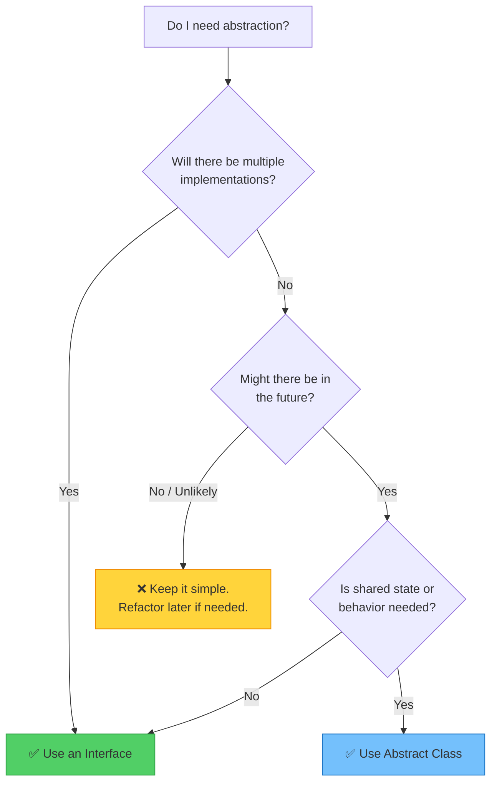

1. **Follow SOLID Principles:**
   - **S**ingle Responsibility — Each class does one thing
   - **O**pen/Closed — Open for extension, closed for modification
   - **L**iskov Substitution — Subtypes must be substitutable for their base types
   - **I**nterface Segregation — Many small interfaces > one big interface
   - **D**ependency Inversion — Depend on abstractions, not concrete classes

2. **Prefer composition over inheritance**
   - Use interfaces and inject implementations rather than deep inheritance trees

3. **Name your abstractions well**
   - `PaymentProcessor` not `AbstractPaymentThing`
   - `Sendable` not `ISend`

4. **Keep interfaces focused**
   ```java
   // ❌ Fat interface
   interface Worker {
       void code();
       void test();
       void manage();
       void design();
   }

   // ✅ Segregated interfaces
   interface Coder { void code(); }
   interface Tester { void test(); }
   interface Manager { void manage(); }
   interface Designer { void design(); }

   // A full-stack developer implements what they need
   class FullStackDev implements Coder, Tester, Designer {
       public void code() { /* ... */ }
       public void test() { /* ... */ }
       public void design() { /* ... */ }
   }
   ```

5. **Document your abstractions**
   - Add Javadoc to interface methods explaining the contract

6. **Test through abstractions**
   - Write tests against the interface, not the implementation
   - Use mock implementations for unit testing

---

## Summary 📝

Abstraction is like a **menu at a restaurant:**
- The **menu** shows you WHAT food is available (interface/abstract class)
- The **kitchen** handles HOW the food is prepared (implementation)
- You don't need to know the recipe to order food
- The restaurant can change their recipe without changing the menu

### Key Takeaways:

| Concept | Summary |
|---------|---------|
| **What** | Hiding complexity, showing only essentials |
| **Why** | Reduces complexity, enables flexibility, loose coupling |
| **How** | Abstract classes and interfaces |
| **Abstract Class** | Partial abstraction + shared state/behavior |
| **Interface** | Full abstraction + multiple inheritance + contracts |
| **Rule of Thumb** | If in doubt, prefer interface over abstract class |

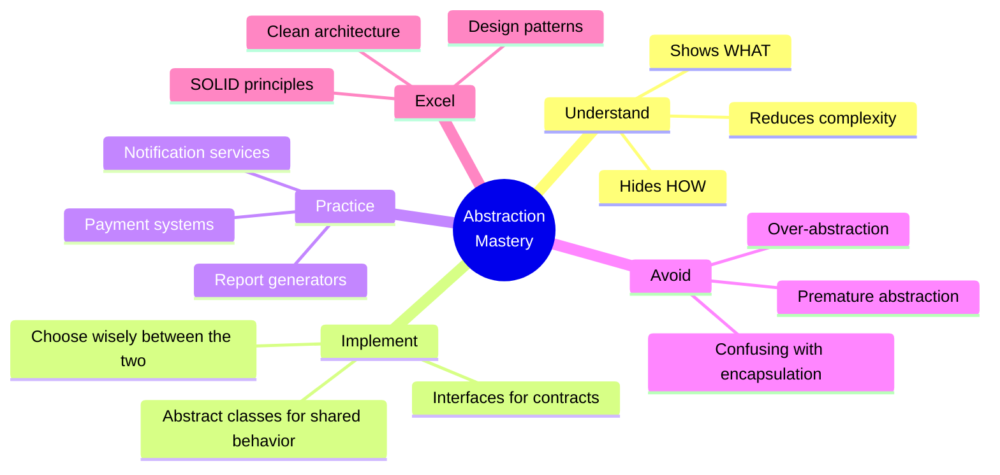

**Remember: Good abstraction makes complex systems feel simple.** 🎉