# Java OOP Concepts - A Complete Guide

## Table of Contents
1. [Why Object-Oriented Programming?](#why-object-oriented-programming)
2. [OOP vs Functional Programming](#oop-vs-functional-programming)
3. [Classes and Objects](#classes-and-objects)
4. [Memory Allocation](#memory-allocation)
5. [Constructors](#constructors)
6. [The `this` Keyword](#the-this-keyword)
7. [Access Modifiers](#access-modifiers)
8. [Static Variables and Static Methods](#static-variables-and-static-methods)

---

## Why Object-Oriented Programming?

### The Real World Problem

Imagine you're managing a library. In the real world, you have:
- **Books** with properties (title, author, ISBN, pages)
- **Members** who can borrow books
- **Librarians** who manage everything

**Without OOP (Traditional Programming):**
```java
String book1Title = "Harry Potter";
String book1Author = "J.K. Rowling";
int book1Pages = 500;

String book2Title = "Lord of the Rings";
String book2Author = "Tolkien";
int book2Pages = 1200;

// This becomes messy quickly with 1000+ books!
```

**With OOP:**
```java
Book harryPotter = new Book("Harry Potter", "J.K. Rowling", 500);
Book lotr = new Book("Lord of the Rings", "Tolkien", 1200);
// Clean, organized, scalable!
```

### Why We Need OOP

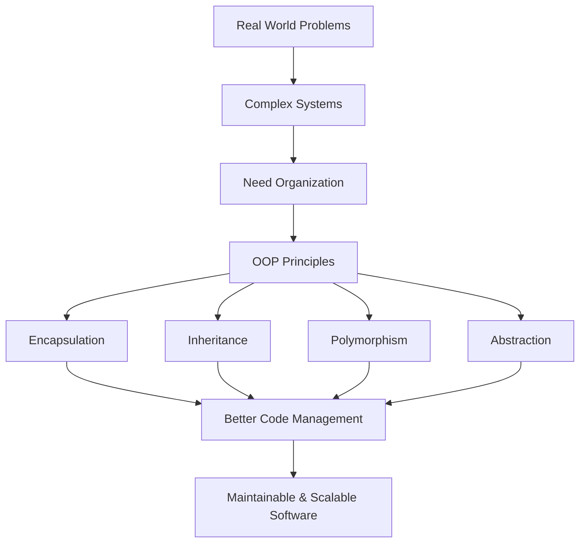
```mermaid
graph TD
    A[Real World Problems] --> B[Complex Systems]
    B --> C[Need Organization]
    C --> D[OOP Principles]
    D --> E[Encapsulation]
    D --> F[Inheritance]
    D --> G[Polymorphism]
    D --> H[Abstraction]
    E --> I[Better Code Management]
    F --> I
    G --> I
    H --> I
    I --> J[Maintainable & Scalable Software]
```

**Key Benefits:**
1. **Modularity**: Code is organized into self-contained objects
2. **Reusability**: Write once, use many times
3. **Maintainability**: Easy to update and debug
4. **Real-world modeling**: Maps naturally to how we think
5. **Data Security**: Hide implementation details

---

## OOP vs Functional Programming

### OOP (Object-Oriented Programming)

**Think of it as:** Organizing your code around "things" (objects) that have properties and behaviors.

```java
// OOP Approach
class BankAccount {
    private double balance;
    
    public void deposit(double amount) {
        this.balance += amount;
    }
    
    public void withdraw(double amount) {
        this.balance -= amount;
    }
}

BankAccount myAccount = new BankAccount();
myAccount.deposit(1000);
myAccount.withdraw(200);
```

### Functional Programming

**Think of it as:** Organizing your code around "actions" (functions) that transform data.

```java
// Functional Approach (in Java with functional style)
public class BankOperations {
    public static double deposit(double balance, double amount) {
        return balance + amount;
    }
    
    public static double withdraw(double balance, double amount) {
        return balance - amount;
    }
}

double balance = 0;
balance = BankOperations.deposit(balance, 1000);
balance = BankOperations.withdraw(balance, 200);
```

### Comparison Table

| Aspect | OOP | Functional Programming |
|--------|-----|------------------------|
| **Focus** | Objects (data + methods) | Pure functions |
| **State** | Mutable (can change) | Immutable (cannot change) |
| **Data** | Encapsulated in objects | Passed as parameters |
| **Best For** | Complex systems, modeling real-world | Data transformations, parallel processing |
| **Example** | Video game characters | Mathematical calculations |

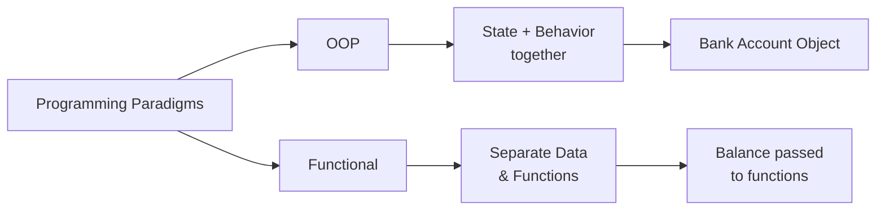
```mermaid
graph LR
    A[Programming Paradigms] --> B[OOP]
    A --> C[Functional]
    B --> D[State + Behavior<br/>together]
    C --> E[Separate Data<br/>& Functions]
    D --> F[Bank Account Object]
    E --> G[Balance passed<br/>to functions]
```

**Real-World Analogy:**
- **OOP**: Like a car - it has properties (color, speed) and actions (accelerate, brake) bundled together
- **Functional**: Like a calculator - you pass numbers to functions and get results back

---

## Classes and Objects

### What is a Class?

A **class** is a blueprint or template. Think of it as a cookie cutter.

### What is an Object?

An **object** is an instance of a class. Think of it as the actual cookie made from the cutter.

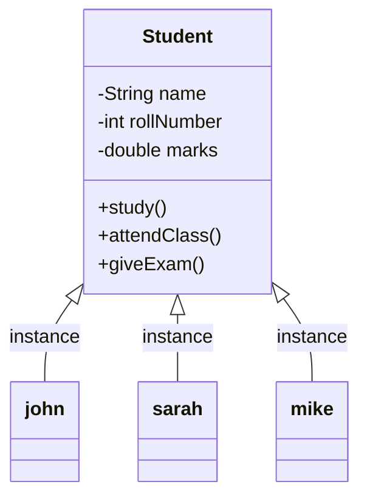
```mermaid
classDiagram
    class Student {
        -String name
        -int rollNumber
        -double marks
        +study()
        +attendClass()
        +giveExam()
    }
    
    Student <|-- john : instance
    Student <|-- sarah : instance
    Student <|-- mike : instance
```

### Real-World Example: Smartphone

```java
// Blueprint (Class)
class Smartphone {
    // Properties (What it HAS)
    String brand;
    String model;
    int batteryPercentage;
    boolean isOn;
    
    // Behaviors (What it CAN DO)
    void powerOn() {
        isOn = true;
        System.out.println(model + " is now ON");
    }
    
    void powerOff() {
        isOn = false;
        System.out.println(model + " is now OFF");
    }
    
    void charge(int percentage) {
        batteryPercentage += percentage;
        if (batteryPercentage > 100) {
            batteryPercentage = 100;
        }
        System.out.println("Battery: " + batteryPercentage + "%");
    }
    
    void makeCall(String number) {
        if (isOn) {
            System.out.println("Calling " + number + "...");
        } else {
            System.out.println("Phone is OFF. Turn it on first!");
        }
    }
}

// Creating Objects (Actual Phones)
public class Main {
    public static void main(String[] args) {
        // John's phone
        Smartphone johnsPhone = new Smartphone();
        johnsPhone.brand = "Apple";
        johnsPhone.model = "iPhone 14";
        johnsPhone.batteryPercentage = 50;
        johnsPhone.isOn = false;
        
        // Sarah's phone
        Smartphone sarahsPhone = new Smartphone();
        sarahsPhone.brand = "Samsung";
        sarahsPhone.model = "Galaxy S23";
        sarahsPhone.batteryPercentage = 80;
        sarahsPhone.isOn = true;
        
        // Using the objects
        johnsPhone.powerOn();
        johnsPhone.makeCall("9876543210");
        johnsPhone.charge(30);
        
        sarahsPhone.makeCall("1234567890");
    }
}
```

### Class vs Object Visualization

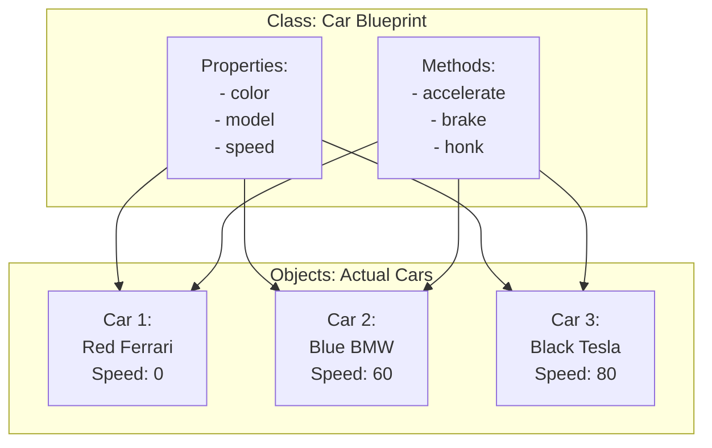
```mermaid
graph TB
    subgraph "Class: Car Blueprint"
        A[Properties:<br/>- color<br/>- model<br/>- speed]
        B[Methods:<br/>- accelerate<br/>- brake<br/>- honk]
    end
    
    subgraph "Objects: Actual Cars"
        C[Car 1:<br/>Red Ferrari<br/>Speed: 0]
        D[Car 2:<br/>Blue BMW<br/>Speed: 60]
        E[Car 3:<br/>Black Tesla<br/>Speed: 80]
    end
    
    A --> C
    A --> D
    A --> E
    B --> C
    B --> D
    B --> E
```

---

## Memory Allocation

### How Memory Works with Classes and Objects

Understanding memory allocation is crucial for writing efficient code.

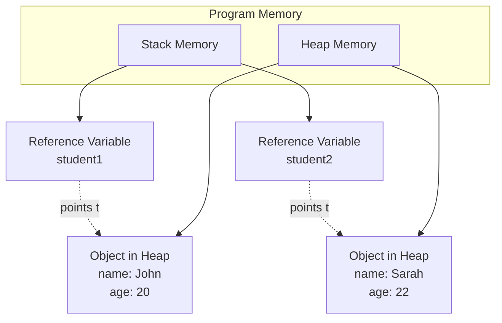
```mermaid
graph TB
    subgraph "Program Memory"
        A[Stack Memory] 
        B[Heap Memory]
    end
    
    A --> C[Reference Variable<br/>student1]
    C -.points to.-> D
    B --> D[Object in Heap<br/>name: John<br/>age: 20]
    
    A --> E[Reference Variable<br/>student2]
    E -.points to.-> F
    B --> F[Object in Heap<br/>name: Sarah<br/>age: 22]
```

### Detailed Explanation

**Stack Memory:**
- Stores **reference variables** (pointers to objects)
- Stores **primitive types** (int, float, char, etc.)
- Fast access
- Automatically managed (garbage collected when method ends)

**Heap Memory:**
- Stores **actual objects**
- Slower than stack
- Managed by Java Garbage Collector

### Memory Allocation Example

```java
class Student {
    String name;    // Reference type
    int age;        // Primitive type
    double marks;   // Primitive type
}

public class MemoryDemo {
    public static void main(String[] args) {
        // Step 1: Reference variable created in Stack
        Student s1;
        
        // Step 2: Object created in Heap, reference stored in s1
        s1 = new Student();
        s1.name = "John";  // "John" string created in Heap
        s1.age = 20;       // Primitive stored in object
        s1.marks = 85.5;   // Primitive stored in object
        
        // Step 3: Another reference pointing to same object
        Student s2 = s1;  // s2 points to SAME object as s1
        
        s2.name = "Mike";  // Changes the object
        System.out.println(s1.name);  // Prints "Mike"!
        
        // Step 4: Creating new object
        s2 = new Student();  // New object created
        s2.name = "Sarah";
        
        System.out.println(s1.name);  // Prints "Mike"
        System.out.println(s2.name);  // Prints "Sarah"
    }
}
```

### Memory State Visualization

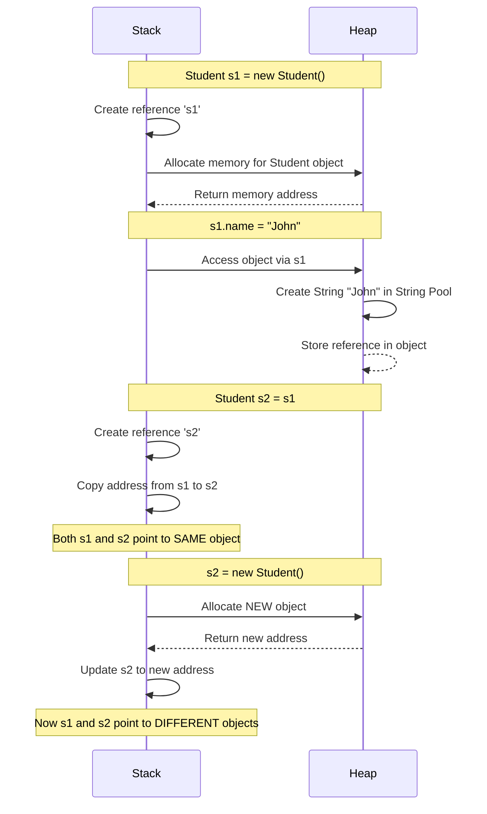
```mermaid
sequenceDiagram
    participant Stack
    participant Heap
    
    Note over Stack,Heap: Student s1 = new Student()
    Stack->>Stack: Create reference 's1'
    Stack->>Heap: Allocate memory for Student object
    Heap-->>Stack: Return memory address
    
    Note over Stack,Heap: s1.name = "John"
    Stack->>Heap: Access object via s1
    Heap->>Heap: Create String "John" in String Pool
    Heap-->>Heap: Store reference in object
    
    Note over Stack,Heap: Student s2 = s1
    Stack->>Stack: Create reference 's2'
    Stack->>Stack: Copy address from s1 to s2
    Note over Stack: Both s1 and s2 point to SAME object
    
    Note over Stack,Heap: s2 = new Student()
    Stack->>Heap: Allocate NEW object
    Heap-->>Stack: Return new address
    Stack->>Stack: Update s2 to new address
    Note over Stack: Now s1 and s2 point to DIFFERENT objects
```

### Null References

```java
Student s3 = null;  // Reference exists but points to nothing

// This will cause NullPointerException
// s3.name = "Test";  // ERROR!

s3 = new Student();  // Now it's safe
s3.name = "Test";    // Works fine
```

---

## Constructors

### What is a Constructor?

A constructor is a **special method** that is automatically called when you create an object. It **initializes** the object.

**Think of it as:** Setting up a new phone when you buy it - entering your name, language preference, etc.

### Why Do We Need Constructors?

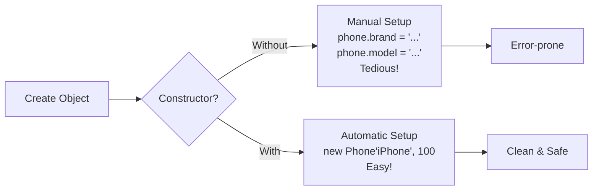
```mermaid
graph LR
    A[Create Object] --> B{Constructor?}
    B -->|Without| C[Manual Setup<br/>phone.brand = '...'<br/>phone.model = '...'<br/>Tedious!]
    B -->|With| D[Automatic Setup<br/>new Phone'iPhone', 100<br/>Easy!]
    C --> E[Error-prone]
    D --> F[Clean & Safe]
```

**Problems without constructors:**
1. Have to set every property manually
2. Easy to forget setting important values
3. Object might be in invalid state
4. Code repetition

### Types of Constructors

#### 1. Default Constructor

A constructor with **no parameters**. If you don't write any constructor, Java provides one automatically.

```java
class Phone {
    String brand;
    int battery;
    
    // Default Constructor
    Phone() {
        System.out.println("Phone created with default settings");
        brand = "Generic";
        battery = 0;
    }
}

// Usage
Phone p1 = new Phone();  // Calls default constructor
System.out.println(p1.brand);    // Generic
System.out.println(p1.battery);  // 0
```

#### 2. Parameterized Constructor

A constructor that **accepts parameters** to initialize object with specific values.

```java
class Phone {
    String brand;
    int battery;
    
    // Parameterized Constructor
    Phone(String b, int bat) {
        brand = b;
        battery = bat;
        System.out.println("Phone created: " + brand + " with " + battery + "% battery");
    }
}

// Usage
Phone p1 = new Phone("iPhone", 100);
Phone p2 = new Phone("Samsung", 80);
```

#### 3. Constructor Overloading

Having **multiple constructors** with different parameters.

```java
class Phone {
    String brand;
    String model;
    int battery;
    
    // Default Constructor
    Phone() {
        brand = "Generic";
        model = "Basic";
        battery = 50;
        System.out.println("Default phone created");
    }
    
    // Constructor with brand only
    Phone(String b) {
        brand = b;
        model = "Basic";
        battery = 50;
        System.out.println("Phone created with brand: " + brand);
    }
    
    // Constructor with brand and model
    Phone(String b, String m) {
        brand = b;
        model = m;
        battery = 50;
        System.out.println("Phone created: " + brand + " " + model);
    }
    
    // Constructor with all parameters
    Phone(String b, String m, int bat) {
        brand = b;
        model = m;
        battery = bat;
        System.out.println("Phone fully configured: " + brand + " " + model + " at " + battery + "%");
    }
}

// Usage - Flexibility!
Phone p1 = new Phone();                              // Uses default
Phone p2 = new Phone("Apple");                       // Uses 1-param
Phone p3 = new Phone("Samsung", "Galaxy S23");       // Uses 2-param
Phone p4 = new Phone("Google", "Pixel 8", 90);       // Uses 3-param
```

### How Constructors Work

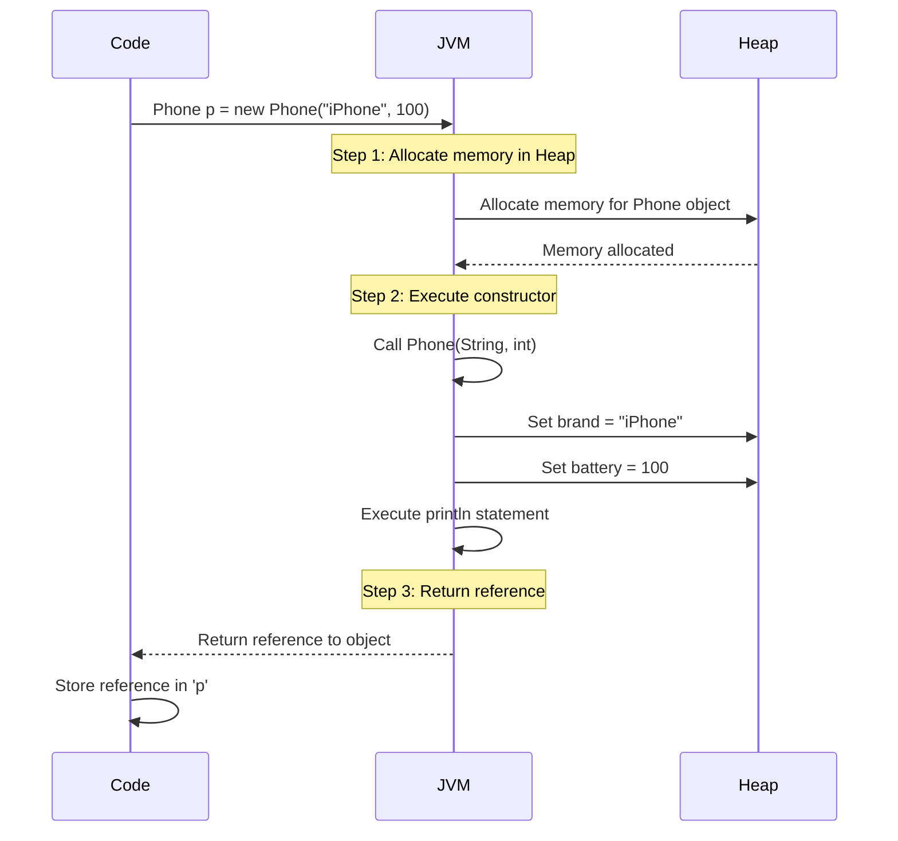
```mermaid
sequenceDiagram
    participant Code
    participant JVM
    participant Heap
    
    Code->>JVM: Phone p = new Phone("iPhone", 100)
    Note over JVM: Step 1: Allocate memory in Heap
    JVM->>Heap: Allocate memory for Phone object
    Heap-->>JVM: Memory allocated
    
    Note over JVM: Step 2: Execute constructor
    JVM->>JVM: Call Phone(String, int)
    JVM->>Heap: Set brand = "iPhone"
    JVM->>Heap: Set battery = 100
    JVM->>JVM: Execute println statement
    
    Note over JVM: Step 3: Return reference
    JVM-->>Code: Return reference to object
    Code->>Code: Store reference in 'p'
```

### The Critical Rule: What Happens When You Create Parameterized Constructor?

This is **very important** to understand!

```java
class Car {
    String brand;
    int speed;
    
    // Only parameterized constructor
    Car(String b, int s) {
        brand = b;
        speed = s;
    }
}

public class Test {
    public static void main(String[] args) {
        // This will cause COMPILATION ERROR!
        // Car c1 = new Car();  ❌ ERROR!
        
        // This works fine
        Car c2 = new Car("BMW", 200);  // ✅ Works!
    }
}
```

**Why the error?**

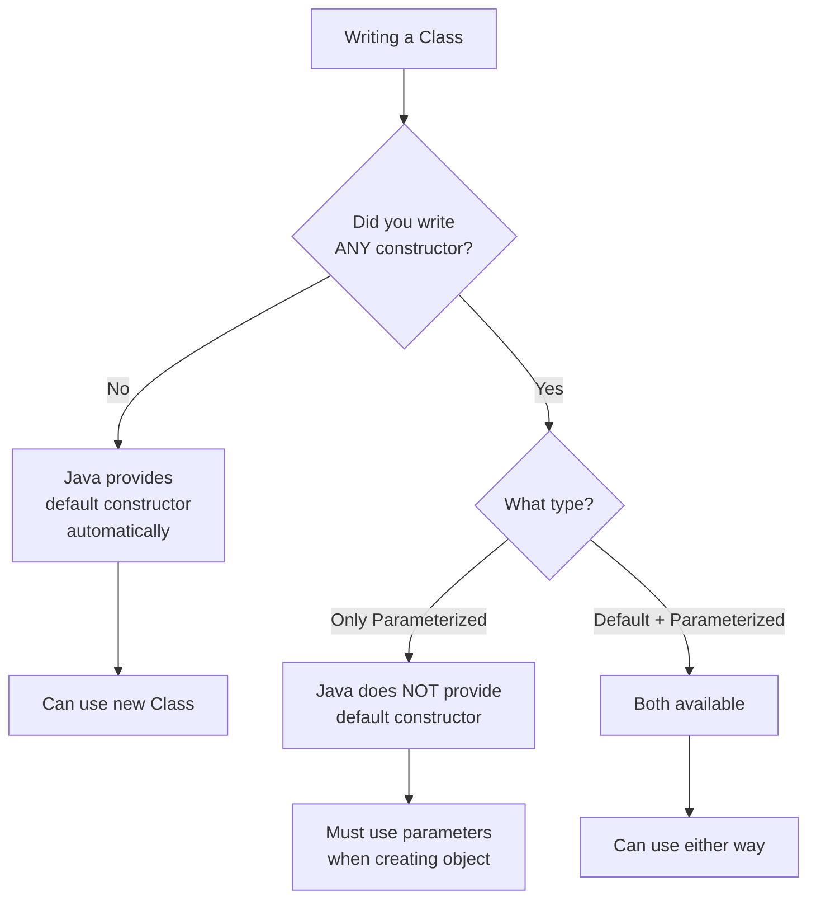
```mermaid
flowchart TD
    A[Writing a Class] --> B{Did you write<br/>ANY constructor?}
    B -->|No| C[Java provides<br/>default constructor<br/>automatically]
    B -->|Yes| D{What type?}
    C --> E[Can use new Class]
    D -->|Only Parameterized| F[Java does NOT provide<br/>default constructor]
    D -->|Default + Parameterized| G[Both available]
    F --> H[Must use parameters<br/>when creating object]
    G --> I[Can use either way]
```

**The Golden Rule:**
> **If you write ANY constructor, Java will NOT provide the default constructor automatically!**

### Solution: Write Both Constructors

```java
class Car {
    String brand;
    int speed;
    
    // Default constructor (you must write it explicitly)
    Car() {
        brand = "Unknown";
        speed = 0;
        System.out.println("Car created with default values");
    }
    
    // Parameterized constructor
    Car(String b, int s) {
        brand = b;
        speed = s;
        System.out.println("Car created: " + brand + " at " + speed + " km/h");
    }
}

public class Test {
    public static void main(String[] args) {
        Car c1 = new Car();                  // ✅ Works! Uses default
        Car c2 = new Car("BMW", 200);        // ✅ Works! Uses parameterized
    }
}
```

### Real-World Example: Bank Account

```java
class BankAccount {
    String accountNumber;
    String holderName;
    double balance;
    String accountType;
    
    // Default constructor - for walk-in customers
    BankAccount() {
        accountNumber = "TEMP" + System.currentTimeMillis();
        holderName = "Unnamed";
        balance = 0.0;
        accountType = "Savings";
        System.out.println("Temporary account created. Please complete KYC.");
    }
    
    // Quick account with minimum details
    BankAccount(String name) {
        accountNumber = "ACC" + System.currentTimeMillis();
        holderName = name;
        balance = 0.0;
        accountType = "Savings";
        System.out.println("Account created for: " + name);
    }
    
    // Full account creation
    BankAccount(String accNum, String name, double initialBalance, String type) {
        accountNumber = accNum;
        holderName = name;
        balance = initialBalance;
        accountType = type;
        System.out.println("Premium account created!");
        System.out.println("Account: " + accNum);
        System.out.println("Holder: " + name);
        System.out.println("Balance: ₹" + balance);
        System.out.println("Type: " + type);
    }
    
    void displayInfo() {
        System.out.println("\n--- Account Information ---");
        System.out.println("Account Number: " + accountNumber);
        System.out.println("Holder: " + holderName);
        System.out.println("Balance: ₹" + balance);
        System.out.println("Type: " + accountType);
    }
}

public class BankDemo {
    public static void main(String[] args) {
        // Different ways to create accounts
        BankAccount acc1 = new BankAccount();
        acc1.displayInfo();
        
        BankAccount acc2 = new BankAccount("Rahul Kumar");
        acc2.displayInfo();
        
        BankAccount acc3 = new BankAccount("ACC12345", "Priya Sharma", 50000, "Current");
        acc3.displayInfo();
    }
}
```

### Constructor Execution Flow

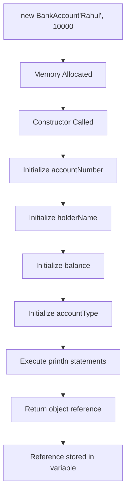
```mermaid
graph TD
    A[new BankAccount'Rahul', 10000] --> B[Memory Allocated]
    B --> C[Constructor Called]
    C --> D[Initialize accountNumber]
    D --> E[Initialize holderName]
    E --> F[Initialize balance]
    F --> G[Initialize accountType]
    G --> H[Execute println statements]
    H --> I[Return object reference]
    I --> J[Reference stored in variable]
```

---

## The `this` Keyword

### What is `this`?

`this` is a **reference to the current object**. It's like saying "this specific object" or "myself" in the context of an object.

**Real-World Analogy:** 
When you say "my phone," the "my" refers to YOUR specific phone, not someone else's phone. In Java, `this` is like "my" - it refers to the current object's properties and methods.

### Why Do We Need `this`?

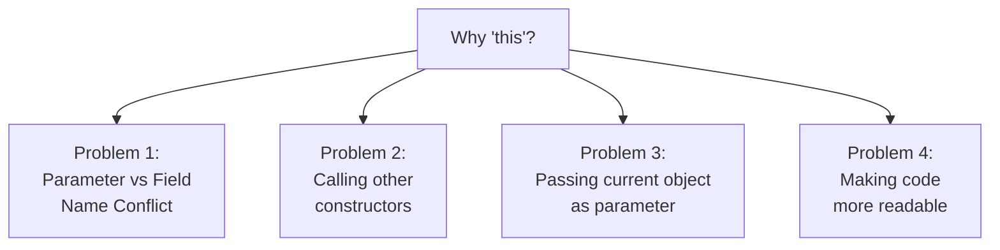
```mermaid
graph TD
    A[Why 'this'?] --> B[Problem 1:<br/>Parameter vs Field<br/>Name Conflict]
    A --> C[Problem 2:<br/>Calling other<br/>constructors]
    A --> D[Problem 3:<br/>Passing current object<br/>as parameter]
    A --> E[Problem 4:<br/>Making code<br/>more readable]
```

### Problem 1: Parameter and Field Name Conflict

```java
class Student {
    String name;
    int age;
    
    // ❌ Confusing - which 'name' is which?
    Student(String name, int age) {
        name = name;  // This does NOTHING! 
        age = age;    // Both refer to parameter, not field!
    }
}
```

**Solution with `this`:**

```java
class Student {
    String name;
    int age;
    
    // ✅ Clear - 'this.name' is the object's field
    Student(String name, int age) {
        this.name = name;  // this.name (field) = name (parameter)
        this.age = age;    // this.age (field) = age (parameter)
    }
    
    void display() {
        System.out.println("Name: " + this.name);  // Clear reference
        System.out.println("Age: " + this.age);
    }
}
```

### Visualization: How `this` Works

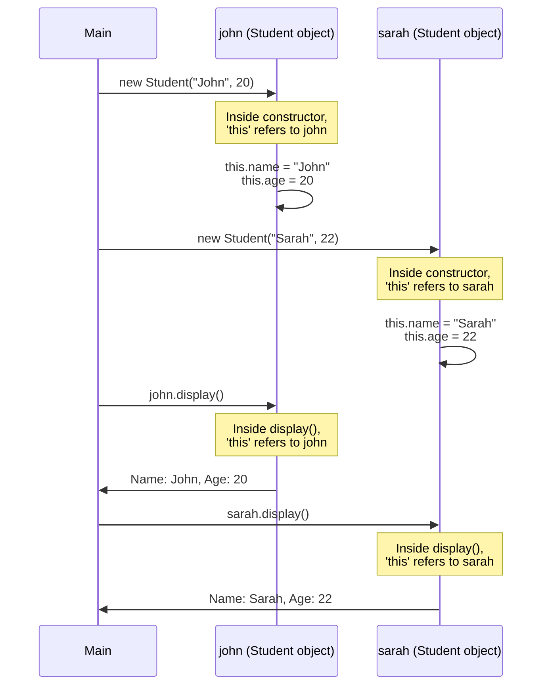
```mermaid
sequenceDiagram
    participant Main
    participant john as john (Student object)
    participant sarah as sarah (Student object)
    
    Main->>john: new Student("John", 20)
    Note over john: Inside constructor,<br/>'this' refers to john
    john->>john: this.name = "John"<br/>this.age = 20
    
    Main->>sarah: new Student("Sarah", 22)
    Note over sarah: Inside constructor,<br/>'this' refers to sarah
    sarah->>sarah: this.name = "Sarah"<br/>this.age = 22
    
    Main->>john: john.display()
    Note over john: Inside display(),<br/>'this' refers to john
    john->>Main: Name: John, Age: 20
    
    Main->>sarah: sarah.display()
    Note over sarah: Inside display(),<br/>'this' refers to sarah
    sarah->>Main: Name: Sarah, Age: 22
```

### Problem 2: Constructor Chaining

Calling one constructor from another constructor to avoid code duplication.

```java
class Employee {
    String name;
    int id;
    double salary;
    String department;
    
    // Default constructor
    Employee() {
        this("Unknown", 0, 0.0, "Not Assigned");  // Calls 4-param constructor
    }
    
    // Constructor with name only
    Employee(String name) {
        this(name, 0, 0.0, "Not Assigned");  // Calls 4-param constructor
    }
    
    // Constructor with name and id
    Employee(String name, int id) {
        this(name, id, 0.0, "Not Assigned");  // Calls 4-param constructor
    }
    
    // Master constructor - all other constructors call this
    Employee(String name, int id, double salary, String department) {
        this.name = name;
        this.id = id;
        this.salary = salary;
        this.department = department;
        System.out.println("Employee created: " + name);
    }
    
    void displayInfo() {
        System.out.println("\n--- Employee Details ---");
        System.out.println("Name: " + this.name);
        System.out.println("ID: " + this.id);
        System.out.println("Salary: ₹" + this.salary);
        System.out.println("Department: " + this.department);
    }
}

public class EmployeeTest {
    public static void main(String[] args) {
        Employee e1 = new Employee();
        e1.displayInfo();
        
        Employee e2 = new Employee("Amit");
        e2.displayInfo();
        
        Employee e3 = new Employee("Priya", 101);
        e3.displayInfo();
        
        Employee e4 = new Employee("Rahul", 102, 75000, "IT");
        e4.displayInfo();
    }
}
```

**Constructor Chaining Flow:**

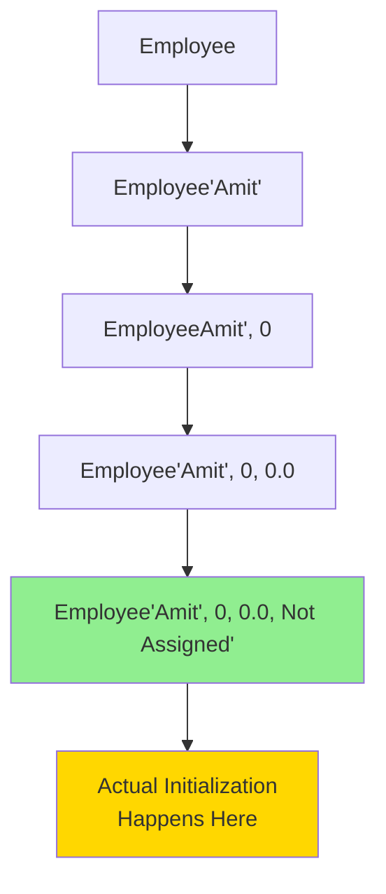
```mermaid
graph TD
    A[Employee] --> B[Employee'Amit']
    B --> C[EmployeeAmit', 0]
    C --> D[Employee'Amit', 0, 0.0]
    D --> E[Employee'Amit', 0, 0.0, Not Assigned']
    E --> F[Actual Initialization<br/>Happens Here]
    
    style E fill:#90EE90
    style F fill:#FFD700
```

**Important Rules for `this()` in Constructor Chaining:**
1. `this()` must be the **first statement** in the constructor
2. You cannot use `this()` and `super()` together
3. Cannot have circular calls (A calls B, B calls A)

### Problem 3: Passing Current Object as Parameter

```java
class Student {
    String name;
    int rollNo;
    
    Student(String name, int rollNo) {
        this.name = name;
        this.rollNo = rollNo;
    }
    
    void registerInLibrary(Library library) {
        // Pass this student to library
        library.addStudent(this);  // 'this' = current student object
    }
    
    void display() {
        System.out.println("Student: " + this.name + " (Roll: " + this.rollNo + ")");
    }
}

class Library {
    void addStudent(Student student) {
        System.out.println("Registering student: " + student.name);
        // Add to database, etc.
    }
}

public class LibraryTest {
    public static void main(String[] args) {
        Student s1 = new Student("Rajesh", 101);
        Student s2 = new Student("Sneha", 102);
        
        Library library = new Library();
        
        s1.registerInLibrary(library);  // s1 passes itself
        s2.registerInLibrary(library);  // s2 passes itself
    }
}
```

### Problem 4: Method Chaining (Returning `this`)

```java
class Calculator {
    int result;
    
    Calculator add(int num) {
        this.result += num;
        return this;  // Return current object
    }
    
    Calculator subtract(int num) {
        this.result -= num;
        return this;  // Return current object
    }
    
    Calculator multiply(int num) {
        this.result *= num;
        return this;  // Return current object
    }
    
    void displayResult() {
        System.out.println("Result: " + this.result);
    }
}

public class CalculatorTest {
    public static void main(String[] args) {
        Calculator calc = new Calculator();
        
        // Method chaining - elegant and readable!
        calc.add(10)
            .multiply(5)
            .subtract(20)
            .add(15)
            .displayResult();  // Result: 45
        
        // Without method chaining (old way):
        // calc.add(10);
        // calc.multiply(5);
        // calc.subtract(20);
        // calc.add(15);
        // calc.displayResult();
    }
}
```

### Complete Example: Online Shopping Cart

```java
class ShoppingCart {
    String customerName;
    double totalAmount;
    int itemCount;
    
    ShoppingCart(String customerName) {
        this.customerName = customerName;
        this.totalAmount = 0.0;
        this.itemCount = 0;
        System.out.println("Shopping cart created for: " + this.customerName);
    }
    
    // Method chaining for adding items
    ShoppingCart addItem(String itemName, double price) {
        System.out.println("Adding " + itemName + " - ₹" + price);
        this.totalAmount += price;
        this.itemCount++;
        return this;  // Return current cart for chaining
    }
    
    ShoppingCart applyDiscount(double percentage) {
        double discount = this.totalAmount * (percentage / 100);
        this.totalAmount -= discount;
        System.out.println("Discount applied: " + percentage + "% (₹" + discount + " off)");
        return this;  // Return current cart for chaining
    }
    
    void checkout() {
        System.out.println("\n=== CHECKOUT ===");
        System.out.println("Customer: " + this.customerName);
        System.out.println("Total Items: " + this.itemCount);
        System.out.println("Total Amount: ₹" + this.totalAmount);
        System.out.println("Thank you for shopping!");
    }
    
    void emailReceipt() {
        System.out.println("Sending receipt to " + this.customerName + "'s email...");
        // In real app, 'this' would be passed to email service
    }
}

public class ShoppingTest {
    public static void main(String[] args) {
        ShoppingCart myCart = new ShoppingCart("Vikram");
        
        // Beautiful method chaining!
        myCart.addItem("Laptop", 50000)
              .addItem("Mouse", 500)
              .addItem("Keyboard", 1500)
              .applyDiscount(10)
              .checkout();
        
        myCart.emailReceipt();
    }
}
```

---

## Access Modifiers

### What Are Access Modifiers?

Access modifiers control **who can see and use** your code. Think of them as security levels or permission settings.

**Real-World Analogy:**
- **Private**: Your personal diary - only YOU can read it
- **Default**: Your house - only your neighbors (same neighborhood/package) can visit
- **Protected**: Family secrets - family members and close relatives can know
- **Public**: Public park - ANYONE can access it

### The Four Access Modifiers

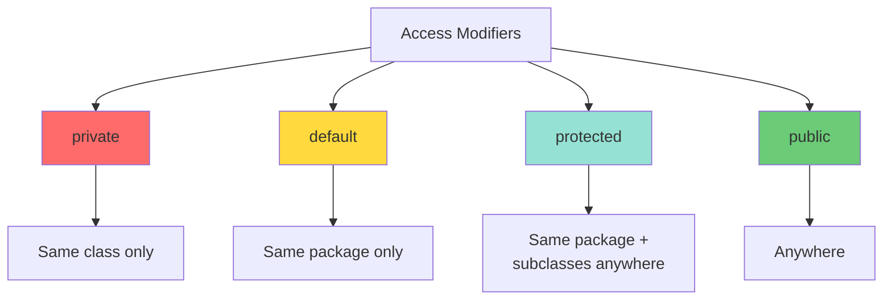
```mermaid
graph TB
    A[Access Modifiers] --> B[private]
    A --> C[default]
    A --> D[protected]
    A --> E[public]
    
    B --> B1[Same class only]
    C --> C1[Same package only]
    D --> D1[Same package +<br/>subclasses anywhere]
    E --> E1[Anywhere]
    
    style B fill:#FF6B6B
    style C fill:#FFD93D
    style D fill:#95E1D3
    style E fill:#6BCB77
```

### Access Level Table

| Modifier | Same Class | Same Package | Subclass (Different Package) | Everywhere |
|----------|-----------|--------------|------------------------------|------------|
| `private` | ✅ Yes | ❌ No | ❌ No | ❌ No |
| default (no modifier) | ✅ Yes | ✅ Yes | ❌ No | ❌ No |
| `protected` | ✅ Yes | ✅ Yes | ✅ Yes | ❌ No |
| `public` | ✅ Yes | ✅ Yes | ✅ Yes | ✅ Yes |

### 1. Private Access Modifier

**Usage:** Only within the **same class**.

**Why:** To hide sensitive data and implementation details (Encapsulation).

```java
class BankAccount {
    private String accountNumber;    // Hidden from outside
    private double balance;          // Hidden from outside
    private String pin;              // Hidden from outside
    
    // Public constructor
    public BankAccount(String accNum, String pin) {
        this.accountNumber = accNum;
        this.balance = 0.0;
        this.pin = pin;
    }
    
    // Public method to access private data (with validation)
    public void deposit(double amount) {
        if (amount > 0) {
            this.balance += amount;
            System.out.println("Deposited: ₹" + amount);
        } else {
            System.out.println("Invalid amount!");
        }
    }
    
    // Public method with security check
    public void withdraw(double amount, String enteredPin) {
        if (!this.pin.equals(enteredPin)) {
            System.out.println("Incorrect PIN!");
            return;
        }
        if (amount > this.balance) {
            System.out.println("Insufficient balance!");
            return;
        }
        if (amount > 0) {
            this.balance -= amount;
            System.out.println("Withdrawn: ₹" + amount);
        }
    }
    
    // Public method to safely view balance
    public double getBalance(String enteredPin) {
        if (this.pin.equals(enteredPin)) {
            return this.balance;
        } else {
            System.out.println("Incorrect PIN!");
            return -1;
        }
    }
}

public class BankTest {
    public static void main(String[] args) {
        BankAccount myAccount = new BankAccount("ACC123456", "1234");
        
        // ❌ Cannot access private fields directly
        // System.out.println(myAccount.balance);  // Compilation ERROR!
        // System.out.println(myAccount.pin);      // Compilation ERROR!
        
        // ✅ Must use public methods
        myAccount.deposit(5000);
        myAccount.withdraw(1000, "1234");
        
        double bal = myAccount.getBalance("1234");
        System.out.println("Current Balance: ₹" + bal);
        
        // Security in action!
        myAccount.withdraw(1000, "9999");  // Wrong PIN - rejected!
    }
}
```

**Why Private is Important:**

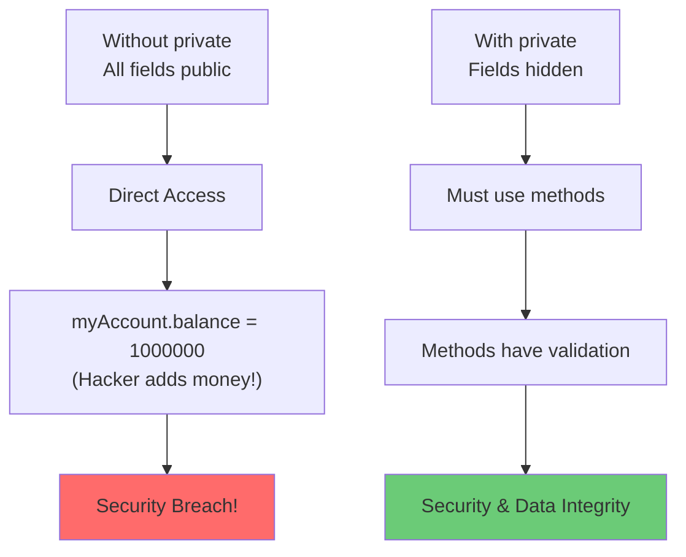
```mermaid
graph TD
    A[Without private<br/>All fields public] --> B[Direct Access]
    B --> C["myAccount.balance = 1000000<br/>(Hacker adds money!)"]
    C --> D[Security Breach!]
    
    E[With private<br/>Fields hidden] --> F[Must use methods]
    F --> G[Methods have validation]
    G --> H[Security & Data Integrity]
    
    style D fill:#FF6B6B
    style H fill:#6BCB77
```

### 2. Default Access Modifier (Package-Private)

**Usage:** Accessible within the **same package** only.

**Note:** No keyword is used - just omit the access modifier.

```java
// File: com/company/model/Employee.java
package com.company.model;

class Employee {  // Default access - only visible in this package
    String name;      // Default access
    int age;          // Default access
    
    void displayInfo() {  // Default access
        System.out.println(name + " - " + age + " years");
    }
}

class Department {  // Default access
    String deptName;
    
    void addEmployee(Employee emp) {  // Can access Employee (same package)
        System.out.println("Adding " + emp.name + " to " + deptName);
    }
}
```

```java
// File: com/company/test/TestEmployee.java
package com.company.test;  // DIFFERENT package

import com.company.model.Employee;  // ❌ COMPILATION ERROR!
// Cannot access default class from different package

public class TestEmployee {
    public static void main(String[] args) {
        // Employee emp = new Employee();  // ❌ ERROR!
    }
}
```

**When to use Default:**
- Classes, methods, and fields that should be used only within a specific package
- Internal helper classes
- Package-level utility methods

### 3. Protected Access Modifier

**Usage:** Accessible within the **same package** AND in **subclasses** (even in different packages).

```java
// File: com/company/model/Vehicle.java
package com.company.model;

public class Vehicle {
    protected String brand;        // Accessible in subclasses
    protected int maxSpeed;        // Accessible in subclasses
    private String engineNumber;   // NOT accessible in subclasses
    
    protected void startEngine() {  // Accessible in subclasses
        System.out.println("Engine started");
    }
    
    private void internalDiagnostics() {  // NOT accessible in subclasses
        System.out.println("Running diagnostics...");
    }
}
```

```java
// File: com/company/vehicles/Car.java
package com.company.vehicles;  // DIFFERENT package

import com.company.model.Vehicle;

public class Car extends Vehicle {
    private int numberOfDoors;
    
    public Car(String brand, int speed, int doors) {
        this.brand = brand;      // ✅ Can access protected field
        this.maxSpeed = speed;   // ✅ Can access protected field
        this.numberOfDoors = doors;
        
        // this.engineNumber = "XYZ";  // ❌ ERROR! Private field
    }
    
    public void drive() {
        this.startEngine();  // ✅ Can access protected method
        System.out.println(this.brand + " is driving at " + this.maxSpeed + " km/h");
        
        // this.internalDiagnostics();  // ❌ ERROR! Private method
    }
}
```

```java
// File: com/company/test/TestCar.java
package com.company.test;

import com.company.vehicles.Car;

public class TestCar {
    public static void main(String[] args) {
        Car myCar = new Car("Tesla", 200, 4);
        myCar.drive();
        
        // myCar.brand = "BMW";  // ❌ ERROR! Protected - not accessible outside package/subclass
    }
}
```

### 4. Public Access Modifier

**Usage:** Accessible from **anywhere** in the application.

```java
// File: com/company/utils/MathHelper.java
package com.company.utils;

public class MathHelper {  // Public class - accessible everywhere
    public static final double PI = 3.14159;  // Public constant
    
    public static int add(int a, int b) {  // Public method
        return a + b;
    }
    
    public static double calculateArea(double radius) {  // Public method
        return PI * radius * radius;
    }
}
```

```java
// File: com/company/app/Application.java
package com.company.app;  // Completely different package

import com.company.utils.MathHelper;  // ✅ Can import public class

public class Application {
    public static void main(String[] args) {
        // ✅ Can access public class and methods from anywhere
        int sum = MathHelper.add(5, 10);
        double area = MathHelper.calculateArea(7.5);
        
        System.out.println("Sum: " + sum);
        System.out.println("Area: " + area);
        System.out.println("PI: " + MathHelper.PI);
    }
}
```

### Comprehensive Real-World Example: Hospital Management System

```java
// File: hospital/model/Patient.java
package hospital.model;

public class Patient {
    // Private - medical records should be confidential
    private String patientId;
    private String medicalHistory;
    private double billAmount;
    
    // Protected - subclasses (like VIPPatient) might need this
    protected String name;
    protected int age;
    
    // Default - only hospital package can see this
    String assignedDoctor;
    
    // Public - anyone can create a patient
    public Patient(String id, String name, int age) {
        this.patientId = id;
        this.name = name;
        this.age = age;
        this.billAmount = 0.0;
    }
    
    // Public - anyone can view basic info
    public void displayBasicInfo() {
        System.out.println("Patient: " + this.name + " (Age: " + this.age + ")");
    }
    
    // Protected - only doctors (subclasses) can add medical records
    protected void addMedicalRecord(String record) {
        this.medicalHistory += record + "\n";
        System.out.println("Medical record added for " + this.name);
    }
    
    // Private - only this class can modify bill
    private void updateBill(double amount) {
        this.billAmount += amount;
    }
    
    // Public - controlled way to add charges
    public void addTreatmentCharge(double amount, String authorization) {
        if (authorization.equals("DOCTOR_APPROVED")) {
            this.updateBill(amount);
            System.out.println("Charge added: ₹" + amount);
        } else {
            System.out.println("Unauthorized! Only doctors can add charges.");
        }
    }
    
    // Public - anyone can view bill (but not modify directly)
    public double getBillAmount() {
        return this.billAmount;
    }
}
```

```java
// File: hospital/model/VIPPatient.java
package hospital.model;

public class VIPPatient extends Patient {
    private String vipLevel;  // Gold, Platinum, Diamond
    
    public VIPPatient(String id, String name, int age, String vipLevel) {
        super(id, name, age);
        this.vipLevel = vipLevel;
    }
    
    public void requestSpecialTreatment() {
        // ✅ Can access protected members from parent
        System.out.println("VIP Patient " + this.name + " (" + this.vipLevel + ") requesting special treatment");
        this.addMedicalRecord("VIP special treatment requested");
        
        // ✅ Can access default member (same package)
        this.assignedDoctor = "Senior Specialist";
        
        // ❌ Cannot access private members
        // this.patientId = "VIP123";  // ERROR!
        // this.updateBill(5000);      // ERROR!
    }
}
```

```java
// File: hospital/staff/Doctor.java
package hospital.staff;  // Different package

import hospital.model.Patient;

public class Doctor {
    private String name;
    
    public Doctor(String name) {
        this.name = name;
    }
    
    public void treatPatient(Patient patient) {
        // ✅ Can access public methods
        patient.displayBasicInfo();
        patient.addTreatmentCharge(2000, "DOCTOR_APPROVED");
        
        // ❌ Cannot access protected members (not a subclass)
        // System.out.println(patient.name);  // ERROR!
        
        // ❌ Cannot access default members (different package)
        // patient.assignedDoctor = "Dr. Smith";  // ERROR!
        
        // ❌ Cannot access private members
        // patient.billAmount = 5000;  // ERROR!
    }
}
```

### Access Modifier Decision Flow

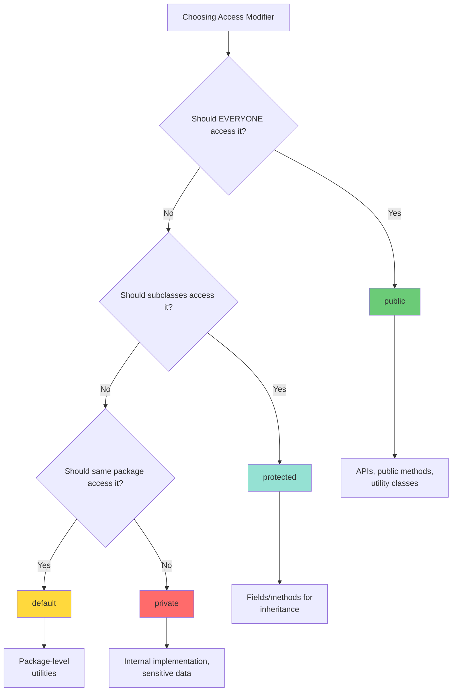
```mermaid
graph TD
    A[Choosing Access Modifier] --> B{Should EVERYONE access it?}
    B -->|Yes| C[public]
    B -->|No| D{Should subclasses access it?}
    D -->|Yes| E[protected]
    D -->|No| F{Should same package access it?}
    F -->|Yes| G[default]
    F -->|No| H[private]
    
    C --> C1[APIs, public methods,<br/>utility classes]
    E --> E1[Fields/methods for<br/>inheritance]
    G --> G1[Package-level<br/>utilities]
    H --> H1[Internal implementation,<br/>sensitive data]
    
    style C fill:#6BCB77
    style E fill:#95E1D3
    style G fill:#FFD93D
    style H fill:#FF6B6B
```

### Best Practices for Access Modifiers

1. **Start with the most restrictive** (private) and only make it more accessible if needed
2. **Keep fields private** - always! Use getters/setters for controlled access
3. **Make methods public** only if they're part of the class's public API
4. **Use protected** when you want to allow inheritance but not widespread access
5. **Think about security and encapsulation** before making something public

### Summary Diagram

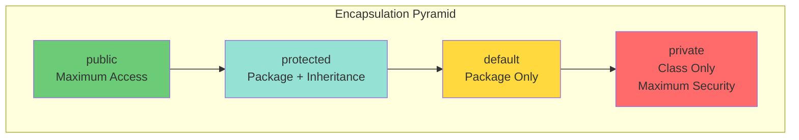
```mermaid
graph TB
    subgraph "Encapsulation Pyramid"
        A[public<br/>Maximum Access]
        B[protected<br/>Package + Inheritance]
        C[default<br/>Package Only]
        D[private<br/>Class Only<br/>Maximum Security]
    end
    
    A --> B
    B --> C
    C --> D
    
    style D fill:#FF6B6B
    style C fill:#FFD93D
    style B fill:#95E1D3
    style A fill:#6BCB77
```

---

## Static Variables and Static Methods

### What is Static?

The `static` keyword in Java means that a member (variable or method) belongs to the **class itself**, not to any specific object. Think of it as something **shared by all instances** of the class.

**Real-World Analogy:**

Imagine a school:
- **Non-static (Instance) variable**: Each student has their own name, roll number, marks (unique to each student)
- **Static (Class) variable**: The school name, total student count, school motto (shared by ALL students)

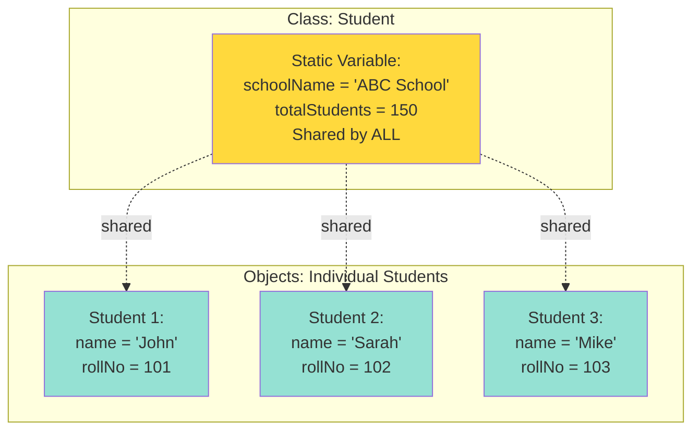
```mermaid
graph TB
    subgraph "Class: Student"
        A[Static Variable:<br/>schoolName = 'ABC School'<br/>totalStudents = 150<br/>Shared by ALL]
    end
    
    subgraph "Objects: Individual Students"
        B[Student 1:<br/>name = 'John'<br/>rollNo = 101]
        C[Student 2:<br/>name = 'Sarah'<br/>rollNo = 102]
        D[Student 3:<br/>name = 'Mike'<br/>rollNo = 103]
    end
    
    A -.shared.-> B
    A -.shared.-> C
    A -.shared.-> D
    
    style A fill:#FFD93D
    style B fill:#95E1D3
    style C fill:#95E1D3
    style D fill:#95E1D3
```

---

### Static Variables

#### What Are Static Variables?

Static variables (also called **class variables**) are variables that:
1. Belong to the **class**, not to individual objects
2. Are **shared** by all objects of the class
3. Exist in memory **only once**, regardless of how many objects you create
4. Can be accessed **without creating an object**

#### Why Do We Need Static Variables?

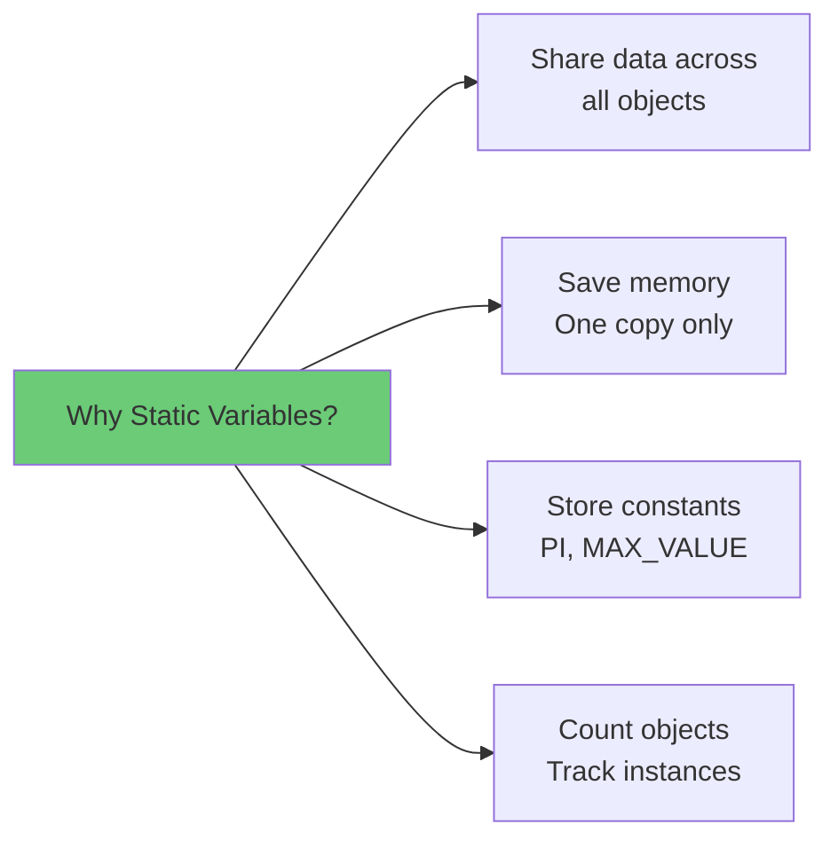
```mermaid
graph LR
    A[Why Static Variables?] --> B[Share data across<br/>all objects]
    A --> C[Save memory<br/>One copy only]
    A --> D[Store constants<br/>PI, MAX_VALUE]
    A --> E[Count objects<br/>Track instances]
    
    style A fill:#6BCB77
```

**Use Cases:**
1. **Constants** that never change (PI, speed of light)
2. **Counters** to track how many objects were created
3. **Configuration data** shared by all instances
4. **Utility values** that don't depend on object state

#### Example: The Problem Without Static

```java
class BankAccount {
    String accountHolder;
    double balance;
    String bankName;  // Every object has its own copy! Wasteful!
    String bankCode;  // Every object has its own copy! Wasteful!
    
    BankAccount(String name, double bal) {
        accountHolder = name;
        balance = bal;
        bankName = "State Bank";  // Same for everyone, but repeated!
        bankCode = "SBI001";       // Same for everyone, but repeated!
    }
}

// Creating 1000 accounts = 1000 copies of "State Bank" and "SBI001"
// Massive memory waste!
```

**Memory Waste Visualization:**

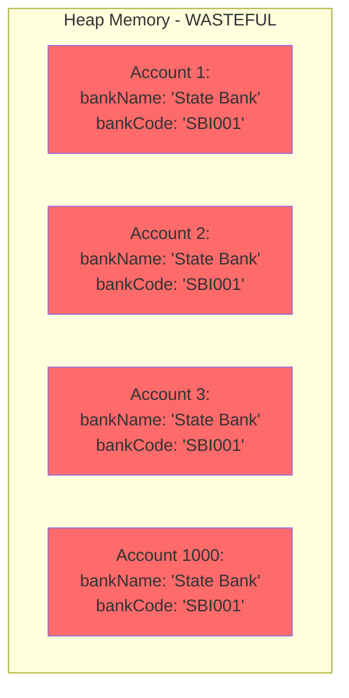
```mermaid
graph TB
    subgraph "Heap Memory - WASTEFUL"
        A[Account 1:<br/>bankName: 'State Bank'<br/>bankCode: 'SBI001']
        B[Account 2:<br/>bankName: 'State Bank'<br/>bankCode: 'SBI001']
        C[Account 3:<br/>bankName: 'State Bank'<br/>bankCode: 'SBI001']
        D[Account 1000:<br/>bankName: 'State Bank'<br/>bankCode: 'SBI001']
    end
    
    style A fill:#FF6B6B
    style B fill:#FF6B6B
    style C fill:#FF6B6B
    style D fill:#FF6B6B
```

#### Solution: Using Static Variables

```java
class BankAccount {
    // Instance variables - unique for each account
    String accountHolder;
    double balance;
    
    // Static variables - shared by ALL accounts
    static String bankName = "State Bank";
    static String bankCode = "SBI001";
    static int totalAccounts = 0;  // Counter for all accounts
    
    BankAccount(String name, double bal) {
        accountHolder = name;
        balance = bal;
        totalAccounts++;  // Increment shared counter
    }
    
    void displayInfo() {
        System.out.println("Account Holder: " + accountHolder);
        System.out.println("Balance: ₹" + balance);
        System.out.println("Bank: " + bankName);  // Accessing static variable
        System.out.println("Bank Code: " + bankCode);
    }
}

public class BankTest {
    public static void main(String[] args) {
        // Accessing static variable WITHOUT creating object
        System.out.println("Bank: " + BankAccount.bankName);
        System.out.println("Total Accounts: " + BankAccount.totalAccounts);
        
        // Creating accounts
        BankAccount acc1 = new BankAccount("Rajesh", 5000);
        BankAccount acc2 = new BankAccount("Priya", 10000);
        BankAccount acc3 = new BankAccount("Amit", 7500);
        
        // Check total accounts
        System.out.println("Total Accounts: " + BankAccount.totalAccounts);  // 3
        
        // Accessing via object (allowed but not recommended)
        System.out.println("Bank via object: " + acc1.bankName);
        
        // Change static variable - affects ALL objects!
        BankAccount.bankName = "Global Bank";
        
        acc1.displayInfo();  // Shows "Global Bank"
        acc2.displayInfo();  // Shows "Global Bank"
        acc3.displayInfo();  // Shows "Global Bank"
    }
}
```

**Efficient Memory Usage:**

```mermaid
graph TB
    subgraph "Method Area - EFFICIENT"
        Z[Static Variables:<br/>bankName: 'State Bank'<br/>bankCode: 'SBI001'<br/>totalAccounts: 3<br/>ONE COPY ONLY]
    end
    
    subgraph "Heap Memory"
        A[Account 1:<br/>holder: 'Rajesh'<br/>balance: 5000]
        B[Account 2:<br/>holder: 'Priya'<br/>balance: 10000]
        C[Account 3:<br/>holder: 'Amit'<br/>balance: 7500]
    end
    
    Z -.shared.-> A
    Z -.shared.-> B
    Z -.shared.-> C
    
    style Z fill:#6BCB77
    style A fill:#95E1D3
    style B fill:#95E1D3
    style C fill:#95E1D3
```

#### Real-World Example: Student Management

```java
class Student {
    // Instance variables - unique to each student
    private String name;
    private int rollNumber;
    private double marks;
    
    // Static variables - shared by all students
    private static String schoolName = "Greenwood High School";
    private static String principalName = "Dr. Sharma";
    private static int totalStudents = 0;
    private static double passPercentage = 40.0;
    
    // Constructor
    public Student(String name, int rollNumber, double marks) {
        this.name = name;
        this.rollNumber = rollNumber;
        this.marks = marks;
        totalStudents++;  // Increment for each new student
        System.out.println("✓ Student " + totalStudents + " enrolled: " + name);
    }
    
    // Instance method
    public void displayInfo() {
        System.out.println("\n--- Student Information ---");
        System.out.println("Name: " + this.name);
        System.out.println("Roll Number: " + this.rollNumber);
        System.out.println("Marks: " + this.marks + "%");
        System.out.println("School: " + schoolName);  // Static variable
        System.out.println("Principal: " + principalName);  // Static variable
        
        if (this.marks >= passPercentage) {
            System.out.println("Result: PASSED ✓");
        } else {
            System.out.println("Result: FAILED ✗");
        }
    }
    
    // Static method to change school name (affects ALL students)
    public static void changeSchoolName(String newName) {
        schoolName = newName;
        System.out.println("School name changed to: " + schoolName);
    }
    
    // Static method to get total students
    public static int getTotalStudents() {
        return totalStudents;
    }
}

public class SchoolTest {
    public static void main(String[] args) {
        // Check total before creating any student
        System.out.println("Total Students: " + Student.getTotalStudents());  // 0
        
        // Create students
        Student s1 = new Student("Arjun", 101, 85.5);
        Student s2 = new Student("Meera", 102, 92.0);
        Student s3 = new Student("Karan", 103, 67.5);
        Student s4 = new Student("Diya", 104, 35.0);
        
        // Display info
        s1.displayInfo();
        s2.displayInfo();
        s3.displayInfo();
        s4.displayInfo();
        
        // Check total
        System.out.println("\nTotal Students Enrolled: " + Student.getTotalStudents());  // 4
        
        // Change school name - affects ALL students
        Student.changeSchoolName("Cambridge International School");
        
        System.out.println("\n--- After School Name Change ---");
        s1.displayInfo();  // Shows new school name
        s4.displayInfo();  // Shows new school name
    }
}
```

---

### Static Methods

#### What Are Static Methods?

Static methods (also called **class methods**) are methods that:
1. Belong to the **class**, not to individual objects
2. Can be called **without creating an object**
3. Can only access **static variables and other static methods** directly
4. **Cannot use `this` keyword** (because there's no specific object)

#### Why Do We Need Static Methods?

```mermaid
graph TD
    A[Why Static Methods?] --> B[Utility functions<br/>Math.sqrt, Math.pow]
    A --> C[Factory methods<br/>Create objects]
    A --> D[Access static data<br/>Without objects]
    A --> E[Helper functions<br/>Conversions, validations]
    
    style A fill:#6BCB77
```

**Use Cases:**
1. **Utility/Helper methods** that don't need object state (Math operations, conversions)
2. **Factory methods** that create and return objects
3. **Access static variables** without creating objects
4. **Main method** - entry point of program

#### Example: Math Utility Class

```java
class MathHelper {
    // Static constants
    public static final double PI = 3.14159;
    public static final double E = 2.71828;
    
    // Static method - can be called without creating object
    public static int add(int a, int b) {
        return a + b;
    }
    
    public static int multiply(int a, int b) {
        return a * b;
    }
    
    public static double circleArea(double radius) {
        return PI * radius * radius;  // Using static constant
    }
    
    public static boolean isEven(int number) {
        return number % 2 == 0;
    }
    
    public static int factorial(int n) {
        if (n <= 1) return 1;
        return n * factorial(n - 1);  // Static method calling itself
    }
}

public class MathTest {
    public static void main(String[] args) {
        // Calling static methods WITHOUT creating object
        int sum = MathHelper.add(10, 20);
        int product = MathHelper.multiply(5, 6);
        double area = MathHelper.circleArea(7.5);
        boolean even = MathHelper.isEven(42);
        int fact = MathHelper.factorial(5);
        
        System.out.println("Sum: " + sum);
        System.out.println("Product: " + product);
        System.out.println("Circle Area: " + area);
        System.out.println("Is 42 even? " + even);
        System.out.println("Factorial of 5: " + fact);
        System.out.println("PI: " + MathHelper.PI);
        
        // No need to create object!
        // MathHelper helper = new MathHelper();  // Unnecessary!
    }
}
```

#### Important Restrictions of Static Methods

```java
class Example {
    // Instance variable
    int instanceVar = 10;
    
    // Static variable
    static int staticVar = 20;
    
    // Instance method
    void instanceMethod() {
        System.out.println(instanceVar);  // ✅ Can access instance variable
        System.out.println(staticVar);     // ✅ Can access static variable
        this.instanceMethod2();            // ✅ Can use 'this'
    }
    
    void instanceMethod2() {
        System.out.println("Instance method 2");
    }
    
    // Static method
    static void staticMethod() {
        // System.out.println(instanceVar);  // ❌ ERROR! Cannot access instance variable
        System.out.println(staticVar);        // ✅ Can access static variable
        
        // this.instanceMethod();  // ❌ ERROR! Cannot use 'this'
        
        staticMethod2();  // ✅ Can call other static methods
        
        // To access instance members, need to create object
        Example obj = new Example();
        System.out.println(obj.instanceVar);  // ✅ Now it works
        obj.instanceMethod();                  // ✅ Now it works
    }
    
    static void staticMethod2() {
        System.out.println("Static method 2");
    }
}
```

**Why These Restrictions?**

```mermaid
sequenceDiagram
    participant Client
    participant Class
    participant Object
    
    Note over Client,Object: Calling Static Method
    Client->>Class: Example.staticMethod()
    Note over Class: No object exists yet!<br/>Cannot access instance variables<br/>Cannot use 'this'
    Class-->>Client: Returns result
    
    Note over Client,Object: Calling Instance Method
    Client->>Object: obj.instanceMethod()
    Note over Object: Object exists!<br/>Can access instance variables<br/>Can use 'this'
    Object-->>Client: Returns result
```

#### Access Rules Summary

| From \ To | Instance Variable | Static Variable | Instance Method | Static Method |
|-----------|-------------------|-----------------|-----------------|---------------|
| **Instance Method** | ✅ Yes | ✅ Yes | ✅ Yes | ✅ Yes |
| **Static Method** | ❌ No (need object) | ✅ Yes | ❌ No (need object) | ✅ Yes |

---

### Real-World Example: Database Connection Pool

```java
class DatabaseConnection {
    // Instance variables - unique for each connection
    private String connectionId;
    private boolean isActive;
    
    // Static variables - shared across all connections
    private static String databaseURL = "jdbc:mysql://localhost:3306/mydb";
    private static String username = "admin";
    private static int maxConnections = 10;
    private static int activeConnections = 0;
    
    // Private constructor (for factory pattern)
    private DatabaseConnection(String id) {
        this.connectionId = id;
        this.isActive = true;
        activeConnections++;
    }
    
    // Static factory method to create connections
    public static DatabaseConnection createConnection() {
        if (activeConnections >= maxConnections) {
            System.out.println("❌ Cannot create connection: Maximum limit reached!");
            return null;
        }
        
        String id = "CONN_" + (activeConnections + 1);
        System.out.println("✓ Creating connection: " + id);
        return new DatabaseConnection(id);
    }
    
    // Instance method
    public void executeQuery(String query) {
        if (isActive) {
            System.out.println("[" + connectionId + "] Executing: " + query);
            System.out.println("[" + connectionId + "] Connected to: " + databaseURL);
        } else {
            System.out.println("Connection is closed!");
        }
    }
    
    // Instance method
    public void close() {
        if (isActive) {
            isActive = false;
            activeConnections--;
            System.out.println("[" + connectionId + "] Connection closed");
        }
    }
    
    // Static method to get configuration
    public static void displayConfig() {
        System.out.println("\n=== Database Configuration ===");
        System.out.println("URL: " + databaseURL);
        System.out.println("Username: " + username);
        System.out.println("Max Connections: " + maxConnections);
        System.out.println("Active Connections: " + activeConnections);
    }
    
    // Static method to change configuration
    public static void setMaxConnections(int max) {
        maxConnections = max;
        System.out.println("Max connections set to: " + max);
    }
    
    // Static method to get active connection count
    public static int getActiveConnections() {
        return activeConnections;
    }
}

public class DatabaseTest {
    public static void main(String[] args) {
        // Display config without creating any object
        DatabaseConnection.displayConfig();
        
        // Create connections using static factory method
        DatabaseConnection conn1 = DatabaseConnection.createConnection();
        DatabaseConnection conn2 = DatabaseConnection.createConnection();
        DatabaseConnection conn3 = DatabaseConnection.createConnection();
        
        // Use instance methods
        conn1.executeQuery("SELECT * FROM users");
        conn2.executeQuery("INSERT INTO products VALUES (1, 'Laptop')");
        conn3.executeQuery("UPDATE orders SET status='shipped' WHERE id=5");
        
        // Check active connections
        System.out.println("\nActive Connections: " + DatabaseConnection.getActiveConnections());
        
        // Close a connection
        conn2.close();
        
        // Check again
        System.out.println("Active Connections: " + DatabaseConnection.getActiveConnections());
        
        // Change max connections limit
        DatabaseConnection.setMaxConnections(15);
        
        // Display updated config
        DatabaseConnection.displayConfig();
    }
}
```

**Output:**
```
=== Database Configuration ===
URL: jdbc:mysql://localhost:3306/mydb
Username: admin
Max Connections: 10
Active Connections: 0

✓ Creating connection: CONN_1
✓ Creating connection: CONN_2
✓ Creating connection: CONN_3

[CONN_1] Executing: SELECT * FROM users
[CONN_1] Connected to: jdbc:mysql://localhost:3306/mydb
[CONN_2] Executing: INSERT INTO products VALUES (1, 'Laptop')
[CONN_2] Connected to: jdbc:mysql://localhost:3306/mydb
[CONN_3] Executing: UPDATE orders SET status='shipped' WHERE id=5
[CONN_3] Connected to: jdbc:mysql://localhost:3306/mydb

Active Connections: 3
[CONN_2] Connection closed
Active Connections: 2

Max connections set to: 15

=== Database Configuration ===
URL: jdbc:mysql://localhost:3306/mydb
Username: admin
Max Connections: 15
Active Connections: 2
```

---

### Static vs Instance: Complete Comparison

```mermaid
graph TB
    subgraph "Instance Members"
        A1[Belong to Objects]
        A2[Each object has<br/>its own copy]
        A3[Access via object:<br/>obj.method]
        A4[Can access both static<br/>and instance members]
        A5[Use 'this' keyword]
    end
    
    subgraph "Static Members"
        B1[Belong to Class]
        B2[One copy shared<br/>by all objects]
        B3[Access via class:<br/>ClassName.method]
        B4[Can access only<br/>static members]
        B5[Cannot use 'this']
    end
    
    style A1 fill:#95E1D3
    style A2 fill:#95E1D3
    style A3 fill:#95E1D3
    style A4 fill:#95E1D3
    style A5 fill:#95E1D3
    style B1 fill:#FFD93D
    style B2 fill:#FFD93D
    style B3 fill:#FFD93D
    style B4 fill:#FFD93D
    style B5 fill:#FFD93D
```

### Comparison Table

| Aspect | Instance (Non-Static) | Static |
|--------|----------------------|--------|
| **Belongs to** | Individual objects | Class itself |
| **Memory** | Each object has own copy | One copy in memory |
| **Access** | Requires object creation | No object needed |
| **Syntax** | `obj.method()` or `obj.variable` | `ClassName.method()` or `ClassName.variable` |
| **Can access** | Both static and instance members | Only static members |
| **Use `this`** | ✅ Yes | ❌ No |
| **When to use** | Data specific to each object | Data/behavior shared by all objects |
| **Example** | Student name, account balance | School name, total student count |

---

### Real-World Example: E-commerce Product

```java
class Product {
    // Instance variables - unique for each product
    private String productId;
    private String name;
    private double price;
    private int stock;
    
    // Static variables - shared by all products
    private static String companyName = "ShopEasy";
    private static double taxRate = 0.18;  // 18% GST
    private static int totalProducts = 0;
    private static double totalRevenue = 0.0;
    
    // Constructor
    public Product(String id, String name, double price, int stock) {
        this.productId = id;
        this.name = name;
        this.price = price;
        this.stock = stock;
        totalProducts++;
    }
    
    // Instance method - calculates price with tax for this product
    public double getPriceWithTax() {
        return this.price + (this.price * taxRate);
    }
    
    // Instance method - sells this specific product
    public void sell(int quantity) {
        if (quantity > this.stock) {
            System.out.println("❌ Insufficient stock for " + this.name);
            return;
        }
        
        this.stock -= quantity;
        double sale = this.price * quantity;
        totalRevenue += sale;  // Update static variable
        
        System.out.println("✓ Sold " + quantity + " x " + this.name);
        System.out.println("  Price: ₹" + sale);
        System.out.println("  Remaining stock: " + this.stock);
    }
    
    // Instance method
    public void displayInfo() {
        System.out.println("\n--- Product Details ---");
        System.out.println("ID: " + this.productId);
        System.out.println("Name: " + this.name);
        System.out.println("Price: ₹" + this.price);
        System.out.println("Price with Tax: ₹" + this.getPriceWithTax());
        System.out.println("Stock: " + this.stock);
        System.out.println("Company: " + companyName);
    }
    
    // Static method - get total products (no object needed)
    public static int getTotalProducts() {
        return totalProducts;
    }
    
    // Static method - get total revenue (no object needed)
    public static double getTotalRevenue() {
        return totalRevenue;
    }
    
    // Static method - change tax rate (affects ALL products)
    public static void setTaxRate(double rate) {
        taxRate = rate;
        System.out.println("Tax rate updated to: " + (rate * 100) + "%");
    }
    
    // Static method - display business summary
    public static void displayBusinessSummary() {
        System.out.println("\n========== Business Summary ==========");
        System.out.println("Company: " + companyName);
        System.out.println("Total Products: " + totalProducts);
        System.out.println("Total Revenue: ₹" + totalRevenue);
        System.out.println("Current Tax Rate: " + (taxRate * 100) + "%");
        System.out.println("======================================");
    }
}

public class EcommerceTest {
    public static void main(String[] args) {
        // Static method call - without creating any object
        System.out.println("Initial Products: " + Product.getTotalProducts());
        
        // Create products
        Product laptop = new Product("P001", "Dell Laptop", 45000, 10);
        Product phone = new Product("P002", "Samsung Phone", 25000, 20);
        Product headphones = new Product("P003", "Sony Headphones", 3000, 50);
        
        // Display product info (instance method)
        laptop.displayInfo();
        phone.displayInfo();
        headphones.displayInfo();
        
        // Sell products (instance method)
        System.out.println("\n--- Sales Transactions ---");
        laptop.sell(2);
        phone.sell(5);
        headphones.sell(10);
        
        // Display business summary (static method)
        Product.displayBusinessSummary();
        
        // Change tax rate (static method - affects all products)
        Product.setTaxRate(0.12);  // Reduced to 12%
        
        // Check price with new tax
        System.out.println("\nLaptop price with new tax: ₹" + laptop.getPriceWithTax());
        System.out.println("Phone price with new tax: ₹" + phone.getPriceWithTax());
        
        // More sales
        System.out.println("\n--- More Sales ---");
        laptop.sell(3);
        headphones.sell(15);
        
        // Final business summary
        Product.displayBusinessSummary();
    }
}
```

---

### Memory Allocation: Static vs Instance

```mermaid
graph TB
    subgraph "Method Area (Class)"
        S1[Static Variables:<br/>companyName<br/>taxRate<br/>totalProducts<br/>totalRevenue]
        S2[Static Methods:<br/>getTotalProducts<br/>getTotalRevenue<br/>setTaxRate<br/>displayBusinessSummary]
    end
    
    subgraph "Heap Memory (Objects)"
        O1[laptop object:<br/>productId: P001<br/>name: Dell Laptop<br/>price: 45000<br/>stock: 10]
        O2[phone object:<br/>productId: P002<br/>name: Samsung Phone<br/>price: 25000<br/>stock: 20]
        O3[headphones object:<br/>productId: P003<br/>name: Sony Headphones<br/>price: 3000<br/>stock: 50]
    end
    
    S1 -.shared by all.-> O1
    S1 -.shared by all.-> O2
    S1 -.shared by all.-> O3
    
    style S1 fill:#FFD93D
    style S2 fill:#FFD93D
    style O1 fill:#95E1D3
    style O2 fill:#95E1D3
    style O3 fill:#95E1D3
```

**Key Points:**
1. **Static members** live in the Method Area (loaded when class is loaded)
2. **Instance members** live in the Heap (created when object is created)
3. Static members exist **before any object is created**
4. Static members exist **even if no objects are created**
5. Static members are destroyed **when program ends**

---

### When to Use Static?

#### ✅ Use Static When:

1. **The data is same for all objects**
   ```java
   static String companyName;  // Same for all employees
   static final double PI = 3.14159;  // Mathematical constant
   ```

2. **Utility/Helper methods that don't depend on object state**
   ```java
   static int max(int a, int b)  // Math utility
   static boolean isValidEmail(String email)  // Validation
   ```

3. **Counters or tracking across all instances**
   ```java
   static int totalStudents;  // Count all students
   static double totalRevenue;  // Sum of all sales
   ```

4. **Constants that never change**
   ```java
   static final int MAX_SIZE = 100;
   static final String VERSION = "1.0.0";
   ```

5. **Factory methods** (methods that create objects)
   ```java
   static DatabaseConnection getInstance()
   static Product createProduct(String type)
   ```

#### ❌ Don't Use Static When:

1. **Data is unique to each object**
   ```java
   String name;  // Each person has different name
   double balance;  // Each account has different balance
   ```

2. **Method needs to access instance variables**
   ```java
   void displayInfo() {  // Needs this.name, this.age
       System.out.println(this.name);
   }
   ```

3. **Behavior depends on object state**
   ```java
   boolean canWithdraw(double amount) {  // Depends on this.balance
       return this.balance >= amount;
   }
   ```

---

### Common Pitfalls and Best Practices

#### ❌ Pitfall 1: Accessing Static via Object (Confusing)

```java
class Counter {
    static int count = 0;
}

Counter c1 = new Counter();
Counter c2 = new Counter();

// BAD - Looks like instance variable
c1.count++;  // Works but misleading
c2.count++;  // Works but misleading

// GOOD - Clear it's a static variable
Counter.count++;  // Clear and correct
Counter.count++;  // Clear and correct
```

#### ❌ Pitfall 2: Trying to Access Instance from Static

```java
class Example {
    int instanceVar = 10;
    
    static void staticMethod() {
        // System.out.println(instanceVar);  // ❌ ERROR!
        
        // Must create object first
        Example obj = new Example();
        System.out.println(obj.instanceVar);  // ✅ Works
    }
}
```

#### ✅ Best Practice: Use `final` with Static Constants

```java
class MathConstants {
    // Good - cannot be changed
    public static final double PI = 3.14159;
    public static final double E = 2.71828;
    
    // Bad - can be changed accidentally
    public static double GRAVITY = 9.8;
}

// Somewhere in code:
// MathConstants.PI = 3.14;  // ❌ ERROR - cannot change final
// MathConstants.GRAVITY = 10;  // ✅ Works but dangerous!
```

#### ✅ Best Practice: Static Initialization Block

```java
class Configuration {
    static String serverURL;
    static int port;
    static boolean isProduction;
    
    // Static initialization block - runs when class is loaded
    static {
        System.out.println("Loading configuration...");
        serverURL = "https://api.example.com";
        port = 8080;
        isProduction = true;
        System.out.println("Configuration loaded!");
    }
    
    static void displayConfig() {
        System.out.println("Server: " + serverURL);
        System.out.println("Port: " + port);
        System.out.println("Production: " + isProduction);
    }
}
```

---

### The `main` Method: A Special Static Method

The `main` method is **static** because:
1. JVM needs to call it **without creating an object**
2. It's the **entry point** of the program
3. Should work **before any objects exist**

```java
public class Application {
    // This is static!
    public static void main(String[] args) {
        // JVM calls this without: new Application()
        System.out.println("Program started");
        
        // Now we can create objects
        Application app = new Application();
        app.run();
    }
    
    // Instance method
    void run() {
        System.out.println("Application running...");
    }
}
```

**Why `main` Must Be Static:**

```mermaid
sequenceDiagram
    participant JVM
    participant Application Class
    participant Application Object
    
    Note over JVM: Program starts
    JVM->>Application Class: Application.main(args)
    Note over Application Class: main is static<br/>No object needed!
    Application Class->>Application Class: Execute main method
    Application Class->>Application Object: new Application()
    Note over Application Object: Now object exists<br/>Can call instance methods
    Application Object->>Application Object: run()
```

---

### Complete Real-World Example: Library Management

```java
class Library {
    // Static variables - shared across entire library
    private static String libraryName = "City Central Library";
    private static int totalBooks = 0;
    private static int totalMembers = 0;
    private static final double LATE_FEE_PER_DAY = 5.0;
    
    // Instance variables - unique per book
    private String bookId;
    private String title;
    private String author;
    private boolean isIssued;
    
    // Static initialization block
    static {
        System.out.println("=" .repeat(50));
        System.out.println("Welcome to " + libraryName);
        System.out.println("=" .repeat(50));
    }
    
    // Constructor
    public Library(String id, String title, String author) {
        this.bookId = id;
        this.title = title;
        this.author = author;
        this.isIssued = false;
        totalBooks++;
        System.out.println("✓ Book added: " + title);
    }
    
    // Instance method - issue this specific book
    public void issueBook(String memberName) {
        if (this.isIssued) {
            System.out.println("❌ Book already issued: " + this.title);
        } else {
            this.isIssued = true;
            System.out.println("✓ Book issued to " + memberName + ": " + this.title);
        }
    }
    
    // Instance method - return this specific book
    public void returnBook(int daysLate) {
        if (!this.isIssued) {
            System.out.println("❌ Book was not issued: " + this.title);
        } else {
            this.isIssued = false;
            double fine = calculateFine(daysLate);  // Calling static method
            System.out.println("✓ Book returned: " + this.title);
            if (fine > 0) {
                System.out.println("  Late fee: ₹" + fine);
            }
        }
    }
    
    // Static method - calculate late fine
    public static double calculateFine(int daysLate) {
        if (daysLate <= 0) return 0.0;
        return daysLate * LATE_FEE_PER_DAY;
    }
    
    // Static method - register new member
    public static void registerMember(String name) {
        totalMembers++;
        System.out.println("✓ New member registered: " + name + " (ID: M" + totalMembers + ")");
    }
    
    // Static method - library statistics
    public static void displayStatistics() {
        System.out.println("\n" + "=".repeat(50));
        System.out.println("Library Statistics");
        System.out.println("=".repeat(50));
        System.out.println("Library Name: " + libraryName);
        System.out.println("Total Books: " + totalBooks);
        System.out.println("Total Members: " + totalMembers);
        System.out.println("Late Fee: ₹" + LATE_FEE_PER_DAY + " per day");
        System.out.println("=".repeat(50));
    }
    
    // Instance method - display book info
    public void displayBookInfo() {
        System.out.println("\n--- Book Information ---");
        System.out.println("ID: " + this.bookId);
        System.out.println("Title: " + this.title);
        System.out.println("Author: " + this.author);
        System.out.println("Status: " + (this.isIssued ? "Issued" : "Available"));
    }
}

public class LibraryTest {
    public static void main(String[] args) {
        // Static methods - no object needed
        Library.registerMember("Rahul Sharma");
        Library.registerMember("Priya Patel");
        Library.registerMember("Amit Kumar");
        
        System.out.println();
        
        // Create books (instance creation)
        Library book1 = new Library("B001", "Java Programming", "James Gosling");
        Library book2 = new Library("B002", "Clean Code", "Robert Martin");
        Library book3 = new Library("B003", "Design Patterns", "Gang of Four");
        
        // Display statistics (static method)
        Library.displayStatistics();
        
        // Issue books (instance methods)
        System.out.println("\n--- Issuing Books ---");
        book1.issueBook("Rahul Sharma");
        book2.issueBook("Priya Patel");
        book1.issueBook("Amit Kumar");  // Already issued
        
        // Display book info (instance method)
        book1.displayBookInfo();
        book2.displayBookInfo();
        book3.displayBookInfo();
        
        // Return books (instance methods)
        System.out.println("\n--- Returning Books ---");
        book1.returnBook(0);   // On time
        book2.returnBook(5);   // 5 days late
        
        // Calculate fine (static method)
        double fine = Library.calculateFine(3);
        System.out.println("\nFine for 3 days late: ₹" + fine);
        
        // Final statistics
        Library.displayStatistics();
    }
}
```

---

### Summary: Static Variables and Methods

```mermaid
mindmap
  root((Static in Java))
    Static Variables
      Class-level data
      Shared by all objects
      One copy in memory
      Access: ClassName.variable
      Use for: Constants, Counters, Config
    Static Methods
      Class-level behavior
      No object needed
      Cannot use 'this'
      Access: ClassName.method
      Use for: Utilities, Factory, Helpers
    Key Rules
      Cannot access instance members directly
      Can access only static members
      Loaded when class loads
      Memory efficient
    Common Examples
      Math.sqrt, Math.PI
      Integer.parseInt
      Arrays.sort
      main method
```

**Remember:**
- **Static = Class-level** (belongs to class, not objects)
- **Instance = Object-level** (belongs to individual objects)
- Static members exist **before any object is created**
- Use static for **shared data and utility methods**
- Use instance for **object-specific data and behavior**

---

## Complete Example: University Management System

Let's bring everything together with a comprehensive example:

```java
// File: University.java
public class University {
    public static void main(String[] args) {
        // Creating students with different constructors
        Student s1 = new Student();  // Default constructor
        Student s2 = new Student("Amit Kumar", 101);  // Parameterized constructor
        Student s3 = new Student("Priya Sharma", 102, 95.5);  // Full constructor
        
        // Display all students
        s1.displayInfo();
        s2.displayInfo();
        s3.displayInfo();
        
        // Enroll in courses
        s2.enrollCourse("Mathematics")
          .enrollCourse("Physics")
          .enrollCourse("Computer Science")
          .displayCourses();
        
        // Update marks
        s3.updateMarks(98.5);
        s3.displayInfo();
        
        // Create a course
        Course mathCourse = new Course("MATH101", "Advanced Mathematics", s2);
        mathCourse.displayCourseInfo();
    }
}

class Student {
    // Private fields - data hiding
    private String name;
    private int rollNumber;
    private double marks;
    private int courseCount;
    
    // Protected - for potential subclasses
    protected String email;
    
    // Default constructor
    public Student() {
        this("Unknown", 0, 0.0);  // Constructor chaining
        System.out.println("Default student created");
    }
    
    // Parameterized constructor
    public Student(String name, int rollNumber) {
        this(name, rollNumber, 0.0);  // Constructor chaining
    }
    
    // Master constructor
    public Student(String name, int rollNumber, double marks) {
        this.name = name;
        this.rollNumber = rollNumber;
        this.marks = marks;
        this.courseCount = 0;
        this.email = name.toLowerCase().replace(" ", ".") + "@university.edu";
        System.out.println("✓ Student created: " + this.name);
    }
    
    // Public method - method chaining using 'this'
    public Student enrollCourse(String courseName) {
        this.courseCount++;
        System.out.println(this.name + " enrolled in: " + courseName);
        return this;  // Return current object for chaining
    }
    
    // Public method to safely update marks
    public void updateMarks(double newMarks) {
        if (newMarks >= 0 && newMarks <= 100) {
            this.marks = newMarks;
            System.out.println("Marks updated for " + this.name + ": " + newMarks);
        } else {
            System.out.println("Invalid marks! Must be between 0 and 100.");
        }
    }
    
    // Public getter methods
    public String getName() {
        return this.name;
    }
    
    public int getRollNumber() {
        return this.rollNumber;
    }
    
    public double getMarks() {
        return this.marks;
    }
    
    // Public method to display info
    public void displayInfo() {
        System.out.println("\n--- Student Information ---");
        System.out.println("Name: " + this.name);
        System.out.println("Roll Number: " + this.rollNumber);
        System.out.println("Marks: " + this.marks + "%");
        System.out.println("Email: " + this.email);
    }
    
    // Public method
    public void displayCourses() {
        System.out.println(this.name + " is enrolled in " + this.courseCount + " courses");
        return;
    }
}

class Course {
    private String courseCode;
    private String courseName;
    private Student enrolledBy;  // Reference to Student object
    
    public Course(String code, String name, Student student) {
        this.courseCode = code;
        this.courseName = name;
        this.enrolledBy = student;
    }
    
    public void displayCourseInfo() {
        System.out.println("\n--- Course Information ---");
        System.out.println("Course Code: " + this.courseCode);
        System.out.println("Course Name: " + this.courseName);
        System.out.println("Enrolled by: " + this.enrolledBy.getName() + 
                           " (Roll: " + this.enrolledBy.getRollNumber() + ")");
    }
}
```

---

## Key Takeaways

### 1. Classes and Objects
- **Class** = Blueprint
- **Object** = Actual instance
- One class can create millions of objects

### 2. Memory Allocation
- **Stack** stores references
- **Heap** stores actual objects
- Understanding this prevents memory leaks and bugs

### 3. Constructors
- Initialize objects when created
- **Default constructor**: No parameters
- **Parameterized constructor**: Takes parameters
- **Critical Rule**: If you write ANY constructor, you must explicitly write default if needed
- **Constructor chaining**: Use `this()` to call other constructors

### 4. The `this` Keyword
- Refers to current object
- Resolves naming conflicts
- Enables constructor chaining
- Allows method chaining
- Passes current object as parameter

### 5. Access Modifiers
- **private**: Maximum security - same class only
- **default**: Package-level access
- **protected**: Package + inheritance
- **public**: Universal access
- **Rule**: Start restrictive, make accessible only when needed

### 6. Why OOP?
- Models real world naturally
- Organizes complex systems
- Enables code reuse
- Provides data security
- Makes maintenance easier

### 7. Static Variables and Methods
- **Static variables**: Belong to class, shared by all objects
- **Static methods**: Can be called without creating objects
- **Memory efficient**: One copy of static members
- **Use cases**: Constants, counters, utility methods
- **Restrictions**: Cannot access instance members directly

---

## Practice Exercises

### Exercise 1: Create a Library System
Create classes for `Book`, `Member`, and `Library` with:
- Appropriate constructors
- Private fields with public getters/setters
- Method chaining for issuing books
- Use of `this` keyword

### Exercise 2: Build a Banking Application
Create `BankAccount` class with:
- Private balance
- Public methods for deposit/withdraw
- Constructor overloading
- Access modifiers for security

### Exercise 3: Design a Student Management System
Implement:
- Constructor chaining
- Method chaining for adding courses
- Protected fields for inheritance
- Memory-efficient design

---

## Conclusion

Object-Oriented Programming is not just a programming paradigm - it's a way of thinking. By organizing code around objects that mirror real-world entities, we create software that is:

- **Intuitive**: Models real-world scenarios
- **Maintainable**: Easy to update and debug
- **Scalable**: Can grow with requirements
- **Secure**: Protects data through encapsulation
- **Reusable**: Write once, use everywhere

Remember: **Great code is not just about making it work - it's about making it work well, securely, and maintainably. OOP gives you the tools to achieve all three.**

---

*Happy Coding! 🚀*