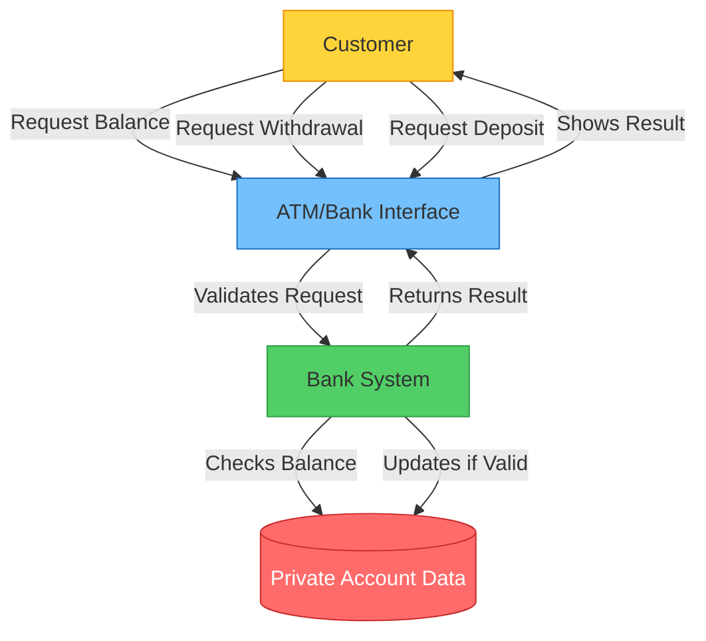
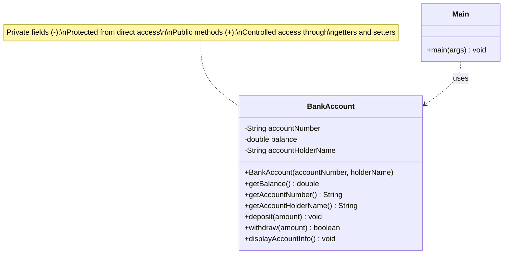
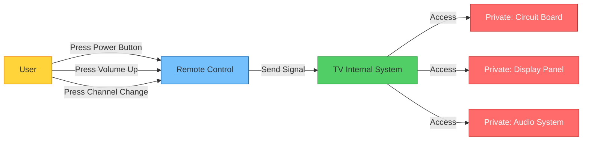
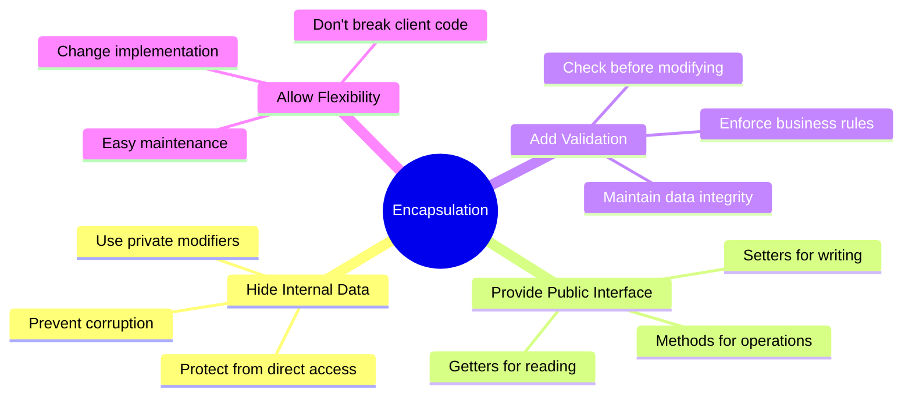

# Java Encapsulation Explained

## What is Encapsulation? 🎁

Think of encapsulation like a **capsule** or a **protective wrapper** around your data. Just like how a medicine capsule protects the medicine inside and controls how it's released into your body, encapsulation in programming protects your data and controls how it's accessed and modified.

## Real-World Example: Your Bank Account 🏦

Let's think about your bank account as a perfect real-world example:

### Without Encapsulation (The Problem):
Imagine if anyone could directly access your bank account and:
- Change your balance to any amount they want
- Set your balance to negative numbers
- Withdraw more money than you have
- See all your private financial information

**This would be chaos!** 😱

### With Encapsulation (The Solution):
Your bank protects your account by:
- Keeping your balance **private** (you can't directly touch it)
- Providing **controlled access** through ATM/online banking (getters)
- Providing **controlled modifications** through deposits/withdrawals (setters with validation)
- Enforcing **business rules** (can't withdraw more than balance)



## Why Do We Need Encapsulation?

### 1. **Data Protection** 🛡️
Prevents unauthorized or accidental modification of data.

### 2. **Controlled Access** 🚪
You decide who can read or modify your data and how.

### 3. **Validation** ✅
You can add rules to ensure data remains valid.

### 4. **Flexibility** 🔄
You can change internal implementation without breaking code that uses your class.

### 5. **Maintenance** 🔧
Makes code easier to maintain and debug.

## Let's Code It! 💻

### ❌ Bad Example (No Encapsulation)

```java
class BankAccount {
    // Anyone can access and modify these directly!
    public String accountNumber;
    public double balance;
}

public class Main {
    public static void main(String[] args) {
        BankAccount account = new BankAccount();
        
        // Dangerous! No validation
        account.balance = -5000;  // Negative balance? That's a problem!
        account.accountNumber = ""; // Empty account number? Also bad!
        
        System.out.println("Balance: $" + account.balance);
    }
}
```

**Problems:**
- No validation (negative balance allowed!)
- Data can be corrupted easily
- No business rules enforced
- Hard to track who modified what

### ✅ Good Example (With Encapsulation)

```java
class BankAccount {
    // Private data - no direct access from outside
    private String accountNumber;
    private double balance;
    private String accountHolderName;
    
    // Constructor
    public BankAccount(String accountNumber, String accountHolderName) {
        this.accountNumber = accountNumber;
        this.accountHolderName = accountHolderName;
        this.balance = 0.0;
    }
    
    // Getter for balance (controlled read access)
    public double getBalance() {
        return balance;
    }
    
    // Getter for account number (controlled read access)
    public String getAccountNumber() {
        return accountNumber;
    }
    
    // Getter for account holder name
    public String getAccountHolderName() {
        return accountHolderName;
    }
    
    // Controlled modification through deposit
    public void deposit(double amount) {
        if (amount > 0) {
            balance += amount;
            System.out.println("Deposited: $" + amount);
        } else {
            System.out.println("Error: Deposit amount must be positive!");
        }
    }
    
    // Controlled modification through withdrawal
    public boolean withdraw(double amount) {
        if (amount <= 0) {
            System.out.println("Error: Withdrawal amount must be positive!");
            return false;
        }
        
        if (amount > balance) {
            System.out.println("Error: Insufficient funds!");
            return false;
        }
        
        balance -= amount;
        System.out.println("Withdrawn: $" + amount);
        return true;
    }
    
    // Display account info
    public void displayAccountInfo() {
        System.out.println("\n--- Account Information ---");
        System.out.println("Account Holder: " + accountHolderName);
        System.out.println("Account Number: " + accountNumber);
        System.out.println("Current Balance: $" + balance);
        System.out.println("---------------------------\n");
    }
}

public class Main {
    public static void main(String[] args) {
        // Create a new bank account
        BankAccount myAccount = new BankAccount("ACC123456", "John Doe");
        
        // Try to access balance directly - This will cause a compilation error!
        // myAccount.balance = -5000; // ❌ Error: The field BankAccount.balance is not visible
        
        // Proper way - using controlled methods
        myAccount.deposit(1000);        // ✅ Deposit $1000
        myAccount.displayAccountInfo();  // Show account info
        
        myAccount.withdraw(300);         // ✅ Withdraw $300
        myAccount.withdraw(800);         // ❌ Error: Insufficient funds
        
        myAccount.displayAccountInfo();  // Show updated info
        
        // Can only read balance through getter
        System.out.println("Available balance: $" + myAccount.getBalance());
    }
}
```

**Output:**
```
Deposited: $1000.0

--- Account Information ---
Account Holder: John Doe
Account Number: ACC123456
Current Balance: $1000.0
---------------------------

Withdrawn: $300.0
Error: Insufficient funds!

--- Account Information ---
Account Holder: John Doe
Account Number: ACC123456
Current Balance: $700.0
---------------------------

Available balance: $700.0
```

## Encapsulation Structure Diagram



## Another Real-World Example: TV Remote Control 📺

Think about your TV remote control:

- **Hidden Complexity**: You don't need to know the complex electronics inside the TV
- **Simple Interface**: You just press buttons (methods) to control it
- **Protection**: You can't accidentally mess up the internal circuits
- **Controlled Access**: Each button does a specific, validated action



### TV Example in Code:

```java
class Television {
    // Private internal state
    private boolean isPoweredOn;
    private int volume;
    private int channel;
    private final int MAX_VOLUME = 100;
    private final int MIN_VOLUME = 0;
    
    public Television() {
        this.isPoweredOn = false;
        this.volume = 50;
        this.channel = 1;
    }
    
    // Public methods to control TV
    public void powerToggle() {
        isPoweredOn = !isPoweredOn;
        System.out.println("TV is now " + (isPoweredOn ? "ON" : "OFF"));
    }
    
    public void volumeUp() {
        if (!isPoweredOn) {
            System.out.println("Please turn on the TV first!");
            return;
        }
        if (volume < MAX_VOLUME) {
            volume += 5;
            System.out.println("Volume: " + volume);
        }
    }
    
    public void volumeDown() {
        if (!isPoweredOn) {
            System.out.println("Please turn on the TV first!");
            return;
        }
        if (volume > MIN_VOLUME) {
            volume -= 5;
            System.out.println("Volume: " + volume);
        }
    }
    
    public void setChannel(int newChannel) {
        if (!isPoweredOn) {
            System.out.println("Please turn on the TV first!");
            return;
        }
        if (newChannel > 0) {
            channel = newChannel;
            System.out.println("Channel changed to: " + channel);
        }
    }
}
```

## The Four Principles of Encapsulation



## Key Rules for Encapsulation

1. **Make fields private**: Use `private` access modifier
2. **Provide public getters**: To read data (if needed)
3. **Provide public setters**: To write data (if needed, with validation)
4. **Validate in setters**: Always check if the data is valid before setting
5. **Keep implementation details hidden**: Users shouldn't know how things work internally

## Summary

Encapsulation is like putting your valuable items in a safe:
- The **safe** protects your items (private fields)
- The **combination lock** controls access (getters/setters)
- Only **authorized operations** are allowed (validated methods)
- The **internal mechanism** is hidden (implementation details)

This makes your code:
- **Safer** - Data can't be corrupted
- **More Reliable** - Business rules are enforced
- **Easier to Maintain** - Changes don't break other code
- **More Professional** - Follows industry best practices

Remember: **Good encapsulation = Happy programmers = Reliable software!** 🎉