# Java Inheritance Explained 🧬

Think of inheritance like a **family tree**. A child inherits traits from their parents — same eyes, same height, same habits. In Java, a **child class** inherits fields and methods from a **parent class**, and can also add its own unique traits or change inherited ones.

---

## 🗺️ Big Picture: What We'll Cover

```mermaid
mindmap
    root((Inheritance))
        Types
            Single
            Multilevel
            Hierarchical
            Multiple via Interface
        Keywords
            extends
            implements
            super
            this
        Constructors
            Default Constructor
            Parameterized Constructor
            super() call
            this() call
        Methods
            Method Overloading
            Method Overriding
            @Override annotation
        Static
            Static fields
            Static methods
            Static vs Instance
            Static and Inheritance
```

---

## 🌍 Real-World Analogy: The Vehicle Family

Imagine a car showroom:
- Every vehicle has: `speed`, `fuel`, `start()`, `stop()`
- A **Car** adds: `numberOfDoors`, `openTrunk()`
- A **Truck** adds: `cargoCapacity`, `loadCargo()`
- An **ElectricCar** extends Car and adds: `batteryLevel`, `chargeBattery()`

**Why repeat `start()` and `stop()` in every class?** You don't have to — that's exactly what inheritance solves.

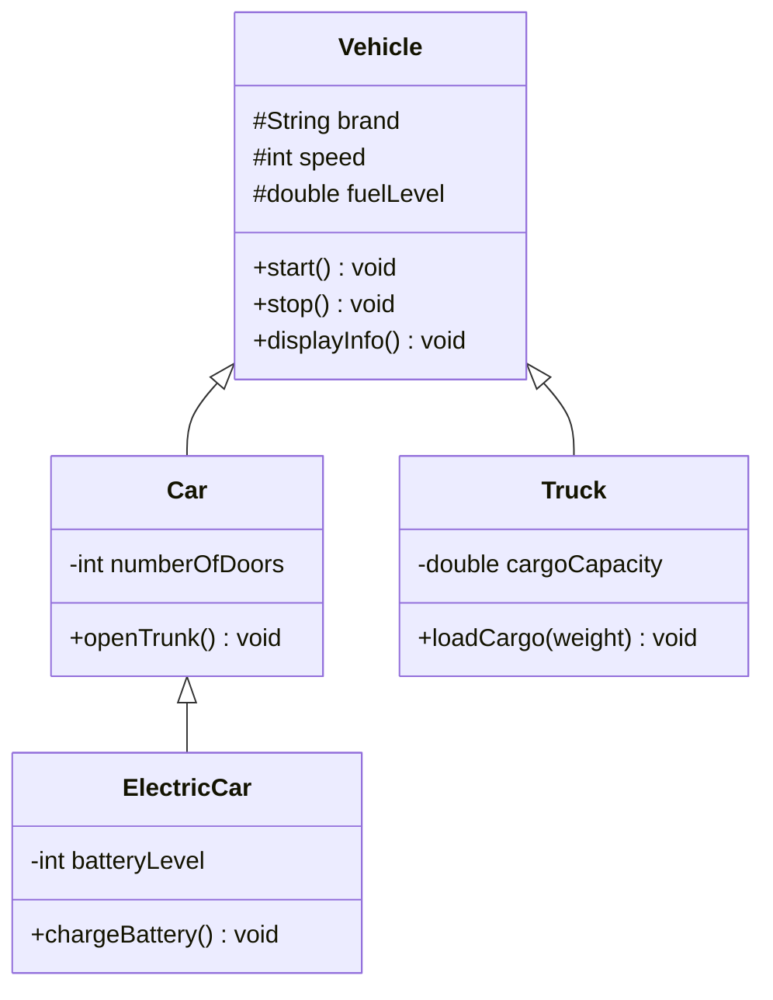

---

## Part 1: Types of Inheritance

### Type 1 — Single Inheritance

One child class inherits from one parent class. The simplest form.

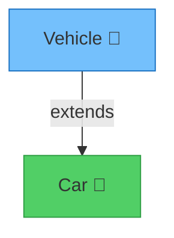

```java
class Vehicle {
    String brand;
    int speed;

    void start() {
        System.out.println(brand + " is starting...");
    }

    void stop() {
        System.out.println(brand + " is stopping.");
    }
}

class Car extends Vehicle {        // Car INHERITS from Vehicle
    int numberOfDoors;

    void openTrunk() {
        System.out.println("Trunk opened on " + brand);
        // 'brand' is inherited from Vehicle — no need to redeclare it here
        // If we didn't use inheritance, we'd have to redeclare 'brand' and
        // rewrite start() and stop() again inside Car — code duplication!
    }
}

public class Main {
    public static void main(String[] args) {
        Car myCar = new Car();
        myCar.brand = "Toyota";        // inherited field
        myCar.speed = 120;             // inherited field
        myCar.numberOfDoors = 4;       // Car's own field

        myCar.start();                 // inherited method — works directly!
        myCar.openTrunk();             // Car's own method
        myCar.stop();                  // inherited method
    }
}
```

**Output:**
```
Toyota is starting...
Trunk opened on Toyota
Toyota is stopping.
```

> **Key Insight:** `Car` didn't write `start()` or `stop()`, yet it uses them. That's inheritance at work!

---

### Type 2 — Multilevel Inheritance

A chain: Grandparent → Parent → Child.

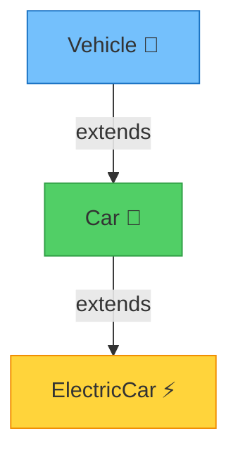

```java
class Vehicle {
    String brand;

    void start() {
        System.out.println(brand + " starting...");
    }
}

class Car extends Vehicle {
    int numberOfDoors;

    void honk() {
        System.out.println(brand + " goes Beep Beep!");
        // 'brand' comes from Vehicle (grandparent) — multilevel access works!
    }
}

class ElectricCar extends Car {    // ElectricCar inherits from Car, which inherits from Vehicle
    int batteryLevel;

    void chargeBattery() {
        batteryLevel = 100;
        System.out.println(brand + " battery charged to " + batteryLevel + "%");
        // 'brand' is from Vehicle (two levels up) — still accessible!
        // Without inheritance, ElectricCar would need to redeclare everything
    }
}

public class Main {
    public static void main(String[] args) {
        ElectricCar tesla = new ElectricCar();
        tesla.brand = "Tesla";           // From Vehicle (2 levels up)
        tesla.numberOfDoors = 4;         // From Car (1 level up)
        tesla.batteryLevel = 80;         // ElectricCar's own field

        tesla.start();                   // From Vehicle — works!
        tesla.honk();                    // From Car — works!
        tesla.chargeBattery();           // ElectricCar's own method
    }
}
```

**Output:**
```
Tesla starting...
Tesla goes Beep Beep!
Tesla battery charged to 100%
```

---

### Type 3 — Hierarchical Inheritance

One parent, multiple children. All children share the parent's features but each adds their own.

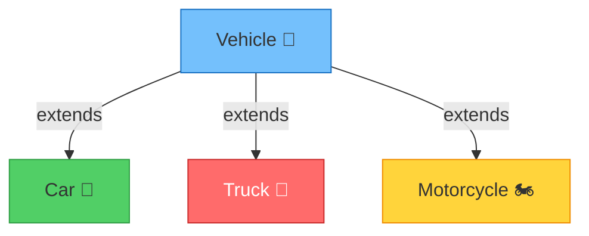

```java
class Vehicle {
    String brand;
    int speed;

    void start() {
        System.out.println(brand + " is starting.");
    }
}

class Car extends Vehicle {
    int doors;

    void openTrunk() {
        System.out.println(brand + ": Trunk opened.");
    }
}

class Truck extends Vehicle {
    double cargoCapacity;

    void loadCargo(double weight) {
        if (weight <= cargoCapacity) {
            System.out.println(brand + ": Loaded " + weight + " tons.");
        } else {
            System.out.println(brand + ": Overloaded! Max capacity: " + cargoCapacity);
        }
    }
}

class Motorcycle extends Vehicle {
    boolean hasSidecar;

    void wheelie() {
        System.out.println(brand + ": Doing a wheelie!");
    }
}

public class Main {
    public static void main(String[] args) {
        Car car = new Car();
        car.brand = "Honda";
        car.start();           // from Vehicle
        car.openTrunk();       // Car's own

        Truck truck = new Truck();
        truck.brand = "Volvo";
        truck.cargoCapacity = 20.0;
        truck.start();         // from Vehicle
        truck.loadCargo(15.5); // Truck's own

        Motorcycle bike = new Motorcycle();
        bike.brand = "Ducati";
        bike.start();          // from Vehicle
        bike.wheelie();        // Motorcycle's own
    }
}
```

**Output:**
```
Honda is starting.
Honda: Trunk opened.
Volvo is starting.
Volvo: Loaded 15.5 tons.
Ducati is starting.
Ducati: Doing a wheelie!
```

---

### Type 4 — Multiple Inheritance (via Interfaces)

Java **does NOT allow** a class to extend multiple classes directly (to avoid the "Diamond Problem"). But it **does allow** implementing multiple interfaces.

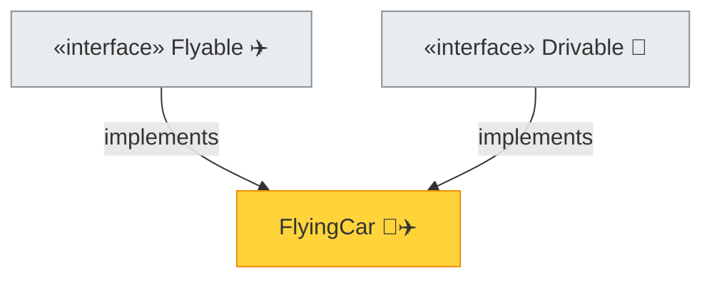

```java
interface Flyable {
    void fly();           // all interface methods are implicitly public abstract

    default void land() {
        System.out.println("Landing...");
    }
}

interface Drivable {
    void drive();

    default void park() {
        System.out.println("Parking...");
    }
}

class FlyingCar implements Flyable, Drivable {
    String model;

    FlyingCar(String model) {
        this.model = model;
        // 'this.model' refers to THIS object's 'model' field
        // Without 'this', Java still understands it here since the parameter
        // name is different, but 'this' makes the intent crystal clear
    }

    @Override
    public void fly() {
        System.out.println(model + " is flying at 5000 feet!");
    }

    @Override
    public void drive() {
        System.out.println(model + " is driving on road.");
    }
}

public class Main {
    public static void main(String[] args) {
        FlyingCar fc = new FlyingCar("AeroCar X1");
        fc.fly();
        fc.drive();
        fc.land();   // default method from Flyable interface
        fc.park();   // default method from Drivable interface
    }
}
```

**Output:**
```
AeroCar X1 is flying at 5000 feet!
AeroCar X1 is driving on road.
Landing...
Parking...
```

> **Why no multiple class inheritance?** If both `ClassA` and `ClassB` have a method `show()`, and `ClassC extends ClassA, ClassB` — which `show()` does `ClassC` use? Java avoids this ambiguity by disallowing it for classes, but interfaces handle it cleanly.

---

## Part 2: The `this` Keyword — "I'm talking about myself"

`this` refers to the **current object** — the instance on which a method or constructor is being called.

### Why Do We Need `this`?

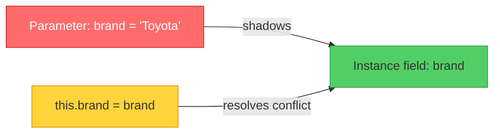

### Scenario 1: Parameter Name Conflicts with Field Name

```java
class Car {
    String brand;    // instance field
    int speed;

    Car(String brand, int speed) {
        // PROBLEM: Both the parameter and the field are named 'brand'
        // Java gives priority to the LOCAL parameter inside this method
        // So just writing  brand = brand;  assigns the parameter to itself — BUG!

        this.brand = brand;
        // 'this.brand' = the FIELD belonging to this object
        // 'brand'       = the PARAMETER passed into the constructor
        // Without 'this': brand = brand; --> parameter assigns to itself, field stays null!

        this.speed = speed;
        // Same reason — parameter 'speed' shadows field 'speed'
    }

    void display() {
        System.out.println("Brand: " + brand + ", Speed: " + speed);
    }
}

public class Main {
    public static void main(String[] args) {
        Car c1 = new Car("BMW", 200);
        c1.display();  // Brand: BMW, Speed: 200

        // What if we remove 'this' from constructor?
        // Car c2 = new Car("Audi", 180);
        // c2.display() would print: Brand: null, Speed: 0
        // Because the field was never actually set!
    }
}
```

**What happens WITHOUT `this` in the constructor:**

```java
Car(String brand, int speed) {
    brand = brand;   // ❌ assigns parameter to itself — field 'brand' is still null
    speed = speed;   // ❌ assigns parameter to itself — field 'speed' is still 0
}
// Result: display() prints "Brand: null, Speed: 0" — WRONG!
```

---

### Scenario 2: `this()` — Calling Another Constructor

`this()` lets one constructor call another constructor **in the same class** — avoids repeating initialization logic.

```java
class Car {
    String brand;
    int speed;
    String color;

    Car(String brand) {
        this(brand, 100, "White");
        // Calls the 3-parameter constructor below
        // Without this(), we'd have to copy-paste  this.brand = brand; this.speed = 100; this.color = "White";  here too
        // that's code duplication — bad practice!
        System.out.println("1-param constructor called");
    }

    Car(String brand, int speed) {
        this(brand, speed, "Black");
        // Delegates to the 3-param constructor with default color
        System.out.println("2-param constructor called");
    }

    Car(String brand, int speed, String color) {
        // This is the MASTER constructor — all initialization happens here
        this.brand = brand;
        this.speed = speed;
        this.color = color;
        System.out.println("3-param constructor called (master)");
    }

    void display() {
        System.out.println(brand + " | Speed: " + speed + " | Color: " + color);
    }
}

public class Main {
    public static void main(String[] args) {
        Car c1 = new Car("Toyota");
        c1.display();

        System.out.println("---");

        Car c2 = new Car("BMW", 250);
        c2.display();

        System.out.println("---");

        Car c3 = new Car("Ferrari", 350, "Red");
        c3.display();
    }
}
```

**Output:**
```
3-param constructor called (master)
1-param constructor called
Toyota | Speed: 100 | Color: White
---
3-param constructor called (master)
2-param constructor called
BMW | Speed: 250 | Color: Black
---
3-param constructor called (master)
Ferrari | Speed: 350 | Color: Red
```

> **Rule:** `this()` must be the **first statement** in a constructor. You can't put any code before it.

---

### Scenario 3: `this` to Return Current Object (Method Chaining)

```java
class Car {
    String brand;
    String color;
    int speed;

    Car setBrand(String brand) {
        this.brand = brand;
        return this;   // returns the SAME Car object so we can chain the next call
        // Without 'return this', we'd have to call each setter on a separate line:
        // car.setBrand("BMW");
        // car.setColor("Red");
        // car.setSpeed(200);
    }

    Car setColor(String color) {
        this.color = color;
        return this;
    }

    Car setSpeed(int speed) {
        this.speed = speed;
        return this;
    }

    void display() {
        System.out.println(brand + " | " + color + " | " + speed + " kmph");
    }
}

public class Main {
    public static void main(String[] args) {
        new Car()
            .setBrand("BMW")    // returns 'this' (same Car object)
            .setColor("Red")    // called on the SAME object
            .setSpeed(200)      // called on the SAME object
            .display();         // called on the SAME object
        // This is called METHOD CHAINING — clean and readable!
    }
}
```

**Output:**
```
BMW | Red | 200 kmph
```

---

## Part 3: The `super` Keyword — "I'm talking about my parent"

`super` refers to the **parent class** — its fields, methods, and constructors.

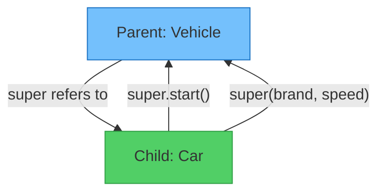

### Scenario 1: `super` to Access Parent Field When Child Has Same Field Name

```java
class Vehicle {
    String type = "Generic Vehicle";   // parent field
}

class Car extends Vehicle {
    String type = "Car";               // child field — SHADOWS the parent field

    void displayTypes() {
        System.out.println("Child type:  " + type);         // refers to Car's own 'type'
        System.out.println("Parent type: " + super.type);   // explicitly accesses Vehicle's 'type'
        // Without 'super.type', you'd have NO way to access Vehicle's 'type' from here
        // The child field completely shadows it otherwise
    }
}

public class Main {
    public static void main(String[] args) {
        Car car = new Car();
        car.displayTypes();
    }
}
```

**Output:**
```
Child type:  Car
Parent type: Generic Vehicle
```

---

### Scenario 2: `super.method()` — Calling Parent's Method

```java
class Vehicle {
    void start() {
        System.out.println("Vehicle engine starting — checking fuel...");
        System.out.println("Ignition on.");
    }
}

class Car extends Vehicle {
    @Override
    void start() {
        super.start();
        // Calls Vehicle's start() FIRST, then adds Car-specific behavior
        // Without super.start(), the parent's startup logic is completely LOST
        // You'd have to copy-paste it — code duplication!
        System.out.println("Car A/C and infotainment booting up...");
    }
}

class ElectricCar extends Car {
    @Override
    void start() {
        super.start();
        // Calls Car's start() (which internally calls Vehicle's start() first)
        // So the FULL chain runs: Vehicle.start() → Car.start() → ElectricCar.start()
        System.out.println("Electric motor engaged silently.");
    }
}

public class Main {
    public static void main(String[] args) {
        System.out.println("--- Starting Electric Car ---");
        ElectricCar tesla = new ElectricCar();
        tesla.start();
    }
}
```

**Output:**
```
--- Starting Electric Car ---
Vehicle engine starting — checking fuel...
Ignition on.
Car A/C and infotainment booting up...
Electric motor engaged silently.
```

> Notice how calling `tesla.start()` triggered a chain: `ElectricCar.start()` → `super.start()` → `Car.start()` → `super.start()` → `Vehicle.start()`. This is the **power of the inheritance chain**.

---

### Scenario 3: `super()` — Calling Parent Constructor

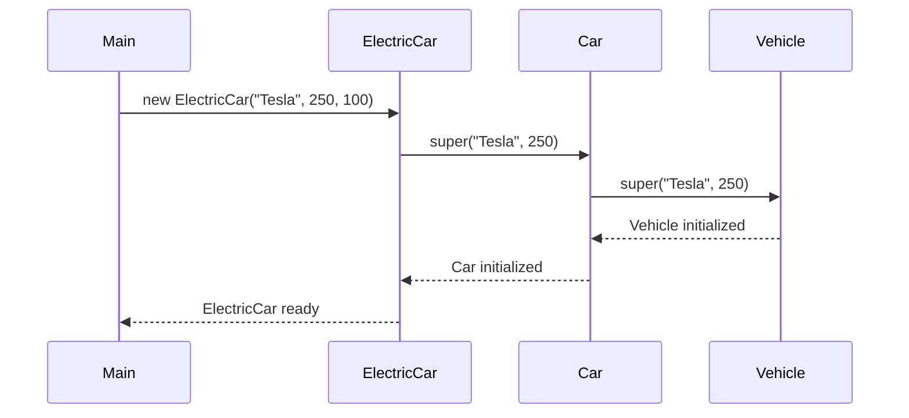

```java
class Vehicle {
    String brand;
    int speed;

    Vehicle(String brand, int speed) {
        this.brand = brand;
        this.speed = speed;
        System.out.println("Vehicle constructor: " + brand + " created.");
    }
}

class Car extends Vehicle {
    int doors;

    Car(String brand, int speed, int doors) {
        super(brand, speed);
        // MUST call super() FIRST to initialize the parent part (brand, speed)
        // If we skip super(), Java will try to call Vehicle's no-arg constructor
        // But Vehicle has no no-arg constructor here → COMPILATION ERROR!
        // super() must ALWAYS be the first statement in a constructor
        this.doors = doors;
        System.out.println("Car constructor: " + doors + " doors added.");
    }
}

class ElectricCar extends Car {
    int batteryLevel;

    ElectricCar(String brand, int speed, int batteryLevel) {
        super(brand, speed, 4);
        // Calls Car's constructor, which calls Vehicle's constructor
        // We hardcode 4 doors for ElectricCar — it always has 4
        this.batteryLevel = batteryLevel;
        System.out.println("ElectricCar constructor: Battery at " + batteryLevel + "%");
    }

    void display() {
        System.out.println("\n--- Electric Car Info ---");
        System.out.println("Brand:   " + brand);           // inherited from Vehicle
        System.out.println("Speed:   " + speed + " kmph"); // inherited from Vehicle
        System.out.println("Doors:   " + doors);           // inherited from Car
        System.out.println("Battery: " + batteryLevel + "%");
    }
}

public class Main {
    public static void main(String[] args) {
        ElectricCar tesla = new ElectricCar("Tesla", 250, 90);
        tesla.display();
    }
}
```

**Output:**
```
Vehicle constructor: Tesla created.
Car constructor: 4 doors added.
ElectricCar constructor: Battery at 90%

--- Electric Car Info ---
Brand:   Tesla
Speed:   250 kmph
Doors:   4
Battery: 90%
```

> **Critical Rule:** `super()` must be the **first statement** in a constructor. You cannot call `super()` and `this()` both in the same constructor (both must be first — contradiction).

---

## Part 4: Constructors in Inheritance — Full Picture

### What Happens When You Create an Object?

```mermaid
flowchart TD
    A[new ElectricCar called] --> B{Does ElectricCar constructor\ncall super explicitly?}
    B -->|Yes| C[Call super() → Car constructor]
    B -->|No| D[Java auto-inserts super()\ncalling no-arg parent constructor]
    C --> E{Does Car constructor\ncall super explicitly?}
    D --> E
    E -->|Yes| F[Call super() → Vehicle constructor]
    E -->|No| G[Java auto-inserts super()]
    F --> H[Vehicle fields initialized]
    G --> H
    H --> I[Car fields initialized]
    I --> J[ElectricCar fields initialized]
    J --> K[Object is ready!]

    style A fill:#74c0fc,stroke:#1971c2
    style K fill:#51cf66,stroke:#2f9e44
    style H fill:#ffd43b,stroke:#f08c00
    style I fill:#ffd43b,stroke:#f08c00
    style J fill:#ffd43b,stroke:#f08c00
```

### The Default Constructor Rule

```java
class Animal {
    String name;

    // No constructor defined — Java provides a default no-arg constructor automatically
    // Equivalent to:  Animal() { super(); }
}

class Dog extends Animal {
    String breed;

    // No constructor defined — Java provides default
    // Equivalent to:  Dog() { super(); }  which calls Animal()
}

public class Main {
    public static void main(String[] args) {
        Dog d = new Dog();   // works! Java's default constructors handle the chain
        d.name = "Buddy";
        d.breed = "Labrador";
        System.out.println(d.name + " is a " + d.breed);
    }
}
```

### When Default Constructors Break

```java
class Animal {
    String name;

    Animal(String name) {
        // We defined a parameterized constructor
        // Java NO LONGER provides the default no-arg constructor!
        this.name = name;
    }
}

class Dog extends Animal {
    String breed;

    Dog(String breed) {
        // Java tries to auto-insert super() here but Animal() no-arg doesn't exist!
        // COMPILATION ERROR: There is no default constructor available in 'Animal'
        // FIX: explicitly call super("Unknown"):
        super("Unknown");   // or take name as a parameter and pass it up
        this.breed = breed;
    }
}
```

> **Golden Rule:** As soon as you define ANY constructor in a class, Java removes the default no-arg constructor. If subclasses exist, they must explicitly call your constructor with `super(...)`.

---

## Part 5: Method Overloading — "Same name, different inputs"

Method overloading = **multiple methods with the same name** but **different parameter lists** in the **same class**.

> This is **Compile-time Polymorphism** (also called Static Dispatch) — Java decides which method to call at **compile time** based on the argument types.

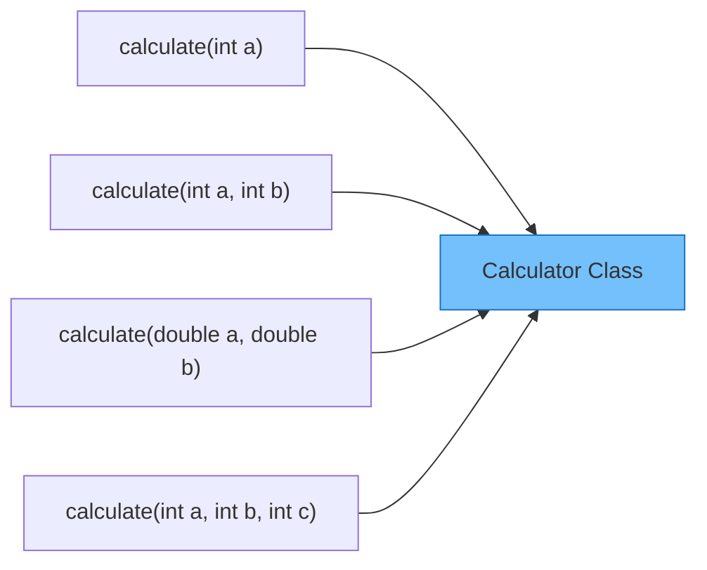

```java
class Calculator {

    // Version 1: one integer
    int calculate(int a) {
        System.out.println("Version 1: single int");
        return a * a;  // square
    }

    // Version 2: two integers — DIFFERENT parameter count from Version 1
    int calculate(int a, int b) {
        System.out.println("Version 2: two ints");
        return a + b;
    }

    // Version 3: two doubles — DIFFERENT parameter type from Version 2
    double calculate(double a, double b) {
        System.out.println("Version 3: two doubles");
        return a * b;
    }

    // Version 4: three integers — DIFFERENT parameter count
    int calculate(int a, int b, int c) {
        System.out.println("Version 4: three ints");
        return a + b + c;
    }

    // ❌ NOT overloading — return type alone is NOT enough to distinguish methods
    // double calculate(int a, int b) { return (double)(a+b); }  → COMPILATION ERROR
}

public class Main {
    public static void main(String[] args) {
        Calculator calc = new Calculator();

        System.out.println(calc.calculate(5));           // calls Version 1 → 25
        System.out.println(calc.calculate(3, 4));        // calls Version 2 → 7
        System.out.println(calc.calculate(2.5, 3.0));    // calls Version 3 → 7.5
        System.out.println(calc.calculate(1, 2, 3));     // calls Version 4 → 6
    }
}
```

**Output:**
```
Version 1: single int
25
Version 2: two ints
7
Version 3: two doubles
7.5
Version 4: three ints
6
```

### Overloading Rules Summary

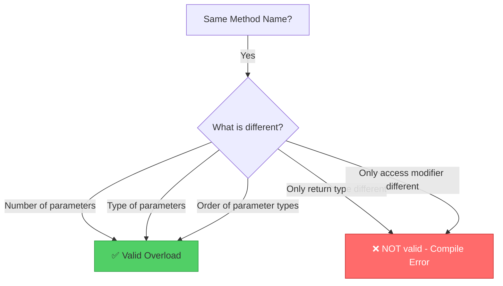

### Real-World Overloading: `println`

You've been using overloading all along! `System.out.println()` is overloaded for every type:
- `println(int x)`
- `println(double x)`
- `println(String x)`
- `println(boolean x)`
- `println(Object x)`

Java picks the right one based on what you pass in.

---

## Part 6: Method Overriding — "I'll do it MY way"

Method overriding = child class **redefines** a method inherited from the parent class, with the **exact same signature**.

> This is **Runtime Polymorphism** (also called Dynamic Dispatch) — Java decides which method to call at **runtime** based on the actual object type.

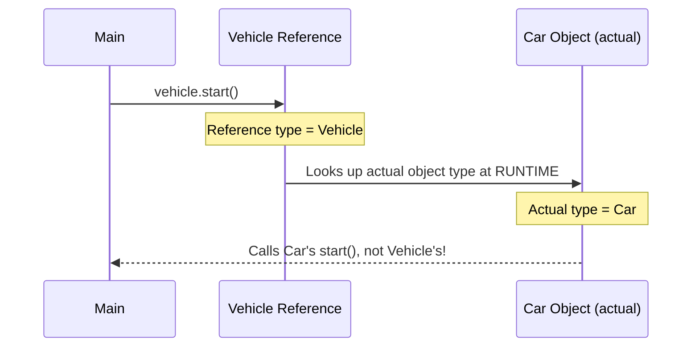

```java
class Vehicle {
    String brand;

    Vehicle(String brand) {
        this.brand = brand;
    }

    void start() {
        // Parent's version — generic startup
        System.out.println(brand + ": Generic vehicle starting.");
    }

    void fuelInfo() {
        System.out.println(brand + ": Runs on fuel.");
    }
}

class Car extends Vehicle {

    Car(String brand) {
        super(brand);   // must initialize parent's 'brand' field via super()
    }

    @Override          // annotation — tells compiler "I intend to override"
    void start() {
        // Child's version — Car-specific startup
        // The @Override annotation is important:
        // If we misspell the method as 'Start()' instead of 'start()',
        // without @Override Java would create a NEW method instead of overriding
        // With @Override, the compiler catches the typo immediately — SAVES from bugs!
        System.out.println(brand + ": Car starting — checking seatbelts, mirrors...");
    }

    // fuelInfo() is NOT overridden — Car will use Vehicle's fuelInfo()
}

class ElectricCar extends Vehicle {

    ElectricCar(String brand) {
        super(brand);
    }

    @Override
    void start() {
        System.out.println(brand + ": Electric car starting silently.");
    }

    @Override
    void fuelInfo() {
        // Overriding fuelInfo because electric cars don't use fuel
        // Without this override, ElectricCar would incorrectly say "Runs on fuel"
        System.out.println(brand + ": Runs on electricity, no fuel needed!");
    }
}

public class Main {
    public static void main(String[] args) {
        Vehicle v1 = new Vehicle("GenericBrand");
        Vehicle v2 = new Car("Honda");          // Vehicle reference, Car object
        Vehicle v3 = new ElectricCar("Tesla");  // Vehicle reference, ElectricCar object

        v1.start();    // Vehicle's start()
        v2.start();    // Car's start() — runtime polymorphism picks Car's version!
        v3.start();    // ElectricCar's start()

        System.out.println("---");

        v1.fuelInfo(); // Vehicle's fuelInfo()
        v2.fuelInfo(); // Vehicle's fuelInfo() — Car didn't override it
        v3.fuelInfo(); // ElectricCar's fuelInfo() — overridden!
    }
}
```

**Output:**
```
GenericBrand: Generic vehicle starting.
Honda: Car starting — checking seatbelts, mirrors...
Tesla: Electric car starting silently.
---
GenericBrand: Runs on fuel.
Honda: Runs on fuel.
Tesla: Runs on electricity, no fuel needed!
```

> **Runtime Polymorphism in action:** `v2` is declared as `Vehicle` but holds a `Car` object. Java looks at the **actual object** at runtime and calls `Car`'s `start()`. This is the heart of OOP — one reference, many behaviors.

### Overriding Rules

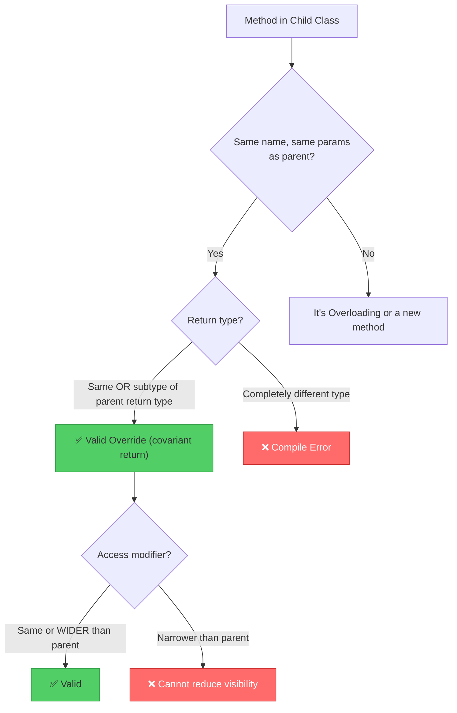

### Overloading vs Overriding — Side by Side

| Feature | Overloading | Overriding |
|---|---|---|
| Where | Same class | Child class redefines parent's method |
| Method name | Same | Same |
| Parameters | Must differ | Must be identical |
| Return type | Can differ | Must be same (or subtype) |
| Resolved at | **Compile time** | **Runtime** |
| Polymorphism | Static / Compile-time | Dynamic / Runtime |
| `@Override` | Not applicable | Strongly recommended |
| `static` methods | Can be overloaded | Cannot be overridden (only hidden) |

---

## Part 7: `static` in Inheritance — The Odd One Out

### What is `static`?

`static` means the field or method **belongs to the CLASS**, not to any specific object.

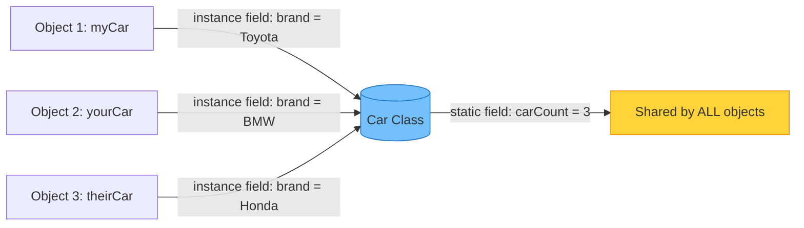

```java
class Car {
    String brand;          // instance field — each Car object has its OWN brand
    static int carCount;   // static field — SHARED across ALL Car objects
    // Think of it as: there's ONE carCount in memory, no matter how many Car objects exist

    Car(String brand) {
        this.brand = brand;
        carCount++;        // every time a Car is created, increment the shared counter
        // No 'this.' needed for static — it belongs to the class, not 'this' object
    }

    void displayBrand() {
        System.out.println("Brand: " + brand);
        // Instance method can access both instance fields and static fields
    }

    static void displayCount() {
        System.out.println("Total cars created: " + carCount);
        // Static method can ONLY access static fields and static methods
        // It CANNOT access 'brand' here because 'brand' belongs to a specific object
        // and in a static method, there's no 'this' object to refer to!
        // System.out.println(brand);  ← COMPILE ERROR in static method
    }
}

public class Main {
    public static void main(String[] args) {
        Car.displayCount();          // 0 — called on CLASS, no object needed

        Car c1 = new Car("Toyota");
        Car c2 = new Car("BMW");
        Car c3 = new Car("Honda");

        Car.displayCount();          // 3 — class-level call (preferred style)
        c1.displayCount();           // 3 — also works but misleading style — avoid this!
        // Both call the same thing. Using c1.displayCount() implies it's instance-specific — it's not.
    }
}
```

**Output:**
```
Total cars created: 0
Total cars created: 3
Total cars created: 3
```

---

### `static` Methods and Inheritance — Method Hiding, NOT Overriding

This is a **critical** and often misunderstood concept.

```java
class Vehicle {
    static void staticMethod() {
        System.out.println("Vehicle: static method");
    }

    void instanceMethod() {
        System.out.println("Vehicle: instance method");
    }
}

class Car extends Vehicle {
    static void staticMethod() {
        // This does NOT override Vehicle's staticMethod()
        // This HIDES it — two separate static methods exist, one per class
        // @Override annotation would cause a COMPILE ERROR here
        System.out.println("Car: static method");
    }

    @Override
    void instanceMethod() {
        // This genuinely overrides Vehicle's instanceMethod()
        System.out.println("Car: instance method");
    }
}

public class Main {
    public static void main(String[] args) {
        Vehicle ref = new Car();    // Vehicle reference pointing to Car object

        ref.staticMethod();
        // Calls VEHICLE's staticMethod() — because static methods are resolved
        // based on REFERENCE TYPE at compile time, not actual object type at runtime!
        // Runtime polymorphism does NOT apply to static methods!

        ref.instanceMethod();
        // Calls CAR's instanceMethod() — runtime polymorphism applies here!

        Car.staticMethod();     // Calls Car's static method directly — correct way
        Vehicle.staticMethod(); // Calls Vehicle's static method directly
    }
}
```

**Output:**
```
Vehicle: static method     ← ref is Vehicle type, so Vehicle's static is called
Car: instance method       ← actual object is Car, so Car's override is called
Car: static method
Vehicle: static method
```

> **Key difference:** Static methods are **resolved at compile time** (no polymorphism). Instance methods are **resolved at runtime** (polymorphism works).

---

### `static` Block — Class Initialization

```java
class DatabaseConfig {
    static String url;
    static String username;
    static int maxConnections;

    static {
        // Static block runs ONCE when the class is first loaded into memory
        // Before any object is created, before any static method is called
        // Used for complex static field initialization
        System.out.println("Loading database config...");
        url = "jdbc:mysql://localhost:3306/mydb";
        username = "admin";
        maxConnections = 10;
        System.out.println("Config loaded!");
    }

    static void showConfig() {
        System.out.println("URL: " + url);
        System.out.println("User: " + username);
        System.out.println("Max connections: " + maxConnections);
    }
}

public class Main {
    public static void main(String[] args) {
        System.out.println("Main started.");
        DatabaseConfig.showConfig();    // static block runs the FIRST time class is used
        DatabaseConfig.showConfig();    // static block does NOT run again
    }
}
```

**Output:**
```
Main started.
Loading database config...
Config loaded!
URL: jdbc:mysql://localhost:3306/mydb
User: admin
Max connections: 10
URL: jdbc:mysql://localhost:3306/mydb
User: admin
Max connections: 10
```

---

## Part 8: Full Real-World Example — Putting It All Together

Let's build an **Employee Payroll System** that uses all the concepts:

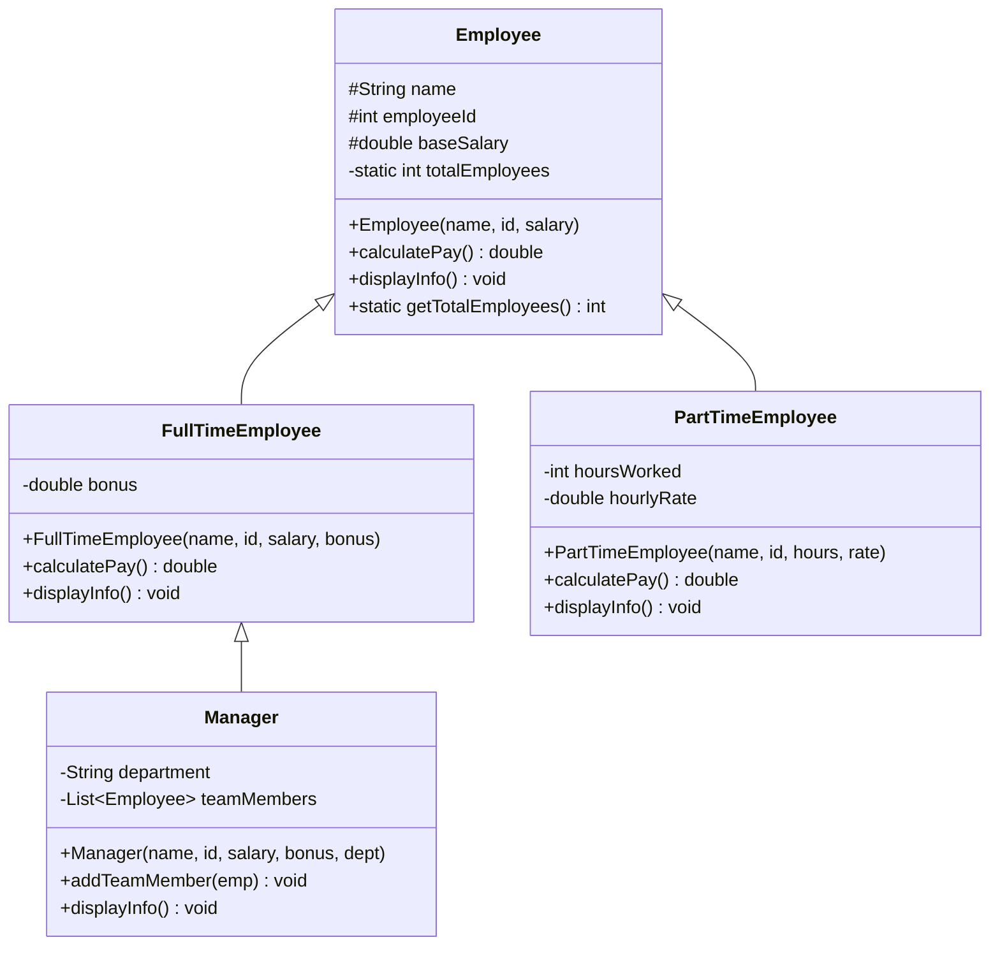

```java
import java.util.ArrayList;
import java.util.List;

class Employee {
    protected String name;
    protected int employeeId;
    protected double baseSalary;
    private static int totalEmployees = 0;  // shared counter across ALL employees

    Employee(String name, int employeeId, double baseSalary) {
        this.name = name;
        // 'this.name' = instance field; 'name' = constructor parameter
        // Without 'this': name = name; → parameter assigns to itself → field stays null

        this.employeeId = employeeId;
        this.baseSalary = baseSalary;
        totalEmployees++;  // no 'this.' needed — static fields don't belong to an instance
    }

    double calculatePay() {
        return baseSalary;  // base implementation — subclasses will override this
    }

    void displayInfo() {
        System.out.println("Name: " + name + " | ID: " + employeeId +
                           " | Pay: $" + String.format("%.2f", calculatePay()));
        // calculatePay() here uses runtime polymorphism!
        // If this is a Manager object, Manager's calculatePay() will be called
    }

    static int getTotalEmployees() {
        return totalEmployees;
        // Static method — no 'this', no instance needed
        // Cannot access 'name', 'baseSalary' etc. here — they belong to instances
    }
}

class FullTimeEmployee extends Employee {
    private double bonus;

    FullTimeEmployee(String name, int employeeId, double baseSalary, double bonus) {
        super(name, employeeId, baseSalary);
        // super() MUST be first — initializes Employee part (name, id, salary)
        // and increments totalEmployees counter in Employee constructor
        // Without super(), baseSalary would be 0 and name would be null!
        this.bonus = bonus;
    }

    @Override
    double calculatePay() {
        return baseSalary + bonus;
        // baseSalary is from parent (protected — accessible in child)
        // bonus is our own field
    }

    @Override
    void displayInfo() {
        super.displayInfo();
        // Reuse parent's display first, then add our specifics
        // Without super.displayInfo(), we'd have to rewrite the full display logic
        System.out.println("  [Full-Time] Bonus: $" + bonus);
    }
}

class PartTimeEmployee extends Employee {
    private int hoursWorked;
    private double hourlyRate;

    PartTimeEmployee(String name, int employeeId, int hoursWorked, double hourlyRate) {
        super(name, employeeId, hoursWorked * hourlyRate);
        // We calculate baseSalary on the fly and pass it to parent
        this.hoursWorked = hoursWorked;
        this.hourlyRate = hourlyRate;
    }

    @Override
    double calculatePay() {
        return hoursWorked * hourlyRate;
    }

    @Override
    void displayInfo() {
        super.displayInfo();
        System.out.println("  [Part-Time] Hours: " + hoursWorked + " @ $" + hourlyRate + "/hr");
    }
}

class Manager extends FullTimeEmployee {
    private String department;
    private List<Employee> teamMembers;

    Manager(String name, int employeeId, double baseSalary, double bonus, String department) {
        super(name, employeeId, baseSalary, bonus);
        // Calls FullTimeEmployee constructor, which calls Employee constructor
        // Chain: Manager → FullTimeEmployee → Employee
        this.department = department;
        this.teamMembers = new ArrayList<>();
        // 'this.teamMembers' — refers to this Manager's own list
    }

    void addTeamMember(Employee emp) {
        teamMembers.add(emp);
        System.out.println(emp.name + " added to " + name + "'s team.");
        // emp.name — accessing name (protected field) of another Employee object
        // name — our own inherited name field (no 'this.' needed, unambiguous)
    }

    @Override
    void displayInfo() {
        super.displayInfo();
        System.out.println("  [Manager] Department: " + department +
                           " | Team Size: " + teamMembers.size());
    }
}

public class Main {
    public static void main(String[] args) {
        System.out.println("=== Company Payroll System ===\n");

        Manager alice = new Manager("Alice", 1, 8000, 2000, "Engineering");
        FullTimeEmployee bob = new FullTimeEmployee("Bob", 2, 5000, 500);
        PartTimeEmployee carol = new PartTimeEmployee("Carol", 3, 80, 25);
        PartTimeEmployee dave = new PartTimeEmployee("Dave", 4, 60, 30);

        alice.addTeamMember(bob);
        alice.addTeamMember(carol);

        System.out.println("\n--- Employee Details ---");
        alice.displayInfo();
        System.out.println();
        bob.displayInfo();
        System.out.println();
        carol.displayInfo();
        System.out.println();
        dave.displayInfo();

        System.out.println("\n--- Summary ---");
        System.out.println("Total Employees: " + Employee.getTotalEmployees());

        System.out.println("\n--- Polymorphism Demo ---");
        // Store all as Employee references — runtime polymorphism!
        Employee[] staff = {alice, bob, carol, dave};
        double totalPayroll = 0;
        for (Employee e : staff) {
            totalPayroll += e.calculatePay();
            // calculatePay() calls the RIGHT version for each object at runtime
            // alice → Manager inherits FullTimeEmployee's calculatePay() = 8000+2000
            // bob   → FullTimeEmployee's calculatePay() = 5000+500
            // carol → PartTimeEmployee's calculatePay() = 80*25
            // dave  → PartTimeEmployee's calculatePay() = 60*30
        }
        System.out.printf("Total Monthly Payroll: $%.2f%n", totalPayroll);
    }
}
```

**Output:**
```
=== Company Payroll System ===

Bob added to Alice's team.
Carol added to Alice's team.

--- Employee Details ---
Name: Alice | ID: 1 | Pay: $10000.00
  [Full-Time] Bonus: $2000.0
  [Manager] Department: Engineering | Team Size: 2

Name: Bob | ID: 2 | Pay: $5500.00
  [Full-Time] Bonus: $500.0

Name: Carol | ID: 3 | Pay: $2000.00
  [Part-Time] Hours: 80 @ $25.0/hr

Name: Dave | ID: 4 | Pay: $1800.00
  [Part-Time] Hours: 60 @ $30.0/hr

--- Summary ---
Total Employees: 4

--- Polymorphism Demo ---
Total Monthly Payroll: $19300.00
```

---

## Part 9: Common Scenarios & Tricky Questions

### Scenario: Constructor Chaining with `this()` and `super()`

```java
class Shape {
    String color;

    Shape() {
        this("Black");
        // Uses this() to call the parameterized constructor of Shape itself
        System.out.println("Shape no-arg constructor");
    }

    Shape(String color) {
        this.color = color;
        System.out.println("Shape(" + color + ") constructor");
    }
}

class Circle extends Shape {
    double radius;

    Circle() {
        this(5.0);
        // Uses this() to call Circle's own parameterized constructor
        // this() and super() cannot BOTH be first — so choosing this() here
        // means Shape() is NOT called directly from here; Circle(5.0) handles it
        System.out.println("Circle no-arg constructor");
    }

    Circle(double radius) {
        super("Red");
        // Calls Shape("Red") constructor — explicitly sets color to Red
        this.radius = radius;
        System.out.println("Circle(" + radius + ") constructor");
    }
}

public class Main {
    public static void main(String[] args) {
        System.out.println("Creating Circle():");
        Circle c = new Circle();
        System.out.println("Color: " + c.color + ", Radius: " + c.radius);
    }
}
```

**Output:**
```
Creating Circle():
Shape(Red) constructor
Circle(5.0) constructor
Circle no-arg constructor
Color: Red, Radius: 5.0
```

**Execution chain:**
`Circle()` → `this(5.0)` → `Circle(5.0)` → `super("Red")` → `Shape("Red")`

---

### Scenario: Can You Override a `private` Method?

```java
class Parent {
    private void secret() {
        System.out.println("Parent secret");
    }

    void reveal() {
        secret();   // calls Parent's own secret() — private methods are NOT inherited
    }
}

class Child extends Parent {
    void secret() {
        // This is NOT overriding — Parent's secret() is private and not visible here
        // This is a BRAND NEW method in Child, completely unrelated to Parent's secret()
        System.out.println("Child secret");
    }
}

public class Main {
    public static void main(String[] args) {
        Child c = new Child();
        c.reveal();   // calls Parent's reveal(), which calls Parent's secret() — NOT Child's!
        c.secret();   // calls Child's secret()
    }
}
```

**Output:**
```
Parent secret    ← reveal() uses Parent's private secret(), not Child's
Child secret
```

---

### Scenario: `final` Keyword Stops Inheritance/Overriding

```java
final class Singleton {
    // This class CANNOT be extended
    // Used when you want to prevent subclassing (e.g., String class in Java is final)
    private static Singleton instance;

    private Singleton() {}

    static Singleton getInstance() {
        if (instance == null) instance = new Singleton();
        return instance;
    }
}

// class HackedSingleton extends Singleton { }  ← COMPILE ERROR: cannot extend final class

class Vehicle {
    String brand;

    final void safetyCheck() {
        // This method CANNOT be overridden in any subclass
        // final methods enforce critical behavior that must not be changed
        System.out.println("Safety check passed — brakes, airbags OK.");
    }

    void start() {
        System.out.println(brand + " starting.");
    }
}

class Car extends Vehicle {
    // @Override void safetyCheck() { }  ← COMPILE ERROR: cannot override final method

    @Override
    void start() {
        System.out.println(brand + " car starting with extra checks.");
    }
}
```

---

## 📋 Complete Concept Cheat Sheet

```mermaid
mindmap
    root((Java Inheritance))
        extends keyword
            Single inheritance
            Multilevel inheritance
            Hierarchical inheritance
        implements keyword
            Multiple inheritance via interfaces
            Interface default methods
        this keyword
            Resolves field vs parameter conflict
            this() calls another constructor
            Returns current object for chaining
        super keyword
            Accesses parent field
            super() calls parent constructor
            super.method() calls parent method
        Constructors
            super() must be first line
            this() must be first line
            Cannot use both in same constructor
            Default constructor removed when custom defined
        Method Overloading
            Same class
            Different parameters
            Compile-time polymorphism
        Method Overriding
            Child redefines parent method
            Same signature required
            Runtime polymorphism
            @Override annotation
        static
            Belongs to class not object
            NOT overridden — only hidden
            No this keyword inside
            Resolved at compile time
```

---

## 🔑 Key Rules — Quick Reference

| Concept | Rule |
|---|---|
| `super()` | Must be **first line** in constructor |
| `this()` | Must be **first line** in constructor |
| Both `super()` and `this()` | **Cannot both appear** in same constructor |
| Default constructor | **Removed** when any custom constructor is defined |
| `@Override` | Use it always — compiler catches typos |
| `static` override | Not possible — it's **method hiding**, not overriding |
| `private` method | **Not inherited** — cannot be overridden |
| `final` method | **Cannot be overridden** |
| `final` class | **Cannot be extended** |
| Overloading | **Compile-time** — resolved by parameter types |
| Overriding | **Runtime** — resolved by actual object type |

---

## 🎓 Summary

Inheritance is the mechanism that lets classes **build on top of each other**, creating a hierarchy of related types. Here's the complete picture:

- **`extends`** creates IS-A relationships: `Car IS-A Vehicle`
- **`super`** is the bridge to the parent — for fields, methods, and constructors
- **`this`** is self-reference — resolves naming conflicts and chains constructors
- **Constructors** always run top-down: grandparent → parent → child
- **Overloading** = same name, different parameters, decided at **compile time**
- **Overriding** = child redefines parent's method, decided at **runtime**
- **`static`** lives on the class, not the object — immune to runtime polymorphism

> **The golden insight:** When you use a parent reference to hold a child object (`Vehicle v = new Car()`), calling methods on it demonstrates the true power of OOP — the correct version is called automatically based on what the object actually **is**, not what the reference **says** it is. This is **runtime polymorphism**, and it's the reason large systems can be designed with flexibility and extensibility.

**Good inheritance design = Less code repetition + More flexibility + Easier maintenance!** 🚀

---

## Part 10: Reference Variable vs Instance — The Most Important Concept in OOP

This is the **single most powerful and confusing** idea in Java inheritance. Let's break it down completely.

### What Are They?

Every object creation has **two sides**:

```
Car c1 = new ElectricCar("Tesla", 250, 90);
 ↑              ↑
 Reference      Instance (actual object in memory)
 (left side)    (right side)
```

| | Reference Variable | Instance (Object) |
|---|---|---|
| What it is | The variable that **holds the address** of the object | The **actual object** created in memory (heap) |
| Declared type | Whatever type you write on the left | Whatever type you write after `new` |
| Controls | **Which methods/fields are VISIBLE** (compile time) | **Which method VERSION runs** (runtime) |
| Lives in | Stack memory | Heap memory |

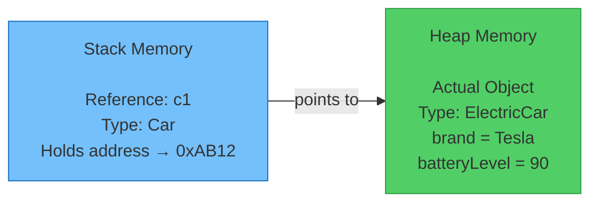

---

### All Possible Object Creation Scenarios

Let's use this hierarchy for all examples:

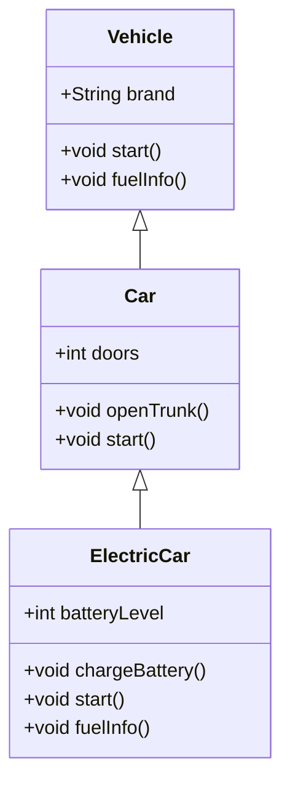

```java
class Vehicle {
    String brand;

    Vehicle(String brand) { this.brand = brand; }

    void start() { System.out.println(brand + ": Vehicle starting"); }
    void fuelInfo() { System.out.println(brand + ": Runs on fuel"); }
}

class Car extends Vehicle {
    int doors;

    Car(String brand, int doors) {
        super(brand);
        this.doors = doors;
    }

    @Override
    void start() { System.out.println(brand + ": Car starting"); }

    void openTrunk() { System.out.println(brand + ": Trunk opened"); }
}

class ElectricCar extends Car {
    int batteryLevel;

    ElectricCar(String brand, int batteryLevel) {
        super(brand, 4);
        this.batteryLevel = batteryLevel;
    }

    @Override
    void start() { System.out.println(brand + ": Electric car starting silently"); }

    @Override
    void fuelInfo() { System.out.println(brand + ": No fuel — runs on electricity"); }

    void chargeBattery() { System.out.println(brand + ": Charging battery..."); }
}
```

---

#### ✅ Scenario A — `Car c1 = new Car("Honda", 4)`

Reference type = **Car**, Instance type = **Car**. The most straightforward.

```java
Car c1 = new Car("Honda", 4);

c1.start();       // ✅ Car's start()
c1.openTrunk();   // ✅ Car's own method — accessible
c1.fuelInfo();    // ✅ inherited from Vehicle
// c1.chargeBattery(); ← ❌ COMPILE ERROR — Car has no chargeBattery()
```

```
Honda: Car starting
Honda: Trunk opened
Honda: Runs on fuel
```

> Simple — reference and instance are the same type. You can access everything `Car` has (its own + inherited from `Vehicle`).

---

#### ✅ Scenario B — `Car c2 = new ElectricCar("Tesla", 90)`

**Reference type = Car** (parent), **Instance type = ElectricCar** (child).

This is the **IS-A** rule in action: `ElectricCar IS-A Car`, so a `Car` reference can hold an `ElectricCar` object.

```java
Car c2 = new ElectricCar("Tesla", 90);

c2.start();       // ✅ RUNS ElectricCar's start() — runtime polymorphism!
c2.openTrunk();   // ✅ Car's method — Car reference can see it
c2.fuelInfo();    // ✅ RUNS ElectricCar's fuelInfo() — overridden version runs!

// c2.chargeBattery(); ← ❌ COMPILE ERROR!
// Even though the actual object IS an ElectricCar (which has chargeBattery),
// the REFERENCE is of type Car — Car doesn't know about chargeBattery()
// The compiler only looks at the REFERENCE type to decide what's accessible
// The runtime object doesn't matter for visibility — only for which version runs
```

```
Tesla: Electric car starting silently    ← ElectricCar's version ran!
Tesla: Trunk opened                      ← Car's method
Tesla: No fuel — runs on electricity     ← ElectricCar's overridden version ran!
```

**Why would you ever do this?**

```java
// You can store ANY type of car in a Car array — powerful for collections!
Car[] fleet = {
    new Car("Honda", 4),
    new ElectricCar("Tesla", 90),
    new ElectricCar("Rivian", 80),
    new Car("BMW", 2)
};

for (Car c : fleet) {
    c.start();    // Correct start() called for each — polymorphism works automatically!
}
```

```
Honda: Car starting
Tesla: Electric car starting silently
Rivian: Electric car starting silently
BMW: Car starting
```

> This is the **power of polymorphism** — one loop, correct behavior for every object type.

---

#### ✅ Scenario C — `Vehicle v = new Car("Honda", 4)`

**Reference type = Vehicle** (grandparent), **Instance type = Car**.

```java
Vehicle v = new Car("Honda", 4);

v.start();     // ✅ RUNS Car's start() — runtime polymorphism
v.fuelInfo();  // ✅ Vehicle's fuelInfo() — Car didn't override it

// v.openTrunk();  ← ❌ COMPILE ERROR!
// Vehicle reference has NO idea about openTrunk() — it's Car-specific
// Vehicle only knows: start() and fuelInfo()
// v.doors         ← ❌ COMPILE ERROR for the same reason
```

```
Honda: Car starting     ← Car's overridden version, NOT Vehicle's!
Honda: Runs on fuel
```

---

#### ✅ Scenario D — `Vehicle v = new ElectricCar("Tesla", 90)`

**Reference type = Vehicle** (grandparent), **Instance type = ElectricCar** (grandchild).

```java
Vehicle v = new ElectricCar("Tesla", 90);

v.start();     // ✅ RUNS ElectricCar's start() — runtime polymorphism jumps 2 levels!
v.fuelInfo();  // ✅ RUNS ElectricCar's fuelInfo() — overridden 2 levels deep!

// v.openTrunk();      ← ❌ COMPILE ERROR — Vehicle doesn't know about it
// v.chargeBattery();  ← ❌ COMPILE ERROR — Vehicle doesn't know about it
// v.doors             ← ❌ COMPILE ERROR — Vehicle doesn't know about it
```

```
Tesla: Electric car starting silently     ← jumped 2 levels to ElectricCar!
Tesla: No fuel — runs on electricity      ← jumped 2 levels to ElectricCar!
```

---

#### ❌ Scenario E — `ElectricCar ec = new Car("Honda", 4)` — ILLEGAL!

```java
ElectricCar ec = new Car("Honda", 4);   // ❌ COMPILE ERROR!
// Car IS-NOT-A ElectricCar
// A parent cannot be assigned to a child reference
// Think of it this way: every ElectricCar is a Car, but NOT every Car is an ElectricCar
// A Car doesn't have batteryLevel, chargeBattery() — so it can't fulfill the ElectricCar contract
```

> **The IS-A rule:** Assignment `A ref = new B()` is only valid if **B IS-A A** (B is a subclass of A, or B implements A). Never the other way around.

---

#### ✅ Scenario F — Casting: Getting Child Abilities Back from a Parent Reference

What if you have a `Car` reference holding an `ElectricCar` object but you **need** to call `chargeBattery()`?

```java
Car c = new ElectricCar("Tesla", 90);   // upcast — implicit, always safe

// c.chargeBattery();  ← ❌ COMPILE ERROR with Car reference

// Solution: downcast — explicitly tell Java "I know this is really an ElectricCar"
ElectricCar ec = (ElectricCar) c;       // downcast — explicit cast required
ec.chargeBattery();                     // ✅ Now works!

// Or inline:
((ElectricCar) c).chargeBattery();      // ✅ Also works without a new variable
```

**But downcast can FAIL at runtime if you're wrong:**

```java
Car c2 = new Car("Honda", 4);           // actual object is Car, NOT ElectricCar

ElectricCar ec2 = (ElectricCar) c2;    // ❌ COMPILE: OK (compiler trusts you)
                                        // ❌ RUNTIME: ClassCastException! 
                                        // A plain Car is NOT an ElectricCar
```

**Safe casting with `instanceof`:**

```java
Car c = new ElectricCar("Tesla", 90);

if (c instanceof ElectricCar) {
    // Only enters here if the actual object IS an ElectricCar — safe!
    ElectricCar ec = (ElectricCar) c;
    ec.chargeBattery();
} else {
    System.out.println("Not an electric car, can't charge.");
}
```

---

### The Complete Visual Summary

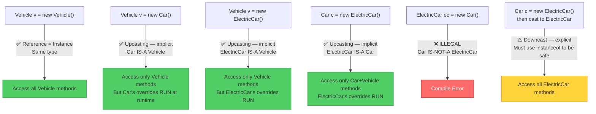

---

### The Two Rules to Remember Forever

```mermaid
graph LR
    A["REFERENCE TYPE\n(left side: Car c)"] -->|determines| B["What methods/fields\nare VISIBLE\n(compile time)"]
    C["INSTANCE TYPE\n(right side: new ElectricCar)"] -->|determines| D["Which method VERSION\nactually RUNS\n(runtime)"]

    style A fill:#74c0fc,stroke:#1971c2
    style C fill:#51cf66,stroke:#2f9e44
    style B fill:#e9ecef,stroke:#868e96
    style D fill:#e9ecef,stroke:#868e96
```

> **Rule 1 — Reference controls VISIBILITY:** Only methods/fields declared in the reference type are accessible. Even if the actual object has more, you can't see them through a parent reference.
>
> **Rule 2 — Instance controls EXECUTION:** When a method is called, the actual object's version runs — always. The override at the actual object's level wins at runtime.

---

### Full Demo — All Scenarios Together

```java
public class Main {
    public static void main(String[] args) {
        System.out.println("=== Scenario A: Car = new Car() ===");
        Car a = new Car("Honda", 4);
        a.start();
        a.openTrunk();

        System.out.println("\n=== Scenario B: Car = new ElectricCar() ===");
        Car b = new ElectricCar("Tesla", 90);
        b.start();       // ElectricCar's start() runs — NOT Car's
        b.fuelInfo();    // ElectricCar's fuelInfo() runs — NOT Vehicle's
        // b.chargeBattery() would be COMPILE ERROR here

        System.out.println("\n=== Scenario C: Vehicle = new Car() ===");
        Vehicle c = new Car("BMW", 2);
        c.start();       // Car's start() runs — NOT Vehicle's
        // c.openTrunk() would be COMPILE ERROR here

        System.out.println("\n=== Scenario D: Vehicle = new ElectricCar() ===");
        Vehicle d = new ElectricCar("Rivian", 75);
        d.start();       // ElectricCar's start() runs
        d.fuelInfo();    // ElectricCar's fuelInfo() runs

        System.out.println("\n=== Scenario F: Downcast ===");
        Car f = new ElectricCar("Lucid", 95);
        if (f instanceof ElectricCar) {
            ((ElectricCar) f).chargeBattery();   // safely accessed after instanceof check
        }
    }
}
```

**Output:**
```
=== Scenario A: Car = new Car() ===
Honda: Car starting
Honda: Trunk opened

=== Scenario B: Car = new ElectricCar() ===
Tesla: Electric car starting silently
Tesla: No fuel — runs on electricity

=== Scenario C: Vehicle = new Car() ===
BMW: Car starting

=== Scenario D: Vehicle = new ElectricCar() ===
Rivian: Electric car starting silently
Rivian: No fuel — runs on electricity

=== Scenario F: Downcast ===
Lucid: Charging battery...
```

---

## 🥜 Inheritance — In a Nutshell

Everything you need to know, one place.

```mermaid
mindmap
    root((Inheritance\nIn a Nutshell))
        What it is
            Child class reuses parent class
            IS-A relationship
            extends keyword
        What gets inherited
            public fields and methods
            protected fields and methods
            NOT private members
            NOT constructors
        Reference vs Instance
            Reference = what you can SEE
            Instance = what actually RUNS
            Parent ref can hold child object
            Child ref cannot hold parent object
        Constructors
            Parent constructor always runs first
            super() must be first line
            this() must be first line
            Both cannot coexist in one constructor
        this keyword
            Resolves name conflicts
            this() chains own constructors
            return this for method chaining
        super keyword
            super() calls parent constructor
            super.method() calls parent method
            super.field accesses parent field
        Overloading
            Same class, same name
            Different parameters
            Compile-time decision
        Overriding
            Child redefines parent method
            Same name and parameters
            Runtime decision
            Use @Override always
        static
            Belongs to class not object
            Cannot be overridden
            Method hiding only
            No polymorphism
```

### The 10 Golden Rules of Inheritance

1. **IS-A rule** — A child reference can point to a parent object: `NO`. A parent reference can point to a child object: `YES`.

2. **Reference controls visibility** — You can only call methods declared in the reference type. Extra methods of the actual object are hidden.

3. **Instance controls execution** — The actual object's overridden method always wins at runtime. The reference type is irrelevant for which version runs.

4. **Constructors are NOT inherited** — A child cannot call a parent's constructor like a regular method. Only `super()` inside a constructor does this.

5. **`super()` is always called** — Either you write it explicitly, or Java inserts it automatically. The parent is always initialized before the child.

6. **`super()` / `this()` must be first** — You cannot have any statement before them in a constructor, and you cannot use both in the same constructor.

7. **`private` is invisible** — Private members are not inherited. A child class has no access to parent's private fields/methods — even with `super`.

8. **`@Override` protects you** — Always use it when overriding. It makes the compiler verify you're actually overriding, not accidentally creating a new method.

9. **`static` is not polymorphic** — Static methods are resolved by the reference type at compile time. Runtime polymorphism does NOT apply to them.

10. **`final` stops inheritance/overriding** — A `final` class cannot be extended. A `final` method cannot be overridden.

### One-Line Answers to Common Questions

| Question | Answer |
|---|---|
| Can `Car c = new ElectricCar()` work? | ✅ Yes — `ElectricCar IS-A Car` |
| Can `ElectricCar ec = new Car()` work? | ❌ No — `Car IS-NOT-A ElectricCar` |
| `Car c = new ElectricCar()` — can I call `chargeBattery()`? | ❌ No — Car reference can't see it. Downcast first. |
| `Vehicle v = new Car()` — which `start()` runs? | Car's — instance type wins at runtime |
| Do constructors get inherited? | ❌ No — only `super()` can invoke them |
| Can I override a `static` method? | ❌ No — it's method hiding, not overriding |
| Can I override a `private` method? | ❌ No — private methods aren't even inherited |
| What if I don't call `super()` explicitly? | Java auto-inserts `super()` (no-arg). Fails if parent has no no-arg constructor. |
| Can `this()` and `super()` both appear in one constructor? | ❌ No — both must be first; contradiction |
| What does `@Override` do if I spell the method wrong? | Gives a **compile error** — saves you from creating an unintended new method |