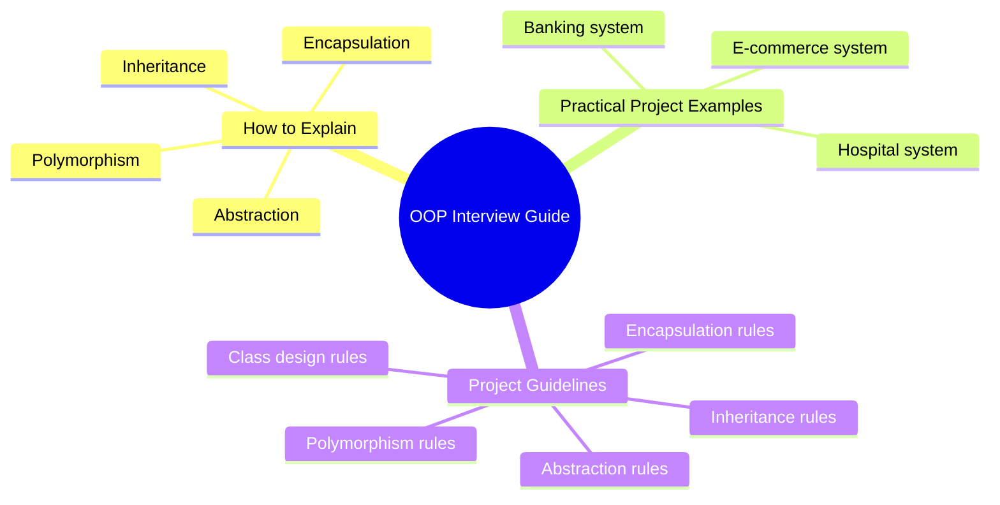

# Java OOP — Interview Guide & Project Guidelines 🎯

This document is your **practical companion** to OOP. We already have deep-dive docs for each concept — this one focuses on:
1. **How to explain each concept in an interview** (simple, confident, memorable)
2. **Real project examples** that make the concept click
3. **Guidelines to follow when building a real project**

---

## 🗺️ What's Covered



---

# Part 1: How to Explain OOP in an Interview

> **The golden interview rule:** Always follow this 3-step formula:
> 1. **One-line definition** — what it is
> 2. **Real-world analogy** — something everyone knows
> 3. **Code tie-in** — how Java implements it

---

## 1.1 Encapsulation 🔒

### How to Explain It

> *"Encapsulation means bundling data (fields) and the methods that operate on that data together inside a class, and restricting direct access to the data from outside. Think of it like a capsule pill — the medicine (data) is wrapped inside, and you interact with it through the outer shell (methods), not directly."*

### The Interview Answer (Say This)

*"Encapsulation is about data protection. I make my fields `private` so nobody can directly change them. I expose only controlled access through `public` getters and setters. This way, I control what goes in and what comes out — like a vending machine: you press a button (method), you get a snack (data). You can't reach inside and grab it directly."*

### Practical Example — Employee Salary

**The problem without encapsulation:**
```java
class Employee {
    public double salary;   // ⚠️ Anyone can set salary to -50000
}

Employee e = new Employee();
e.salary = -50000;   // No validation. Bug waiting to happen.
```

**With encapsulation:**
```java
class Employee {
    private String name;
    private double salary;

    public Employee(String name, double salary) {
        this.name = name;
        setSalary(salary);   // validation on creation too
    }

    public double getSalary() {
        return salary;
    }

    public void setSalary(double salary) {
        if (salary < 0) {
            System.out.println("❌ Invalid salary. Must be positive.");
            return;
        }
        this.salary = salary;
    }

    public String getName() { return name; }
}

public class Main {
    public static void main(String[] args) {
        Employee e = new Employee("Gowtham", 75000);
        e.setSalary(-5000);       // ❌ Blocked by validation
        e.setSalary(85000);       // ✅ Updated properly
        System.out.println(e.getName() + " earns ₹" + e.getSalary());
    }
}
```

**Output:**
```
❌ Invalid salary. Must be positive.
Gowtham earns ₹85000.0
```

### Key Interview Points
- `private` fields + `public` getters/setters = encapsulation
- You add **validation** inside setters — this is the real power
- It makes your class a **black box** — caller doesn't need to know internals

---

## 1.2 Inheritance 🧬

### How to Explain It

> *"Inheritance lets one class acquire the properties and behaviors of another class, so you don't have to rewrite the same code. It's like a child inheriting traits from their parents — same eyes, same height, but the child can also have their own unique traits."*

### The Interview Answer (Say This)

*"Inheritance promotes code reuse. Instead of writing `start()` and `stop()` methods in every vehicle class — Car, Truck, Bike — I write them once in a parent `Vehicle` class, and all child classes inherit them. The child class can use parent behavior as-is, or override it to customize it. Java uses the `extends` keyword for this."*

### Practical Example — Vehicle System

```java
class Vehicle {
    protected String brand;
    protected int speed;

    Vehicle(String brand, int speed) {
        this.brand = brand;
        this.speed = speed;
    }

    void start() {
        System.out.println(brand + " is starting...");
    }

    void stop() {
        System.out.println(brand + " is stopping.");
    }
}

class Car extends Vehicle {
    private int doors;

    Car(String brand, int speed, int doors) {
        super(brand, speed);
        this.doors = doors;
    }

    void openTrunk() {
        System.out.println(brand + " trunk opened. Doors: " + doors);
    }
}

class ElectricCar extends Car {
    private int batteryLevel;

    ElectricCar(String brand, int speed, int doors, int batteryLevel) {
        super(brand, speed, doors);
        this.batteryLevel = batteryLevel;
    }

    @Override
    void start() {
        // ✅ Custom behavior — silent start
        System.out.println(brand + " silently powers on. Battery: " + batteryLevel + "%");
    }
}

public class Main {
    public static void main(String[] args) {
        Car c = new Car("Toyota", 180, 4);
        c.start();       // inherited from Vehicle
        c.openTrunk();   // own method

        ElectricCar ec = new ElectricCar("Tesla", 250, 4, 87);
        ec.start();      // overridden
        ec.stop();       // still inherited from Vehicle
    }
}
```

**Output:**
```
Toyota is starting...
Toyota trunk opened. Doors: 4
Tesla silently powers on. Battery: 87%
Tesla is stopping.
```

### Key Interview Points
- `extends` keyword, `super()` to call parent constructor
- Child gets all `public`/`protected` members of parent
- Child can **override** a parent method to customize behavior
- Promotes **DRY** (Don't Repeat Yourself)

---

## 1.3 Polymorphism 🎭

### How to Explain It

> *"Polymorphism means 'many forms.' The same method name behaves differently depending on the object or the arguments. It's like the word 'draw' — draw a circle, draw a salary, draw a card — same word, different behavior depending on context."*

### The Interview Answer (Say This)

*"Polymorphism comes in two types. Compile-time polymorphism is method overloading — same method name, different parameters, Java decides which one to call at compile time. Runtime polymorphism is method overriding — a parent reference holds a child object, and Java decides which version of the method to call at runtime. The second type is what makes polymorphism truly powerful in real systems."*

### Practical Example — Notification System (Runtime Polymorphism)

```java
class Notification {
    void send(String message) {
        System.out.println("Sending: " + message);
    }
}

class EmailNotification extends Notification {
    @Override
    void send(String message) {
        System.out.println("📧 Email sent: " + message);
    }
}

class SMSNotification extends Notification {
    @Override
    void send(String message) {
        System.out.println("📱 SMS sent: " + message);
    }
}

class PushNotification extends Notification {
    @Override
    void send(String message) {
        System.out.println("🔔 Push notification: " + message);
    }
}

public class Main {
    public static void main(String[] args) {
        // ✅ Parent reference — can hold any child type
        Notification[] alerts = {
            new EmailNotification(),
            new SMSNotification(),
            new PushNotification()
        };

        // Same method call — different behavior based on actual object
        for (Notification n : alerts) {
            n.send("Your order has been shipped!");
        }
    }
}
```

**Output:**
```
📧 Email sent: Your order has been shipped!
📱 SMS sent: Your order has been shipped!
🔔 Push notification: Your order has been shipped!
```

> **The magic:** You can add a new `WhatsAppNotification` class tomorrow and plug it into this array — the loop doesn't need to change at all.

### Practical Example — Method Overloading (Compile-time Polymorphism)

```java
class Calculator {
    int add(int a, int b) {
        return a + b;
    }

    double add(double a, double b) {
        return a + b;
    }

    int add(int a, int b, int c) {
        return a + b + c;
    }
}

public class Main {
    public static void main(String[] args) {
        Calculator calc = new Calculator();
        System.out.println(calc.add(5, 3));          // calls int version
        System.out.println(calc.add(5.5, 3.2));      // calls double version
        System.out.println(calc.add(1, 2, 3));       // calls 3-param version
    }
}
```

**Output:**
```
8
8.7
6
```

### Key Interview Points
- **Overloading** = same method name, different parameters (compile-time)
- **Overriding** = child redefines parent method (runtime)
- Parent reference can point to child object — this enables runtime polymorphism
- Core benefit: **flexibility and extensibility** — add new types without touching old code

---

## 1.4 Abstraction 🎨

### How to Explain It

> *"Abstraction means hiding the complex internal implementation and showing only what's necessary. Think of a TV remote — you press 'Volume Up,' the TV gets louder. You don't know or care what circuits fire internally. You interact with a simple interface."*

### The Interview Answer (Say This)

*"Abstraction is about separating 'what to do' from 'how to do it.' I define what operations must exist (using abstract classes or interfaces) without saying how they're implemented. Each concrete class implements the 'how' in its own way. This gives me a clean contract — all payment methods must have `pay()`, but UPI pays differently from a Credit Card."*

### Practical Example — Payment Gateway

```java
abstract class PaymentMethod {
    protected String userName;
    protected double amount;

    PaymentMethod(String userName, double amount) {
        this.userName = userName;
        this.amount = amount;
    }

    // Abstract — every payment type MUST define this
    abstract void pay();

    // Concrete — shared by all
    void showReceipt() {
        System.out.println("✅ Payment of ₹" + amount + " by " + userName + " successful.");
    }
}

class UPIPayment extends PaymentMethod {
    private String upiId;

    UPIPayment(String userName, double amount, String upiId) {
        super(userName, amount);
        this.upiId = upiId;
    }

    @Override
    void pay() {
        System.out.println("📲 UPI payment via " + upiId);
        showReceipt();
    }
}

class CreditCardPayment extends PaymentMethod {
    private String cardLastFour;

    CreditCardPayment(String userName, double amount, String cardLastFour) {
        super(userName, amount);
        this.cardLastFour = cardLastFour;
    }

    @Override
    void pay() {
        System.out.println("💳 Credit card ending in " + cardLastFour);
        showReceipt();
    }
}

public class Main {
    public static void main(String[] args) {
        PaymentMethod p1 = new UPIPayment("Gowtham", 1500, "gowtham@upi");
        PaymentMethod p2 = new CreditCardPayment("Gowtham", 3200, "4242");

        p1.pay();
        System.out.println("---");
        p2.pay();
    }
}
```

**Output:**
```
📲 UPI payment via gowtham@upi
✅ Payment of ₹1500.0 by Gowtham successful.
---
💳 Credit card ending in 4242
✅ Payment of ₹3200.0 by Gowtham successful.
```

### Key Interview Points
- `abstract class` — partial abstraction, can have concrete methods too
- `interface` — full abstraction (contract only, no implementation)
- You interact with the **abstract type**, not the concrete class
- Makes adding new implementations easy without changing existing code

---

# Part 2: Full Project Walkthrough — E-Commerce System

This shows all 4 concepts working **together** in a realistic scenario.

```
📦 E-Commerce System
├── Product (Encapsulation)
├── Electronics extends Product (Inheritance)
├── Discount (Abstraction — abstract class)
├── FlatDiscount, PercentDiscount (Polymorphism)
└── Order (uses all of the above)
```

```java
// ─────────── ENCAPSULATION ───────────
class Product {
    private String name;
    private double price;
    private int stock;

    Product(String name, double price, int stock) {
        this.name = name;
        setPrice(price);
        this.stock = stock;
    }

    public String getName() { return name; }
    public double getPrice() { return price; }
    public int getStock() { return stock; }

    public void setPrice(double price) {
        if (price < 0) throw new IllegalArgumentException("Price cannot be negative");
        this.price = price;
    }

    public boolean reduceStock(int qty) {
        if (qty > stock) return false;
        stock -= qty;
        return true;
    }
}

// ─────────── INHERITANCE ───────────
class Electronics extends Product {
    private int warrantyMonths;

    Electronics(String name, double price, int stock, int warrantyMonths) {
        super(name, price, stock);
        this.warrantyMonths = warrantyMonths;
    }

    void showWarranty() {
        System.out.println(getName() + " — Warranty: " + warrantyMonths + " months");
    }
}

// ─────────── ABSTRACTION ───────────
abstract class Discount {
    abstract double apply(double price);
    abstract String description();
}

// ─────────── POLYMORPHISM ───────────
class FlatDiscount extends Discount {
    private double amount;
    FlatDiscount(double amount) { this.amount = amount; }

    @Override
    public double apply(double price) { return Math.max(0, price - amount); }

    @Override
    public String description() { return "Flat ₹" + amount + " off"; }
}

class PercentDiscount extends Discount {
    private double percent;
    PercentDiscount(double percent) { this.percent = percent; }

    @Override
    public double apply(double price) { return price - (price * percent / 100); }

    @Override
    public String description() { return percent + "% off"; }
}

// ─────────── BRINGING IT ALL TOGETHER ───────────
class Order {
    private Product product;
    private int quantity;
    private Discount discount;

    Order(Product product, int quantity, Discount discount) {
        this.product = product;
        this.quantity = quantity;
        this.discount = discount;
    }

    void placeOrder() {
        if (!product.reduceStock(quantity)) {
            System.out.println("❌ Not enough stock for " + product.getName());
            return;
        }
        double basePrice = product.getPrice() * quantity;
        double finalPrice = discount.apply(basePrice);

        System.out.println("🛒 Order Summary");
        System.out.println("   Product  : " + product.getName());
        System.out.println("   Qty      : " + quantity);
        System.out.println("   Base     : ₹" + basePrice);
        System.out.println("   Discount : " + discount.description());
        System.out.println("   Final    : ₹" + finalPrice);
        System.out.println("   Stock left: " + product.getStock());
    }
}

public class Main {
    public static void main(String[] args) {
        Electronics phone = new Electronics("iPhone 15", 80000, 10, 12);
        phone.showWarranty();

        Order o1 = new Order(phone, 2, new PercentDiscount(10));
        o1.placeOrder();

        System.out.println("---");

        Order o2 = new Order(phone, 1, new FlatDiscount(5000));
        o2.placeOrder();
    }
}
```

**Output:**
```
iPhone 15 — Warranty: 12 months
🛒 Order Summary
   Product  : iPhone 15
   Qty      : 2
   Base     : ₹160000.0
   Discount : 10.0% off
   Final    : ₹144000.0
   Stock left: 8
---
🛒 Order Summary
   Product  : iPhone 15
   Qty      : 1
   Base     : ₹80000.0
   Discount : Flat ₹5000.0 off
   Final    : ₹75000.0
   Stock left: 7
```

---

# Part 3: Project Guidelines — Rules to Follow 📋

These are the practical rules to keep in mind whenever you start building a real Java project.

---

## 3.1 Encapsulation Rules

- **Always make fields `private`.** No exceptions unless there's a very strong reason.
- **Add validation inside setters**, not outside. The class is responsible for its own integrity.
- **Don't blindly generate getters and setters for every field.** Only expose what the caller actually needs. A `password` field might only have a setter, never a getter.
- **Think of each class as a capsule** — it manages its own data. Outside code asks nicely through methods.

```
✅  private String email;  + public setEmail() with format validation
❌  public String email;   — anyone sets "notanemail" with no checks
```

---

## 3.2 Inheritance Rules

- **Use inheritance only for a true "is-a" relationship.** A `Dog` IS-A `Animal` ✅. A `Car` IS-A `Engine` ❌ — that's a has-a relationship; use composition instead.
- **Keep inheritance hierarchies shallow.** More than 3 levels deep becomes hard to understand and debug. Prefer composition when things get complex.
- **Never override a method just to make it do nothing (empty body).** That's a code smell — it means the inheritance relationship is wrong.
- **Use `@Override` annotation always** when overriding. It catches typos at compile time.
- **Don't inherit just to reuse code.** If `PDFExporter` extends `CSVExporter` just to reuse a utility method, that's wrong. Extract that utility into a separate helper class.

```
✅  class SavingsAccount extends BankAccount  (is-a relationship)
❌  class Car extends Engine                  (has-a, use composition)
```

---

## 3.3 Polymorphism Rules

- **Program to the parent type, not the concrete type.** Declare variables as the parent/interface type so you can swap implementations later.
- **Use collections of the parent type** to process many different subtypes uniformly.
- **When you find yourself writing `if (obj instanceof Dog)` chains**, that's a sign you should be using polymorphism instead.
- **Favor runtime polymorphism (overriding) over long if-else or switch chains** for type-based behavior.

```java
// ❌ Bad — must change this code every time you add a new type
if (shape instanceof Circle) { drawCircle(); }
else if (shape instanceof Square) { drawSquare(); }

// ✅ Good — just add a new Shape subclass, this code never changes
shape.draw();
```

---

## 3.4 Abstraction Rules

- **Use an `abstract class` when subtypes share some common implementation** (shared fields, shared methods).
- **Use an `interface` when you're defining a pure contract** that unrelated classes can implement (e.g., `Printable`, `Serializable`, `Comparable`).
- **Name interfaces as capabilities/adjectives** — `Flyable`, `Drawable`, `Payable` — not `FlyInterface`.
- **Keep interfaces focused and small** (Interface Segregation — one of the SOLID principles). Don't dump 10 methods in one interface if not all implementors need all of them.
- **Never expose implementation details in the abstract layer.** The abstract method signature should describe "what", never "how".

```java
// ✅ Good abstract method — describes what, not how
abstract void processPayment(double amount);

// ❌ Bad abstract method — leaks implementation detail
abstract void chargeViaMasterCardAPI(double amount);
```

---

## 3.5 General Class Design Rules (The Big Picture)

| Rule | Description |
|------|-------------|
| **Single Responsibility** | Each class should do one thing well. An `Order` class handles orders. It doesn't send emails or format PDFs. |
| **Meaningful names** | `CustomerRepository` is clear. `DataHelper2` is not. |
| **Constructor sets up valid state** | After `new MyClass(...)`, the object should always be in a valid, usable state. |
| **Avoid god classes** | If your class has 30+ methods, it's doing too much. Break it up. |
| **Prefer composition over deep inheritance** | An `Engine` inside a `Car` is cleaner than `Car extends Engine`. |
| **Think about access modifiers intentionally** | Default everything to `private`. Loosen only when you have a reason. |
| **Use `final` for constants and locked logic** | `public static final` for constants, `final` method for locked business rules. |
| **Use `protected` deliberately** | Only when child classes genuinely need access to a field/method. Don't use it as "less private". |

---

## 3.6 The "Is-A vs Has-A" Test (Most Common Design Mistake)

Before you use `extends`, ask yourself:

| Question | Answer | Use |
|----------|--------|-----|
| Is a `SavingsAccount` a `BankAccount`? | Yes | `extends` (inheritance) |
| Does a `Car` have an `Engine`? | Yes | field (composition) |
| Can a `Dog` fly? | No | Don't inherit `Bird` |
| Can a `Duck` both swim and fly? | Yes | Implement `Swimmable`, `Flyable` interfaces |

---

## 3.7 Quick Pre-Checklist Before Writing Any Class

Before you write a new class in a project, run through this:

```
□ What is the single responsibility of this class?
□ What data does it own? → Make those fields private.
□ What behavior does it expose? → Those are the public methods.
□ Does it inherit from something? → Is it truly an "is-a" relationship?
□ Does it need an abstract parent or interface? → Will there be multiple types of this?
□ Are there any values that should never change? → Use final.
□ Are there fields only child classes need? → Use protected.
□ Can I write the constructor to ensure the object is always valid at creation?
```

---

## 🧠 Interview Cheat Sheet

| Concept | One Line | Keyword | Real Example |
|---------|----------|---------|--------------|
| **Encapsulation** | Protect data, control access | `private`, getters/setters | Employee salary validation |
| **Inheritance** | Reuse parent behavior in child | `extends`, `super` | Vehicle → Car → ElectricCar |
| **Polymorphism** | Same method, different behavior | `@Override`, parent reference | Notification.send() for Email/SMS/Push |
| **Abstraction** | Hide complexity, show interface | `abstract`, `interface` | PaymentMethod → UPI / CreditCard |

---

## 🔑 The One Rule That Ties It All Together

> **Encapsulation** protects your data.
> **Inheritance** shares your code.
> **Polymorphism** makes your code flexible.
> **Abstraction** keeps your design clean.
>
> Used together, they give you code that is **safe, reusable, flexible, and maintainable**.