# Java Polymorphism Explained 🎭

> **Teacher's note:** "Poly" means *many*, "morph" means *forms*. Polymorphism = **one thing, many forms**. This is the concept that makes Java truly powerful, flexible, and professional. By the end of this document, you'll not only understand it — you'll *feel* it.

---

## 🌍 Real-World Analogy First

Think about a **remote control** in your house.

You point it at the TV → it turns the TV on.  
You point it at the AC → it turns the AC on.  
You point it at a music system → it turns the music on.

**Same action** (`pressPowerButton()`), **same button**, **different behavior** depending on what device you're pointing at.

That's polymorphism.

Or think about a **person**:
- The same person is a **Son** at home, a **Student** at college, an **Employee** at work, a **Customer** at a shop.
- Same person, different roles, different behavior in each context.

---

## 🗺️ Big Picture — What We'll Cover

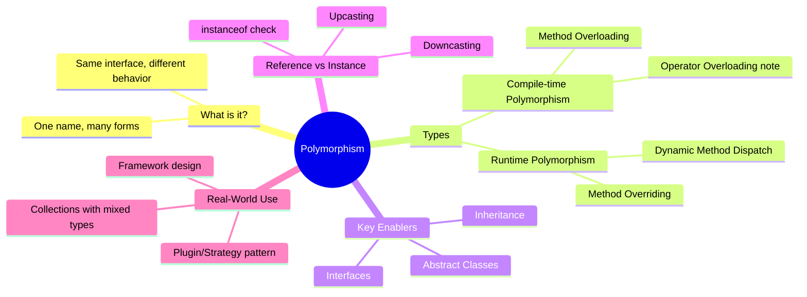

---

## Part 1: Two Types of Polymorphism

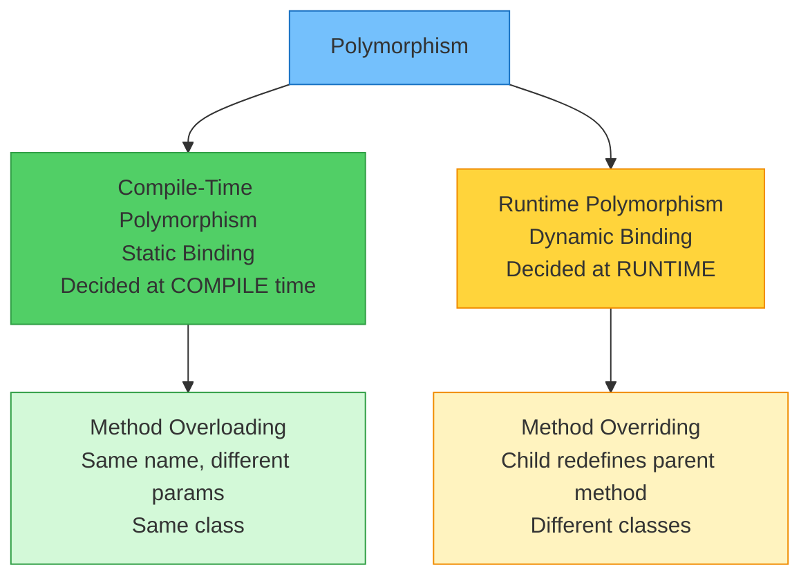

---

## Part 2: Compile-Time Polymorphism (Method Overloading)

### What is it?

The **compiler** decides which method to call **before the program even runs**, purely by looking at the **method name + parameter types**.

### Teacher's Analogy

Imagine a **printer** in your office:
- You send it a **black & white document** → it prints in B&W
- You send it a **color photo** → it prints in color
- You send it **multiple pages** → it uses the paper tray

Same "print" action, different behavior based on **what you give it**. The printer decides at the moment it receives the job — that's compile-time.

```java
class Printer {

    void print(String document) {
        System.out.println("Printing text document: " + document);
    }

    void print(String document, boolean isColor) {
        if (isColor) {
            System.out.println("Printing COLOR document: " + document);
        } else {
            System.out.println("Printing B&W document: " + document);
        }
    }

    void print(int numberOfCopies, String document) {
        System.out.println("Printing " + numberOfCopies + " copies of: " + document);
    }

    void print(String[] pages) {
        System.out.println("Printing " + pages.length + " pages:");
        for (String page : pages) {
            System.out.println("  -> " + page);
        }
    }
}

public class Main {
    public static void main(String[] args) {
        Printer printer = new Printer();

        printer.print("Resume.pdf");
        // Compiler sees: one String argument → picks Version 1

        printer.print("Wedding Photo.jpg", true);
        // Compiler sees: String + boolean → picks Version 2

        printer.print(5, "Report.docx");
        // Compiler sees: int + String → picks Version 3

        printer.print(new String[]{"Page1", "Page2", "Page3"});
        // Compiler sees: String array → picks Version 4
    }
}
```

**Output:**
```
Printing text document: Resume.pdf
Printing COLOR document: Wedding Photo.jpg
Printing 5 copies of: Report.docx
Printing 3 pages:
  -> Page1
  -> Page2
  -> Page3
```

> **Key point:** The compiler resolves this at build time. No surprises at runtime. The correct method version is "baked in" to the bytecode before execution.

### What Makes Overloading Valid?

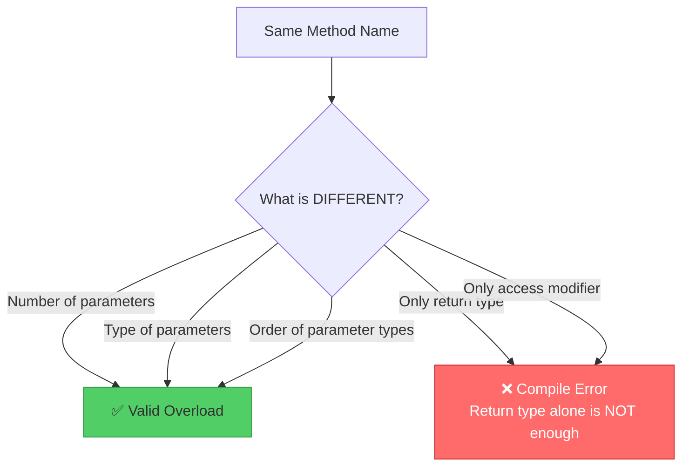

```java
class Example {
    void show(int a, String b) { }    // Version 1
    void show(String b, int a) { }    // ✅ Valid — order of types is different

    // ❌ int show(int a) vs void show(int a) → COMPILE ERROR
    // Same name + same params, different return type is NOT overloading
}
```

### Type Promotion in Overloading

Java automatically "promotes" smaller types when no exact match exists:

```java
class Calculator {
    void add(long a, long b) {
        System.out.println("long version: " + (a + b));
    }

    void add(double a, double b) {
        System.out.println("double version: " + (a + b));
    }
}

public class Main {
    public static void main(String[] args) {
        Calculator c = new Calculator();
        c.add(10, 20);       // int promoted to long → calls long version
        c.add(1.5, 2.5);     // exact double match → calls double version
        c.add(10, 2.5);      // int promoted to double (mixed) → calls double version
    }
}
```

**Output:**
```
long version: 30
double version: 4.0
double version: 12.5
```

---

## Part 3: Runtime Polymorphism (Method Overriding)

### What is it?

The **JVM** decides which method to call **while the program is running**, based on the **actual object type** — not the reference type.

This is the *heart* of OOP. This is what makes Java flexible enough to build huge systems.

### Teacher's Analogy

Think of a **payment terminal** at a shop. It says "Pay Now":

- You tap your **Visa card** → Visa's payment process runs
- You tap your **Mastercard** → Mastercard's process runs
- You scan a **UPI QR code** → UPI's process runs

The terminal (reference) is the same. The payment method (actual object) determines what happens. The cashier doesn't care which one you use — they just say "pay now" and the right thing happens. That's runtime polymorphism.

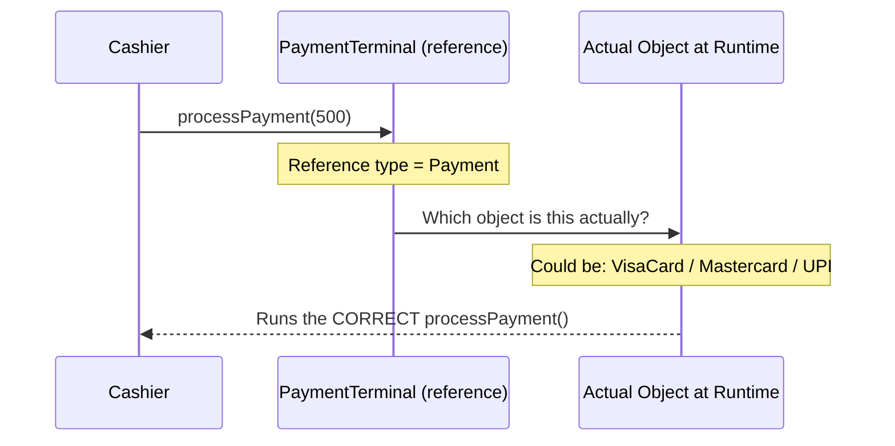

```java
class Payment {
    String customerName;

    Payment(String customerName) {
        this.customerName = customerName;
    }

    void processPayment(double amount) {
        System.out.println(customerName + ": Generic payment of ₹" + amount);
    }

    void printReceipt() {
        System.out.println("Receipt for: " + customerName);
    }
}

class VisaCard extends Payment {
    String cardNumber;

    VisaCard(String customerName, String cardNumber) {
        super(customerName);
        this.cardNumber = cardNumber;
    }

    @Override
    void processPayment(double amount) {
        // Same method name, same parameters — overriding parent's version
        System.out.println(customerName + ": Visa card ****" +
            cardNumber.substring(cardNumber.length() - 4) +
            " charged ₹" + amount + " | Sending to Visa network...");
    }
}

class UPIPayment extends Payment {
    String upiId;

    UPIPayment(String customerName, String upiId) {
        super(customerName);
        this.upiId = upiId;
    }

    @Override
    void processPayment(double amount) {
        System.out.println(customerName + ": UPI " + upiId +
            " → ₹" + amount + " | Sending request to bank...");
    }
}

class CashPayment extends Payment {
    CashPayment(String customerName) {
        super(customerName);
    }

    @Override
    void processPayment(double amount) {
        System.out.println(customerName + ": Cash payment ₹" + amount + " | Change to be returned.");
    }
}

public class Main {
    public static void main(String[] args) {
        // All stored as Payment references — DIFFERENT actual objects
        Payment[] customers = {
            new VisaCard("Alice", "4111111111111234"),
            new UPIPayment("Bob", "bob@okaxis"),
            new CashPayment("Carol"),
            new VisaCard("Dave", "4111111111115678"),
            new UPIPayment("Eve", "eve@ybl")
        };

        System.out.println("=== Processing Payments at Checkout ===\n");
        for (Payment p : customers) {
            p.processPayment(499.00);
            // Java looks at the ACTUAL object type at runtime
            // and calls the correct processPayment() for each
        }
    }
}
```

**Output:**
```
=== Processing Payments at Checkout ===

Alice: Visa card ****1234 charged ₹499.0 | Sending to Visa network...
Bob: UPI bob@okaxis → ₹499.0 | Sending request to bank...
Carol: Cash payment ₹499.0 | Change to be returned.
Dave: Visa card ****5678 charged ₹499.0 | Sending to Visa network...
Eve: UPI eve@ybl → ₹499.0 | Sending request to bank...
```

> **Notice:** We wrote `p.processPayment(499)` — one line — for all 5 different payment types. No `if-else` chains, no type checking. The JVM handled it. That's the beauty of runtime polymorphism.

**What it would look like WITHOUT polymorphism (ugly):**

```java
// Without polymorphism — you'd need to know every type and check manually
for (int i = 0; i < customers.length; i++) {
    if (customers[i] instanceof VisaCard) {
        ((VisaCard) customers[i]).processPayment(499);
    } else if (customers[i] instanceof UPIPayment) {
        ((UPIPayment) customers[i]).processPayment(499);
    } else if (customers[i] instanceof CashPayment) {
        ((CashPayment) customers[i]).processPayment(499);
    }
    // And every time you add a NEW payment type,
    // you have to find this code and add another else-if — BAD!
}
```

With polymorphism, you just add a new class and override `processPayment()` — the loop needs **zero changes**. That's **open for extension, closed for modification** — a core software design principle.

---

## Part 4: Dynamic Method Dispatch — How Runtime Polymorphism Actually Works

This is the **mechanism** behind runtime polymorphism. It's important to understand exactly what Java is doing under the hood.

```mermaid
flowchart TD
    A["Payment p = new VisaCard(...)"] --> B[p holds memory address of VisaCard object]
    B --> C["p.processPayment(500) called"]
    C --> D{Compiler checks:\nDoes Payment have processPayment?\n}
    D -->|Yes — compile passes| E[At RUNTIME: JVM looks at\nactual object at that memory address]
    E --> F{What is the actual type?}
    F -->|VisaCard| G[Run VisaCard.processPayment()]
    F -->|UPIPayment| H[Run UPIPayment.processPayment()]
    F -->|CashPayment| I[Run CashPayment.processPayment()]

    style G fill:#51cf66,stroke:#2f9e44
    style H fill:#51cf66,stroke:#2f9e44
    style I fill:#51cf66,stroke:#2f9e44
    style D fill:#74c0fc,stroke:#1971c2
    style F fill:#ffd43b,stroke:#f08c00
```

```java
Payment p;               // just a reference variable, holds nothing yet

p = new VisaCard("Alice", "4111111111111234");
p.processPayment(500);   // RUNTIME: looks at actual object → VisaCard's version runs

p = new UPIPayment("Bob", "bob@upi");
p.processPayment(500);   // RUNTIME: looks at actual object → UPIPayment's version runs
// Same variable 'p', same line of code, but DIFFERENT method runs each time!
// That's dynamic dispatch.
```

---

## Part 5: Polymorphism with Abstract Classes

### What is an Abstract Class?

An **abstract class** is a class that says: *"I define WHAT should be done, but not HOW. My children must fill in the HOW."*

Think of it like an **employee contract template** — it says "you must implement `doWork()`, `submitReport()`" but each department fills it in differently.

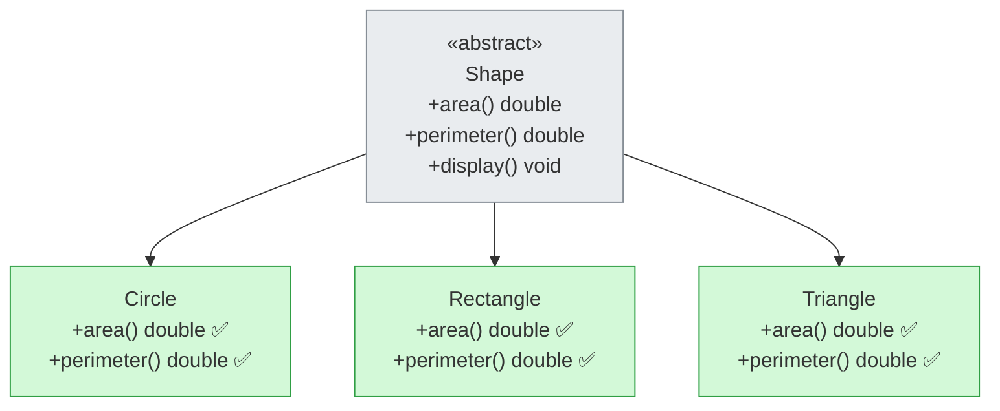

```java
abstract class Shape {
    String color;

    Shape(String color) {
        this.color = color;
    }

    // Abstract methods — NO body, MUST be overridden by children
    // The 'what' without the 'how'
    abstract double area();
    abstract double perimeter();

    // Concrete method — has a body, inherited as-is
    void display() {
        System.out.println(color + " " + getClass().getSimpleName() +
            " | Area: " + String.format("%.2f", area()) +
            " | Perimeter: " + String.format("%.2f", perimeter()));
        // area() and perimeter() here use RUNTIME polymorphism!
        // Even though we're inside Shape, the child's version runs
    }
}

class Circle extends Shape {
    double radius;

    Circle(String color, double radius) {
        super(color);
        this.radius = radius;
    }

    @Override
    double area() {
        return Math.PI * radius * radius;
    }

    @Override
    double perimeter() {
        return 2 * Math.PI * radius;
    }
}

class Rectangle extends Shape {
    double length, width;

    Rectangle(String color, double length, double width) {
        super(color);
        this.length = length;
        this.width = width;
    }

    @Override
    double area() {
        return length * width;
    }

    @Override
    double perimeter() {
        return 2 * (length + width);
    }
}

class Triangle extends Shape {
    double a, b, c;   // three sides

    Triangle(String color, double a, double b, double c) {
        super(color);
        this.a = a;
        this.b = b;
        this.c = c;
    }

    @Override
    double area() {
        double s = (a + b + c) / 2;   // Heron's formula
        return Math.sqrt(s * (s - a) * (s - b) * (s - c));
    }

    @Override
    double perimeter() {
        return a + b + c;
    }
}

public class Main {
    public static void main(String[] args) {
        // Shape s = new Shape("Red");  ← ❌ COMPILE ERROR — cannot instantiate abstract class!
        // Abstract classes exist ONLY to be inherited — never directly created

        Shape[] shapes = {
            new Circle("Red", 7),
            new Rectangle("Blue", 5, 10),
            new Triangle("Green", 3, 4, 5)
        };

        System.out.println("=== Shape Calculator ===\n");
        for (Shape s : shapes) {
            s.display();
            // display() is defined in Shape (concrete)
            // but inside display(), area() and perimeter() call the CHILD's version
            // That's polymorphism inside polymorphism!
        }

        System.out.println("\n=== Total Area ===");
        double totalArea = 0;
        for (Shape s : shapes) {
            totalArea += s.area();   // correct area() called for each shape
        }
        System.out.printf("Sum of all areas: %.2f%n", totalArea);
    }
}
```

**Output:**
```
=== Shape Calculator ===

Red Circle | Area: 153.94 | Perimeter: 43.98
Blue Rectangle | Area: 50.00 | Perimeter: 30.00
Green Triangle | Area: 6.00 | Perimeter: 12.00

=== Total Area ===
Sum of all areas: 209.94
```

### Abstract Class Rules

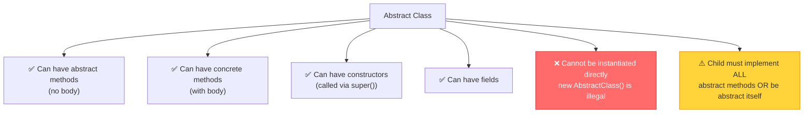

---

## Part 6: Polymorphism with Interfaces

### Abstract Class vs Interface — When to Use What?

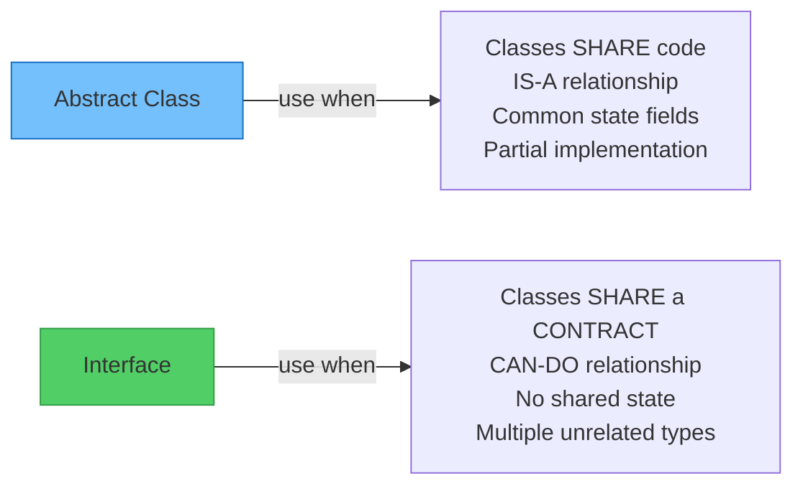

### Teacher's Analogy

- **Abstract class** = Employment contract with partial training included. All employees of that company share the training but implement their own job roles.
- **Interface** = A skill certification. A person can hold multiple certifications (Flyable, Swimmable, Runnable) regardless of what type of person they are.

```java
interface Drawable {
    void draw();              // abstract by default
    void resize(double factor);

    default void describe() {
        System.out.println("I am a drawable object of type: " + getClass().getSimpleName());
    }
}

interface Saveable {
    void saveToFile(String path);
    void loadFromFile(String path);
}

class Canvas implements Drawable {
    String name;

    Canvas(String name) { this.name = name; }

    @Override
    public void draw() {
        System.out.println("Canvas '" + name + "': drawing on full canvas");
    }

    @Override
    public void resize(double factor) {
        System.out.println("Canvas '" + name + "': resizing by factor " + factor);
    }
}

class PhotoFile implements Drawable, Saveable {
    String filename;
    int width, height;

    PhotoFile(String filename, int width, int height) {
        this.filename = filename;
        this.width = width;
        this.height = height;
    }

    @Override
    public void draw() {
        System.out.println("PhotoFile '" + filename + "' (" + width + "x" + height + "): rendering pixels");
    }

    @Override
    public void resize(double factor) {
        width = (int)(width * factor);
        height = (int)(height * factor);
        System.out.println("PhotoFile resized to " + width + "x" + height);
    }

    @Override
    public void saveToFile(String path) {
        System.out.println("Saving " + filename + " to: " + path);
    }

    @Override
    public void loadFromFile(String path) {
        System.out.println("Loading photo from: " + path);
    }
}

public class Main {
    public static void main(String[] args) {
        Drawable[] drawables = {
            new Canvas("MainCanvas"),
            new PhotoFile("sunset.jpg", 1920, 1080),
            new Canvas("ThumbnailCanvas"),
            new PhotoFile("profile.png", 400, 400)
        };

        System.out.println("=== Rendering All Drawables ===");
        for (Drawable d : drawables) {
            d.draw();
            d.describe();     // default method from interface — no override needed
            System.out.println();
        }

        System.out.println("=== Saving only Saveable objects ===");
        for (Drawable d : drawables) {
            if (d instanceof Saveable) {
                // Only PhotoFile implements Saveable, so only photos get saved
                ((Saveable) d).saveToFile("/storage/output/");
            }
        }
    }
}
```

**Output:**
```
=== Rendering All Drawables ===
Canvas 'MainCanvas': drawing on full canvas
I am a drawable object of type: Canvas

PhotoFile 'sunset.jpg' (1920x1080): rendering pixels
I am a drawable object of type: PhotoFile

Canvas 'ThumbnailCanvas': drawing on full canvas
I am a drawable object of type: Canvas

PhotoFile 'profile.png' (400x400): rendering pixels
I am a drawable object of type: PhotoFile

=== Saving only Saveable objects ===
Saving sunset.jpg to: /storage/output/
Saving profile.png to: /storage/output/
```

---

## Part 7: Upcasting and Downcasting — Moving Through the Hierarchy

### Upcasting — Going UP (always safe, implicit)

Assigning a child object to a parent reference. Always safe because a child IS-A parent.

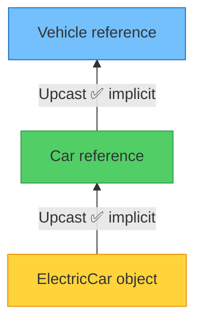

```java
class Animal {
    void sound() { System.out.println("Some sound..."); }
}

class Dog extends Animal {
    @Override
    void sound() { System.out.println("Woof! Woof!"); }

    void fetch() { System.out.println("Fetching the ball!"); }
}

class GoldenRetriever extends Dog {
    @Override
    void sound() { System.out.println("Gentle Woof~"); }

    void swim() { System.out.println("Swimming across the lake!"); }
}

public class Main {
    public static void main(String[] args) {
        GoldenRetriever goldie = new GoldenRetriever();

        // Upcasting — each level loses visibility of child-specific methods
        Dog dogRef = goldie;         // upcast: GoldenRetriever → Dog (implicit)
        Animal animalRef = goldie;   // upcast: GoldenRetriever → Animal (implicit)

        goldie.sound();       // Gentle Woof~    (actual object wins)
        goldie.fetch();       // Fetching the ball!
        goldie.swim();        // Swimming across the lake!

        dogRef.sound();       // Gentle Woof~    (runtime polymorphism — still GoldenRetriever!)
        dogRef.fetch();       // Fetching the ball! (Dog has fetch — visible via Dog reference)
        // dogRef.swim();     // ❌ COMPILE ERROR — Dog reference can't see swim()

        animalRef.sound();    // Gentle Woof~    (runtime polymorphism — still GoldenRetriever!)
        // animalRef.fetch(); // ❌ COMPILE ERROR — Animal reference can't see fetch()
        // animalRef.swim();  // ❌ COMPILE ERROR — Animal reference can't see swim()
    }
}
```

**Output:**
```
Gentle Woof~
Fetching the ball!
Swimming across the lake!
Gentle Woof~
Fetching the ball!
Gentle Woof~
```

> **Pattern:** All three calls to `sound()` printed `"Gentle Woof~"`. That's the actual `GoldenRetriever` object speaking, no matter which level of reference you hold it at.

---

### Downcasting — Going DOWN (explicit, can fail)

Getting the child reference back from a parent reference — to access child-specific methods.

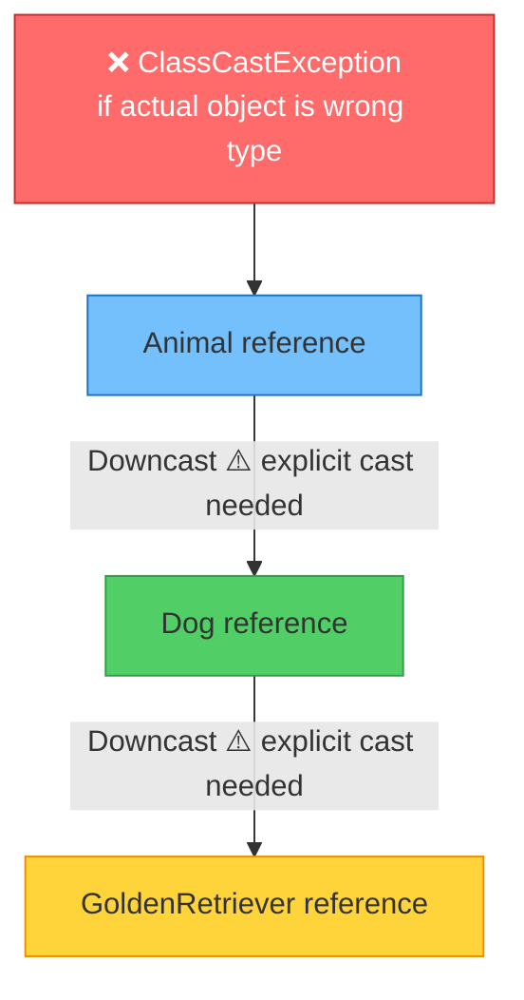

```java
public class Main {
    public static void main(String[] args) {
        Animal a = new GoldenRetriever();   // upcast (implicit)

        // a.swim(); ← ❌ COMPILE ERROR — Animal can't see swim()

        // Downcast — tell Java "I know this is actually a GoldenRetriever"
        GoldenRetriever g = (GoldenRetriever) a;   // downcast (explicit)
        g.swim();    // ✅ Now accessible

        // What happens if you downcast to the WRONG type?
        Animal a2 = new Dog();
        // Dog dogRef2 = (GoldenRetriever) a2;  ← COMPILE: OK (compiler trusts you)
        //                                          RUNTIME: ClassCastException! 💥
        //                                          Dog is NOT a GoldenRetriever
    }
}
```

### The Safe Way — `instanceof` Before Downcasting

```java
Animal[] animals = {
    new GoldenRetriever(),
    new Dog(),
    new GoldenRetriever(),
    new Animal()
};

for (Animal a : animals) {
    a.sound();   // always works — runtime polymorphism

    if (a instanceof GoldenRetriever) {
        ((GoldenRetriever) a).swim();   // safe — only runs for GoldenRetrievers
    }

    if (a instanceof Dog) {
        ((Dog) a).fetch();   // safe — runs for Dog AND GoldenRetriever (IS-A Dog)
    }
}
```

**Output:**
```
Gentle Woof~
Swimming across the lake!
Fetching the ball!
Woof! Woof!
Fetching the ball!
Gentle Woof~
Swimming across the lake!
Fetching the ball!
Some sound...
```

> Note: `GoldenRetriever instanceof Dog` is `true` because `GoldenRetriever IS-A Dog`. So `fetch()` runs for both Dogs and GoldenRetrievers.

### Java 16+ Pattern Matching instanceof (Modern Java)

```java
// Old way (verbose):
if (a instanceof GoldenRetriever) {
    GoldenRetriever g = (GoldenRetriever) a;
    g.swim();
}

// Modern way (Java 16+) — combines instanceof check and cast in one line:
if (a instanceof GoldenRetriever g) {
    g.swim();   // 'g' is already cast and available here
}
```

---

## Part 8: Full Real-World Project — Notification System

Let's build something you'd actually see in a real app — a **notification system** that sends different types of notifications (Email, SMS, Push, WhatsApp) to users.

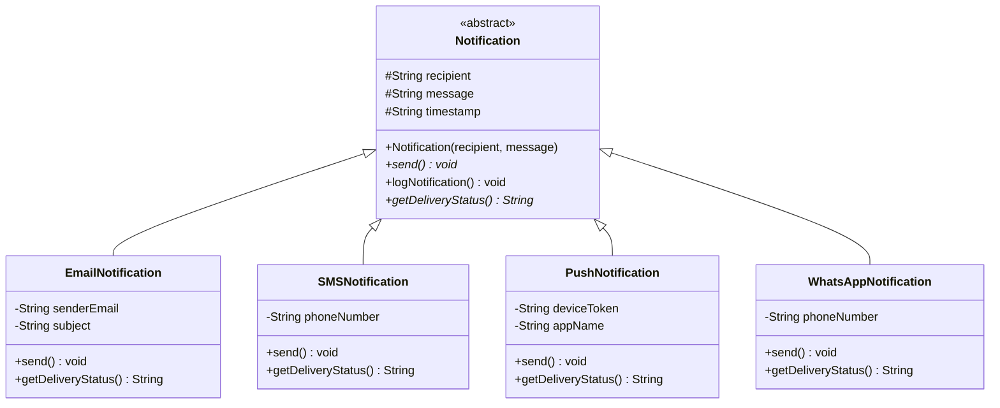

```java
import java.time.LocalDateTime;
import java.time.format.DateTimeFormatter;
import java.util.ArrayList;
import java.util.List;

abstract class Notification {
    protected String recipient;
    protected String message;
    protected String timestamp;
    private boolean sent = false;

    Notification(String recipient, String message) {
        this.recipient = recipient;
        this.message = message;
        this.timestamp = LocalDateTime.now()
            .format(DateTimeFormatter.ofPattern("yyyy-MM-dd HH:mm:ss"));
    }

    // Abstract — every subclass MUST define how to send
    abstract void send();

    // Abstract — every subclass MUST define its delivery status
    abstract String getDeliveryStatus();

    // Concrete — shared log format for ALL notifications (no override needed)
    void logNotification() {
        System.out.println("[LOG " + timestamp + "] " +
            getClass().getSimpleName() + " to " + recipient +
            " | Status: " + getDeliveryStatus());
        // getDeliveryStatus() here uses runtime polymorphism!
        // Even though we're inside Notification, the child's version runs
    }

    // Template method pattern — uses polymorphism internally
    final void sendAndLog() {
        send();           // child's send() runs (runtime polymorphism)
        logNotification(); // uses child's getDeliveryStatus() inside
    }
}

class EmailNotification extends Notification {
    private String senderEmail;
    private String subject;

    EmailNotification(String recipient, String subject, String message, String senderEmail) {
        super(recipient, message);
        this.subject = subject;
        this.senderEmail = senderEmail;
    }

    @Override
    void send() {
        System.out.println("📧 EMAIL");
        System.out.println("   From:    " + senderEmail);
        System.out.println("   To:      " + recipient);
        System.out.println("   Subject: " + subject);
        System.out.println("   Body:    " + message);
        System.out.println("   ✅ Email queued via SMTP server");
    }

    @Override
    String getDeliveryStatus() {
        return "QUEUED via SMTP";
    }
}

class SMSNotification extends Notification {
    private String phoneNumber;

    SMSNotification(String recipient, String phoneNumber, String message) {
        super(recipient, message);
        this.phoneNumber = phoneNumber;
    }

    @Override
    void send() {
        System.out.println("📱 SMS");
        System.out.println("   To:      " + phoneNumber + " (" + recipient + ")");
        System.out.println("   Message: " + message);
        System.out.println("   ✅ SMS sent via Twilio API");
    }

    @Override
    String getDeliveryStatus() {
        return "SENT via SMS Gateway";
    }
}

class PushNotification extends Notification {
    private String deviceToken;
    private String appName;

    PushNotification(String recipient, String deviceToken, String appName, String message) {
        super(recipient, message);
        this.deviceToken = deviceToken;
        this.appName = appName;
    }

    @Override
    void send() {
        System.out.println("🔔 PUSH NOTIFICATION");
        System.out.println("   App:     " + appName);
        System.out.println("   Device:  " + deviceToken.substring(0, 8) + "...");
        System.out.println("   User:    " + recipient);
        System.out.println("   Alert:   " + message);
        System.out.println("   ✅ Push delivered via FCM");
    }

    @Override
    String getDeliveryStatus() {
        return "DELIVERED via FCM";
    }
}

class WhatsAppNotification extends Notification {
    private String phoneNumber;

    WhatsAppNotification(String recipient, String phoneNumber, String message) {
        super(recipient, message);
        this.phoneNumber = phoneNumber;
    }

    @Override
    void send() {
        System.out.println("💬 WHATSAPP");
        System.out.println("   To:      +" + phoneNumber + " (" + recipient + ")");
        System.out.println("   Message: " + message);
        System.out.println("   ✅ WhatsApp message sent via Business API");
    }

    @Override
    String getDeliveryStatus() {
        return "SENT via WhatsApp Business API";
    }
}

// Notification dispatcher — doesn't care about types, just sends!
class NotificationDispatcher {
    private List<Notification> queue = new ArrayList<>();

    void addNotification(Notification n) {
        queue.add(n);
        // Accepts ANY Notification subtype — polymorphism enables this
    }

    void dispatchAll() {
        System.out.println("=== Dispatching " + queue.size() + " notifications ===\n");
        for (Notification n : queue) {
            n.sendAndLog();   // correct send() runs for each type — runtime polymorphism
            System.out.println();
        }
        System.out.println("=== All dispatched ===");
    }

    void dispatchTo(String recipient) {
        System.out.println("=== Sending all notifications to: " + recipient + " ===\n");
        for (Notification n : queue) {
            if (n.recipient.equals(recipient)) {
                n.send();    // correct send() for each type
                System.out.println();
            }
        }
    }
}

public class Main {
    public static void main(String[] args) {
        NotificationDispatcher dispatcher = new NotificationDispatcher();

        dispatcher.addNotification(new EmailNotification(
            "alice@example.com",
            "Your order is confirmed!",
            "Hi Alice, your order #12345 has been confirmed. Expected delivery: 3 days.",
            "noreply@shop.com"
        ));

        dispatcher.addNotification(new SMSNotification(
            "Bob",
            "9876543210",
            "Your OTP is 4821. Valid for 5 minutes."
        ));

        dispatcher.addNotification(new PushNotification(
            "Carol",
            "abc123def456ghi789",
            "ShopApp",
            "Flash sale! 50% off for next 2 hours only!"
        ));

        dispatcher.addNotification(new WhatsAppNotification(
            "Dave",
            "919123456789",
            "Your delivery is out for delivery. Track: bit.ly/track123"
        ));

        dispatcher.dispatchAll();
    }
}
```

**Output:**
```
=== Dispatching 4 notifications ===

📧 EMAIL
   From:    noreply@shop.com
   To:      alice@example.com
   Subject: Your order is confirmed!
   Body:    Hi Alice, your order #12345 has been confirmed. Expected delivery: 3 days.
   ✅ Email queued via SMTP server
[LOG 2024-01-15 10:30:00] EmailNotification to alice@example.com | Status: QUEUED via SMTP

📱 SMS
   To:      9876543210 (Bob)
   Message: Your OTP is 4821. Valid for 5 minutes.
   ✅ SMS sent via Twilio API
[LOG 2024-01-15 10:30:00] SMSNotification to Bob | Status: SENT via SMS Gateway

🔔 PUSH NOTIFICATION
   App:     ShopApp
   Device:  abc123de...
   User:    Carol
   Alert:   Flash sale! 50% off for next 2 hours only!
   ✅ Push delivered via FCM
[LOG 2024-01-15 10:30:00] PushNotification to Carol | Status: DELIVERED via FCM

💬 WHATSAPP
   To:      +919123456789 (Dave)
   Message: Your delivery is out for delivery. Track: bit.ly/track123
   ✅ WhatsApp message sent via Business API
[LOG 2024-01-15 10:30:00] WhatsAppNotification to Dave | Status: SENT via WhatsApp Business API

=== All dispatched ===
```

> **Key insight:** `NotificationDispatcher` has **zero knowledge** of Email, SMS, Push, or WhatsApp. It just knows `Notification`. Tomorrow, if you add `TelegramNotification`, the dispatcher needs **zero changes** — just create the class and override `send()`. That's the power polymorphism brings to real systems.

---

## Part 9: Polymorphism — Common Tricky Questions

### Q1: Does polymorphism apply to fields?

**No! Only to methods.**

```java
class Parent {
    String name = "Parent";

    void showName() {
        System.out.println("Parent method: " + name);
    }
}

class Child extends Parent {
    String name = "Child";   // field HIDING, not overriding

    @Override
    void showName() {
        System.out.println("Child method: " + name);
    }
}

public class Main {
    public static void main(String[] args) {
        Parent p = new Child();

        System.out.println(p.name);      // "Parent" ← REFERENCE type decides fields!
        p.showName();                    // "Child method: Child" ← INSTANCE type decides methods!
    }
}
```

**Output:**
```
Parent
Child method: Child
```

> **Fields are resolved by reference type** (compile time). **Methods are resolved by instance type** (runtime). This is a classic interview question!

---

### Q2: Does polymorphism work with static methods?

**No! Static methods are NOT polymorphic.**

```java
class Parent {
    static void greet() {
        System.out.println("Hello from Parent (static)");
    }

    void hello() {
        System.out.println("Hello from Parent (instance)");
    }
}

class Child extends Parent {
    static void greet() {
        // This HIDES Parent's greet() — NOT overriding
        System.out.println("Hello from Child (static)");
    }

    @Override
    void hello() {
        System.out.println("Hello from Child (instance)");
    }
}

public class Main {
    public static void main(String[] args) {
        Parent p = new Child();

        p.greet();    // "Hello from Parent (static)"  ← reference type wins — NO polymorphism
        p.hello();    // "Hello from Child (instance)"  ← instance type wins — polymorphism!
    }
}
```

**Output:**
```
Hello from Parent (static)
Hello from Child (instance)
```

---

### Q3: Can constructors be polymorphic?

**No!** Constructors are not inherited and cannot be overridden. But a constructor CAN call an overridden method — which leads to a dangerous pitfall:

```java
class Parent {
    Parent() {
        System.out.println("Parent constructor");
        show();   // ⚠️ DANGER: calls overridden version in child!
    }

    void show() {
        System.out.println("Parent show()");
    }
}

class Child extends Parent {
    int value = 42;

    Child() {
        super();   // Parent constructor runs first
        System.out.println("Child constructor — value = " + value);
    }

    @Override
    void show() {
        System.out.println("Child show() — value = " + value);
        // ⚠️ When called from Parent's constructor, 'value' is NOT yet initialized!
        // 'value' will be 0 here (default int), not 42 yet
    }
}

public class Main {
    public static void main(String[] args) {
        new Child();
    }
}
```

**Output:**
```
Parent constructor
Child show() — value = 0   ← value is 0, not 42! Child fields aren't initialized yet!
Child constructor — value = 42
```

> **Lesson:** Never call overridable methods from a constructor. This is a well-known Java anti-pattern. The child's overriding method runs before the child's fields are initialized.

---

### Q4: What is Covariant Return Type in Overriding?

Java allows the overriding method to return a **subtype** of the parent's return type.

```java
class Animal {
    Animal create() {
        System.out.println("Creating Animal");
        return new Animal();
    }
}

class Dog extends Animal {
    @Override
    Dog create() {
        // Return type is Dog — a subtype of Animal — VALID covariant return!
        // This is still considered a proper override
        System.out.println("Creating Dog");
        return new Dog();
    }
}

public class Main {
    public static void main(String[] args) {
        Animal a = new Dog();
        Animal result = a.create();   // Dog's create() runs, returns Dog object
        System.out.println(result.getClass().getSimpleName());
    }
}
```

**Output:**
```
Creating Dog
Dog
```

---

## Part 10: Abstract Class vs Interface vs Concrete Class — Decision Guide

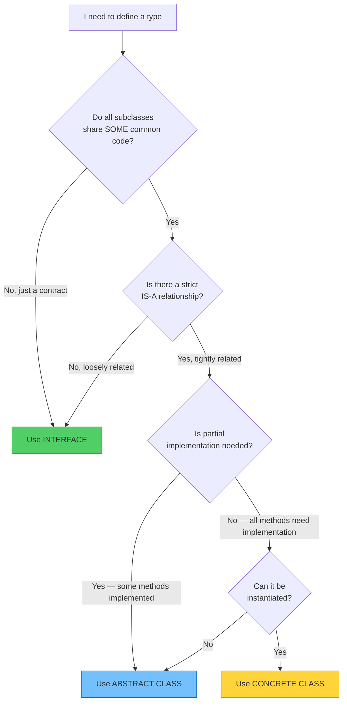

| | Concrete Class | Abstract Class | Interface |
|---|---|---|---|
| Can instantiate directly | ✅ Yes | ❌ No | ❌ No |
| Can have fields | ✅ Yes | ✅ Yes | ⚠️ Only static final |
| Can have constructor | ✅ Yes | ✅ Yes | ❌ No |
| Abstract methods | ❌ No | ✅ Yes (optional) | ✅ Yes (all methods by default) |
| Concrete methods | ✅ Yes | ✅ Yes | ✅ Only with `default` keyword |
| Multiple inheritance | ❌ No | ❌ No | ✅ Yes (implement many) |
| Use case | Complete object | Shared base + partial | Capability contract |

---

## 🥜 Polymorphism — In a Nutshell

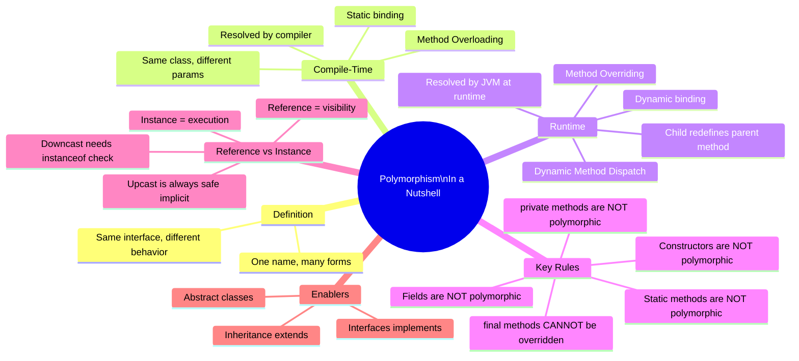

### The 8 Golden Rules of Polymorphism

1. **Runtime polymorphism applies ONLY to instance methods** — not fields, not static methods, not constructors.

2. **The reference type controls WHAT you can call** — even if the actual object has more, the reference determines visibility.

3. **The actual object controls WHICH version runs** — the deepest override in the hierarchy always wins.

4. **Upcasting is always safe and implicit** — `Parent p = new Child()` never fails.

5. **Downcasting is explicit and can fail** — always use `instanceof` before downcasting.

6. **Abstract classes enforce contracts** — all concrete subclasses must implement every abstract method.

7. **Interfaces give maximum flexibility** — a class can implement multiple interfaces regardless of its inheritance chain.

8. **Adding a new subclass never breaks existing code** — that's the OCP (Open/Closed Principle) powered by polymorphism.

### One-Line Answers to Common Questions

| Question | Answer |
|---|---|
| What decides which overloaded method runs? | **Compiler** — based on parameter types at compile time |
| What decides which overriding method runs? | **JVM** — based on actual object type at runtime |
| `Animal a = new Dog()` — which `sound()` runs? | **Dog's** — actual object wins at runtime |
| `Animal a = new Dog()` — can I access `fetch()`? | ❌ No — Animal reference can't see `fetch()` |
| Are fields polymorphic? | ❌ No — field access is by reference type |
| Are static methods polymorphic? | ❌ No — static methods are hidden, not overridden |
| Can an abstract class have a constructor? | ✅ Yes — called via `super()` from child |
| Can I instantiate an abstract class? | ❌ No — `new AbstractClass()` is a compile error |
| Can an interface have implementation? | ✅ Yes — via `default` methods (Java 8+) |
| What is dynamic method dispatch? | The JVM mechanism that resolves overridden method calls at runtime |

---

## 🎓 Final Summary

Polymorphism is the ability of a single action to behave differently based on context. It's what separates amateur Java code from professional, scalable systems.

- **Compile-time polymorphism** (overloading) = same name, different inputs, compiler decides → simple convenience
- **Runtime polymorphism** (overriding) = same name, same inputs, JVM decides based on actual object → real power

The deepest insight: write code that talks to **types** (references), and the **objects** take care of their own behavior. You don't need to know whether it's an Email or SMS or Push — you just say `send()` and the right thing happens. That's a well-designed system.

> **"Write to abstractions, not implementations."** — This is the principle that polymorphism makes possible. It's why Java frameworks like Spring, Hibernate, and Android are built entirely on interfaces and abstract classes — they never know what your specific class is, they just know it implements the right contract.

**Master polymorphism = Write code that works today AND adapts to tomorrow!** 🚀