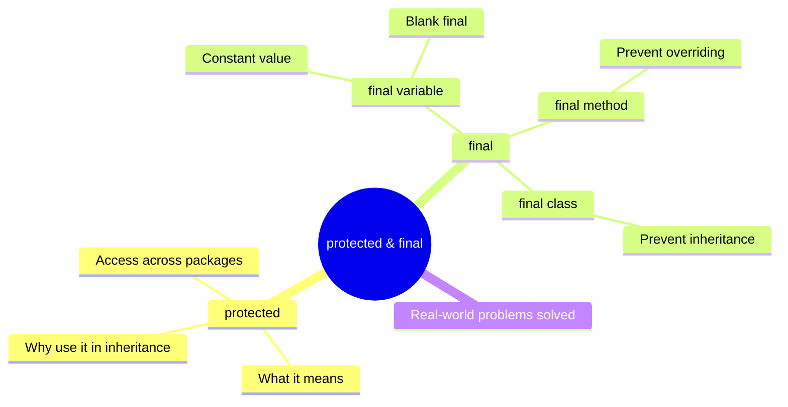

# Java `protected` & `final` Keywords Explained 🔐

These two keywords are deeply tied to **inheritance**. You're right to connect them — they control *what child classes can access* and *what child classes can change*.

---

## 🗺️ Big Picture: What We'll Cover



---

## 🌍 Real-World Analogy First

Think of a **company's internal salary structure**:

- **`public`** → Posted on the company website. Everyone can see it.
- **`private`** → Locked in the CEO's vault. Nobody else can see it.
- **`protected`** → Shared only within the company and its branches (child companies). Internal, but inheritable.
- **`final`** → A sealed company policy. Written in stone. Nobody can change it.

---

## Part 1: The `protected` Keyword 🔒

### What Problem Does It Solve?

In Java, `private` fields are hidden — even child classes can't access them directly. But sometimes you want a parent class to **share something with its children**, without exposing it to the entire world.

That's exactly what `protected` solves.

### Access Rules at a Glance

| Modifier    | Same Class | Same Package | Child Class (different package) | Everyone |
|-------------|------------|--------------|----------------------------------|----------|
| `private`   | ✅          | ❌            | ❌                               | ❌        |
| `default`   | ✅          | ✅            | ❌                               | ❌        |
| `protected` | ✅          | ✅            | ✅                               | ❌        |
| `public`    | ✅          | ✅            | ✅                               | ✅        |

### The Problem Without `protected`

```java
class Animal {
    private String name;   // private — child can't touch this

    Animal(String name) {
        this.name = name;
    }
}

class Dog extends Animal {
    void display() {
        // ❌ Compile Error: name has private access in Animal
        System.out.println("Dog name: " + name);
    }
}
```

The child class `Dog` **cannot** access `name` because it's `private`. You'd be forced to make it `public`, which exposes it to everyone — not ideal.

### The Fix: Use `protected`

```java
class Animal {
    protected String name;   // ✅ Child classes can access this
    protected int age;

    Animal(String name, int age) {
        this.name = name;
        this.age = age;
    }

    protected void breathe() {
        System.out.println(name + " is breathing.");
    }
}

class Dog extends Animal {

    private String breed;

    Dog(String name, int age, String breed) {
        super(name, age);
        this.breed = breed;
    }

    void display() {
        // ✅ Accessing protected fields from parent directly
        System.out.println("Name  : " + name);
        System.out.println("Age   : " + age);
        System.out.println("Breed : " + breed);
        breathe();   // ✅ Calling protected method from parent
    }
}

public class Main {
    public static void main(String[] args) {
        Dog d = new Dog("Bruno", 3, "Labrador");
        d.display();

        // ❌ Can't access protected field from outside the class hierarchy
        // System.out.println(d.name);  // This would be a compile error in a different package
    }
}
```

**Output:**
```
Name  : Bruno
Age   : 3
Breed : Labrador
Bruno is breathing.
```

### Key Takeaway for `protected`

```
private   → "Only I can use it."
protected → "I and my children can use it."
public    → "Anyone can use it."
```

Use `protected` when you want to **share internals with child classes** but not with the outside world.

---

## Part 2: The `final` Keyword 🔒🔒

`final` means **"this cannot be changed."** It can be applied to three things:
1. **Variables** → value cannot be reassigned
2. **Methods** → cannot be overridden by child classes
3. **Classes** → cannot be extended (no child class allowed)

---

### 2.1 `final` Variable — Constant Value

#### What Problem Does It Solve?

Imagine you store the value of **PI** as a regular variable. Any part of the code (or child class) could accidentally change it. That's a bug waiting to happen.

```java
class Circle {
    double PI = 3.14159;   // ⚠️ Anyone can change this by mistake
}
```

#### The Fix: `final` Variable

```java
class Circle {
    final double PI = 3.14159;   // ✅ This is now a constant

    double area(double radius) {
        return PI * radius * radius;
    }
}

public class Main {
    public static void main(String[] args) {
        Circle c = new Circle();
        System.out.println("Area: " + c.area(5));

        // ❌ Compile Error: cannot assign a value to final variable PI
        // c.PI = 3.0;
    }
}
```

**Output:**
```
Area: 78.53975
```

#### `final` with Inheritance — Child Cannot Change It

```java
class Vehicle {
    final int MAX_SPEED = 200;   // Constant for all vehicles
}

class Car extends Vehicle {
    void show() {
        // ✅ Can read it
        System.out.println("Max Speed: " + MAX_SPEED);

        // ❌ Compile Error: cannot assign a value to final variable MAX_SPEED
        // MAX_SPEED = 250;
    }
}
```

#### Blank `final` Variable (Initialized Later)

A `final` variable doesn't have to be assigned immediately — but it **must** be assigned exactly once before use, typically in the constructor.

```java
class BankAccount {
    final String accountNumber;   // blank final

    BankAccount(String accountNumber) {
        this.accountNumber = accountNumber;   // ✅ Assigned in constructor
    }

    void show() {
        System.out.println("Account: " + accountNumber);
        // ❌ accountNumber = "NEW123";  // Can't change after assignment
    }
}

public class Main {
    public static void main(String[] args) {
        BankAccount acc = new BankAccount("ACC-001");
        acc.show();
    }
}
```

**Output:**
```
Account: ACC-001
```

> This is perfect for IDs, account numbers, or any value set once at creation and never changed.

---

### 2.2 `final` Method — Prevent Overriding

#### What Problem Does It Solve?

In inheritance, child classes can **override** parent methods to change their behavior. Sometimes that's dangerous — for example, a security check or a core calculation that must never be tampered with.

```java
class Payment {
    // What if a child changes how tax is calculated to cheat the system?
    double calculateTax(double amount) {
        return amount * 0.18;
    }
}

class FraudulentPayment extends Payment {
    @Override
    double calculateTax(double amount) {
        return 0;   // ⚠️ No tax! This overrides and breaks the rule.
    }
}
```

#### The Fix: `final` Method

```java
class Payment {
    final double calculateTax(double amount) {
        return amount * 0.18;   // ✅ Locked — no one can change this logic
    }

    void processPayment(double amount) {
        double tax = calculateTax(amount);
        System.out.println("Amount : ₹" + amount);
        System.out.println("Tax    : ₹" + tax);
        System.out.println("Total  : ₹" + (amount + tax));
    }
}

class OnlinePayment extends Payment {
    // ❌ Compile Error: cannot override the final method from Payment
    // double calculateTax(double amount) { return 0; }

    void showGateway() {
        System.out.println("Gateway: Razorpay");
    }
}

public class Main {
    public static void main(String[] args) {
        OnlinePayment op = new OnlinePayment();
        op.processPayment(1000);
        op.showGateway();
    }
}
```

**Output:**
```
Amount : ₹1000.0
Tax    : ₹180.0
Total  : ₹1180.0
Gateway: Razorpay
```

> The child class can still **use** the `final` method — it just **cannot override** it. Child classes can add their own new methods freely.

---

### 2.3 `final` Class — Prevent Inheritance

#### What Problem Does It Solve?

Some classes are designed to be **complete and self-contained**. If someone extends them and overrides behavior, it could break the entire system. The classic example is Java's own `String` class — it's `final` because if you could extend it, you could create a "String" that doesn't actually behave like a String, breaking everything.

```java
// What if someone could extend String?
class HackedString extends String {
    // Override equals() to always return true — breaks all comparisons!
}
```

Java prevents this by making `String` a `final` class.

#### The Fix: `final` Class

```java
final class DatabaseConnection {
    private String url;
    private String username;

    DatabaseConnection(String url, String username) {
        this.url = url;
        this.username = username;
    }

    void connect() {
        System.out.println("Connected to: " + url + " as " + username);
    }
}

// ❌ Compile Error: cannot inherit from final DatabaseConnection
// class HackedConnection extends DatabaseConnection { }

public class Main {
    public static void main(String[] args) {
        DatabaseConnection db = new DatabaseConnection("jdbc:mysql://localhost/shop", "admin");
        db.connect();
    }
}
```

**Output:**
```
Connected to: jdbc:mysql://localhost/shop as admin
```

> A `final` class **can still use** other non-final classes. It just can't be extended itself.

---

## Part 3: Combining `protected` and `final` Together

Here's a real-world scenario: a **banking system** where:
- Child banks can **read** the base interest rate (`protected`)
- But **nobody can change** the core interest calculation (`final` method)
- And the core rate itself is a **constant** (`final` variable)

```java
class Bank {
    protected final double BASE_INTEREST_RATE = 4.5;   // protected + final

    protected String bankName;

    Bank(String bankName) {
        this.bankName = bankName;
    }

    // final method — core logic locked, no child can override
    final double calculateInterest(double principal, int years) {
        return principal * BASE_INTEREST_RATE / 100 * years;
    }
}

class SavingsAccount extends Bank {

    private double balance;

    SavingsAccount(String bankName, double balance) {
        super(bankName);
        this.balance = balance;
    }

    void showDetails(int years) {
        // ✅ Can read protected fields
        System.out.println("Bank              : " + bankName);
        System.out.println("Base Interest Rate: " + BASE_INTEREST_RATE + "%");
        System.out.println("Balance           : ₹" + balance);

        // ✅ Can call final method (but cannot override it)
        double interest = calculateInterest(balance, years);
        System.out.println("Interest (" + years + " yrs) : ₹" + interest);
        System.out.println("Total After " + years + " yrs: ₹" + (balance + interest));
    }

    // ✅ Child can add its OWN new methods
    void deposit(double amount) {
        balance += amount;
        System.out.println("Deposited ₹" + amount + " | New Balance: ₹" + balance);
    }
}

public class Main {
    public static void main(String[] args) {
        SavingsAccount acc = new SavingsAccount("State Bank", 50000);
        acc.showDetails(3);
        System.out.println("---");
        acc.deposit(10000);
    }
}
```

**Output:**
```
Bank              : State Bank
Base Interest Rate: 4.5%
Balance           : ₹50000.0
Interest (3 yrs) : ₹6750.0
Total After 3 yrs: ₹56750.0
---
Deposited ₹10000.0 | New Balance: ₹60000.0
```

---

## 📊 Summary: When to Use What

| Keyword              | Applied To | What It Does                                      | Use When                                              |
|----------------------|------------|---------------------------------------------------|-------------------------------------------------------|
| `protected`          | Field/Method | Accessible in child classes & same package     | You want to share internals with child classes only   |
| `final` variable     | Field       | Value cannot be reassigned after first assignment | You need a constant — IDs, rates, configs             |
| `final` method       | Method      | Cannot be overridden by child classes             | Core logic that must never be tampered with           |
| `final` class        | Class       | Cannot be extended — no subclasses allowed        | Utility/security classes that must be self-contained  |

---

## 🔑 Key Rules to Remember

- **`protected` + `private`** → `protected` wins for child classes. Private is truly sealed.
- **`final` variable** → must be assigned before use, and only **once**.
- **`final` method** → child class **can call** it, but **cannot override** it.
- **`final` class** → can still **extend** other classes, it just can't **be** extended.
- **`static final`** → the standard way to declare a class-level constant (e.g., `public static final double PI = 3.14159`).

---

## 🧠 Quick Memory Trick

```
protected  →  "Share with family, not strangers."
final      →  "Set in stone. No changes allowed."
```