# Java Classes and Objects Explained 🎓

## Introduction

Think of a **class** as a blueprint or template, and an **object** as the actual thing built from that blueprint. Just like how an architect's blueprint can be used to build many houses, a class can be used to create many objects!

---

## What Does a Class Contain?

A class is like a container that holds:

### 1. **Attributes (Instance Variables)**
These are the characteristics or properties of the class.
```java
class Student {
    String name;      // attribute
    int age;          // attribute
    String rollNumber; // attribute
}
```

### 2. **Methods (Behaviors)**
These are actions that objects of the class can perform.
```java
class Student {
    String name;
    int age;
    
    void study() {
        System.out.println(name + " is studying!");
    }
    
    void attendClass() {
        System.out.println(name + " is attending class!");
    }
}
```

### 3. **Constructors**
Special methods used to initialize objects when they're created.
```java
class Student {
    String name;
    int age;
    
    // Constructor
    Student(String studentName, int studentAge) {
        name = studentName;
        age = studentAge;
    }
}
```

---

## How Objects are Stored in Memory

When you create an object, **two things happen in memory:**

### Step 1: Object Creation
```java
Student student1 = new Student("Alice", 20);
```

Let me break this down:

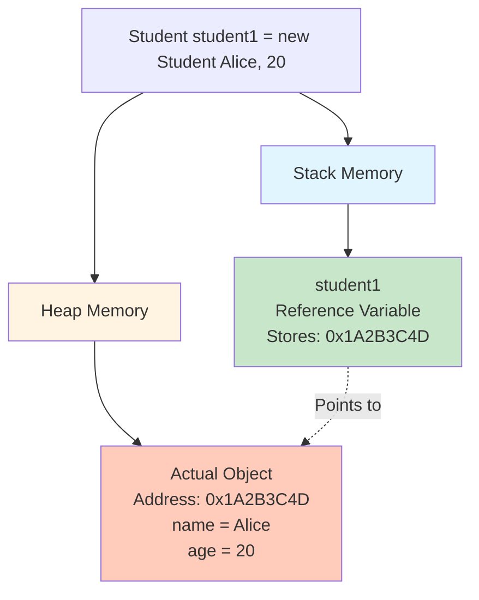

### Memory Allocation Breakdown:

1. **Stack Memory** - Stores the reference variable (`student1`)
2. **Heap Memory** - Stores the actual object with its data
3. **Reference Address** - The variable holds the memory address (like `0x1A2B3C4D`) pointing to the object in heap

---

## When is Memory Created?

Memory allocation happens at **runtime** when you use the `new` keyword:

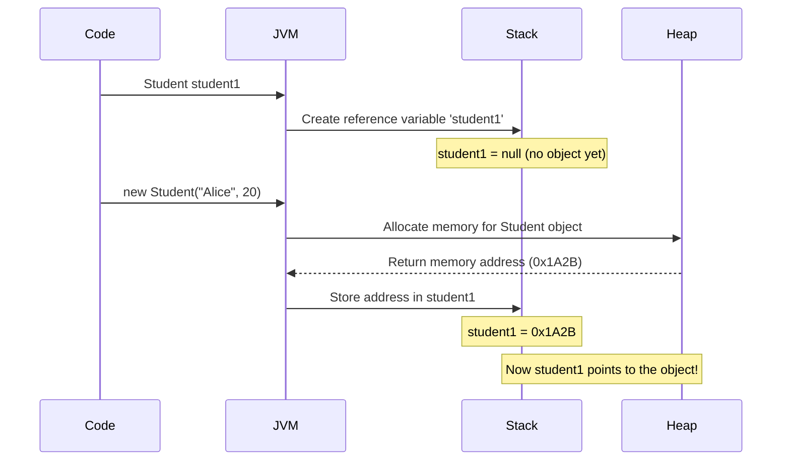

### Timeline:
1. **Compile Time**: Class definition is checked for errors
2. **Runtime - Step 1**: Reference variable is created in stack (initialized to `null`)
3. **Runtime - Step 2**: `new` keyword triggers object creation in heap
4. **Runtime - Step 3**: Constructor runs to initialize the object
5. **Runtime - Step 4**: Memory address is stored in the reference variable

---

## What Happens When Variables Aren't Assigned?

Great question! Let's see what happens when you don't assign values to variables:

### Example:
```java
class Car {
    String brand;      // String (Reference type)
    int price;         // int (Primitive type)
    boolean isElectric; // boolean (Primitive type)
    double mileage;    // double (Primitive type)
}

public class Main {
    public static void main(String[] args) {
        Car myCar = new Car();
        
        System.out.println("Brand: " + myCar.brand);        // null
        System.out.println("Price: " + myCar.price);        // 0
        System.out.println("Electric: " + myCar.isElectric); // false
        System.out.println("Mileage: " + myCar.mileage);    // 0.0
    }
}
```

### Default Values Table:

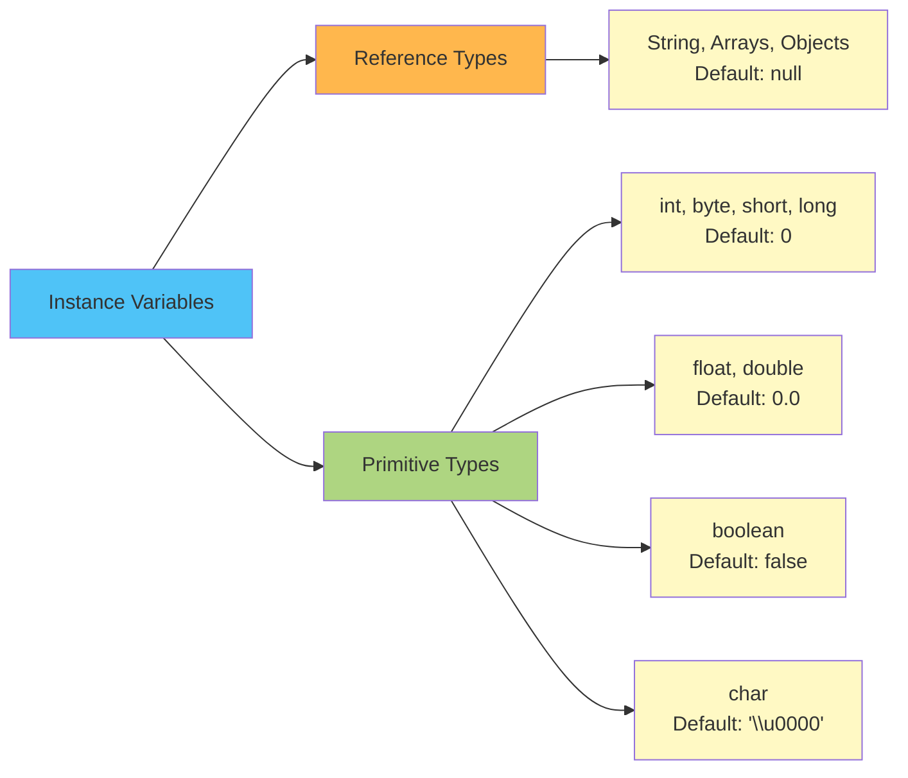

---

## Complete Memory Visualization

Let's see a complete example with multiple objects:

```java
class Student {
    String name;
    int age;
    
    Student(String n, int a) {
        name = n;
        age = a;
    }
}

public class Main {
    public static void main(String[] args) {
        Student s1 = new Student("Alice", 20);
        Student s2 = new Student("Bob", 22);
        Student s3 = s1;  // Same reference!
    }
}
```

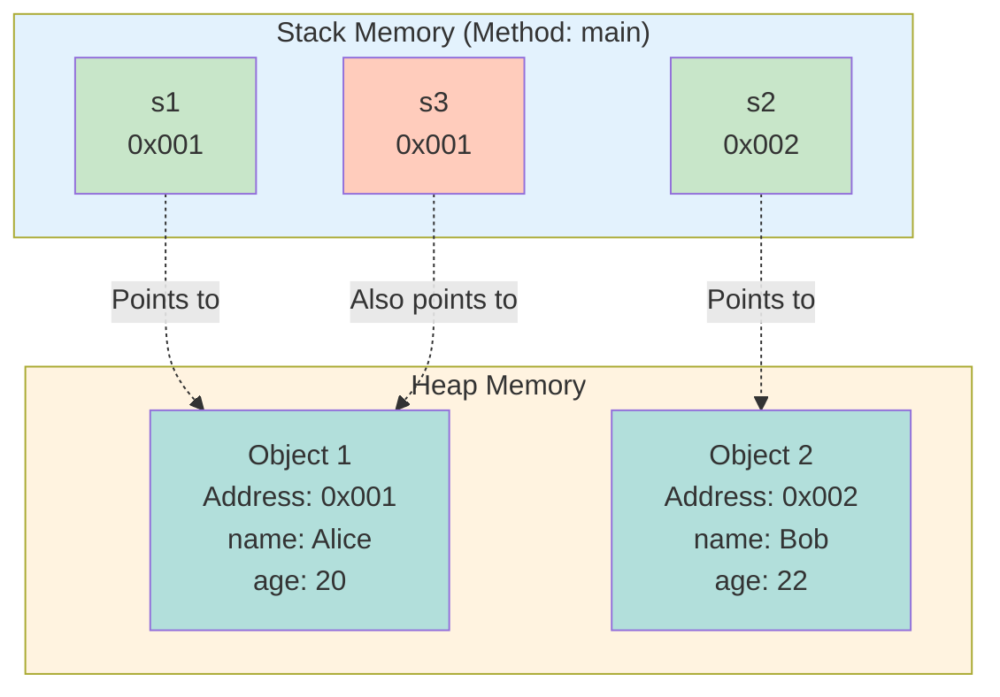

### Key Observations:
- `s1` and `s3` point to the **same object** (address `0x001`)
- `s2` points to a **different object** (address `0x002`)
- If you modify through `s3`, changes will reflect in `s1` (same object!)

---

## Object Lifecycle: Creation to Destruction

```mermaid
stateDiagram-v2
    [*] --> Declared: Student s1;
    Declared --> Created: new Student("Alice", 20);
    Created --> InUse: Object is being used
    InUse --> InUse: Methods called, values changed
    InUse --> Unreferenced: s1 = null; or method ends
    Unreferenced --> GarbageCollected: Garbage Collector runs
    GarbageCollected --> [*]: Memory freed
    
    note right of Declared
        Reference variable created
        Value: null
        Memory: Stack only
    end note
    
    note right of Created
        Object created in Heap
        Constructor executed
        Stack stores reference
    end note
    
    note right of Unreferenced
        No variables point to object
        Eligible for cleanup
    end note
```

---

## Real-World Analogy 🏠

Think of it like this:

| Programming Concept | Real-World Analogy |
|---------------------|-------------------|
| **Class** | Blueprint of a house |
| **Object** | Actual house built from blueprint |
| **Reference Variable** | Address written on a piece of paper |
| **new Keyword** | Construction company building the house |
| **Heap Memory** | The neighborhood where houses are built |
| **Stack Memory** | Your pocket where you keep addresses |
| **Attributes** | Features of the house (color, size, rooms) |
| **Methods** | Things you can do in the house (cook, sleep) |
| **Default Values** | Empty rooms (not furnished) |

---

## Quick Example with Unassigned Variables

```java
class Book {
    String title;
    String author;
    int pages;
    double price;
}

public class Main {
    public static void main(String[] args) {
        Book book1 = new Book();  // Object created
        
        // All values are defaults because we didn't assign anything
        System.out.println(book1.title);  // null
        System.out.println(book1.author); // null
        System.out.println(book1.pages);  // 0
        System.out.println(book1.price);  // 0.0
        
        // Now let's assign some values
        book1.title = "Java Programming";
        book1.pages = 500;
        
        System.out.println(book1.title);  // Java Programming
        System.out.println(book1.author); // still null
        System.out.println(book1.pages);  // 500
        System.out.println(book1.price);  // still 0.0
    }
}
```

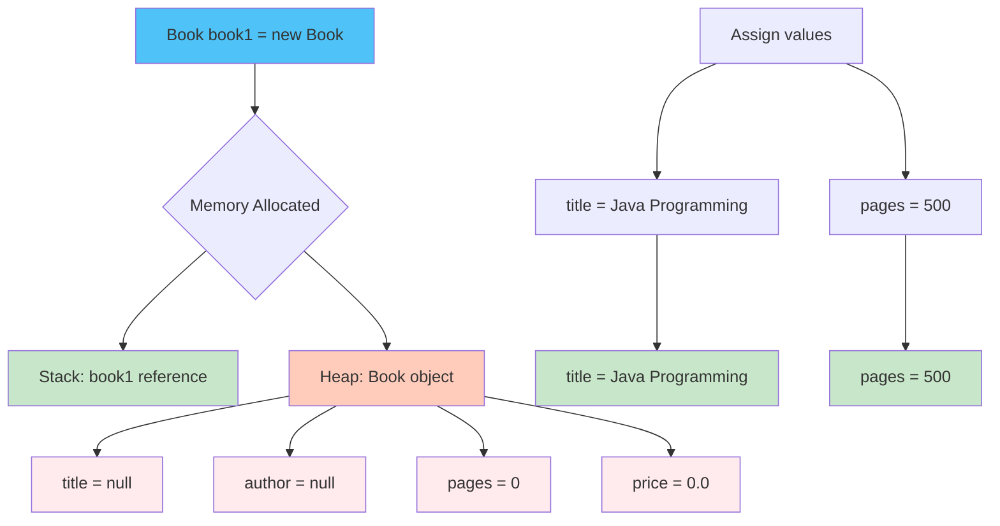

---

## Summary 📝

### Key Takeaways:

1. **Class = Blueprint**, **Object = Instance built from blueprint**

2. **Memory Allocation:**
   - Stack stores reference variables (addresses)
   - Heap stores actual objects
   - `new` keyword triggers memory allocation

3. **Reference Variables:**
   - Hold memory addresses, not actual objects
   - Multiple variables can point to the same object

4. **When Memory is Created:**
   - Reference variable: immediately when declared
   - Object: when `new` keyword is used (runtime)

5. **Unassigned Variables:**
   - Get default values automatically
   - Reference types → `null`
   - Numeric types → `0` or `0.0`
   - Boolean → `false`
   - Char → `'\u0000'`

6. **Important:** If you don't assign values, Java won't throw an error for instance variables (class variables). They'll just have default values. But **local variables** (inside methods) MUST be assigned before use!

---

## Practice Question 🤔

What will be the output?

```java
class Person {
    String name;
    int age;
    
    Person(String name) {
        this.name = name;
        // age not assigned in constructor!
    }
}

public class Main {
    public static void main(String[] args) {
        Person p1 = new Person("John");
        System.out.println(p1.name);
        System.out.println(p1.age);
    }
}
```

**Answer:** 
```
John
0
```

Why? Because `name` is assigned in the constructor, but `age` gets the default value of `0` (default for int).

---


# 📌 Call by Value vs Call by Reference in Java (Teacher Style)

> ✅ **Important Truth:**\
> Java is **always call by value**.\
> But for objects, the **value being passed is the reference**, which
> creates confusion.

------------------------------------------------------------------------

# 🧠 1. Call by Value (Primitive Types)

## 🔹 Definition

When a method receives a **copy of the value**, any change inside the
method **does NOT affect the original variable**.

------------------------------------------------------------------------

## ✅ Example

``` java
class PassingRefDemo {

    static void increment(int a) {
        a++; // changes only the copy
    }

    public static void main(String[] args) {
        int a = 10;
        increment(a);
        increment(a);
        System.out.println(a);
    }
}
```

------------------------------------------------------------------------

## 🔍 Step-by-Step Execution

### Step 1 --- Before method call

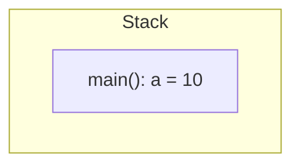

------------------------------------------------------------------------

### Step 2 --- First method call: `increment(a)`

👉 Java creates a **new stack frame**\
👉 Value **10 is copied**

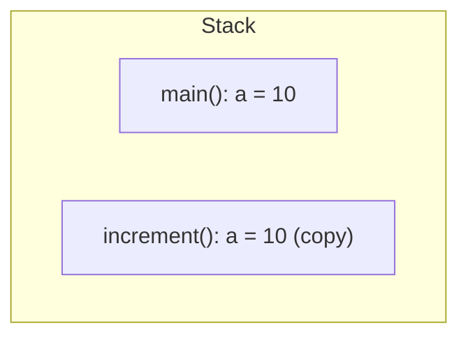

Inside method:

    a++ → becomes 11 (ONLY inside method)

After method ends → frame destroyed ❌

------------------------------------------------------------------------

### Step 3 --- Second call

Same thing happens again.

------------------------------------------------------------------------

## ✅ Final Output

    10

✔ Original `a` never changed\
✔ Because primitive uses pure call by value

------------------------------------------------------------------------

# 🧠 2. Call by Value with Objects (The Confusing Part)

Now your second example:

``` java
Box b1 = new Box(5,3,4);
Box b2 = new Box(5,3,4);

System.out.println(b1.isEqual(b2));
System.out.println(b2.length);
```

------------------------------------------------------------------------

## 🔥 VERY IMPORTANT

Java passes:

-   ❌ NOT the object\
-   ❌ NOT true call by reference\
-   ✅ **Copy of the reference**

------------------------------------------------------------------------

# 🧱 Heap vs Stack Memory

## 📦 Memory Areas

  Memory   Stores
  -------- -----------------------------
  Stack    local variables, references
  Heap     actual objects

------------------------------------------------------------------------

# 🔬 Execution Flow with Diagram

## ✅ Step 1 --- Object Creation

``` java
Box b1 = new Box(5,3,4);
Box b2 = new Box(5,3,4);
```

### Memory State

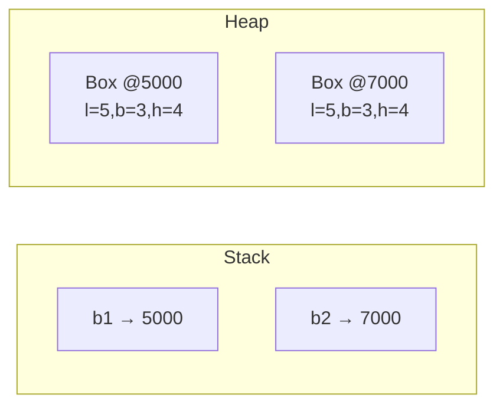

------------------------------------------------------------------------

## ✅ Step 2 --- Method Call

``` java
b1.isEqual(b2);
```

Method:

``` java
boolean isEqual(Box b) {
    b.length++;  // ⚠️ modifying object
}
```

### 🔴 What Actually Gets Passed

Java copies the **reference value**.

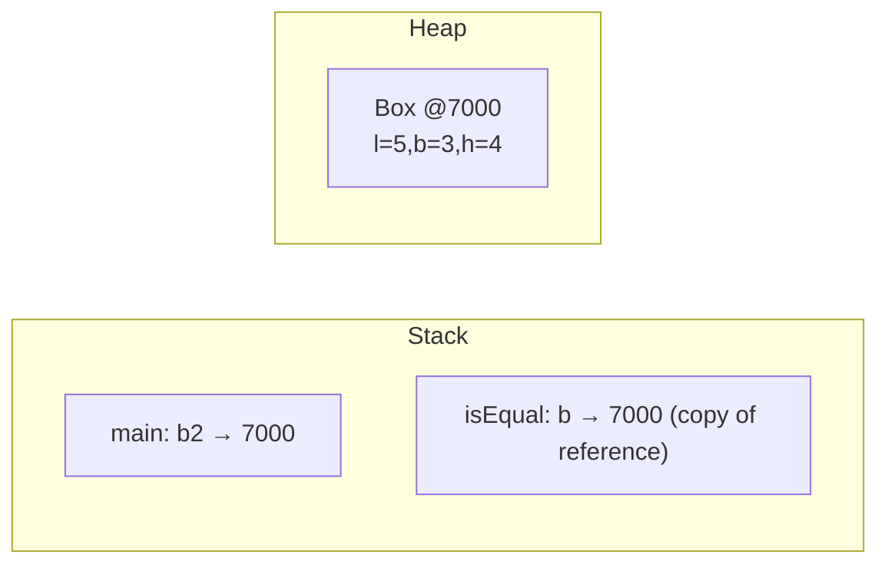

------------------------------------------------------------------------

## 🚨 Key Insight

Even though reference is copied...

👉 BOTH references point to **same heap object**

So this line:

``` java
b.length++;
```

✅ modifies the real object in heap

------------------------------------------------------------------------

## ✅ Step 3 --- After Modification

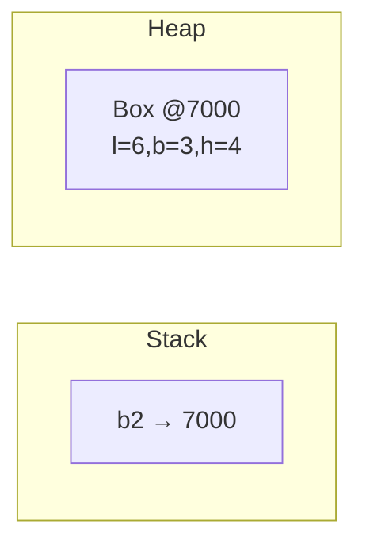

------------------------------------------------------------------------

## ✅ Final Output

    false
    6

------------------------------------------------------------------------

# 🎯 Final Teacher Summary

> 🟢 Java = always call by value\
> 🟡 For primitives → value copied\
> 🔴 For objects → reference value copied\
> 🔥 Object state CAN change\
> ❌ Reference itself cannot change outside


Happy Learning! 🚀